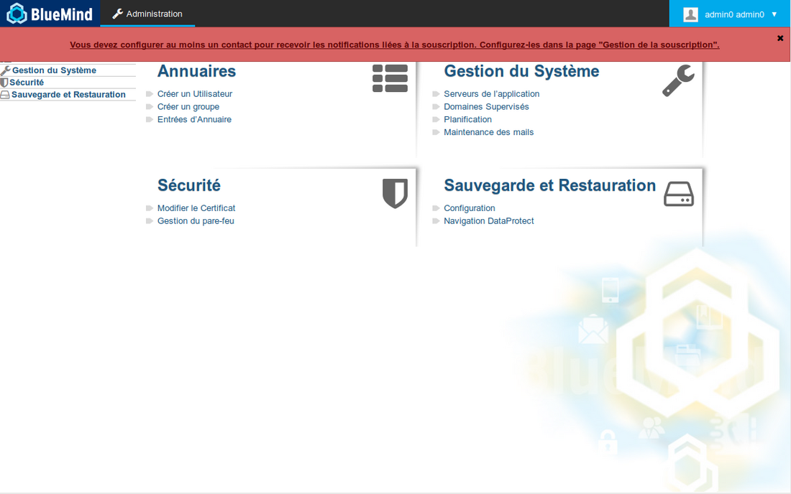
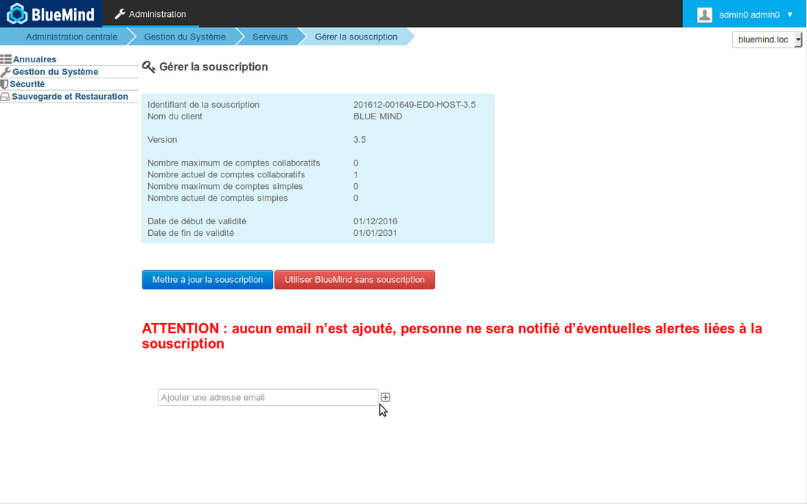
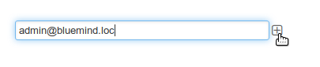
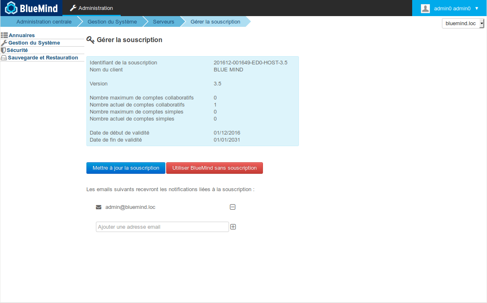
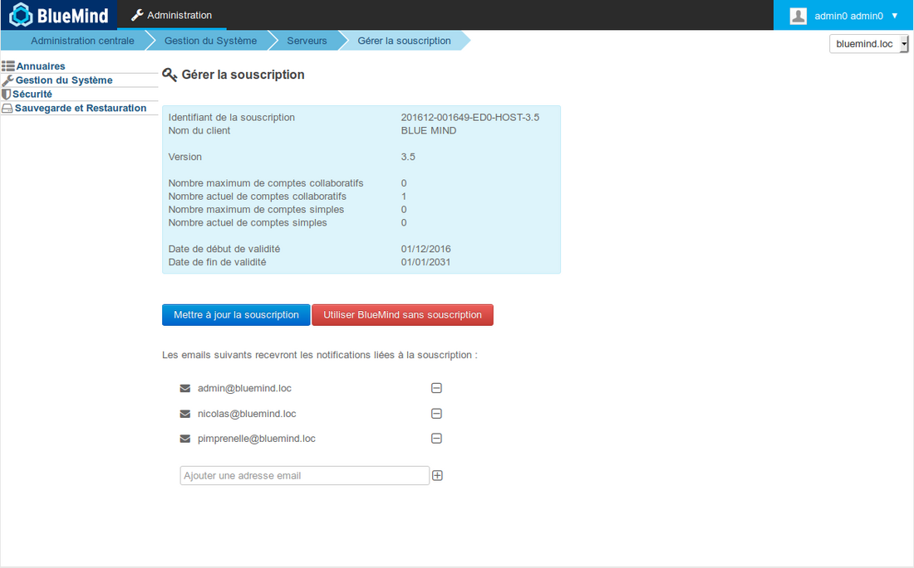

# La souscription BlueMind

# BlueMind, solution Open Source et offre professionnelle

## La Solution BlueMind

BlueMind est une solution Open Source de messagerie collaborative et communications unifiées de nouvelle génération. BlueMind propose une ergonomie simplifiée, une interface web très réactive, une gestion complète de la mobilité et est portée par une architecture moderne et ouverte (mode web déconnecté, services web natifs et API couvrant 100% du périmètre, plugins,..).

## L'offre professionnelle de BlueMind

Autour du Logiciel Open Source, BlueMind SAS propose une offre professionnelle dont l'objectif est de permettre une utilisation en production en toute sérénité et dans la durée.

L'offre professionnelle s'appuie sur des versions garanties et supportées par BlueMind SAS, qui en assure le suivi. La souscription permet d'accéder aux mises à jour correctives et évolutives. Sont aussi inclus des composants et outils additionnels simplifiant l'exploitation et l'intégration dans un système d'information.

L'offre professionnelle appelée souscription BlueMind est la solution indispensable pour assurer un maintien en condition opérationnelle de votre BlueMind Open Source.

# Contenu de la souscription

La souscription BlueMind comprend :

- le logiciel BlueMind OpenSource en versions garanties et supportées
- les [mises à jour correctives](/Guide_d_installation/Mise_à_jour_de_BlueMind/)
- les mises à jours évolutives avec les nouvelles versions de BlueMind
- l'utilisation complète d'Outlook pour Windows sans connecteur
- un outil d'administration permettant l'application simple et graphique des mises à jour, correctives et évolutives
- des composants additionnels :
  - un connecteur [Active Directory](/Guide_de_l_administrateur/Gestion_des_entités/Synchronisation_Active_Directory/)

:::important

Être averti des mises à jour

La souscription vous permettant de mettre à jour BlueMind, n'oubliez pas de vous abonner à la newsletter dédiée afin de recevoir les informations de publication de versions, évolutives et correctives : [https://lists.bluemind.net/mailman/listinfo/bluemind](https://lists.bluemind.net/mailman/listinfo/bluemind)

:::

## Versions garanties et support éditeur

La souscription BlueMind propose des versions identifiées et supportées par l'éditeur qui en assure le suivi correctif et évolutif. 

## Outil de mise à jour

Le processus de [mise à jour de BlueMind](/Guide_d_installation/Mise_à_jour_de_BlueMind/) est simple, sûr, rapide pour que celles-ci ne restent pas virtuelles et soient effectivement appliquées.

Pour garantir les évolutions, la souscription intègre un outil graphique d'administration permettant de réaliser simplement et en temps réduit les mises à niveau correctives et évolutives du logiciel. Le client décide du moment de la mise à jour et l'outil la réalise.

# Types de souscription

La souscription BlueMind est proposée sous différents types, selon les usages et le type d'utilisateur final :

- Prod / Host
- Evaluation (Tests, Preprod, Dev...)
- Gratuite

## Prod / Host

Une souscription de production (type PROD) ou d'hébergement (type HOST) permet au client d'installer et de maintenir la solution BlueMind selon les caractéristiques contractualisées avec l'éditeur.

NB : les souscriptions Host sont réservées à nos partenaires hébergeurs.

## Évaluation

Une souscription d'évaluation (type TRIAL) peut être fournie à des fins de tests, de développement ou encore d'environnements de pré-production, elle permet l'utilisation complète de l'offre professionnelle pour une durée et un nombre d'utilisateurs limités.

## Gratuite

Une souscription gratuite et complète peut être offerte à certains publics tels que :

- les associations loi 1901 œuvrant dans le domaine de l'Open Source,
- les auteurs de contributions significatives
- les particuliers l'utilisant pour leur usage personnel, dans la limite de 10 comptes.

# Limites de validité
:::important

Qui est administrateur ?

Sont considérés comme administrateurs de la souscription [les utilisateurs auxquels est attribué le rôle](/Guide_de_l_administrateur/Gestion_des_entités/Utilisateurs/Les_rôles_droits_d_accès_et_d_administration/) « Gérer la souscription BlueMind ». Il est important d'activer conjointement le rôle "Console d'administration" afin de permettre à l'utilisateur d'accéder à celle-ci afin de pouvoir installer et mettre à jour la souscription.

:::
:::important

Continuité de service

Durant les périodes où les utilisateurs ne peuvent plus se connecter, le système continue de fonctionner, il ne s'agit pas d'un blocage de BlueMind mais seulement des **accès à BlueMind** : les emails entrant sont toujours reçus et traités par le serveur, les utilisateurs les trouveront dans leur boîte lorsque l'accès sera rétabli.

:::

## Date de validité

La souscription BlueMind est valide jusqu'à une date donnée.

Pour une souscription de production (type PROD ou HOST), les administrateurs de la souscription sont régulièrement informés de l'approche de cette date

1 2 mois avant la date d'expiration : un email est envoyé aux administrateurs de domaine
1 1 mois avant la date d'expiration : un email est envoyé aux administrateurs de domaine et un bandeau apparaît dans leur interface, ainsi que dans celle du superadministrateur admin0
1 à la date d'expiration :
  - un bandeau d'information apparaît pour tous les utilisateurs
  - lorsqu'ils se connectent, les administrateurs sont automatiquement dirigés vers la page de gestion de la souscription afin de régulariser la situation
  - un email est envoyé tous les 2 jours aux administrateurs
1 10 jours après la date d'expiration :
  - l'ensemble des utilisateurs est bloqué : l'accès à BlueMind ne peut plus se faire, y compris en accès distant (mobile, logiciel tiers...)
  - lorsqu'ils se connectent, les administrateurs sont automatiquement dirigés vers la page de gestion de la souscription afin de régulariser la situation

Pour une souscription d'évaluation (type TRIAL) le système est bloqué à la date d'expiration :

- les utilisateurs ne peuvent plus se connecter à BlueMind
- 
les administrateurs peuvent se connecter et sont automatiquement redirigés vers la page de gestion de la souscription afin de régulariser la situation

## Nombre d'utilisateurs

La souscription BlueMind ouvre droit à un certain nombre d'utilisateurs.

Une tolérance de dépassement de 10% est cependant accordée, le temps que la souscription soit régularisée.

Les administrateurs sont informés comme suit :

1 **Lorsque des utilisateurs supplémentaires sont créés** et tant que le nombre d'utilisateurs dépasse le nombre maximum de la souscription :
  - un bandeau d'information apparaît dans leur interface, sur la console d'administration aussi bien que dans leurs applications (messagerie, agenda, etc.)
  - un email d'information leur est envoyé tous les 7 jours.
1 **Au bout d'un mois**, si la situation n'a pas été régularisée (suppression d'utilisateurs ou ajustement de la souscription) : 
  - l'ensemble des utilisateurs est bloqué : l'accès à BlueMind ne peut plus se faire, y compris en accès distant (mobile, logiciel tiers...)
  - un email d'information est envoyé aux administrateurs
  - les administrateurs ayant les droit adéquats peuvent se loguer à la console d'administration afin de régulariser la situation

**Si le seuil de tolérance de 10% est atteint, la création de nouveaux utilisateurs n'est plus possible**. Un bandeau d'information apparaît dans le BlueMind des administrateurs (console d'administration, messagerie, agenda, etc.).

# Réception des alertes

À l'approche d'une limite de validité (nombre d'utilisateur ou date) ou lorsque celle-ci est atteinte, un bandeau d'alerte est affiché selon le cas chez les administrateurs et/ou les utilisateurs (voir chapitre précédent) et des emails d'alertes sont émis.

Pour cela au moins **une adresse destinataire **doit** être renseignée** dans la page de gestion de la souscription afin de s'assurer qu'une personne au moins reçoit ces alertes, le système pouvant finir par être bloqué si la souscription n'est pas mise à jour à temps (voir chapitre précédent). Tant qu'une adresse n'est pas paramétrée, un bandeau d'information apparaît sur chaque page de la console d'administration pour les utilisateurs ayant [le rôle idoine](/Guide_de_l_administrateur/Gestion_des_entités/Utilisateurs/Les_rôles_droits_d_accès_et_d_administration/) :

Un clic sur le texte du bandeau permet de se rendre directement sur la page de gestion de la souscription. Sur cette page, un avertissement apparaît ainsi qu'un champ permettant de renseigner une adresse :

Pour ajouter une adresse email, remplir simplement le champ puis cliquer sur le bouton  à côté de celui-ci :

L'email est aussitôt ajouté et l'avertissement disparaît :

Procéder de même pour ajouter autant d'adresses destinataires que désiré :

:::important

Mise en indésirable

Pour les adresses externes, certains systèmes d'antispam risquent de filtrer le message : pensez à indiquer au destinataire de vérifier son dossier d'indésirables régulièrement.

Pour cette raison, il est donc toujours préférable d'avoir au moins un destinataire interne.

:::

Il est à tout moment possible de retirer une adresse email en cliquant sur le bouton  en face de celle-ci :

:::important

Prise en compte

Inutile de valider ou enregistrer, les ajouts et suppressions sont pris en compte immédiatement.

:::

