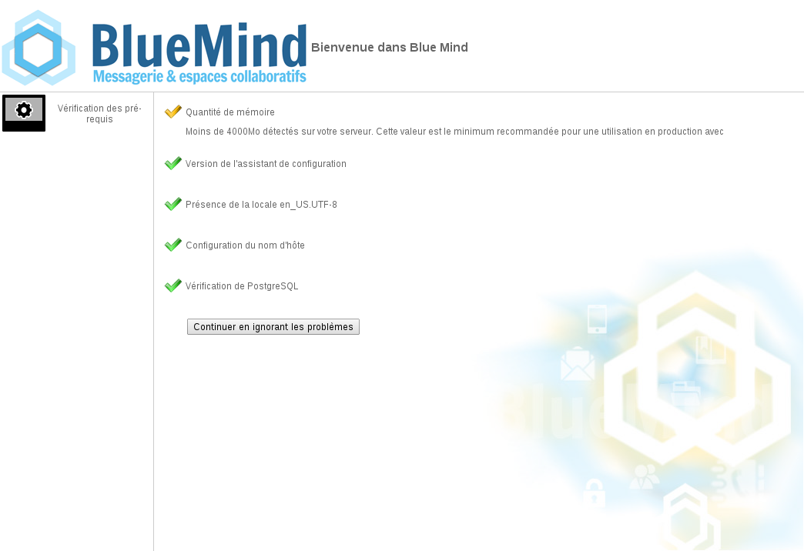
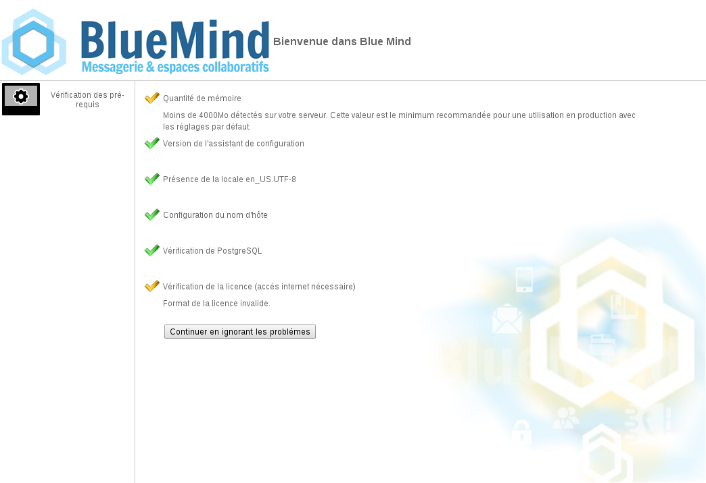

# Applications et composants

Liste des applications et des composants de BlueMind

## Les applications utilisateur

### Webmail

L'application de webmail est entièrement intégrée avec les autres applications BlueMind.

Les fonctionnalités majeures apportées comprennent notamment :

- une vue à 3 panneaux
- les réponses aux invitations aux événements sont possibles sans quitter l'application de webmail
- autocomplétion des contacts et listes de distribution BlueMind
- recherche avancée full-text et multidossiers

Pour plus de détails, voir [Découvrir la messagerie](../../Guide_de_l_utilisateur/La_messagerie/Decouvrir_la_messagerie.md)

### Calendrier

L'application d'agenda présente parmi ses fonctionnalités majeures :

- le support du mode déconnecté
- l'affichage d'agendas multiples
- la gestion des étiquettes (tags)
- la gestion de ressources

Pour plus de détails, voir [Découvrir l'agenda](../../Guide_de_l_utilisateur/L_agenda/Decouvrir_l_agenda.md)

### Contacts

L'application de gestion des contacts présente parmi ses fonctionnalités :

- le support du mode déconnecté
- la gestion des étiquettes (tags)
- la gestion de listes de contacts
- la gestion des contacts et des carnets d'adresses de l'utilisateur

Pour plus de détails, voir [Découvrir les contacts](../../Guide_de_l_utilisateur/Les_contacts/Decouvrir_les_contacts.md)

### Paramètres et préférences

L'application de gestion des paramètres et préférences permet à un utilisateur de modifier ses préférences personnelles de paramétrage et d'affichage de BlueMind.

Pour plus de détails, voir [Paraméter le compte utilisateur](../../Guide_de_l_utilisateur/Parametrer_le_compte_utilisateur.md)

## Les applications de l'administrateur

### Installation Wizard

L'application Installation Wizard (IW) permet d'installer BlueMind sur un nouveau serveur. L'application configure l'ensemble des composants systèmes et tous les paramétrages BlueMind permettant l'installation de BlueMind de façon complète, cohérente et performante.

:::info

L'Installation Wizard ne permet pas de réaliser une mise à jour d'un système BlueMind. Seul le Setup Wizard permet cette étape.

:::

### Setup Wizard

L'application Setup Wizard (SW) est un assistant d'installation et de mise à jour de BlueMind.

Fourni par la [souscription BlueMind](https://www.bluemind.net/acheter/), l'application Setup Wizard, en plus des mêmes actions que l'application Installation Wizard, permet de mettre à jour une installation déjà existante de BlueMind, y compris dans un environnement distribué et lors de changements de version majeure.

## Les composants serveur

### Core

Le composant serveur Core est le web-service principal de BlueMind. Il permet de gérer :

- la logique métier
- les accès à la base de données
- les appels aux API BlueMind

### Application Server

Toutes les interfaces web à destination de l'utilisateur final sont exécutées sur un serveur web JEE. Les applications hébergées sont :

- l'agenda
- la gestion des contacts
- la console d'administration
- la gestion des paramètres
- l'Installation Wizard et le Setup Wizard
- l'application Apache Solr
- l'interface client du serveur XMPP (à partir de BlueMind v3)

### SMTP & IMAP

Les protocoles standards de messagerie sont supportés par BlueMind :

- SMTP grâce à postfix
- IMAP et POP with Cyrus IMAPd

### MQ Server

Hazelcast est packagé et entièrement intégré avec BlueMind pour l'échange d'événements entre applications BlueMind. Ce composant est utilisé pour :

- envoyer des notifications concernant les événements issus du calendrier (événements issus de Core et écoutés par EAS par exemple)
- envoyer des notifications concernant les événements issus de la gestion de contacts (événements issus de Core et écoutés par EAS par exemple)
- envoyer des notifications concernant les emails délivrés (événement issus du démon LMTP et écoutés par EAS par exemple)
- envoyer des notifications concernant les événements de login et de logout (événements issus de Core et écoutés par HPS par exemple)

Le cluster Hazelcast est constitué de 3 noeuds assurés par les services core, EAS et bm-webserver. Il est très important que le cluster soit complet pour le bon fonctionnement de BlueMind, son état peut être surveillé grâce au [Monitoring Bm-Tick](../Supervision/Monitoring_Bm_Tick/index.md).

### EAS

EAS est un serveur de synchronisation à destination des appareils mobiles (smartphones, tablettes, ...). Il gère les protocoles natifs de ce type d'appareils et permet donc d'utiliser les applications natives des smartphones pour synchronise les mails / agendas / contacts.

### Locator

Le composant Locator peut être considéré comme un serveur de résolution de nom interne à BlueMind. Il permet aux composants d'établir des liens entre eux.

Par exemple, Locator permet au composant EAS de connaître le nom du serveur IMAP qui possède la boîte mail d'un utilisateur donné.

### HPS

HPS est un serveur d'authentification HTTP de type Reverse proxy. Il se situe entre le reverse proxy [Nginx](http://wiki.nginx.org/Main) et les applications utilisateurs.

Quand une authentification est requise, HPS présente le formulaire de login à l'utilisateur si celui-ci n'est pas encore authentifié, ou passe la requête aux services demandés.

Ce composant est responsable de la logique SSO (Single Sign-On / Single Sign-Out) aux interfaces utilisateurs.

### SASL Daemon

Ce composant, nommé YSNP est le démon BlueMind d'authentification SASL. Il permet de valider les mots de passe auprès du composant Core et permet une authentification au niveau du composant IMAP pour les utilisateurs connectés via les interfaces web

## Les plugins

BlueMind peut être étendu au moyen d'*add-ons* (modules complémentaires) ou programmes complémentaires qui sont partagés par la communauté sur le [MarketPlace](https://marketplace.bluemind.net/).

Pour en savoir plus sur le développement de ces plugins, vous pouvez consulter la page dédiée [Contribuer à BlueMind](../../Guide_du_developpeur/Contribuer_a_BlueMind.md).

