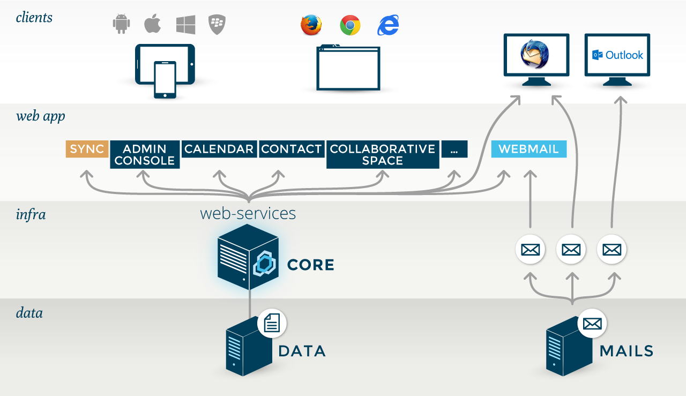

# La solution BlueMind

## Une solution 100% web

Toutes les fonctionnalités de BlueMind sont conçues pour et disponibles via un navigateur Web. Ainsi, l'ensemble des fonctionnalités est accessible au moyen d'un simple navigateur Web. L'utilisation de clients de messagerie n'est donc plus nécessaire et les déploiements sont grandement facilités.

BlueMind supporte en particulier les navigateurs :

- Mozilla à partir de la version ESR 52
- Chrome : dernière version
- Internet Explorer à partir de la version 11
- Safari à partir de la version 5.

#### Interfaces utilisateurs Full JavaScript

BlueMind offre des ergonomies riches de type client lourd depuis de simples navigateurs :

- Pas de rechargement de page
- Mode web déconnecté dans le navigateur

#### File de messages (MOM)

BlueMind utilise des files de messages afin de limiter le trafic superflu et centraliser certains traitements. C'est en particulier le cas pour :

- le push e-mail (les nouveaux mails sont poussés vers les appareils mobiles quand nécessaire, rendant inutile le trafic lié à la vérification des nouveaux messages),
- la réplication de sessions entre tous les serveurs BlueMind,
- la répartition de charge et la haute disponibilité.

#### SSO intégré

BlueMind intègre son propre SSO, ce qui permet de passer de façon transparente d'une application à l'autre. Ainsi, un utilisateur en mode Web, quel que soit le navigateur, s'authentifie au moment de l'accès à BlueMind. Une fois cette authentification validée, il peut accéder à l'ensemble des applications BlueMind (Messagerie, Agenda, Contacts, Console d'administation...) sans nécessiter de nouvelle authentification.

De plus, le SSO autorise le single logout, qui déconnecte l'utilisateur de l'ensemble des onglets ou fenêtres BlueMind lorsqu'il se déconnecte d'une fenêtre.

#### Environnement Microsoft

BlueMind permet d'éviter la ré-authentification dans le cas d'une utilisation dans un environnement Microsoft.

Ainsi, un utilisateur sous Windows utilisant Outlook qui s'authentifie auprès de l'Active Directory à l'ouverture de session a son authentification reprise au lancement d'Outlook. La connexion à BlueMind est donc transparente.

## Les applications utilisateur

### Webmail

L'application de webmail est entièrement intégrée avec les autres applications BlueMind.

Les fonctionnalités majeures apportées comprennent notamment :

- une vue à 3 panneaux
- les réponses aux invitations aux événements sont possibles sans quitter l'application de webmail
- autocomplétion des contacts et listes de distribution BlueMind
- recherche avancée full-text et multidossiers

Pour plus de détails, voir [Découvrir la messagerie](../../Guide_de_l_utilisateur/La_messagerie/Découvrir_la_messagerie.md)

### Calendrier

L'application d'agenda présente parmi ses fonctionnalités majeures :

- le support du mode déconnecté
- l'affichage d'agendas multiples
- la gestion des étiquettes (tags)
- la gestion de ressources

Pour plus de détails, voir [Découvrir l'agenda](../../Guide_de_l_utilisateur/L_agenda/Découvrir_l_agenda.md)

### Contacts

L'application de gestion des contacts présente parmi ses fonctionnalités :

- le support du mode déconnecté
- la gestion des étiquettes (tags)
- la gestion de listes de contacts
- la gestion des contacts et des carnets d'adresses de l'utilisateur

Pour plus de détails, voir [Découvrir les contacts](../../Guide_de_l_utilisateur/Les_contacts/Découvrir_les_contacts.md)

### Paramètres et préférences

L'application de gestion des paramètres et préférences permet à un utilisateur de modifier ses préférences personnelles de paramétrage et d'affichage de BlueMind.

Pour plus de détails, voir [Paraméter le compte utilisateur](../../Guide_de_l_utilisateur/Paramétrer_le_compte_utilisateur.md)

## Les applications de l'administrateur

### Installation Wizard

L'application Installation Wizard (IW) permet d'installer BlueMind sur un nouveau serveur. L'application configure l'ensemble des composants systèmes et tous les paramétrages BlueMind permettant l'installation de BlueMind de façon complète, cohérente et performante.

:::info

L'Installation Wizard ne permet pas de réaliser une mise à jour d'un système BlueMind. Seul le Setup Wizard permet cette étape.

:::

### Setup Wizard

L'application Setup Wizard (SW) est un assistant d'installation et de mise à jour de BlueMind.

Fourni par la [souscription BlueMind](http://www.blue-mind.net/solutions/article/solution-professionnelle), l'application Setup Wizard, en plus des mêmes actions que l'application Installation Wizard, permet de mettre à jour une installation déjà existante de BlueMind, y compris dans un environnement distribué et lors de changements de version majeure.

