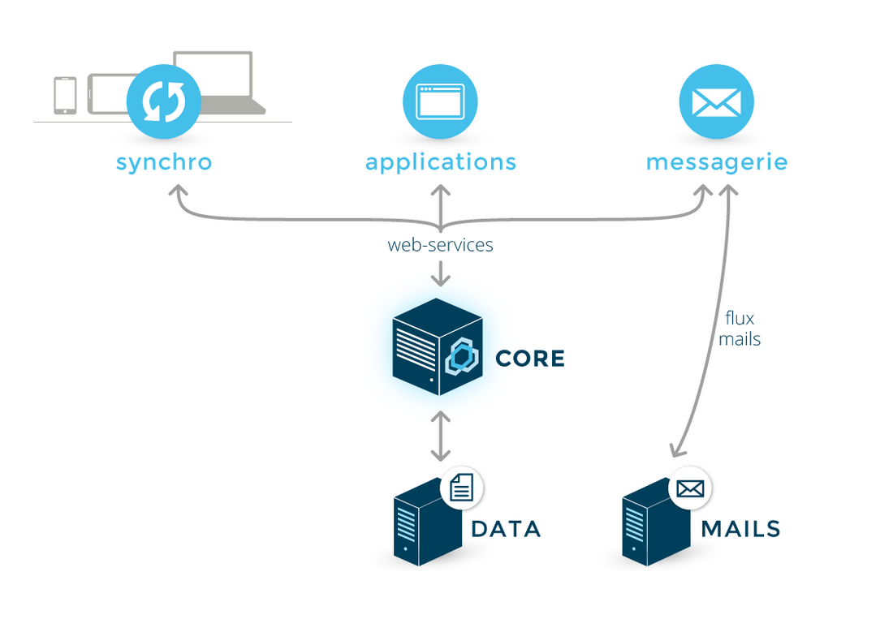
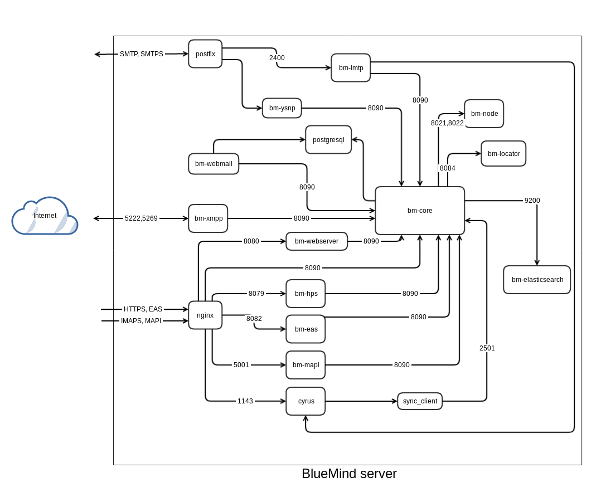

# Les services

## Architecture des services

- BM-Core est le composant central de BlueMind. Il est le centre de gestion unique des données et des règles métier. C'est le seul composant à accéder à la base de données.

- Toutes les fonctionnalités sont exposées en Web Services et peuvent donc être pilotées par d'autres applications.

- Tous les composants, internes ou externes, utilisent les Web Services. Cela a pour avantage de limiter les flux depuis et vers la messagerie BlueMind (qui sont restreint aux flux Web Services et au flux de messagerie) et de garantir l'utilisation de règles de gestion homogènes quel que soit le point d'entrée d'une modification.

## Paquets fournis avec BlueMind

Les paquets sont disponibles dans `/var/spool/bluemind-pkgs/`

Les commandes aptitude ([Debian](https://wiki.debian.org/fr/Aptitude)/[Ubuntu](https://doc.ubuntu-fr.org/aptitude)) et yum ([RedHat](http://www.linuxcommand.org/man_pages/yum8.html)) permettent d'effectuer des recherches et lister les paquets disponibles et/ou installés.

## Services utilisés par BlueMind

| Service | Utilisation |
| --- | --- |
| net.bluemind.eas.push | synchronisation des périphériques mobiles via le protocole Exchange Active Sync |
| net.bluemind.dav.server.dav | synchronisation CardDav et CalDav des clients Apple |
| net.bluemind.milter.milter | service milter |
| net.bluemind.xmpp.server.launcher.tigase | messagerie instantanée |
| net.bluemind.core.launcher.core | service principal |
| net.bluemind.node.server.nodelauncher | communication entre les différentes serveurs dans le cas d'une installation multi-serveurs |
| net.bluemind.tika.server.tika | détection et extraction des métadonnées et textes de documents |
| net.bluemind.proxy.http.launcher.hpslauncher | proxy d'authentification |
| exchange.http | communication avec MAPI |
| net.bluemind.webmodules.launcher.webLauncher | proxy HTTP pour les webservices |
| net.bluemind.locator.app | service de localisation des différents serveurs dans le cas d'une installation multi-serveurs |
| org.elasticsearch.bootstrap.Elasticsearch | service d'indexation et de recherche |
| net.bluemind.ysnp.ysnp | authentification SMTP et IMAP |
| net.bluemind.lmtp | service local de transfert de courrier |
| postgresql | base de données |
| postfix | serveur de messagerie|
| nginx| proxy HTTP + IMAP |
| php-fpm| interpréteur PHP pour les applications web (webmail) |
| cyrus (imapd et pop3d) | service pour la synchronisation imap et pop de logiciels de messagerie tiers (lourds ou mobiles) |

## Données utilisées par BlueMind

### Sauvegarde

- /var/backups/bluemind

### /etc

Les fichiers et répertoires situés dans `/etc/` contiennent les configurations des composants utilisés par BlueMind :

| Fichier/répertoire | Contenu |
| --- | --- |
| bm| bm.ini, les certificats et clés ssh de bm-node. |
| bm-node | rsync.excludes |
| bm-webmail | configuration de php5-fpm pour BlueMind et nginx-webmail.conf |
| cyrus.conf | configuration de cyrus |
| imapd.conf | configuration de imap (généré par bm-core) |
| nginx | configuration de nginx |
| php5 | configuration de php5 |
| postfix | configuration de postfix, notamment les maps de transport :warning: Il est possible d'ajouter des maps postfix supplémentaires mais il ne faut en aucun cas enlever ou modifier les maps déjà existantes et utilisées par BlueMind |
| postgresql | configuration de postgresql |

### /usr/share

Les sous-répertoires situés dans `/usr/share/` contiennent les modules et applications web. Les données présentes dans ces répertoires sont installées par les paquets BlueMind et ne doivent pas être modifiés

- bm-conf/logs : configuration par défault des logs applicatif (log4)

### /var/spool

Les sous-répertoires de `/var/spool/` contiennent les données utilisées par BlueMind (exceptées celles contenues dans la base de données postgresql) :

| Répertoire | Données | type stockage |
| --- | --- | --- |
| bm-docs| documents BlueMind (photos utilisateurs/resources) | tous |
| bm-elasticsearch | index ElasticSearch | block device |
| bm-hsm | mails archivés | tous |
| bm-filehosting | pièces jointes détachés des mails | tous |
| cyrus/data | mails | tous |
| cyrus/meta | metadonnées des mails | block device |
| postfix | files d'attentes postfix | tous |
| sieve | script sieve | tous |
| bluemind-pkgs | données d'installation de BlueMind - utilisé à l'installation et tant qu'on n'a pas de souscription | tous |

### /var/lib

Les données situées dans `/var/lib/` ne doivent pas être modifiées manuellement :

| Répertoire | Contenu |
| --- | --- |
| bm-ca| autorité de certification généré lors de l'installation |
| postgresql | base de données postgresql |
| cyrus | informations administratives de Cyrus - liste des BAL, ACLs, quota, quota utilisé |

### Estimation de taille des dossiers

La taille usuelle de certains dossiers peut être estimée de la façon suivante :

| Dossier | Taille estimée |
| --- | --- |
| /var/spool/bm-elasticsearch| ~10% de /var/spool/cyrus/data + /var/spool/bm-hsm **La taille de la partition doit être d'AU MOINS 2 fois le volume de données contenu.** Idéalement, ce dossier sera déporté et séparé en 2 partitions dédiées, qui respecteront la même contrainte de taille :/var/spool/bm-elasticsearch/data et /var/spool/bm-elasticsearch/repo|
| /var/spool/cyrus/meta | ~10% de /var/spool/cyrus/data + /var/spool/bm-hsm |
| /var/spool/sieve | ~1Mo/(utilisateurs+mailshare) |

| Dossier | Type de montage | Taille estimée |
| --- | --- | --- |
| /var/lib/cyrus| block device | ~10Go |
| /var/lib/postgresql | block device | ~20Go |

:::info

Il s'agit là d'estimations, qui peuvent être amenées à varier suivant les installations et l'évolution de l'organisation, il est donc préférable d'utiliser des technologies permettant d'agrandir simplement les FS.

:::

## Logs

Les logs sont écrits dans des sous-répertoires du répertoire `/var/log/` :

| Répertoire | Contenu |
| --- | --- |
| bm| logs du core |
| bm-elasticsearch | logs elasticsearch |
| bm-hps | logs hps |
| bm-lmtpd | logs service LMTP |
| bm-locator | logs locator |
| bm-mapi | logs service mapi |
| bm-node | logs du node |
| bm-tika | logs de Tika |
| bm-webserver | logs du webserver |
| bm-webmail | logs du webmail |
| bm-xmpp | logs XMPP |
| bm-ysnp | logs YNSP |

Pour les autres composants qu'il est possible de superviser, les fichiers ou sous-répetoires suivants peuvent être utilisés :

| Fichier/répertoire | Contenu |
| --- | --- |
| mail.err | erreurs Postfix/Cyrus |
| mail.log | logs Postfix/Cyrus |
| nginx/ | logs NGinx |
| bm-php5-fpm/ | logs FPM (/var/log/bm-php-fpm/ sur RedHat) |
| postgresql/ | logs de PostgreSQL |

Pour plus de détails, consultez la page dédiée [Logs - Fichiers journaux](/Guide_de_l_administrateur/Supervision/Logs_Fichiers_journaux/)

