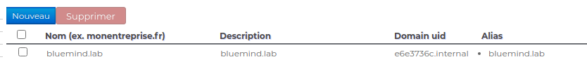

# Problèmes d'émission et réception de messages


## Problèmes connus

### Les emails n'arrivent pas sur une adresse existante

****Symptômes****** :** les emails ne sont pas délivrés à une adresse pourtant existante et l'expéditeur ne reçoit pas de message d'erreur

****Cause** :** la modification de l'adresse de messagerie (suite à changement de login par exemple) n'a pas été correctement reportée par le système dans les maps postfix

****Solution** :** il faut régénérer les maps Postfix en se rendant dans la console d'administration > Gestions du Système > Maintenance des mails > cliquer sur le bouton "Exécuter" :


Il n'est pas nécessaire de redémarrer de service, les changements sont effectifs dès la fin de l'opération.

Si cela ne résout pas le problème, voir les chapitres ci-dessous pour une investigation plus poussée.


## Vérifier qu'un email est bien arrivé sur le serveur

Il peut y avoir plusieurs raisons pour qu'un email supposé arrivé ne soit pas présent dans la boite d'un utilisateur.

- L'email est bloqué par un antispam avant d'arriver sur le serveur BlueMind, dans ce cas il vous faut regarder dans les logs de votre solutions Antispam
- L'email est bloqué dans la queue postifx du serveur BlueMind, cela arrive notamment quand un utilisateur a atteint 100% de son quota, l'email sera dans ce cas placé en attente dans postfix pendant 3 jours. Si au bout de 3 jours il n'a toujours pas réussi à délivrer l'email, un message de *non-delivery* sera envoyé à l'expéditeur. Vous pouvez voir si l'email est présent dans la *queue* postfix avec la commande :


```
[root@bluemind ~]# postqueue -p
-Queue ID- --Size-- ----Arrival Time---- -Sender/Recipient-------
4E4D83AF8E      943 Thu Mar  2 07:10:58  full@bluemind.net
(host 192.168.124.72[192.168.124.72] said: 452 4.2.2 Over quota SESSIONID=<cyrus-4311-1488438658-1> (in reply to RCPT TO command))
                                         full@bluemind.net
```

Pour débloquer le message, il faut demander à l'utilisateur de supprimer des emails ou augmenter son quota puis attendre que le message soit délivré ou forcer postfix à réessayer de délivrer les emails avec la commande postqueue -f


Si l'email n'est pas bloqué alors vous pouvez trouver les traces de son arrivée dans les logs de postfix (`/var/log/maillog` ou `/var/log/mail.log`) :


```
Mar  1 20:45:32 bluemind postfix/lmtp[16928]: C5BF3135FAF: to=<user@bluemind.net>, relay=192.168.124.72[192.168.124.72]:2400, delay=0.32, delays=0.21/0.02/0.01/0.09, dsn=2.1.5, status=sent (250 2.1.5 Ok SESSIONID=<cyrus-12823-1488397532-1> [bluemind.net!user.user.INBOX () 2294])
```


Cette ligne de log montre que l'email identifié par l'id C5BF3135FAF a bien été remis dans la boite de réception de l'utilisateur 'user@bluemind.net' le 1 mars à 20:45.

Vous pouvez trouver plus d'information sur l'email, notamment l'adresse de l'expéditeur, en recherchant l'id :


```
[root@bluemind ~]# grep C5BF3135FAF /var/log/maillog
Mar  1 20:45:32 bluemind postfix/smtpd[16923]: C5BF3135FAF: client=smtp.domain.net[192.168.120.30]
Mar  1 20:45:32 bluemind postfix/cleanup[16927]: C5BF3135FAF: message-id=<AM5PR04MB3219A293B59D96973D338B01D2290>
Mar  1 20:45:32 bluemind postfix/qmgr[364]: C5BF3135FAF: from=<user2@domain.net>, size=8386, nrcpt=1 (queue active)
Mar  1 20:45:32 bluemind postfix/lmtp[16928]: C5BF3135FAF: to=<user@bluemind.net>, relay=192.168.124.72[192.168.124.72]:2400, delay=0.32, delays=0.21/0.02/0.01/0.09, dsn=2.1.5, status=sent (250 2.1.5 Ok SESSIONID=<cyrus-12823-1488397532-1> [bluemind.net!user.user.INBOX () 2294])
Mar  1 20:45:32 bluemind postfix/qmgr[364]: C5BF3135FAF: removed
```


On peut voir ici que c'est user2@domain.net qui est l'expéditeur de l'email AM5PR04MB3219A293B59D96973D338B01D2290 et qu'il a bien été délivré à notre utilisateur.

Le message-id est l'identifiant unique du message, celui-ci se trouve dans les en-têtes de l'email

Le dernier nombre de la ligne lmtp (ici 2294) correspond à l'id de l'email dans le dossier *INBOX* de l'utilisateur, vous pouvez donc trouver l'email dans `/var/spool/cyrus/data*/b/bluemind\_net/b/bluemind.net/*u/user/user/2294`.

## Suivre l'historique d'un email

### Pour un email connu

Une fois l'UID de l'email trouvé (voir ci-dessus), l'outil en ligne de commande bm-cli permet d'obtenir l'historique des mouvements d'un message :


```
bm-cli mail history-imap --email <email> --imapUid <imapUid>
```


Où :

- email : l'adresse email de l'utilisateur concerné
- imapUid : l'UID de l'email, trouvé via les logs ou présent sur le serveur dans le dossier de l'utilisateur


Par exemple :


```
[root@centos7 test]# bm-cli mail history-imap --email john.test@local.lan --imapUid 1
+------------------------------+---------+--------------------+---------------------------------------+--------+---------------+----------------+
| Date                         | Type    | Owner              | Folder-UID                            | Folder | Item/IMAP-UID | Flags          |
+------------------------------+---------+--------------------+---------------------------------------+--------+---------------+----------------+
| Thu Jun 13 13:11:14 GMT 2019 | Created |   John Test (USER) | mbox\_records\_nqjg0zo2avnp9p8i121e8czq |  INBOX |        12617. |                |
+------------------------------+---------+--------------------+---------------------------------------+--------+---------------+----------------+
| Thu Jun 13 13:11:25 GMT 2019 | Updated |   John Test (USER) | mbox\_records\_nqjg0zo2avnp9p8i121e8czq |  INBOX |        12617. | Seen,Important |
+------------------------------+---------+--------------------+---------------------------------------+--------+---------------+----------------+
| Thu Jun 13 13:11:25 GMT 2019 | Created | admin admin (USER) | mbox\_records\_xyum8ijpaahokdnpnhvr6vwp |  Trash |        12617. |                |
+------------------------------+---------+--------------------+---------------------------------------+--------+---------------+----------------+
| Thu Jun 13 13:11:25 GMT 2019 | Updated |   John Test (USER) | mbox\_records\_nqjg0zo2avnp9p8i121e8czq |  INBOX |        12617. |        Deleted |
+------------------------------+---------+--------------------+---------------------------------------+--------+---------------+----------------+
```


### Avec une recherche par mot clef

L'outil en ligne de commande permet aussi d'effectuer des recherches par mot clef :


```
bm-cli mail history-query --email <email> --query <query>
```


Par exemple ici nous allons chercher les emails de rappels d'un utilisateur pour voir s'ils ont été reçus/déplacés/supprimés :


```
# bm-cli mail history-query --email jdoe@blue-mind.net --query Rappel
+------------------------------+---------+-----------------+---------------------------------------------------+--------+---------------+-------+
| Date                         | Type    | Owner           | Folder-UID                                        | Folder | Item/IMAP-UID | Flags |
+------------------------------+---------+-----------------+---------------------------------------------------+--------+---------------+-------+
| Sat Apr 13 06:45:17 GMT 2019 | Created | John Doe (USER) | mbox\_records\_0ad3865e-6336-4c98-b4b8-1706fc05e73f |  INBOX |            7. |       |
+------------------------------+---------+-----------------+---------------------------------------------------+--------+---------------+-------+
+------------------------------+---------+-----------------+---------------------------------------------------+--------+---------------+--------------+
| Date                         | Type    | Owner           | Folder-UID                                        | Folder | Item/IMAP-UID | Flags        |
+------------------------------+---------+-----------------+---------------------------------------------------+--------+---------------+--------------+
| Sun Apr 14 06:45:18 GMT 2019 | Created | John Doe (USER) | mbox\_records\_0ad3865e-6336-4c98-b4b8-1706fc05e73f |  INBOX |            8. |              |
+------------------------------+---------+-----------------+---------------------------------------------------+--------+---------------+--------------+
| Thu Jun 13 14:09:35 GMT 2019 | Updated | John Doe (USER) | mbox\_records\_0ad3865e-6336-4c98-b4b8-1706fc05e73f |  INBOX |            8. |              |
+------------------------------+---------+-----------------+---------------------------------------------------+--------+---------------+--------------+
| Thu Jun 13 14:09:41 GMT 2019 | Created | John Doe (USER) | mbox\_records\_6330f080-7b22-4a9d-b181-7ca99e226878 |  Trash |            3. |         Seen |
+------------------------------+---------+-----------------+---------------------------------------------------+--------+---------------+--------------+
| Thu Jun 13 14:09:42 GMT 2019 | Updated | John Doe (USER) | mbox\_records\_0ad3865e-6336-4c98-b4b8-1706fc05e73f |  INBOX |            8. | Seen,Deleted |
+------------------------------+---------+-----------------+---------------------------------------------------+--------+---------------+--------------+
```


1. Un email (id 7) a simplement été reçu, il est toujours dans la boîte de réception de l'utilisateur qui ne l'a pas consulté
2. Un autre email (id 8) a été lu et placé dans la corbeille :
    - il est copié dans la corbeille où il prend l'id 3
    - l'original, d'id 8, est supprimé de la boîte de réception
    - les 2 versions sont marquées comme lues


Autre exemple, un peu plus tard on constate que l'email d'id 7 a "disparu" :


```
# bm-cli mail history-imap --email jdoe@blue-mind.net --imapUid 7
+------------------------------+---------+------------------------+---------------------------------------------------+------------+---------------+--------------+
| Date                         | Type    | Owner                  | Folder-UID                                        | Folder     | Item/IMAP-UID | Flags        |
+------------------------------+---------+------------------------+---------------------------------------------------+------------+---------------+--------------+
| Sat Apr 13 06:45:17 GMT 2019 | Created |        John Doe (USER) | mbox\_records\_0ad3865e-6336-4c98-b4b8-1706fc05e73f |      INBOX |            7. |              |
+------------------------------+---------+------------------------+---------------------------------------------------+------------+---------------+--------------+
| Thu Jun 13 14:09:42 GMT 2019 | Updated |        John Doe (USER) | mbox\_records\_0ad3865e-6336-4c98-b4b8-1706fc05e73f |      INBOX |            7. |              |
+------------------------------+---------+------------------------+---------------------------------------------------+------------+---------------+--------------+
| Thu Jun 13 14:13:54 GMT 2019 | Created |     projet (MAILSHARE) |                     mbox\_records\_32d9e5e24fb3a25a |     projet |           56. |              |
+------------------------------+---------+------------------------+---------------------------------------------------+------------+---------------+--------------+
| Thu Jun 13 14:13:55 GMT 2019 | Updated |        John Doe (USER) | mbox\_records\_0ad3865e-6336-4c98-b4b8-1706fc05e73f |      INBOX |            7. | Seen,Deleted |
+------------------------------+---------+------------------------+---------------------------------------------------+------------+---------------+--------------+
```


→ l'email a été déplacé dans la boîte partagée "projet" :

- l'email est créé dans cette boîte, où cette copie prend l'id 56
- l'original est marqué comme lu et supprimé de la boîte de l'utilisateur


:::info

Dans ce cas précis, l'email n'est pas copié dans la corbeille et le fichier n'apparaît plus sur le serveur car il ne s'agit pas d'une suppression en tant que telle mais d'un déplacement vers un autre dossier, même si celui-ci s'avère être un dossier partagé.

:::

## Restauration

La suppression en mode *delayed* a été mise en place au niveau de cyrus. Cela signifie que les mails ne sont réellement supprimés du serveur qu'au bout de 7 jours. Pendant ce laps de temps ils sont présents sur le disque mais non visible en IMAP.
Ce mode de suppression prépare la future fonctionnalité de corbeille à double fond.

Dans les exemples suivants, Il faut réaliser les manipulations avec le nom du domaine technique et non pas le nom de domaine principal ou un alias. Le nom de domaine technique est affiché dans la console d'admin :



Pour lister les mails supprimés d'un utilisateur il faut utiliser la commande :


```
unexpunge -l user/john@domain.net
```


Pour restaurer un mail :


```
unexpunge -u -d user/john@domain.net 46908
```


*où 46908 est l'id du message.*

Pour restaurer tous les emails de l'utilisateur :


```
unexpunge -a -d user/john@domain.net
```
A noter que ces commandes peuvent être jouées depuis le CLI BlueMind :

```
bm-cli mail unexpunge

## Pour de l'aide sur cette commande :
bm-cli mail unexpunge --help

```

Pour plus d'informations sur ces commandes et la façon de les passer, veuillez consulter la documentation cyrus : [https://www.cyrusimap.org/imap/reference/manpages/systemcommands/unexpunge.html](https://www.cyrusimap.org/imap/reference/manpages/systemcommands/unexpunge.html)


