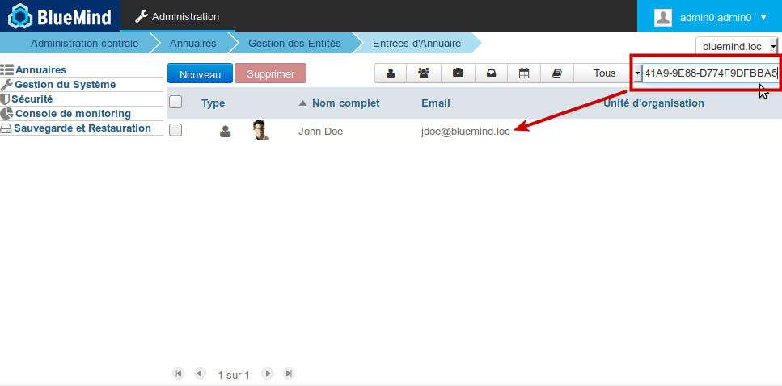

# Disparitions et modifications d'événements


## Présentation

Les actions réalisées sur les événements de calendriers (création, modification, suppression) sont loguées sur le serveur dans le répertoire `/var/log/bm/audit` dans des fichiers correspondant chacun à un calendrier.

Les noms des fichiers sont de la forme `audit-<uid du calendrier>@domaine.log`

Par exemple, le fichier correspondant au calendrier par défaut de l'utilisateur John Doe sur notre serveur de démonstration se nomme : `audit-calendar:Default:9E3C96CA-2E46-41A9-9E88-D774F9DFBBA5@bluemind.loc.log`


:::tip

uid et identifiant

Lorsque l'on connaît l'identifiant d'un utilisateur, on peut retrouver son uid en se rendant sur sa fiche d'administration : l'uid est alors visible dans l'url :


Lorsque l'on a un uid et que l'on souhaite savoir à quel utilisateur il correspond, il suffit de rechercher cet uid dans l'administration des utilisateurs :


:::

Les noms de fichiers listés dans le répertoire peuvent semble de forme différente. Par exemple, le listing ci-dessous :


```
root@bluemind.loc:/var/log/bm/audit# ll
total 12980
drwxr-xr-x 2 root root   12288 janv. 11 14:46 ./
drwxr-xr-x 3 root root    4096 janv.  4 17:36 ../
-rw-r--r-- 1 root root     640 nov.   9 14:35 audit-2C0728BF-770D-4C2B-8365-AC1B168EE427@bluemind.loc.log
-rw-r--r-- 1 root root    2712 janv. 11 14:33 audit-8DEEA368-C34F-4F94-B711-0967C4460584@bluemind.loc.log
-rw-r--r-- 1 root root  311419 déc.  21 11:57 audit-calendar:079FC452-5725-4F50-B606-6EEEDA8BCDBF@bluemind.loc.log
-rw-r--r-- 1 root root     660 nov.   6 15:43 audit-calendar:ADC181A0-4124-42D8-BB92-4AF9031B3C46@bluemind.loc.log
-rw-r--r-- 1 root root     670 nov.  13 09:22 audit-calendar:Default:09F20F61-1904-4872-8B12-552693652163@bluemind.loc.log
-rw-r--r-- 1 root root     671 déc.  20 16:36 audit-calendar:Default:0C905A1A-D337-4208-8804-2B00EFA3FE2B@bluemind.loc.log
...
```


Cela est dû au fait que :

- la chaîne "`calendar:`" est incluse dans les uid des calendriers par défaut des utilisateurs et ceux de ressources

- la chaîne "`Default:`" est incluse dans l'uid des calendriers par défaut des utilisateurs


Ainsi, le nom de fichier permet d'identifier :

- `audit-XYZ123` : un calendrier secondaire d'utilisateur ou un calendrier de domaine
- `audit-**calendar:**XYZ123` : un calendrier de ressource
- `audit-**calendar:Default:**XYZ123` : un calendrier par défaut d'utilisateur


*NB : des uid tels que calendar_calendar_57 ou calendar:Default:user_entity_156492 sont des uid d'entités migrées de BlueMind 3.0 (ici respectivement un calendrier de domaine et un utilisateur).*

## Décoder une ligne de log d'un événement simple


:::info

L'outil en ligne de commande bm-cli permet un filtrage et un affichage plus clair du contenu des fichiers logs. Consultez la [documentation dédiée](/Guide_de_l_administrateur/Administration_avancée/Client_CLI_pour_l_administration/) ou l'aide en ligne de l'outil pour en savoir plus sur son usage et les options possibles :


```
bm-cli help calendar log
```


:::


:::tip

Pour rechercher des informations sur un événement on pourra utiliser la commande "grep" sur son titre (tout ou partie) plutôt que parcourir le fichier de l'utlisateur

:::

Par exemple, je recherche les informations concernant l'événement "Réunion commerce" de mon utilisateur John Doe :


```
root@mail:/var/log/bm/audit# grep commerce audit-calendar:Default:9E3C96CA-2E46-41A9-9E88-D774F9DFBBA5@bluemind.loc.log
2018-02-13 10:55:27,347 INFO - 1518519326822 9bd44f3a-6201-44ed-972a-5e787fbae9fc : (actor:9E3C96CA-2E46-41A9-9E88-D774F9DFBBA5@bluemind.loc meta: {session=02907900-87a0-407b-bcb7-6fa48b9801b5, origin=bm-hps, remote=192.168.122.1,127.0.0.1}) -> (action:create, ro:false, meta: {sanitized-value="{\"main\":{\"dtstart\":{\"iso8601\":\"2018-02-15T14:00:00.000+01:00\",\"timezone\":\"Europe/Paris\",\"precision\":\"DateTime\"},\"summary\":\"Réunion commerce\",\"classification\":\"Public\",\"location\":\"\",\"description\":\"\",\"priority\":5,\"alarm\":null,\"status\":\"Confirmed\",\"attendees\":[],\"organizer\":null,\"categories\":[],\"exdate\":null,\"rdate\":null,\"rrule\":null,\"url\":\"\",\"dtend\":{\"iso8601\":\"2018-02-15T15:00:00.000+01:00\",\"timezone\":\"Europe/Paris\",\"precision\":\"DateTime\"},\"transparency\":\"Opaque\"},\"occurrences\":[],\"properties\":null,\"icsUid\":\"489eddbe-b669-4bdc-b8ba-e9ffe672f8e2\"}", item-uid="80e03821-6fcd-4c02-b45f-fc320c5461cb", value="{\"main\":{\"dtstart\":{\"iso8601\":\"2018-02-15T14:00:00.000+01:00\",\"timezone\":\"Europe/Paris\",\"precision\":\"DateTime\"},\"summary\":\"Réunion commerce\",\"classification\":\"Public\",\"location\":\"\",\"description\":\"\",\"priority\":5,\"alarm\":null,\"status\":\"Confirmed\",\"attendees\":[],\"organizer\":null,\"categories\":[],\"exdate\":null,\"rdate\":null,\"rrule\":null,\"url\":\"\",\"dtend\":{\"iso8601\":\"2018-02-15T15:00:00.000+01:00\",\"timezone\":\"Europe/Paris\",\"precision\":\"DateTime\"},\"transparency\":\"Opaque\"},\"occurrences\":[],\"properties\":null,\"icsUid\":\"489eddbe-b669-4bdc-b8ba-e9ffe672f8e2\"}", sendNotif="false"}) on (object:calendar:Default:9E3C96CA-2E46-41A9-9E88-D774F9DFBBA5@bluemind.loc meta: {container-json="{\"id\":27,\"uid\":\"calendar:Default:9E3C96CA-2E46-41A9-9E88-D774F9DFBBA5\",\"type\":\"calendar\",\"name\":\"John Doe\",\"owner\":\"9E3C96CA-2E46-41A9-9E88-D774F9DFBBA5\",\"createdBy\":\"system\",\"updatedBy\":\"system\",\"created\":1475668302446,\"updated\":1475668302446,\"domainUid\":\"bluemind.loc\",\"defaultContainer\":true,\"readOnly\":false}"}) succeed
2018-02-13 10:56:06,389 INFO - 1518519366020 4b5d4721-8600-4639-ab24-e99bf7d8831c : (actor:030835FF-B045-448D-AFAE-EAA8CFA0F3F6@bluemind.loc meta: {session=d26c1876-d92e-4ecd-855c-a536398cc9e4, origin=bm-hps, remote=192.168.122.1,127.0.0.1}) -> (action:delete, ro:false, meta: {previous-value="{\"main\":{\"dtstart\":{\"iso8601\":\"2018-02-15T14:00:00.000+01:00\",\"timezone\":\"Europe/Paris\",\"precision\":\"DateTime\"},\"summary\":\"Réunion commerce\",\"classification\":\"Public\",\"location\":\"\",\"description\":\"\",\"priority\":5,\"alarm\":null,\"status\":\"Confirmed\",\"attendees\":[],\"organizer\":null,\"categories\":[],\"exdate\":null,\"rdate\":null,\"rrule\":null,\"url\":\"\",\"dtend\":{\"iso8601\":\"2018-02-15T15:00:00.000+01:00\",\"timezone\":\"Europe/Paris\",\"precision\":\"DateTime\"},\"transparency\":\"Opaque\"},\"occurrences\":[],\"properties\":{},\"icsUid\":\"489eddbe-b669-4bdc-b8ba-e9ffe672f8e2\"}", item-uid="80e03821-6fcd-4c02-b45f-fc320c5461cb", sendNotif="false"}) on (object:calendar:Default:9E3C96CA-2E46-41A9-9E88-D774F9DFBBA5@bluemind.loc meta: {container-json="{\"id\":27,\"uid\":\"calendar:Default:9E3C96CA-2E46-41A9-9E88-D774F9DFBBA5\",\"type\":\"calendar\",\"name\":\"John Doe\",\"owner\":\"9E3C96CA-2E46-41A9-9E88-D774F9DFBBA5\",\"createdBy\":\"system\",\"updatedBy\":\"system\",\"created\":1475668302446,\"updated\":1475668302446,\"domainUid\":\"bluemind.loc\",\"defaultContainer\":true,\"readOnly\":false}"}) succeed
```


Les informations principales dans ces lignes sont :

- **2018-02-13 10:55:27,347** : la date à laquelle l'action a été effectuéeAttention : il s'agit ici de l'heure GMT, il peut donc y avoir un décalage avec l'heure réelle à laquelle l'action a été réalisée selon le fuseau horaire. Ainsi l'action loguée ici étant en France à l'heure d'hiver, elle a en réalité été faite et loguée à 11h55
- **origin** : la provenance de l'action
Dans notre exemple bm-hps indique une connexion hps, soit une connexion via webmail ou connecteur Thunderbird


:::tip

Les origines possibles sont :

- ** **bm-hps** ** : webmail ou Thunderbird
- ** **bm-connector-outlook-&lt;version>** ** : Outlook*par exemple : origin=bm-connector-outlook-3.1.25071 otlk:16.0.0.4266*
- ** **bm-eas** ** : appareil mobile connecté en EAS


:::

- **actor** : **l'uid de l'utilisateur ayant effectué l'action** Dans notre exemple :
    - 1ère ligne : 9E3C96CA-2E46-41A9-9E88-D774F9DFBBA5@bluemind.loc : correspond à l'utilisateur John Doe lui-même
    - 2ème ligne : 030835FF-B045-448D-AFAE-EAA8CFA0F3F6@bluemind.loc : correspond à l'utilisateur John Smith
- **action** : **l'action effectuée** Dans notre exemple :
    - 1ère ligne : action:create : création de l'événement
    - 2ème ligne : action:delete : suppression de l'événement


Les informations sur l'événement lui-même :

- **dtstart** et **dtend** permettent de repérer l'heure de début et de fin de l'événementDans notre exemple :
    - dtstart : 2018-02-15T14:00:00.000+01:00 : le 15/02/2018 à 15h, heure GMT+1 du fuseau horaire Europe/Paris
    - dtend : 2018-02-15T15:00:00.000+01:00 : le 15/02/2018 à 15h
- **summary** : le titre de l'événementDans notre exemple :
    - \"summary\":\"Réunion commerce\" : le titre est "Réunion commerce"
- **\"attendees\":[]**:  ici il n'y a pas d'invités, si l'événement comporte des invités alors les crochets encadre la liste de ceux-ci (voir ci-dessous les logs d'une réunion)
- **\"organizer\":null** : ici il n'y a pas d'organisateur spécifié, il s'agit d'un simple événement sur le calendrier de l'organisateur lui-même (voir ci-dessous les logs d'une réunion)
- **object:calendar** permet de vérifier le calendrier concerné, ses informations se trouvent entre les parenthèses.Dans notre exemple, on y trouve :
    - l'identifiant du calendrier concerné (le même que le nom du fichier de log)
    - **name** : le nom de l'utilisateur : John Doe
    - **owner** : l'uid de l'utilisateur : 9E3C96CA-2E46-41A9-9E88-D774F9DFBBA5


## Les logs d'une réunion

Prenons l'exemple d'une réunion pour observer son cycle de vie :

1. l'organisateur crée la réunion avec 2 invités :


```
2018-02-13 12:39:23,734 INFO - 1518525563613 f7ed4a4e-6627-44aa-92bf-5b9b6d1fc5e6 : (actor:9E3C96CA-2E46-41A9-9E88-D774F9DFBBA5@bluemind.loc meta: {session=96a513b4-add8-4a7f-849f-aabcb87333b8, origin=bm-hps, remote=192.168.122.1,127.0.0.1}) -> (action:create, ro:false, meta: {sanitized-value="{\"main\":{\"dtstart\":{\"iso8601\":\"2018-02-15T15:00:00.000+01:00\",\"timezone\":\"Europe/Paris\",\"precision\":\"DateTime\"},\"summary\":\"Réunion de suivi\",\"classification\":\"Public\",\"location\":\"Agence de Toulouse\",\"description\":\"\",\"priority\":5,\"alarm\":[],\"status\":\"Confirmed\",\"attendees\":[{\"cutype\":\"Individual\",\"member\":null,\"role\":\"RequiredParticipant\",\"partStatus\":\"NeedsAction\",\"rsvp\":true,\"delTo\":null,\"delFrom\":null,\"sentBy\":null,\"commonName\":\"John Smith\",\"dir\":\"bm://bluemind.loc/users/030835FF-B045-448D-AFAE-EAA8CFA0F3F6\",\"lang\":null,\"mailto\":\"hannibal@bluemind.loc\",\"uri\":\"addressbook\_bluemind.loc/030835FF-B045-448D-AFAE-EAA8CFA0F3F6\",\"internal\":true,\"responseComment\":null},{\"cutype\":\"Individual\",\"member\":null,\"role\":\"RequiredParticipant\",\"partStatus\":\"NeedsAction\",\"rsvp\":true,\"delTo\":null,\"delFrom\":null,\"sentBy\":null,\"commonName\":\"client@somewhere.loc\",\"dir\":null,\"lang\":null,\"mailto\":\"client@somewhere.loc\",\"uri\":null,\"internal\":false,\"responseComment\":null}],\"organizer\":{\"uri\":null,\"commonName\":\"John Doe\",\"mailto\":\"jdoe@bluemind.loc\",\"dir\":\"bm://bluemind.loc/users/9E3C96CA-2E46-41A9-9E88-D774F9DFBBA5\"},\"categories\":[],\"exdate\":[],\"rdate\":null,\"rrule\":null,\"url\":\"\",\"dtend\":{\"iso8601\":\"2018-02-15T17:00:00.000+01:00\",\"timezone\":\"Europe/Paris\",\"precision\":\"DateTime\"},\"transparency\":\"Opaque\"},\"occurrences\":[],\"properties\":null,\"icsUid\":\"90318754-e081-4974-b54f-68c711727a85\"}", item-uid="50cdb282-f8f1-4d50-bdfd-3ef06e70f37e", value="{\"main\":{\"dtstart\":{\"iso8601\":\"2018-02-15T15:00:00.000+01:00\",\"timezone\":\"Europe/Paris\",\"precision\":\"DateTime\"},\"summary\":\"Réunion de suivi\",\"classification\":\"Public\",\"location\":\"Agence de Toulouse\",\"description\":\"\",\"priority\":5,\"alarm\":[],\"status\":\"Confirmed\",\"attendees\":[{\"cutype\":\"Individual\",\"member\":null,\"role\":\"RequiredParticipant\",\"partStatus\":\"NeedsAction\",\"rsvp\":true,\"delTo\":null,\"delFrom\":null,\"sentBy\":null,\"commonName\":\"John Smith\",\"dir\":null,\"lang\":null,\"mailto\":\"hannibal@bluemind.loc\",\"uri\":\"addressbook\_bluemind.loc/030835FF-B045-448D-AFAE-EAA8CFA0F3F6\",\"internal\":false,\"responseComment\":null},{\"cutype\":\"Individual\",\"member\":null,\"role\":\"RequiredParticipant\",\"partStatus\":\"NeedsAction\",\"rsvp\":true,\"delTo\":null,\"delFrom\":null,\"sentBy\":null,\"commonName\":\"client@somewhere.loc\",\"dir\":null,\"lang\":null,\"mailto\":\"client@somewhere.loc\",\"uri\":null,\"internal\":false,\"responseComment\":null}],\"organizer\":{\"uri\":null,\"commonName\":\"John Doe\",\"mailto\":null,\"dir\":\"bm://bluemind.loc/users/9E3C96CA-2E46-41A9-9E88-D774F9DFBBA5\"},\"categories\":[],\"exdate\":[],\"rdate\":null,\"rrule\":null,\"url\":\"\",\"dtend\":{\"iso8601\":\"2018-02-15T17:00:00.000+01:00\",\"timezone\":\"Europe/Paris\",\"precision\":\"DateTime\"},\"transparency\":\"Opaque\"},\"occurrences\":[],\"properties\":null,\"icsUid\":\"90318754-e081-4974-b54f-68c711727a85\"}", sendNotif="true"}) on (object:calendar:Default:9E3C96CA-2E46-41A9-9E88-D774F9DFBBA5@bluemind.loc meta: {container-json="{\"id\":27,\"uid\":\"calendar:Default:9E3C96CA-2E46-41A9-9E88-D774F9DFBBA5\",\"type\":\"calendar\",\"name\":\"John Doe\",\"owner\":\"9E3C96CA-2E46-41A9-9E88-D774F9DFBBA5\",\"createdBy\":\"system\",\"updatedBy\":\"system\",\"created\":1475668302446,\"updated\":1475668302446,\"domainUid\":\"bluemind.loc\",\"defaultContainer\":true,\"readOnly\":false}"}) succeed
```


    - **actor**:9E3C96CA-2E46-41A9-9E88-D774F9DFBBA5@bluemind.loc : notre organisateur John Doe
    - **action**:create
    - **dtstart** : 2018-02-15T15:00:00.000+01:00 : le 15/02/2018 à 15h
    - **dtend** : 2018-02-15T17:00:00.000+01:00 : le 15/02/2018 à 17h
    - **summary** : Réunion de suivi
    - **attendees** : introduit la liste des invités (entre crochets), chaque invité est présenté entre accolades. On repèrera pour chacun :
        - **commonName** : le nom (John Smith et client@somewhere.loc, ce deuxième invité ne fait pas partie des contacts)
        - **dir** : null si l'invité n'est pas un utilisateur du domaine, sinon on y retrouve son uid
        - **mailTo** : l'adresse email de l'invité
        - **uri** : null si l'invité ne fait pas partie du domaine, sinon on y retrouve son "adresse" dans l'annuaire BlueMind, comportant son uid
    - **organizer** : permet de retrouver l'organisateur de la réunion, la partie entre accolades est similaire aux invités, on y retrouve les mêmes données, notamment commonName, dir, mailTo, uri
    - **on (object:calendar** : de même que pour l'événement simple, permet de vérifier les informations du calendrier concerné
2. Les emails d'invitation sont envoyés :


```
2018-02-13 12:39:23,973 INFO - 1518525563723 3bc532fe-e480-4db5-9666-ce8db3e9fc8c : (actor:9E3C96CA-2E46-41A9-9E88-D774F9DFBBA5@bluemind.loc meta: {session=96a513b4-add8-4a7f-849f-aabcb87333b8, origin=bm-hps, remote=192.168.122.1,127.0.0.1}) -> (action:send-mail, ro:false, meta: {ics="BEGIN:VCALENDAR\r\nPRODID:-//BlueMind//BlueMind Calendar//FR\r\nVERSION:2.0\r\nCALSCALE:GREGORIAN\r\nMETHOD:REQUEST\r\nBEGIN:VEVENT\r\nDTSTAMP:20180213T123923Z\r\nUID:90318754-e081-4974-b54f-68c711727a85\r\nDTSTART;TZID=Europe/Paris:20180215T150000\r\nSUMMARY:Réunion de suivi\r\nCLASS:PUBLIC\r\nLOCATION:Agence de Toulouse\r\nPRIORITY:5\r\nSTATUS:CONFIRMED\r\nATTENDEE;CUTYPE=INDIVIDUAL;ROLE=REQ-PARTICIPANT;PARTSTAT=NEEDS-ACTION;RSVP=TRUE;CN=John Smith;DIR=\"bm://bluemind.loc/users/030835FF-B045-448D-AFAE-EAA8CFA0F3F6\":MAILTO:hannibal@bluemind.loc\r\nATTENDEE;CUTYPE=INDIVIDUAL;ROLE=REQ-PARTICIPANT;PARTSTAT=NEEDS-ACTION;RSVP=TRUE;CN=client@somewhere.loc:MAILTO:client@somewhere.loc\r\nORGANIZER;CN=John Doe:mailto:jdoe@bluemind.loc\r\nVERSION:2.0\r\nDTEND;TZID=Europe/Paris:20180215T170000\r\nTRANSP:OPAQUE\r\nX-MICROSOFT-DISALLOW-COUNTER:TRUE\r\nX-MICROSOFT-CDO-BUSYSTATUS:BUSY\r\nX-MOZ-LASTACK:20180213T123923Z\r\nEND:VEVENT\r\nBEGIN:VTIMEZONE\r\nTZID:Europe/Paris\r\nTZURL:http://tzurl.org/zoneinfo-outlook/Europe/Paris\r\nX-LIC-LOCATION:Europe/Paris\r\nBEGIN:DAYLIGHT\r\nTZOFFSETFROM:+0100\r\nTZOFFSETTO:+0200\r\nTZNAME:CEST\r\nDTSTART:19700329T020000\r\nRRULE:FREQ=YEARLY;BYMONTH=3;BYDAY=-1SU\r\nEND:DAYLIGHT\r\nBEGIN:STANDARD\r\nTZOFFSETFROM:+0200\r\nTZOFFSETTO:+0100\r\nTZNAME:CET\r\nDTSTART:19701025T030000\r\nRRULE:FREQ=YEARLY;BYMONTH=10;BYDAY=-1SU\r\nEND:STANDARD\r\nEND:VTIMEZONE\r\nEND:VCALENDAR\r\n", mailTo="hannibal@bluemind.loc"}) on (object:calendar:Default:9E3C96CA-2E46-41A9-9E88-D774F9DFBBA5@bluemind.loc meta: {container-json="{\"id\":27,\"uid\":\"calendar:Default:9E3C96CA-2E46-41A9-9E88-D774F9DFBBA5\",\"type\":\"calendar\",\"name\":\"John Doe\",\"owner\":\"9E3C96CA-2E46-41A9-9E88-D774F9DFBBA5\",\"createdBy\":\"system\",\"updatedBy\":\"system\",\"created\":1475668302446,\"updated\":1475668302446,\"domainUid\":\"bluemind.loc\",\"defaultContainer\":true,\"readOnly\":false}"}) succeed
2018-02-13 12:39:24,198 INFO - 1518525563986 701820e7-bdd7-4cf4-81a0-085c3eed246c : (actor:9E3C96CA-2E46-41A9-9E88-D774F9DFBBA5@bluemind.loc meta: {session=96a513b4-add8-4a7f-849f-aabcb87333b8, origin=bm-hps, remote=192.168.122.1,127.0.0.1}) -> (action:send-mail, ro:false, meta: {ics="BEGIN:VCALENDAR\r\nPRODID:-//BlueMind//BlueMind Calendar//FR\r\nVERSION:2.0\r\nCALSCALE:GREGORIAN\r\nMETHOD:REQUEST\r\nBEGIN:VEVENT\r\nDTSTAMP:20180213T123923Z\r\nUID:90318754-e081-4974-b54f-68c711727a85\r\nDTSTART;TZID=Europe/Paris:20180215T150000\r\nSUMMARY:Réunion de suivi\r\nCLASS:PUBLIC\r\nLOCATION:Agence de Toulouse\r\nPRIORITY:5\r\nSTATUS:CONFIRMED\r\nATTENDEE;CUTYPE=INDIVIDUAL;ROLE=REQ-PARTICIPANT;PARTSTAT=NEEDS-ACTION;RSVP=TRUE;CN=John Smith;DIR=\"bm://bluemind.loc/users/030835FF-B045-448D-AFAE-EAA8CFA0F3F6\":MAILTO:hannibal@bluemind.loc\r\nATTENDEE;CUTYPE=INDIVIDUAL;ROLE=REQ-PARTICIPANT;PARTSTAT=NEEDS-ACTION;RSVP=TRUE;CN=client@somewhere.loc:MAILTO:client@somewhere.loc\r\nORGANIZER;CN=John Doe:mailto:jdoe@bluemind.loc\r\nVERSION:2.0\r\nDTEND;TZID=Europe/Paris:20180215T170000\r\nTRANSP:OPAQUE\r\nX-MICROSOFT-DISALLOW-COUNTER:TRUE\r\nX-MICROSOFT-CDO-BUSYSTATUS:BUSY\r\nX-MOZ-LASTACK:20180213T123923Z\r\nEND:VEVENT\r\nBEGIN:VTIMEZONE\r\nTZID:Europe/Paris\r\nTZURL:http://tzurl.org/zoneinfo-outlook/Europe/Paris\r\nX-LIC-LOCATION:Europe/Paris\r\nBEGIN:DAYLIGHT\r\nTZOFFSETFROM:+0100\r\nTZOFFSETTO:+0200\r\nTZNAME:CEST\r\nDTSTART:19700329T020000\r\nRRULE:FREQ=YEARLY;BYMONTH=3;BYDAY=-1SU\r\nEND:DAYLIGHT\r\nBEGIN:STANDARD\r\nTZOFFSETFROM:+0200\r\nTZOFFSETTO:+0100\r\nTZNAME:CET\r\nDTSTART:19701025T030000\r\nRRULE:FREQ=YEARLY;BYMONTH=10;BYDAY=-1SU\r\nEND:STANDARD\r\nEND:VTIMEZONE\r\nEND:VCALENDAR\r\n", mailTo="client@somewhere.loc"}) on (object:calendar:Default:9E3C96CA-2E46-41A9-9E88-D774F9DFBBA5@bluemind.loc meta: {container-json="{\"id\":27,\"uid\":\"calendar:Default:9E3C96CA-2E46-41A9-9E88-D774F9DFBBA5\",\"type\":\"calendar\",\"name\":\"John Doe\",\"owner\":\"9E3C96CA-2E46-41A9-9E88-D774F9DFBBA5\",\"createdBy\":\"system\",\"updatedBy\":\"system\",\"created\":1475668302446,\"updated\":1475668302446,\"domainUid\":\"bluemind.loc\",\"defaultContainer\":true,\"readOnly\":false}"}) succeed
```

1 ligne par invité apparaît avec :

    - **action**:send-mail
    - **mailTo**: l'adresse de messagerie de l'invitéAttention à ne pas confondre avec les mots clés MAILTO présents plus tôt sur la même ligne à chaque adresse de chaque invité.
3. John Smith, ayant droit d'écriture sur l'agenda de John Doe supprime la réunion :


```
2018-02-13 12:39:54,110 INFO - 1518525594028 34bf638c-e9b5-46d2-9685-cd3b6028b9d5 : (actor:030835FF-B045-448D-AFAE-EAA8CFA0F3F6@bluemind.loc meta: {session=642532de-7613-491c-81e5-9dd63e6afb69, origin=bm-hps, remote=192.168.122.1,127.0.0.1}) -> (action:delete, ro:false, meta: {previous-value="{\"main\":{\"dtstart\":{\"iso8601\":\"2018-02-15T15:00:00.000+01:00\",\"timezone\":\"Europe/Paris\",\"precision\":\"DateTime\"},\"summary\":\"Réunion de suivi\",\"classification\":\"Public\",\"location\":\"Agence de Toulouse\",\"description\":\"\",\"priority\":5,\"alarm\":null,\"status\":\"Confirmed\",\"attendees\":[{\"cutype\":\"Individual\",\"member\":null,\"role\":\"RequiredParticipant\",\"partStatus\":\"Accepted\",\"rsvp\":false,\"delTo\":null,\"delFrom\":null,\"sentBy\":null,\"commonName\":\"John Smith\",\"dir\":\"bm://bluemind.loc/users/030835FF-B045-448D-AFAE-EAA8CFA0F3F6\",\"lang\":null,\"mailto\":\"hannibal@bluemind.loc\",\"uri\":\"addressbook\_bluemind.loc/030835FF-B045-448D-AFAE-EAA8CFA0F3F6\",\"internal\":true,\"responseComment\":null},{\"cutype\":\"Individual\",\"member\":null,\"role\":\"RequiredParticipant\",\"partStatus\":\"NeedsAction\",\"rsvp\":true,\"delTo\":null,\"delFrom\":null,\"sentBy\":null,\"commonName\":\"client@somewhere.loc\",\"dir\":null,\"lang\":null,\"mailto\":\"client@somewhere.loc\",\"uri\":null,\"internal\":false,\"responseComment\":null}],\"organizer\":{\"uri\":null,\"commonName\":\"John Doe\",\"mailto\":\"jdoe@bluemind.loc\",\"dir\":\"bm://bluemind.loc/users/9E3C96CA-2E46-41A9-9E88-D774F9DFBBA5\"},\"categories\":[],\"exdate\":null,\"rdate\":null,\"rrule\":null,\"url\":\"\",\"dtend\":{\"iso8601\":\"2018-02-15T17:00:00.000+01:00\",\"timezone\":\"Europe/Paris\",\"precision\":\"DateTime\"},\"transparency\":\"Opaque\"},\"occurrences\":[],\"properties\":{},\"icsUid\":\"90318754-e081-4974-b54f-68c711727a85\"}", item-uid="50cdb282-f8f1-4d50-bdfd-3ef06e70f37e", sendNotif="true"}) on (object:calendar:Default:9E3C96CA-2E46-41A9-9E88-D774F9DFBBA5@bluemind.loc meta: {container-json="{\"id\":27,\"uid\":\"calendar:Default:9E3C96CA-2E46-41A9-9E88-D774F9DFBBA5\",\"type\":\"calendar\",\"name\":\"John Doe\",\"owner\":\"9E3C96CA-2E46-41A9-9E88-D774F9DFBBA5\",\"createdBy\":\"system\",\"updatedBy\":\"system\",\"created\":1475668302446,\"updated\":1475668302446,\"domainUid\":\"bluemind.loc\",\"defaultContainer\":true,\"readOnly\":false}"}) succeed
```


    - **actor**:030835FF-B045-448D-AFAE-EAA8CFA0F3F6@bluemind.loc : John Smith
    - **action**:delete
4. Là aussi, des mails d'information sont envoyés à chacun des invités :


```
2018-02-13 12:39:54,298 INFO - 1518525594114 f0d9ab6a-7bda-40db-9df1-d201c8f146e4 : (actor:030835FF-B045-448D-AFAE-EAA8CFA0F3F6@bluemind.loc meta: {session=642532de-7613-491c-81e5-9dd63e6afb69, origin=bm-hps, remote=192.168.122.1,127.0.0.1}) -> (action:send-mail, ro:false, meta: {ics="BEGIN:VCALENDAR\r\nPRODID:-//BlueMind//BlueMind Calendar//FR\r\nVERSION:2.0\r\nCALSCALE:GREGORIAN\r\nMETHOD:CANCEL\r\nBEGIN:VEVENT\r\nDTSTAMP:20180213T123954Z\r\nUID:90318754-e081-4974-b54f-68c711727a85\r\nDTSTART;TZID=Europe/Paris:20180215T150000\r\nSUMMARY:Réunion de suivi\r\nCLASS:PUBLIC\r\nLOCATION:Agence de Toulouse\r\nPRIORITY:5\r\nSTATUS:CONFIRMED\r\nATTENDEE;CUTYPE=INDIVIDUAL;ROLE=REQ-PARTICIPANT;PARTSTAT=ACCEPTED;RSVP=FALSE;CN=John Smith;DIR=\"bm://bluemind.loc/users/030835FF-B045-448D-AFAE-EAA8CFA0F3F6\":MAILTO:hannibal@bluemind.loc\r\nATTENDEE;CUTYPE=INDIVIDUAL;ROLE=REQ-PARTICIPANT;PARTSTAT=NEEDS-ACTION;RSVP=TRUE;CN=client@somewhere.loc:MAILTO:client@somewhere.loc\r\nORGANIZER;CN=John Doe:mailto:jdoe@bluemind.loc\r\nVERSION:2.0\r\nDTEND;TZID=Europe/Paris:20180215T170000\r\nTRANSP:OPAQUE\r\nX-MICROSOFT-DISALLOW-COUNTER:TRUE\r\nX-MICROSOFT-CDO-BUSYSTATUS:BUSY\r\nX-MOZ-LASTACK:20180213T123954Z\r\nEND:VEVENT\r\nBEGIN:VTIMEZONE\r\nTZID:Europe/Paris\r\nTZURL:http://tzurl.org/zoneinfo-outlook/Europe/Paris\r\nX-LIC-LOCATION:Europe/Paris\r\nBEGIN:DAYLIGHT\r\nTZOFFSETFROM:+0100\r\nTZOFFSETTO:+0200\r\nTZNAME:CEST\r\nDTSTART:19700329T020000\r\nRRULE:FREQ=YEARLY;BYMONTH=3;BYDAY=-1SU\r\nEND:DAYLIGHT\r\nBEGIN:STANDARD\r\nTZOFFSETFROM:+0200\r\nTZOFFSETTO:+0100\r\nTZNAME:CET\r\nDTSTART:19701025T030000\r\nRRULE:FREQ=YEARLY;BYMONTH=10;BYDAY=-1SU\r\nEND:STANDARD\r\nEND:VTIMEZONE\r\nEND:VCALENDAR\r\n", mailTo="hannibal@bluemind.loc"}) on (object:calendar:Default:9E3C96CA-2E46-41A9-9E88-D774F9DFBBA5@bluemind.loc meta: {container-json="{\"id\":27,\"uid\":\"calendar:Default:9E3C96CA-2E46-41A9-9E88-D774F9DFBBA5\",\"type\":\"calendar\",\"name\":\"John Doe\",\"owner\":\"9E3C96CA-2E46-41A9-9E88-D774F9DFBBA5\",\"createdBy\":\"system\",\"updatedBy\":\"system\",\"created\":1475668302446,\"updated\":1475668302446,\"domainUid\":\"bluemind.loc\",\"defaultContainer\":true,\"readOnly\":false}"}) succeed
2018-02-13 12:39:54,481 INFO - 1518525594299 7729d1a7-c170-4bc4-a8cf-c79df1bdea02 : (actor:030835FF-B045-448D-AFAE-EAA8CFA0F3F6@bluemind.loc meta: {session=642532de-7613-491c-81e5-9dd63e6afb69, origin=bm-hps, remote=192.168.122.1,127.0.0.1}) -> (action:send-mail, ro:false, meta: {ics="BEGIN:VCALENDAR\r\nPRODID:-//BlueMind//BlueMind Calendar//FR\r\nVERSION:2.0\r\nCALSCALE:GREGORIAN\r\nMETHOD:CANCEL\r\nBEGIN:VEVENT\r\nDTSTAMP:20180213T123954Z\r\nUID:90318754-e081-4974-b54f-68c711727a85\r\nDTSTART;TZID=Europe/Paris:20180215T150000\r\nSUMMARY:Réunion de suivi\r\nCLASS:PUBLIC\r\nLOCATION:Agence de Toulouse\r\nPRIORITY:5\r\nSTATUS:CONFIRMED\r\nATTENDEE;CUTYPE=INDIVIDUAL;ROLE=REQ-PARTICIPANT;PARTSTAT=ACCEPTED;RSVP=FALSE;CN=John Smith;DIR=\"bm://bluemind.loc/users/030835FF-B045-448D-AFAE-EAA8CFA0F3F6\":MAILTO:hannibal@bluemind.loc\r\nATTENDEE;CUTYPE=INDIVIDUAL;ROLE=REQ-PARTICIPANT;PARTSTAT=NEEDS-ACTION;RSVP=TRUE;CN=client@somewhere.loc:MAILTO:client@somewhere.loc\r\nORGANIZER;CN=John Doe:mailto:jdoe@bluemind.loc\r\nVERSION:2.0\r\nDTEND;TZID=Europe/Paris:20180215T170000\r\nTRANSP:OPAQUE\r\nX-MICROSOFT-DISALLOW-COUNTER:TRUE\r\nX-MICROSOFT-CDO-BUSYSTATUS:BUSY\r\nX-MOZ-LASTACK:20180213T123954Z\r\nEND:VEVENT\r\nBEGIN:VTIMEZONE\r\nTZID:Europe/Paris\r\nTZURL:http://tzurl.org/zoneinfo-outlook/Europe/Paris\r\nX-LIC-LOCATION:Europe/Paris\r\nBEGIN:DAYLIGHT\r\nTZOFFSETFROM:+0100\r\nTZOFFSETTO:+0200\r\nTZNAME:CEST\r\nDTSTART:19700329T020000\r\nRRULE:FREQ=YEARLY;BYMONTH=3;BYDAY=-1SU\r\nEND:DAYLIGHT\r\nBEGIN:STANDARD\r\nTZOFFSETFROM:+0200\r\nTZOFFSETTO:+0100\r\nTZNAME:CET\r\nDTSTART:19701025T030000\r\nRRULE:FREQ=YEARLY;BYMONTH=10;BYDAY=-1SU\r\nEND:STANDARD\r\nEND:VTIMEZONE\r\nEND:VCALENDAR\r\n", mailTo="client@somewhere.loc"}) on (object:calendar:Default:9E3C96CA-2E46-41A9-9E88-D774F9DFBBA5@bluemind.loc meta: {container-json="{\"id\":27,\"uid\":\"calendar:Default:9E3C96CA-2E46-41A9-9E88-D774F9DFBBA5\",\"type\":\"calendar\",\"name\":\"John Doe\",\"owner\":\"9E3C96CA-2E46-41A9-9E88-D774F9DFBBA5\",\"createdBy\":\"system\",\"updatedBy\":\"system\",\"created\":1475668302446,\"updated\":1475668302446,\"domainUid\":\"bluemind.loc\",\"defaultContainer\":true,\"readOnly\":false}"}) succeed

```


    - **actor**:030835FF-B045-448D-[AFAE-EAA8CFA0F3F6@bluemind.loc](mailto:AFAE-EAA8CFA0F3F6@bluemind.loc) : John Smith
    - **action**:send-mail


