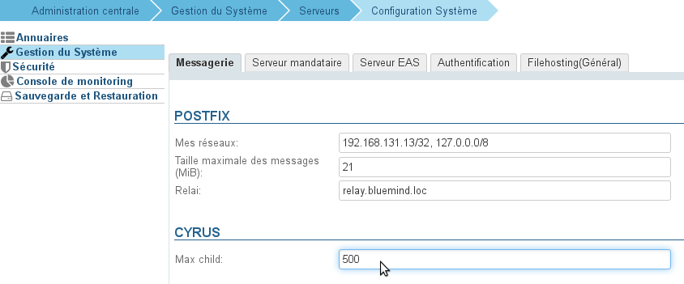

# Erreurs d'identification IMAP


## Symptômes

- Les utilisateurs ne peuvent plus du tout se connecter
- Erreurs 'Bad Gateway' lors de l'accès Web
- Des problèmes de connexion interviennent de manière occasionnelle


## Problème

Lorsque que le nombre maximal de processus IMAP est atteint, les utilisateurs ont des erreurs de login.

## Solution

Il faut augmenter le nombre maximal de processus IMAP.
En général, il faut compter environ 1.5 fois le nombre d'utilisateurs pour une utilisation mixte webmail/client lourds. Sur les installations où beaucoup d'utilisateurs utilisent des clients lourds on comptera environ 3x le nombre d'utilisateurs.

1. Compter le nombre de processus utilisé actuellement :


```
pgrep -c imap
```


2. Se rendre dans la console d'administration > Configuration système > onglet Messagerie et augmenter la valeur du champs "Maxchild" de la section Cyrus selon le calcul ci-dessus :


