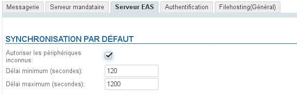
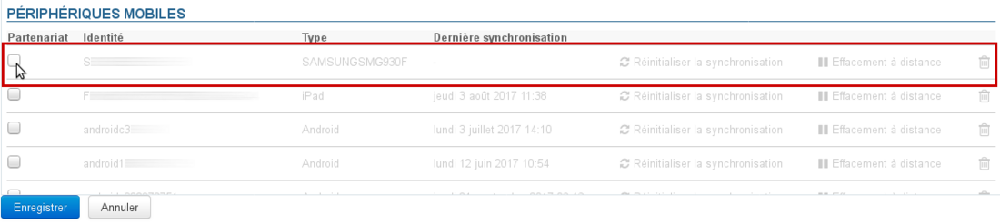
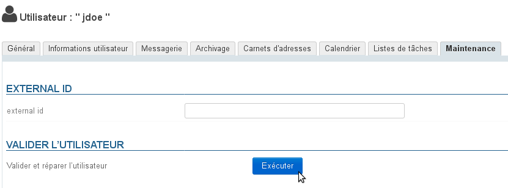

# Problèmes de synchronisation mobile

Vous trouverez ci-dessous des éléments d'investigation et de contrôles lorsqu'un, plusieurs ou tous les mobiles rencontrent des problème dans la synchronisation de BlueMind avec leur appareil mobile.

## Problème de connexion

** **Symptômes :** ** la connexion échoue alors que les paramètres serveur et identifiants saisis sont bons

** **Actions :** ** Assurez vous que le mobile a le droit de se connecter au serveur :

- **autorisation globale** : l'autorisation de connecter un appareil mobile peut être donnée de façon générale à tous les utilisateurs de BlueMind. Pour cela se rendre dans Gestion du système > Configuration système > onglet Serveur EAS et cocher la case "Autoriser les périphériques inconnus" : 
- **autorisation nominative** : dans le cas où l'autorisation ci-dessus n'est pas activée, celle-ci peut être donnée pour un utilisateur et un appareil en particulier. Pour cela :
    - paramétrer le mobile et lancer une demande de connexion
    - se rendre dans la fiche d'administration de l'utilisateur concerné > onglet MaintenanceL'appareil doit y être visible, la ligne correspondante est grisée et il n'y a pas de date de dernière synchronisation : 
    - Cocher la case en début de ligneNB : dans le cas où l'autorisation globale est donnée, ces cases ne sont pas actives
    - Valider la demande d'autorisationNB : il n'est pas nécessaire de cliquer sur "Enregistrer", l'autorisation est immédiatement effective
    - Relancer une synchronisation sur le téléphone

## Problèmes de synchronisation des messages

** **Symptômes :** ** il manque des dossiers ou le contenu de la boîte de réception ne s'affiche pas

** **Cause :** ** la hiérarchie de dossiers est certainement corrompue

** **Actions :** ** il faut réaliser une opération de réparation de la boîte concernée :

1. lancer l'opération "Valider et réparer" (*check&repair*) : se rendre dans la fiche d'administration de l'utilisateur concerné, onglet Maintenance et cliquer sur le bouton "Exécuter" dans la section "Valider l'utilisateur" : 
2. si cette opération ne fonctionne pas et si l'utilisateur rencontre toujours les mêmes problèmes regarder les logs EAS (`/var/log/bm-eas/eas.log` et `/var/log/bm-eas/user-eas-<identifiant>.log`) et les logs du core (`/var/log/bm/core.log`) lors du *check&repair*  :
    - en consultant les fichiers à l'horaire où a eu lieu l'opération ci-dessus
    - en relançant l'opération après avoir activé un *tail* sur les fichiers.
Ouvrir un ticket avec les informations trouvées si celles-ci ne vous permettent pas de trouver la raison des problèmes et leur résolution.

