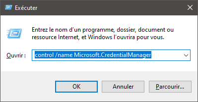

# Résolution des problèmes avec Outlook


## Présentation

Cette page a pour but de vous aider à investiguer, diagnostiquer et résoudre les problèmes rencontrés lors de l'utilisation d'Outlook avec BlueMind

En premier lieu, en cas de problème dès la création du compte, consulter la page de [compatibilité](/FAQ_Foire_aux_questions_/Compatibilité/) afin de vérifier que la **version d'Outlook est supportée**, cette page rend aussi compte de limitations connues.


:::info

Outlook pour MacOS

Les protocoles de communication étant différents, nous ne pouvons garantir la compatibilité qu'avec Outlook **pour Windows**.

**BlueMind 4 n'est ainsi pas compatible avec les versions d'Outlook pour MacOS.**

:::


## Trouver les logs

**Côté logiciel client**, les éventuels messages se trouvent directement dans l'interface d'Outlook, dans le dossier "Problèmes de synchronisation".

**Côté serveur**, 2 fichiers sont à consulter :

1. le log général `/var/log/bm-mapi/mapi.log`
2. le log d'activité `/var/log/bm-mapi/activities.log`


:::info

Il possible d'activer un log détaillé sur le serveur pour un utilisateur en particulier pour de l'investigation avancée, ** **mais attention cela à des impacts sur les performances** **. L'activation se fait via [l'outil en ligne de commande bm-cli](/Guide_de_l_administrateur/Administration_avancée/Client_CLI_pour_l_administration/) avec le paquet supplémentaire `bm-plugin-cli-mapi` installé sur le serveur :


```
bm-cli mapi logging --enable jdoe@bluemind.loc
```


Les logs se retrouvent alors dans le fichier `/var/log/bm-mapi/user-jdoe@bluemind.loc.log`

 ** Le réglage est perdu au redémarrage du serveur bm-mapi**

:::

## Diagnostiquer des problèmes

### Un mail ne se copie ou déplace pas dans un dossier

**Problèmes/Symptômes :**

- un email est visible dans un dossier dans Outlook mais il n'apparait pas sur le serveur dans ce même dossier (il n'y est visible ni dans le webmail ni sur des appareils mobiles)
- dans le dossier Outlook *"Problèmes de Synchronisation"*, il y a de nombreuses erreurs concernant cet email
- la synchronisation est bloquée mais quand on supprime l'email dans Outlook, la synchonisation reprend


**Diagnostic :**

1. Rechercher l'email sur le serveur grâce à une partie de son sujet :


```
# cd /var/spool/cyrus/data/bluemind\_loc/domain/b/bluemind.loc/j/user/jdoe/
# grep "texte du sujet" \*
```


2. Copier le fichier trouvé en tant que fichier eml :


```
# cp 4817. ~/email-deffectueux.eml
```


3.  Le récupérer et le copier dans un Outlook de test fonctionnel afin de voir si le problème se reproduit et observer/récupérer les logs correspondant


## Problèmes connus

### Création de compte en erreur à cause d'un mauvais mot de passe enregistré

** **Problèmes/Symptômes** ** ** :** la saisie du mot de passe ne permet pas la création du compte, Outlook indique toujours que le mot de passe est erroné

** **Cause :** **  l'utilisateur a enregistré un mauvais mot de passe pour ce compte lors d'une tentative de création précédente

** **Vérification** ** ** :** dans le fichier de logs du serveur `/var/log/nginx/access.log` on trouve des lignes de ce type :


```
192.168.61.133 - - [06/May/2019:16:57:53 +0200] "POST /autodiscover/autodiscover.xml HTTP/1.1" 401 0 "-" "Microsoft Office/16.0 (Windows NT 10.0; Microsoft Outlook 16.0.11601; Pro)"
```


ou


```
192.168.61.133 - tom@bm.lan [06/May/2019:16:58:31 +0200] "POST /mapi/nspi/?MailboxId=94a5c596-90a8-4985-91fd-57629ee06561@bm.lan HTTP/1.1" 200 149 "-" "Microsoft Office/16.0(Windows NT 10.0; Microsoft Outlook 16.0.11601; Pro)"
```


Ces lignes indiquent qu'il y a mauvais mot de passe pour [tom@bm.lan](mailto:tom@bm.lan) soumis par la création de compt


** **Solution :** **

Pour supprimer le mauvais mot de passe :

- s'assurer qu'Outlook et l'écran de création de compte soient fermés
- ouvrir le Gestionnaire d'identification en tapant Windows + R
- saisir "`control /name Microsoft.CredentialManager`" :
- cliquer sur OK (ou touche &lt;Entrée>)
- Supprimer les entrées de type  `autodiscover.domaine.tld`  et  `MicrosoftOffice16\_SSPI:utilisateur@domaine.tld`  Par exemple pour supprimer le mot de passe de * tom@bm.lan * :


### Le mot de passe est demandé en boucle

** **Problème/Symptôme** ** ** :** La création de compte et la synchronisation se font bien mais ensuite Outlook demande le mot de passe de l'utilisateur de façon répétée sans arrêt.

** **Cause** :** si une méthode d'authentification CAS est en place, Outlook peut ne pas trouver la bonne méthode à utiliser pour contacter le service découverte automatique

** **Solution** :** Il faut forcer la clef de registre pour indiquer à Outlook d'exclure la méthode de connexion directe à Office365

1. Ouvrez regedit :
    - sélectionnez le bouton démarrer
    - Tapez `regedit` soit dans l'application *Exécuter* soit dans la barre de recherche de Windows
    - Appuyer sur Entrée
2. **(FORTEMENT RECOMMANDÉ MAIS OPTIONNEL)** Faites une copie de sauvegarde de votre registre. [Cliquez ici pour apprendre comment](https://support.microsoft.com/help/322756).
3. Dans le registre, accéder à `HKEY_CURRENT_USER\Software\Microsoft\Office\16.0\Outlook\AutoDiscover`
4. Faites un clic droit à n'importe quel emplacement de la colonne de droite, sélectionner NOUVEAU et ensuite, *DWORD (32-bit)*.
5. Nommez cette entrée : `ExcludeExplicitO365EndPoint`
6. Avec un clic-droit sur cette entrée, sélectionnez *Modifier*
7. Changez la valeur pour 1 dans le champ à cet effet et appuyez sur OK
8. Redémarrez votre ordinateur
9. Recréez votre profil Outlook
10. Ouvrez Outlook et, lorsque requis, entrez votre adresse courriel ainsi que le mot de passe qui lui est associé.


Pour plus d'information concernant ce problème : [https://docs.microsoft.com/fr-fr/outlook/troubleshoot/domain-management/unexpected-autodiscover-behavior](https://docs.microsoft.com/fr-fr/outlook/troubleshoot/domain-management/unexpected-autodiscover-behavior)

### Les dossiers sont vides

** **Problème/Symptôme** ** ** :** Les dossiers par défaut (boîte de réception, messages envoyés, corbeille, etc.) sont bien présents mais ils sont vides. Sur le webmail, ils contiennent bien des messages.

** **Cause** :** Cela est dû à un dysfonctionnement de la réplication sur le compte en question. 

** **Solution** :** Il faut passer par des opérations de maintenance spécifique :


```
bm-cli maintenance repair --ops replication.subtree user@domain.tld
bm-cli maintenance repair --ops replication.parentUid user@domain.tld
```


Ensuite, **relancer outlook** et vérifier que les messages arrivent correctement.

### Le carnet d'adresse globale sur Outlook n'est pas complet

** **Problème/Symptôme** ** ** :**

- je lance outlook
- je rédige un message
- je clique sur le bouton À
- Je ne retrouve pas toutes les adresses du serveur BlueMind


** **Vérification** :**

Contrôler le fichier de logs `/var/log/bm-mapi/mapi.log`. On y retrouve des erreurs de ce type :


```
2019-11-22 10:51:07,079 [OAB-generation-pool-2-thread-7] n.b.e.p.c.o.OABGenerator WARN - Cannot handle directory entry a25a572f-eadd-4232-a183-4c0c41e56d0b of type USER
java.lang.NullPointerException: null
        at net.bluemind.exchange.mapi.commons.DistinguishedName.userDN(DistinguishedName.java:96)
        at net.bluemind.exchange.provider.core.impl.gal.UserAddressProps.getDn(UserAddressProps.java:60)
        at net.bluemind.exchange.provider.core.impl.gal.UserAddressProps.<init>(UserAddressProps.java:54)
        at net.bluemind.exchange.provider.core.oab.OABGenerator.userRecord(OABGenerator.java:221)
        at net.bluemind.exchange.provider.core.oab.OABGenerator.create(OABGenerator.java:119)
        at net.bluemind.exchange.oab.impl.OABIndexHandler.lambda$1(OABIndexHandler.java:121)
```


** **Cause** :** il faut regénérer la base hollow qui permet le mapping des uids BlueMind avec les "uid outlook pour mapi".

exemple : 
lecture du mapping possible via


```
bm-cli hollow directory domain.tld
Record{uid=a25a572f-eadd-4232-a183-4c0c41e56d0b, dn=/o=mapi/ou=domain.tld/cn=recipients/cn=user:a25a572f-eadd-4232-a183-4c0c41e56d0b}
```


** **Solution** : **Régénérer la base hollow en suivant la procédure suivante :


**
BlueMind 4.0.x


**
BlueMind 4.1 et plus


```
systemctl stop bm-mapi && systemctl stop bm-core
rm -fr /var/spool/bm-hollowed/directory/domain.tld/
systemctl start bm-core
```


```
bm-cli maintenance repair --ops hollow.directory domain.tld
```


Vérifier les logs du core et attendre la fin de la régénération de la base hollow. Enfin, relancer le service mapi :


```
systemctl start bm-mapi
```


### Les messages ne sont pas affichés en arborescence malgré le mode conversation activé

Cette fonctionnalité n'est pas encore implémentée dans la gestion de MAPI par BlueMind.

Cependant il peut arriver que certains messages soient triés en tant que conversations selon le client tiers dont ils proviennent (Webmail ou Thunderbird par exemple).

### Lors de la création d'un profil, outlook affiche un message "The name cannot be matched to a name in the address list."

****Cause :**** Lors de la création d'un profil, outlook vérifie que l'adresse mail du compte est présente dans le GAL mais seule l'adresse mail par défaut est présente dans le GAL.

****Solution :**** Dans les paramètres bluemind du compte (administrateur), désigner l'adresse mail utilisée pour créer le profil outlook comme adresse mail par défaut.


