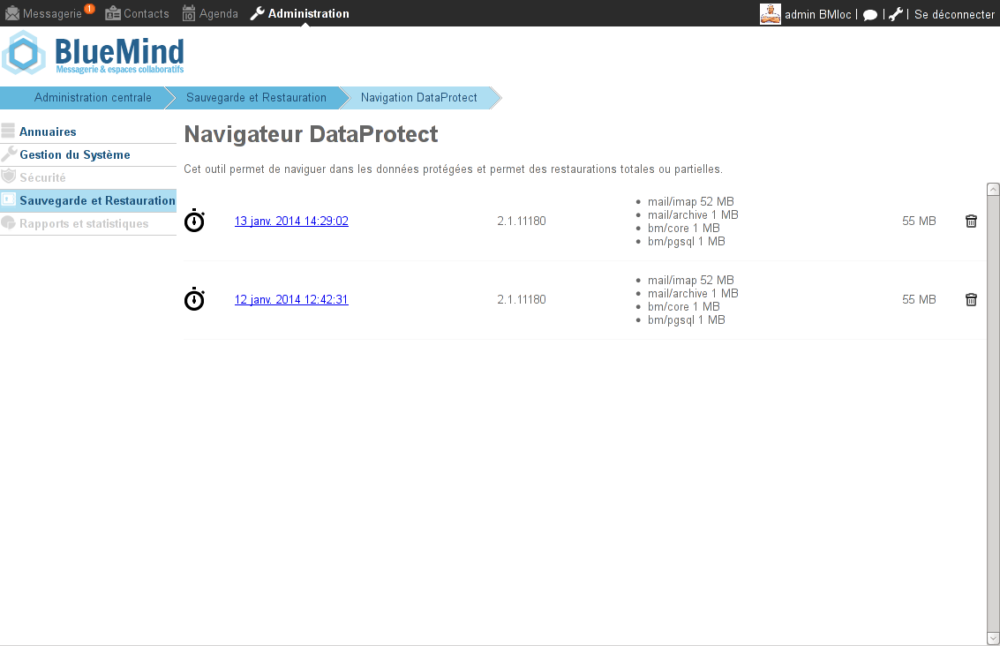
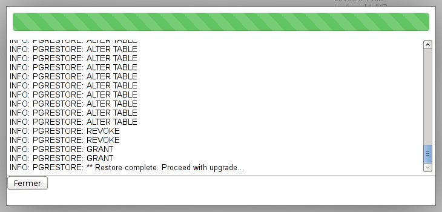
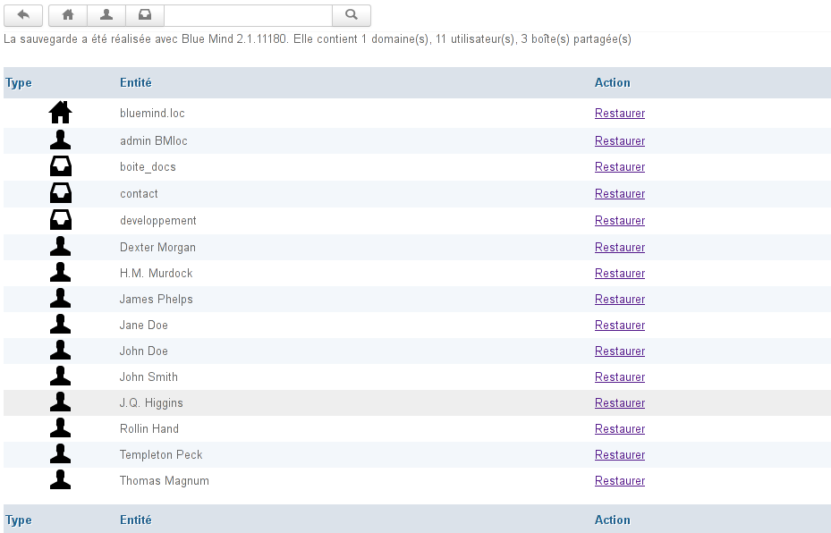
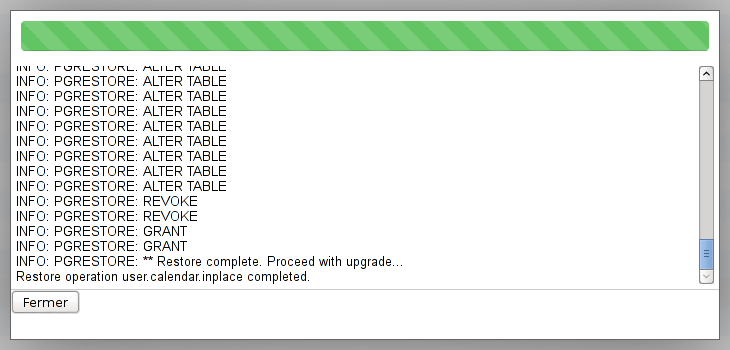

# Restauration unitaire - Navigation DataProtect

# Présentation

La restauration unitaire est une fonctionnalité très pratique proposée par BlueMind qui permet de restaurer les données d'un seul utilisateur rapidement. La restauration est réalisée graphiquement et permet de choisir le type d'objet (entité : utilisateur, mail, calendrier boite partagée, etc..), puis l'objet lui-même dont les données doivent être restaurées

Cette fonctionnalité s'appuie elle aussi sur l'historisation des données pour choisir la date des données à sauvegarder.

# Restaurer les données d'un utilisateur ou d'une boite partagée

Le navigateur DataProtect permet de naviguer simplement et graphiquement au sein des données de sauvegardes depuis l'interface d'administration de BlueMind.

Pour restaurer les données :

- en tant qu'administrateur, se rendre dans l'interface d'administration > Sauvegarde et restauration > Navigation DataProtect :  La page présente les sauvegardes réalisées par BlueMind et actuellement accessibles.
- cliquer sur la sauvegarde souhaitée, le système lance alors une restauration temporaire des données, permettant de naviguer dans la sauvegarde :  
- Cliquer sur Fermer pour accéder aux données
- Le navigateur présente alors les données de la sauvegarde par entité :  En haut de page, des outils de recherche permettent de filtrer et rechercher les entités affichées :
  -  affiche/masque les domaines
  -  affiche/masque les utilisateurs
  -  affiche/masque les boîtes partagées
Le champs de recherche permet d'effectuer des recherches textuelles et le bouton  de revenir à l'accueil de la navigation DataProtect.

## Restauration des données d'un utilisateur

- Cliquer sur le lien «Restaurer» correspondant à l'utilisateur voulu. Une popup propose alors les options de restauration :  
  - **Restaurer la boite mail dans un sous-dossier** : restaure l'intégralité de la boite mail de l'utilisateur dans un sous-dossier de celle-ci
  - **Remplacer le contenu de la boîte mail** : remplace l'intégralité de la boite mail de l'utilisateur. Cela remet la boite aux lettres dans son état à la date de la sauvegarde. Toutes les modifications (messages reçus ou envoyés, déplacement dans des dossiers, etc.) effectuées depuis seront perdues.
  - **Remplacer les carnets d'adresses de l'utilisateur** : remplace l'intégralité des carnets d'adresses de l'utilisateur par ceux à la date de la sauvegarde
  - **Envoyer l'export VCards par mail** : effectue un export au [format VCard](http://fr.wikipedia.org/wiki/VCard) des carnets d'adresse de l'utilisateur et les lui envoie par mail
  - **Envoyer un export ICS par mail** : effectue un export au [format ICS](http://fr.wikipedia.org/wiki/.ics) de l'agenda de l'utilisateur et le lui envoie par mail
  - **Remplacer le contenu du calendrier** : restaure l'intégralité du calendrier à la date de la sauvegarde. Toutes les modifications (nouveaux événements, suppressions, déplacements, etc.) effectuées depuis seront perdues.
  - **Remplacer l'utilisateur et ses données** : restaure l'intégralité des données (messages, contacts, agenda, préférences, etc.) de l'utilisateur à la date de la sauvegarde. Toutes les modifications effectuées depuis seront perdues.
- Choisir l'option souhaitée et cliquer sur "Restaurer".La popup informe alors du déroulement de l'opération par une barre de progression et l'affichage du journal en temps réel : 
- Une fois l'opération terminée, cliquer sur Fermer pour revenir à la liste des entités.

## Restauration d'une boite partagée

La restauration d'une boite partagée se fait de la façon suivante.

Cliquer sur le lien «Restaurer» correspondant à la boite partagée voulue. Une popup propose alors les options de restauration :

- Restaurer le contenu de la boite mail dans un sous-dossier : restaure l'intégralité de la boite mail de la boite partagée dans un sous-dossier de celle-ci
- Remplacer le contenu de la boîte mail : remplace l'intégralité de la boite mail de la boite partagée. Cela remet la boite aux lettres dans son état à la date de la sauvegarde. Toutes les modifications (messages reçus ou envoyés, déplacement dans des dossiers, etc.) effectuées depuis seront perdues.

- Choisir l'option souhaitée et cliquer sur "Restaurer".  La popup informe alors du déroulement de l'opération par une barre de progression et l'affichage du journal en temps réel.
- Une fois l'opération terminée, cliquer sur Fermer pour revenir à la liste des entités.

## Script post-backup

Après chaque sauvegarde, DataProtect recherche et exécute le cas échéant un script placé et nommé */usr/bin/bm-post-full-backup.sh* sur le serveur sauvegardé. Ce script doit être créé par l'utilisateur et peut permettre d'effectuer des tâches de post-traitement comme par exemple la copie des données sauvegardées à un autre emplacement.

