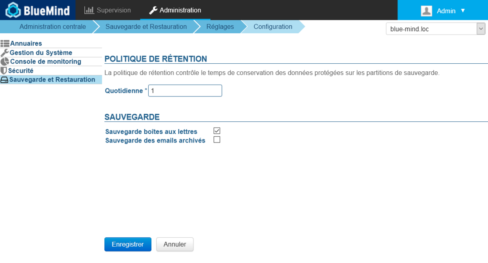

# Sauvegarde et restauration


## Présentation

BlueMind génère automatiquement des sauvegardes régulières des données afin de permettre une restauration rapide via l'interface d'administration.

La sauvegarde entière des données du système ( calendrier/contact/mails) est effectuée à intervalles réguliers et déposée dans un répertoire du système. Un système de sauvegarde annexe ( Bacula, Tina, etc..) peut venir copier ces sauvegardes afin de réaliser une externalisation des sauvegardes sur bandes ou dans le système de sauvegarde externe.

La structure des données de sauvegarde permet de revenir dans le temps et ainsi restaurer les données des utilisateurs à un moment précis.

La fréquence des sauvegardes est paramétrable et dépend de l'espace disque disponible sur vos supports. Il est à noter que la durée minimale entre deux sauvegardes est de un jour.

Les sauvegardes ainsi réalisées peuvent ensuite être associées à un logiciel de sauvegarde d'entreprise centralisé ( Time Navigator, NetBackup...).


## Les atouts du système de sauvegarde intégré

- **Gain de temps** Les sauvegardes sont incrémentales, seules les différences (nouveaux messages, suppressions,..) transitent.
- **Gain de fonctionnalités** La sauvegarde gère l'historisation des données.
- **Gain de place** La sauvegarde historise les données, sans les dupliquer. Chaque sauvegarde est autonome (de type snapshot), même si seules les différences ont transité. Ainsi vous pouvez avoir 10 sauvegardes pour une place occupée similaire à la taille de votre dépôt de mails.
- **Optimisations** Les données sont automatiquement dédupliquées.
- **Sauvegarde complète** L'outil de sauvegarde intégré permet de s'assurer que toutes les données présentes et futures sont automatiquement sauvegardées, qu'il s'agisse de données de messagerie (e-mail stockés sous la forme de fichiers), de données de l'agenda, de carnets d'adresses (stockées en base de données) ou encore de fichiers de configuration. 
- **Compatibilité des sauvegardes** Les sauvegardes, quelle que soit la date à laquelle elles ont été réalisées, restent compatibles avec toutes les versions mineures d'une même version majeure (3.5.x ou 4.x par exemple). Ainsi une sauvegarde réalisée dans une version donnée peut être remontée sur toute version mineure plus récente de BlueMind.Par exemple, une sauvegarde réalisée en 3.5.12 peut être remontée en 3.5.16-7, ou encore une sauvegarde réalisée en 4.0.1 peut être remontée en 4.4.3
- **Performance** Les sauvegardes n'occasionnent pas d'interruption de service ; elles sont conçues et réalisées dans un temps court afin de garantir la cohérence des données lorsqu'elles seront restaurées. Cette contrainte est au cœur de la conception de la sauvegarde BlueMind. 
- **Historique** La réalisation d'une sauvegarde de données se fait obligatoirement de façon incrémentale, tout en conservant un historique de ces données. Cette fonctionnalité d'historisation est particulièrement intéressante pour ceux qui ne disposent pas d'une grosse infrastructure de sauvegarde : une donnée n'est présente que dans une seule sauvegarde et les nouvelles données sont stockées dans un incrément.De plus, afin de s'assurer d'une restauration sûre, le programme reconstitue les données à partir d'une sauvegarde et d'un ou plusieurs incréments. Cela est transparent pour l'administrateur qui décide de la date à laquelle les données doivent être restaurées.


## Architecture technique de la sauvegarde

- **Composant de stockage et d'historisation** BlueMind s'appuie sur le logiciel Open Source rsync. Cet outil permet de réaliser des copies incrémentales. Les données dont le spool de mail sont ainsi sauvegardé en créant des liens symboliques depuis le dernier backup, seul les nouveaux mails sont ainsi sauvegardés.
- **Modules BlueMind et sauvegardes** BlueMind se base sur une architecture permettant d'éclater les services sur différents serveurs. Suivant les services hébergés par chacun des serveurs, ceux-ci se voient attribuer différentes méthodes de sauvegarde appropriées avec les données stockées sur ce nœud applicatif ( spool de mail, base de données, index, archivage, etc..). Ainsi, pour chaque rôle pouvant être attribué aux serveurs BueMind, il existe une procédure spécifique de sauvegarde assurant la reprise optimale et intégrale des données. 
- **Localisation des sauvegardes** Les données de sauvegarde sont généralement externalisées sur un serveur séparé. BlueMind propose 2 solutions pour configurer les espaces de stockages des données sauvegardées :
    1. La mise en place d'un montage NFS sur le système de fichier du serveur de production.
    2. Utiliser un nœud (un serveur) de l'architecture BlueMind dédié faisant uniquement office de serveur de sauvegarde.
Suivant vos disponibilités et votre type d'infrastructure, l'une au l'autre des solutions peut être utilisée, l'objectif étant toutefois de séparer les données de production des données sauvegardées, afin de s'assurer de la capacité à remonter les services en cas de perte ou de corruption de données.- **Intégration dans une infrastructure de sauvegarde** Un Système d'information est souvent doté d'une infrastructure de sauvegarde. Des logiciels comme Atempo Time Navigator, Tivoli Storage Manager, Net Backup ou autre centralise les méthodes de sauvegarde et gèrent eux-mêmes l'historisation de vos backups.Ces outils s'interface bien avec BlueMind. Il nécessite une configuration particulière afin de permettre la conservation des historiques de sauvegarde BlueMind.Le serveur BlueMind s'occupe de réaliser la sauvegarde de façon sûre, complète et à chaud des données de production. Le logiciel de backup du client devra être configuré pour ne réaliser aucune historisation des données. De cette façon, le logiciel de sauvegarde tiers récupère le contenu de la sauvegarde réalisée par BlueMind pour le transférer sur bande ou autre.


## Configuration du montage NFS


:::info

Le répertoire de sauvegarde doit être accessible depuis l'ensemble des nœuds du domaine BlueMind ; il convient donc de réaliser les opérations de montage et vérification suivantes sur **tous les serveurs concernés**.

:::

Pour les points de montage de type NFS, ext3 ou ext4, il convient d'appliquer les options *nodiratime* et *noatime* afin d'accélérer les accès disque. En effet les systèmes de fichiers avancés comme NTFS, ext3/4 permettent de connaître la date de dernier accès aux fichiers. Ainsi pour chaque lecture de fichier, il y a une opération d'écriture supplémentaire afin de modifier la date de dernier accès et de vérifier cette dernière. Voici un exemple de montage du fichier */etc/fstab* :


```
# Point de montage NFS
nas.mydomain.lab:/backup  /var/backups/bluemind  nfs  rw,soft,noatime,nodiratime,vers=3,exec 0 0
```


Pour activer le montage NFS, exécuter en tant qu''utilisateur *root* :


```
mount /var/backups/bluemind
```


Il est ensuite conseillé de tester le bon fonctionnement du montage en exécutant les commandes suivantes en ligne de commande, toujours en tant qu'utilisateur *root* depuis le serveur BlueMind :


```
cd /var/backups/bluemind
touch test

```


Puis effacer ce fichier de test :


```
rm test
```


:::tip

Accès permanent à la dernière sauvegarde

Afin de pouvoir accéder à la dernière sauvegarde par le même chemin, vous pouvez utiliser le script `/usr/bin/bm-post-full-backup.sh` avec le contenu suivant :


```
#!/bin/bash
parts=("bm/es" "bm/pgsql" "filehosting/data" "mail/imap" "mail/archive")
server\_ip="192.168.124.72"

for part in ${parts[@]}
do
        echo "creating last directory for part : $part"
        # get last backup directory
        last\_version=`ls -tr /var/backups/bluemind/dp\_spool/rsync/$server\_ip/$part | grep -v "last" | tail -1`
        echo " last version : $last\_version"
        # create link
        rm /var/backups/bluemind/dp\_spool/rsync/$server\_ip/$part/last
        ln -s /var/backups/bluemind/dp\_spool/rsync/$server\_ip/$part/$last\_version /var/backups/bluemind/dp\_spool/rsync/$server\_ip/$part/last
done

```


A noter :

- le script peut être créé s'il n'existe pas déjà sur le serveur
- le script peut être complété avec ce contenu s'il existe déjà
- il est nécessaire de créer un répertoire nommé "last" pointant toujours vers la dernière sauvegarde réalisée


:::

## Configuration de la sauvegarde

La console d'administration permet de configurer le nombre de sauvegardes quotidiennes à conserver.

Pour mettre en œuvre une politique de sauvegarde, se rendre dans l'administration de BlueMind > Sauvegarde et Restauration > Réglages > Configuration :



- **Politique de rétention** : indiquer le nombre de jours pendant lesquelles un sauvegarde (ici, les sauvegardes quotidiennes) doit être conservée
- **Sauvegarde boîtes aux lettres** : lorsque cette option est activée, toutes les données du serveur sont sauvegardées, y compris les emails . A contrario, lorsqu'elle ne l'est pas, seules les données de contacts, agenda et tâches sont sauvegardées. Cette option est utile pour éviter des sauvegardes en double lorsque les messages sont déjà sauvegardés par un autre système dédié.


:::info

Performances

Nous déconseillons fortement d'activer l'option "Sauvegarde boîtes aux lettres" si l'espace occupé par les emails est très important (~1To et plus, la limite d'efficacité du système de sauvegarde peut varier selon les performances de l'espace de sauvegarde choisi).

Plusieurs types d'alternatives sont possibles :

 - outils de l'hyperviseur (sauvegarde du disque virtuel du spool, des VMs...)
 - technologies intégrées au système (snapshots LVM par exemple)
 - technologies intégrées directement au stockage (snapshots au niveau de la baie)

Ainsi on peut utiliser le système de sauvegarde BlueMind pour les autres données seulement (contact/agenda/tâches) qui seront restaurables par la console d'administration et un système externe pour les emails, plus volumineux.

:::

- **Sauvegarde des emails archivés** : lorsque cette option est activée, les emails archivés seront sauvegardés également.Par défaut, cette option n'est pas activée, seuls les emails non archivés sont sauvegardés.

:::info

Recommandations

Lorsque le nombre de sauvegardes quotidiennes configuré est trop important, la durée de chaque sauvegarde augmente, les différents incréments de sauvegarde se référençant entre eux. 

- si vous ne sauvegardez pas les e-mails, vous pouvez configurer 7 jours ou plus de rétention de sauvegarde ;
- si vous sauvegardez les e-mails, cela dépend de la taille du spool. Un paramétrage de quelques jours maximum est recommandé.

Dans tous les cas, il est utile de conserver quelques anciennes sauvegardes (J-7, J-15, J-30) pour vous permettre de revenir dans le passé si la perte de données est détectée tardivement.

:::

## Actions post-sauvegarde

En fin de sauvegarde, le script `/usr/bin/bm-post-full-backup.sh` est exécuté automatiquement s'il existe.

Il peut contenir des opérations spécifiques à réaliser suite à une sauvegarde en succès.

## Restauration

La même sauvegarde BlueMind permet à la fois la restauration d'un plan de reprise d'activité et les restaurations unitaires de données (les données ou une partie des données d'un utilisateur).

### Plan de Reprise d'Activité (PRA)


:::info

Versions

 Pour que la restauration puisse fonctionner, le serveur doit avoir la même adresse IP et la même version de BlueMind que le serveur d'origine.

:::

Les données complètes sont restaurées lors de la phase d'installation (ou ré-installation) de BlueMind.

Lors des étapes d'installation de BlueMind avec l'outil Setup Wizard, vous avez le choix, soit d'installer un système BlueMind vierge, soit de réaliser une restauration globale. La restauration globale permet de remonter l'intégralité de votre serveur à a partir d'une sauvegarde et correspond à une restauration PRA.

Cette solution permet de remonter facilement, rapidement et en toute sécurité un nouveau serveur BlueMind.

### Restauration unitaire

La restauration unitaire est une fonctionnalité très pratique proposée par BlueMind qui permet de restaurer les données d'un seul utilisateur rapidement. La restauration est réalisée graphiquement et permet de choisir le type d'objet (entité : utilisateur, mail, calendrier boite partagée, etc..), puis l'objet lui-même dont les données doivent être restaurées

Cette fonctionnalité s'appuie elle aussi sur l'historisation des données pour choisir la date des données à sauvegarder.


