# Explorer et analyser les données avec bm-tick


## L'explorateur de données

L'onglet *DataExplorer* vous permet, comme son nom l'indique en anglais, de parcourir les données de la base, en d'autres termes l'historique des métriques collectées.


:::info

Vous pourrez trouver dans la page annexe de notre documentation la [référence des métriques collectées](/Guide_de_l_administrateur/Supervision/Monitoring_Bm_Tick/Référence_des_métriques/) afin d'en savoir plus sur les métriques collectées et leur contenu.

:::

La partie haute de la fenêtre permet d'écrire ou générer la requête :

- soit en écrivant directement dans l'espace prévu à cet effet
- soit en sélectionnant les indicateurs souhaités au moyen du navigateur de données :
    - **DB.RetentionPolicy** : la base de données que l'on souhaite consulter. Celle qui nous intéresse en priorité est la base **telegraf.autogen** qui contient les données concernées, les autres sont des bases système contenant les données de fonctionnement internes.
    - **Measurements & Tags** : la métrique recherchée
    - **Fields** : le ou les champs souhaités pour cette donnée


L'affichage au bas de la fenêtre vous présente le graphe correspondant à la requête. Il est soumis aux règles de rafraichissement et de période telles que définies en haut de la page, de même que sur les tableaux de bord :
 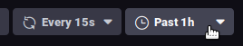


** **Pour rechercher et analyser une métrique :** **

1. sélectionner la base de données telegraf.autogen en 1ère colonne
2. dans le champs de recherche de la seconde colonne *"Measurements & tags"*, taper par exemple le nom du composant BlueMind afin de voir quelles métriques sont disponibles pour celui-ci : 
3. Sélectionner une métrique en cliquant sur son nom - ici par exemple "`bm-ysnp-authCount`"
4. Vous pouvez naviguer dans la sous-arborescence de la métrique afin d'affiner la donnée voulue :

    - **datalocation** : nom du serveur
    - **host** : nom ou IP de l'hôte
    - **meterType** : le type de donnée, ce champs est particulièrement important car il vous indique la nature des informations contenues dans cette métrique
        - *gauge* : mesure instantanée
        - *counter* : compteur à incrémentation
        - *[distsum](#Exploreretanalyserlesdonneesavecbmtick-distsum)* : couple de données comportant un compteur et une quantitépar exemple :
            - bm-lmtpd.emailSize = (nombre d'emails , taille totale des emails)
            - bm-lmtpd.emailRecipients = (nombre d'emails , nombre de destinataires)
        - *timer* : identique au distsum mais la quantité est ici toujours exprimée en nanosecondes
    - **status** : selon le type de données il peut s'agir d'un statut *ok/failed* (requête aboutie/échouée par exemple), *success/failure* (authentification réussie/échouée par exemple), etc.


:::tip

Il est en général conseillé de regrouper les données par serveur en sélectionnant le bouton "Group by host" qui apparaît au survol de la ligne "host" ou en dépliant cette arborescence :


Cela permet de regrouper les données selon l'hôte au lieu d'obtenir une moyenne des données de chaque serveur.

Selon la métrique observée, il pourra être pertinent d'utiliser aussi le **regroupement par status**, code ou encore par *datalocation*.

:::
5. Choisir le champs dans la 3ème colonne, en fonction de la donnée finale voulue. Le graphique correspondant est alors affiché : 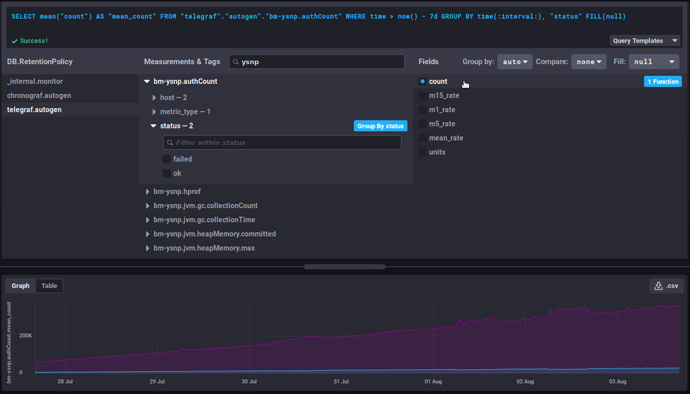


### Fonctions utiles/affinage de la requête

#### Modifier la durée affichée

Cette partie de la requête définit la durée à afficher :


```
WHERE time > now() - 7d
```


Elle signifie de façon littérale : les données dont le temps est supérieur à aujourd'hui moins 7 jours (7d = 7 *days*), soit les données des 7 derniers jours

 changer pour le nombre de jours/heures désiré afin d'augmenter ou raccourcir la vision du graphique

#### Évolution d'un compteur

Les données de type *counter* sont cumulatives et augmentent donc régulièrement. Dans ce cas c'est leur évolution qui est plus intéressante que la valeur elle-même.

Par exemple la donnée `bm-ysnp.authCount` compte le nombre d'authentifications traitées : en consultant la donnée brute on aura à un instant T le nombre d'authentifications traitées par le serveur depuis le début de la mise en place de la collecte, cela n'est pas un chiffre intéressant en soi. En revanche l'évolution de ce chiffre nous donnera le nombre d'authentifications traitées au fur et à mesure que le temps passe.

##### non_negative_difference

Pour observer cette évolution on pourra utiliser la fonction "[non_negative_difference](https://docs.influxdata.com/influxdb/v1.6/query_language/functions/#non-negative-difference)" qui donne la différence non négative entre 2 points du graphique.

En reprenant l'exemple du nombre d'authentifications, le graphique suivant sans fonction appliquée, montre le nombre moyen d'authentifications traitées par le composant ysnp sur les dernières 24h, par serveur et par statut :

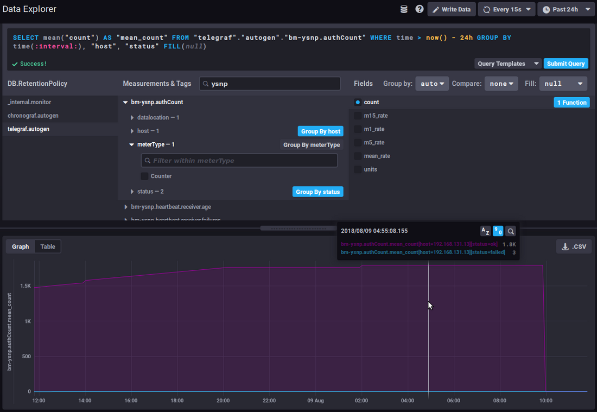

 la moyenne ne cesse de croître, au fur et à mesure que de nouvelles authentifications sont traitées

En utilisant la fonction de différence par intervalles, le graphique donne alors le nombre d'authentification pour chaque intervalle de temps, on voit donc à présent de quelle façon la quantité d'authentifications traitées évolue :

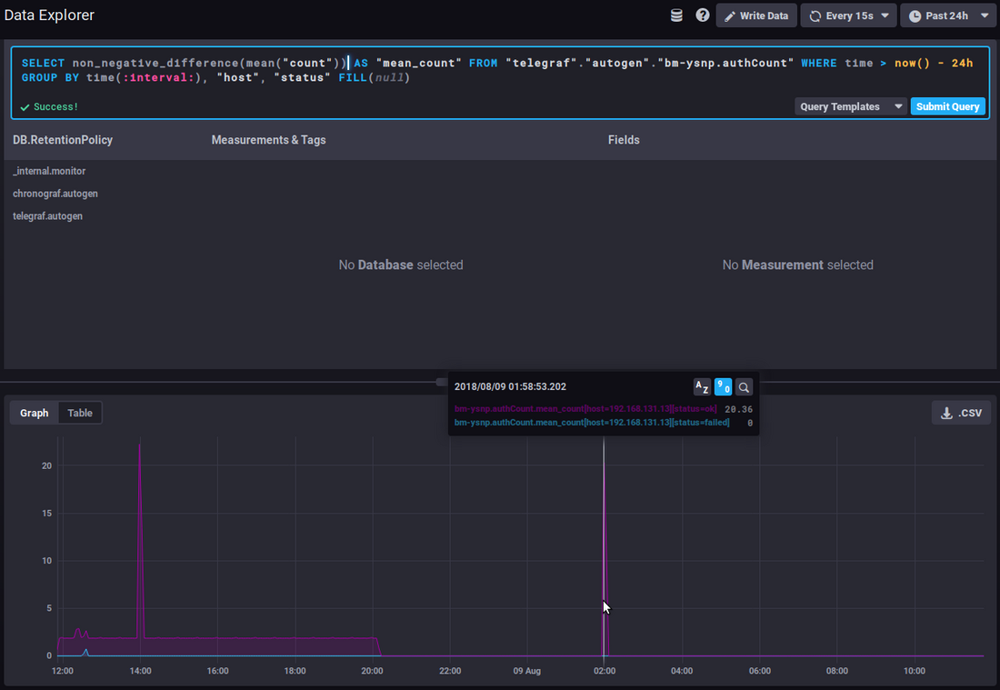

 Un fort et soutenu pic d'augmentation de la courbe du statut "failed" pourrait être le signe d'une attaque de spammeurs essayant d'utiliser le serveur pour envoyer des mails.

##### non_negative_derivative

Une autre fonction permet d'obtenir la courbe d'évolution d'une donnée mais en apportant un paramétrage supplémentaire : [non_negative_derivative](https://docs.influxdata.com/influxdb/v1.6/query_language/functions/#non-negative-derivative).

Cette fonction propose elle aussi le calcul de la différence entre 2 points, mais elle permet en plus de préciser l'unité.
En effet avec la fonction *non_negative_difference* le système calcule lui-même un intervalle automatique en fonction de la durée affichée ("*where time..."*) et du regroupement des données ("*group by time...*"). Avec la fonction *non_negative_derivative* vous pouvez forcer l'unité afin, par exemple, d'obtenir un taux par minute, heure, jour, etc.

Ainsi, la requête ci-dessous présente le nombre moyen de connexions (*mean("count")*) par minute (*non_negative_derivative(...,1m)*) lors des dernières 24h (*where time > now() - 1d*) pour chaque heure (*group by time(1h)*) :

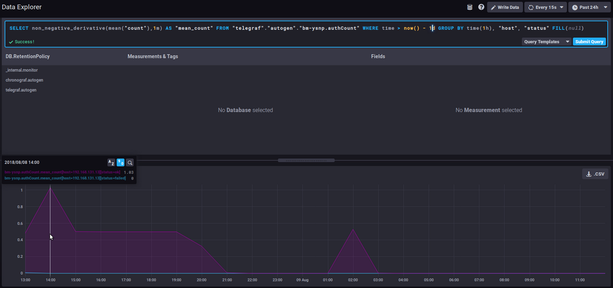

 à 14h il y avait en moyenne 1.03 connexions par minute, à 15h il y en avait 0.5/mn, etc.

#### Les *distsum*

Les métriques de type *distsum* comportent 2 informations :

1. le 1er nombre est un compte
2. le 2ème nombre est une quantité


Ainsi, on a par exemple les couples suivants :

- `bm-lmtpd.emailSize` = (nombre d'emails , taille totale des emails)
- `bm-lmtpd.emailRecipients` = (nombre d'emails , nombre de destinataires)


Prenons par exemple la métrique `emailSize` : à chaque enregistrement, le système va enregistrer le nombre d'emails comptés pour la période (depuis le dernier enregistrement) et la taille totale que ces emails ont représenté.

Ces données permettent d'établir des moyennes de taille par message et ainsi voir si la taille moyenne des messages évolue de façon brutale et anormale.
Par exemple on pourra constater une augmentation régulière de la taille moyenne au cours du temps, qui peut être imputée à l'amélioration des connexions, des serveurs, des habitudes des utilisateurs, etc. mais si tout d'un coup, en l'espace de quelques jours la taille moyenne des messages double (ou plus), cela n'est pas normal, il faudra en chercher la raison : une signature d'entreprise a-t-elle été positionnée ? Celle-ci contient peut-être une image dont on aurait oublié de diminuer la taille et qui alourdit d'autant chaque message et, par là, la charge des serveurs.

#### Liens utiles

Pour aller plus loin dans le langage de requêtes InfluxQL, se reporter à la documentation dédiée :

[https://docs.influxdata.com/influxdb/v1.6/query_language/](https://docs.influxdata.com/influxdb/v1.6/query_language/)

Voir en particulier les fonctions : [https://docs.influxdata.com/influxdb/v1.6/query_language/functions/](https://docs.influxdata.com/influxdb/v1.6/query_language/functions/)

Et les regroupements par temps : [https://docs.influxdata.com/influxdb/v1.6/query_language/data_exploration/#advanced-group-by-time-syntax](https://docs.influxdata.com/influxdb/v1.6/query_language/data_exploration/#advanced-group-by-time-syntax)

### Aller plus loin avec les graphiques

L'outil graphique du *DataExplorer* propose des options limitées, il est par exemple impossible de créer un graphe empilé afin de voir les sommes de 2 courbes.

Pour faire cela, il faut passer par les courbes des tableaux de bord (voir plus bas) :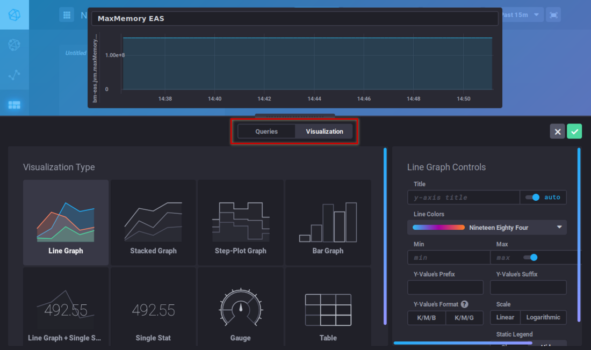

## Les tableaux de bord

L'onglet *Dashboards* vous permet d'accéder aux tableaux de bord. Il s'agit de pages vous permettant de regrouper les données de votre choix.

Par défaut 3 tableaux de bords sont pré-configurés et donnés pour exemples :

- ** **JVMs Memory Usage** ** : utilisation mémoire des JVMs, vous retrouvez ici l'utilisation de chaque composant BlueMind (EAS, Core, milter, ElasticSearch, HPS, etc.) et pouvez contrôler une sur-consommation ou au contraire l'absence de données indiquant qu'un service est arrêté
- ** **Mail insights** ** : données de la messagerie (nombre d'emails délivrés, taille moyenne des messages, nombre de processus IMAP, etc.)
- ** **Monitoring system status** ** : données système concernant l'outil de monitoring lui-même (quantité de données collectées, taille de la base de données, etc.)


:::info

Réinitialisation automatique des tableaux de bord par défaut

Les tableaux de bord par défaut de BlueMind sont réinitialisés à chaque mise à jour.

Ainsi, ils sont recréés s'ils ont été supprimés et ils sont remis aux contenus par défaut s'ils ont été modifiés. Si vous souhaitez personnaliser un de ces 3 tableaux, il vaut donc mieux le cloner (voir ci-dessous) et faire les modifications sur le clone ou simplement renommer le tableau.

:::

Vous pouvez rajouter autant de tableaux que vous le souhaitez afin d'avoir des vues personnalisées sur les données qui vous intéressent, en regroupant les données par type, par pertinence, par module, etc.


:::tip

Les tableaux peuvent être dupliqués ou supprimés directement depuis la liste principale. En passant la souris sur la ligne d'un tableau de bord, les boutons d'action apparaissent en fin de ligne correspondante :

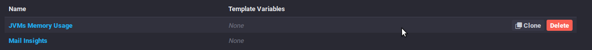

:::

Pour créer un nouveau tableau de bord, rendez-vous à l'accueil de l'onglet *Dashboard* et cliquez sur le bouton "*Create dashboard*" :

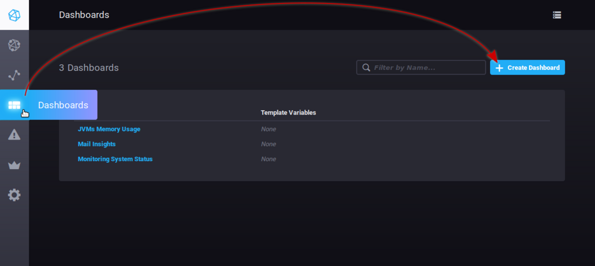

Le tableau est aussitôt créé, une nouvelle vue vide est présentée :

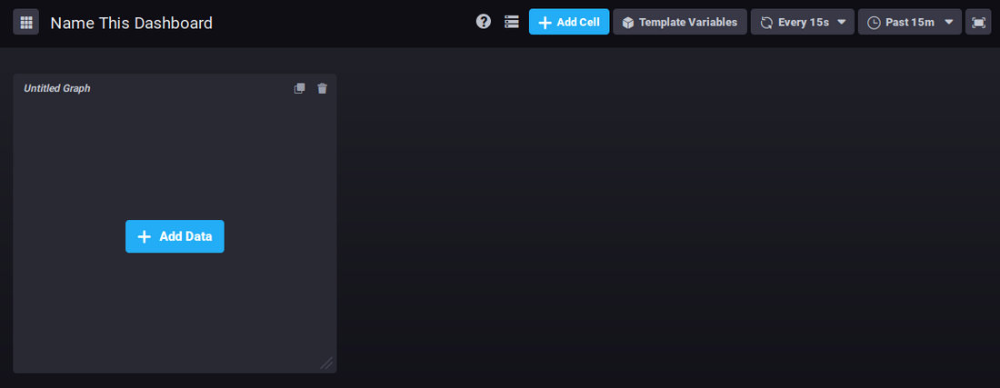

Cliquez sur "*Name this dashboard*" pour que le champ devienne éditable, saisissez alors un nom pour votre tableau :


Pour ajouter un graphique dans la zone déjà présente, cliquez sur 

L'éditeur de requête apparaît, vous permettant de créer votre requête soit par saisie directe soit grâce au navigateur de base de données, et vous propose une vue en temps réel du graphique correspondant :

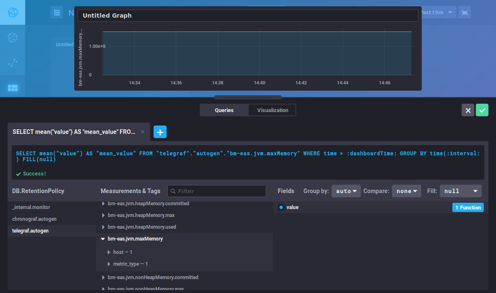

Cet éditeur est similaire à celui du *DataExplorer*, vous pouvez vous référez à la section précédente pour la recherche de métriques et la construction des requêtes.

Le bouton "* **Visualization** *" vous permet de choisir le type de graphique souhaité et de personnaliser celui-ci :


Une fois votre graphique créé, cliquez sur "Save" en haut à droite de l'éditeur pour le sauvegarder et l'ajouter à la zone :


Cliquez sur  pour ajouter autant de zones de graphiques que vous le souhaitez :

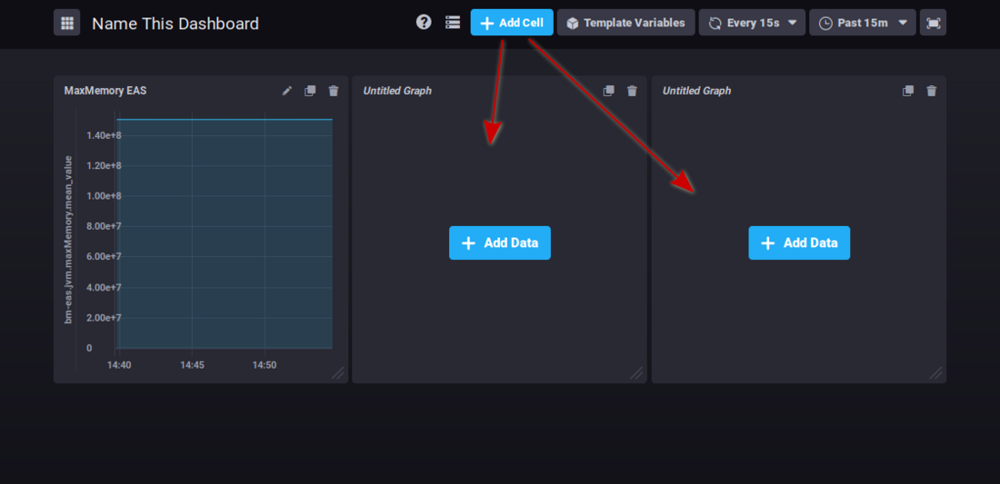

En haut à droite de chaque cellule, des boutons vous permettent :

-  : éditer, ajouter des annotations ou télécharger les données au format csv
-  : clôner le graphique, une nouvelle zone avec le même graphique est ajoutée en fin de tableau de bord
- 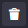 : supprimer le graphique


Cliquer sur l'icône souhaitée pour faire apparaître le menu des actions possibles.


:::tip

Les graphiques peuvent être réorganisés par simple glisser-déposer en cliquant sur leur zone de titre :


:::


:::info

Il n'y a pas de bouton de sauvegarde des changements : toutes les modifications sont enregistrées au fur et à mesure, ainsi vous ne risquez pas de perdre tout le travail effectué en oubliant de sauvegarder.

:::

## Les alertes

L'onglet *Alerting* permet d'accéder à la gestion des alertes ainsi qu'à l'historique des alertes levées.

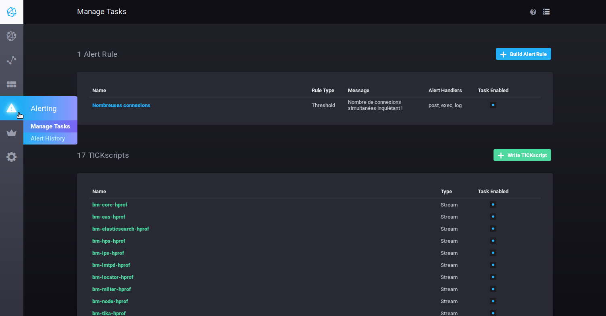

Les alertes peuvent se présenter sous forme de scripts ou de règles d'alertes.

Par défaut aucune règle d'alerte n'est présente à l'installation, en revanche un certain nombre de scripts sont pré-configurés, vous pouvez les modifier et/ou en rajouter autant que vous le souhaitez.


:::info

Les alertes préconfigurées par BlueMind sont des alertes importantes sur l'état de santé du serveur, une attention particulière doit leur être portée si l'une d'elles est levée.

:::

### Les alertes

- Pour créer une alerte, cliquer sur le bouton 
- Pour modifier une alerte, cliquer sur son nom dans la liste.


Remplissez (ou corriger) ensuite les différentes parties du formulaire :

- ** **Name this alert rule** ** : nom de l'alerte
- ** **Alert type** ** : le type d'alerte, les détails seront définis plus bas
    - **Threshold** : seuil – l'alerte sera levée lorsque les données atteindront, dépasseront ou diminueront en deçà de la valeur définie
    - **Relative** : relatif à son propre historique – l'alerte sera levée lorsqu'il y aura un changement de valeur dépassant les conditions définies
    - **Deadman** : mort – l'alerte sera levée lorsque plus aucune valeur ne sera détectée pendant le temps défini
- ** **Time series** ** : série de données surveillée – utilisez le navigateur pour trouver la série souhaitée
    - **DB.RetentionPolicy** : la base de données concernée. Celle qui nous intéresse en priorité est la base **telegraf.autogen** qui contient les données concernées, les autres bases de données sont des bases système contenant les données de la base elle-même.
    - **Measurements & Tags** : la métrique recherchée, un champ en haut de colonne permet de filtrer sur le nom pour une recherche plus facile
    - **Fields** : le ou les champs souhaités pour cette donnée
- ** **Conditions** ** : une fois le champ sélectionné, fixez ici les conditions en fonction du type d'alerte choisi précédemmentLorsqu'une valeur est saisie, l'affichage propose un aperçu en temps réel des données collectées, permettant éventuellement de positionner ou d'ajuster la valeur.Par exemple avec le formulaire ci-dessous : 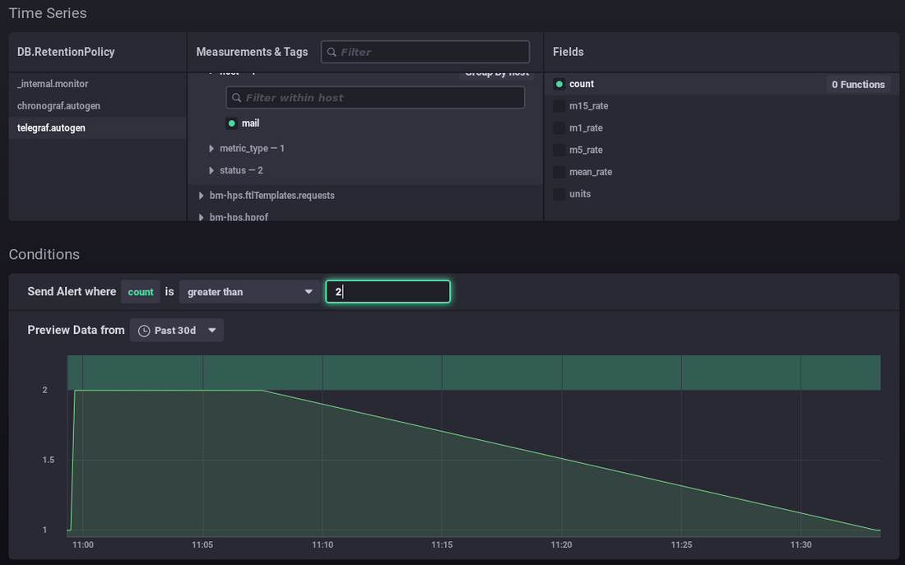 
    - Je paramètre une alerte lorsque le nombre de connexion dépasse 2.
    - Le graphique montre le nombre de connexion sur le mois précédent (courbe verte).
    - La zone verte en haut représente la zone dans laquelle l'alerte aurait été levée.
    -  Je peux constater que mes valeurs ont toujours été en dessous, il serait anormal qu'elles le dépassent donc l'alerte me semble pertinente à ce seuil
Ainsi, vous pouvez positionner votre valeur au mieux en fonction de votre donnée et son historique : au dessus des valeurs habituelles, comprenant les pics ou non, etc.Dans ce second exemple, une alerte sera levée lors des pics de consommation de mémoire qui arrivent tous les quelques jours : 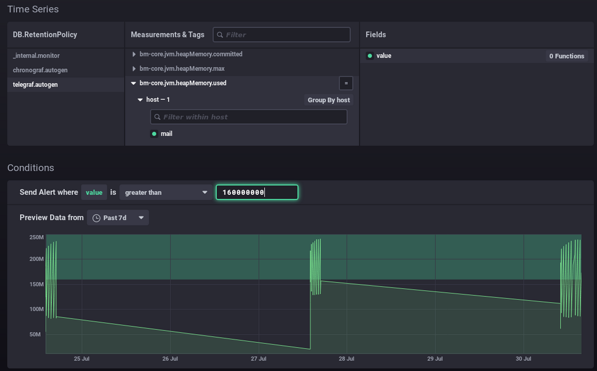- ** **Alert** ** handlers** ** : gestionnaires d'actions à réaliserAjouter grâce à la liste déroulante un ou plusieurs destinataires de l'alerte :
    - post : envoie une requête http de type "post" à l'url donnée
    - tcp : envoie une requête via le protocole tcp à l'adresse indiquée
    - exec : ligne de commande à exécuter sur le serveur
    - log : écrire un message dans le fichier log désigné
    - ...
Ici, l'alerte envoie une requête http, lance une commande sur le serveur et écrit un message dans le fichier log dédié : - ** **Message** ** : le message à écrire ou envoyer via le(s) gestionnaire(s) spécifié(s) ci-dessus 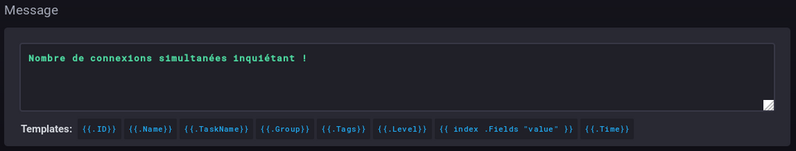


### Les scripts

Les scripts permettent une gestion plus fine et experte des alertes. Chaque alerte créée sous forme de règle est aussi présente sous forme de script et peut être éditée de cette façon.

- Pour créer un script, cliquer sur le bouton 
- Pour modifier un script, cliquer sur son nom dans la liste.


Pour plus d'information sur l'écriture de scripts, vous pouvez vous référer à la documentation produit :

[https://docs.influxdata.com/kapacitor/v1.5/tick/](https://docs.influxdata.com/kapacitor/v1.5/tick/)

[https://www.influxdata.com/blog/tick-script-templates/](https://www.influxdata.com/blog/tick-script-templates/)

### Historique des alertes

Le sous-menu *Alerting* > *Alert history* permet d'accéder à l'historique des alertes levées :

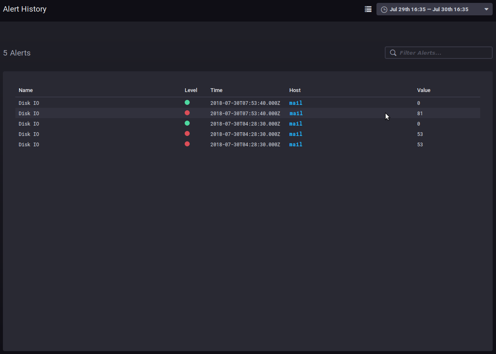

L'historique permet de voir le nom, le niveau, l'heure, l'hôte concerné et la valeur de la donnée lors de la levée de l'alerte.

Un clic sur le nom d'hôte mène au tableau de bord de supervision de celui-ci.

## Autres onglets

### Les hôtes

L'onglet *Host List* vous présente la liste des serveurs hôtes surveillés, avec les applications qu'ils comprennent :

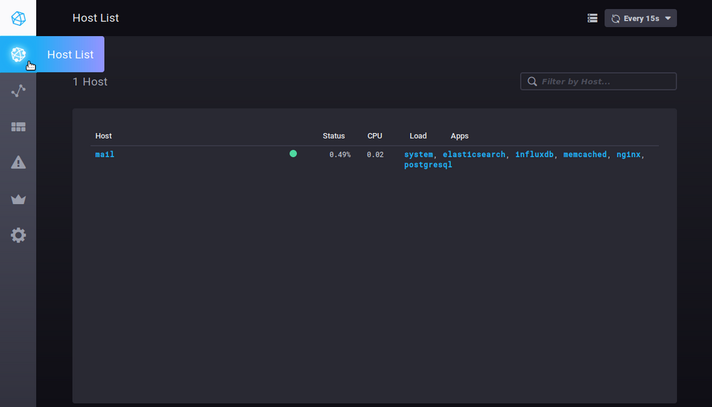

Un clic sur un serveur ou sur une application vous mène au tableau de bord spécifique de cet élément.


