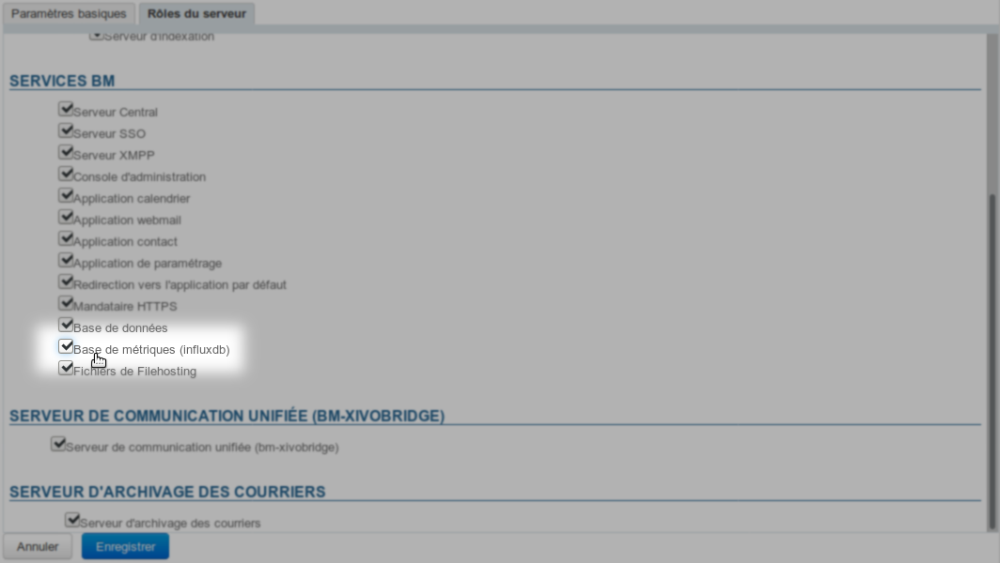

# Installation et Accès


# Présentation

La suite de supervision bm-tick est installée automatiquement et par défaut dans BlueMind 4.


# Installation

Les paquets logiciels sont pré-installés sur le serveur avec l'installation de BlueMind mais nécessitent néanmoins une phase de configuration :

1 Se connecter à la console d'administration en tant que superutilisateur admin0 (ou administrateur délégué ayant les droits nécessaires) et se rendre dans Gestion du système > Serveurs de l'application > sélectionner le serveur > onglet Rôles du serveur
1 Activer le rôle « Base de métriques (influxdb) » :
1 ****Enregistrer****
1 
Installer les derniers paquets nécessaires à l'accès à la console et redémarrer BlueMind :


```
aptitude install bm-plugin-admin-console-monitoring bm-plugin-node-monitoring
bmctl restart
```


1 
Lancer une génération initiale des alertes et tableaux de bord par défaut de l'application. Pour cela, toujours connecté root à la machine, lancer la commande suivante :


```
bm-cli tick reconfigure
```


1 
Recharger le service Nginx :


```
systemctl reload bm-nginx
```


NB : cette commande est sans impact sur les utilisateurs, elle peut être exécutée sans risque de coupure


# Accéder à l'application

Vous pouvez accéder à l'application en vous connectant à l'url **https://&lt;votre bluemind>.tld/tick**
:::important

L'identifiant et le mot de passe qui vous sont demandés sont ceux de l'assistant d'installation qui vous ont été fournis lors de l'installation de Bluemind et qui sont configurable dans l'administration de BlueMind.

Si vous les avez perdus, vous pouvez consulter la FAQ à ce sujet : [J'ai perdu le mot de passe de l'assistant d'installation](/FAQ_Foire_aux_questions_/#FAQ-swpassword)

:::

**L**'accès à l'application est simplifié et soumis à un [rôle](/Guide_de_l_administrateur/Gestion_des_entités/Utilisateurs/Les_rôles_droits_d_accès_et_d_administration/) :

- Affecter le rôle "**Console de monitoring**" aux personnes souhaitées (via la gestion de chaque utilisateur ou via un groupe)
- Les personnes ont dès lors (une reconnexion peut être nécessaire) un lien "Supervision" dans le bandeau leur permettant d'accéder à la console :


