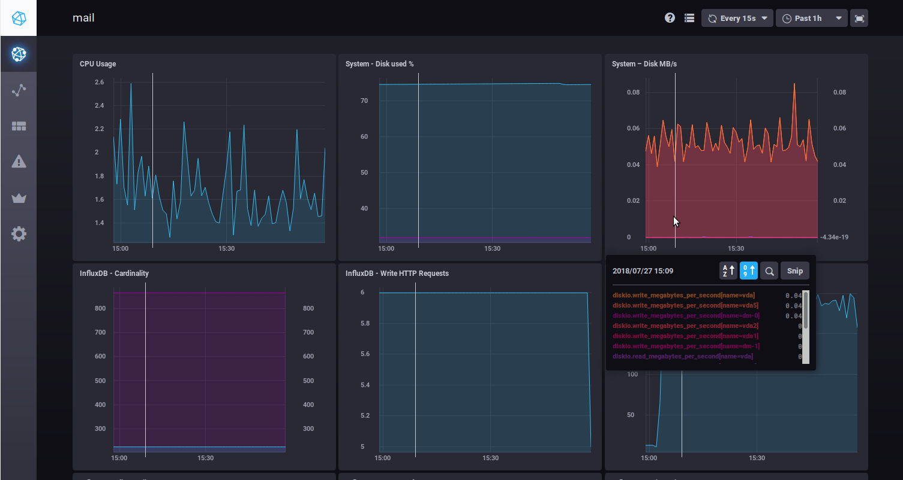
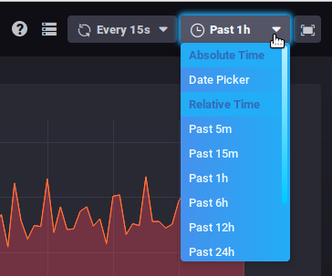

# Monitoring Bm-Tick

## Présentation

:::info
 L'outil de supervision est installé par défaut dans BlueMind 4 et ne doit ni ne peut être désinstallé
:::

L'outil de supervision Tick utilisé par BlueMind vous permet de superviser l'ensemble des données des serveurs en temps réel mais aussi de consulter l'historique de celles-ci grâce à son stockage en base de données. Il permet aussi un paramétrage fin et personnalisé des alertes sous diverses formes : alerte dans l'interface, action en ligne de commande, écriture dans un fichier de log spécialisé, etc.

L'ensemble Tick regroupe les produits :

- **Telegraf** : outil de collecte et rapport des données
- **InfluxDB** : base de données spécialisée pour les métriques, événements et leur analyse en temps réel
- **Chronograf** : application web de présentation des données permettant la visualisation et la surveillance
- **Kapacitor** : outil de traitement, surveillance et alerte des données chronologiques

En plus de cet ensemble de produits, le packaging BlueMind apporte :

- la configuration par défaut dédiée à BlueMind
- la configuration automatique de Telegraf et l'ajout de ses plugins
- la configuration automatique de tableaux de bord et alertes par défaut

De plus, le packaging BlueMind apporte la surveillance d'un très grand nombre de données, pour une surveillance la plus complète, précise et personnalisée possible. Il permet aussi **l'accès à l'historique de ces données** qui sont conservées pour une durée d'un mois, permettant ainsi de consulter, voir l'évolution et comparer les données passées avec l'existant afin de détecter des anomalies et pouvoir les analyser a posteriori.

Nous vous invitons à consulter le reste de notre documentation afin d'installer, utiliser et maîtriser l'outil :

- [Installation et Accès](/Guide_de_l_administrateur/Supervision/Monitoring_Bm_Tick/Installation_et_Accès/)
- [Explorer et analyser les données avec bm-tick](/Guide_de_l_administrateur/Supervision/Monitoring_Bm_Tick/Explorer_et_analyser_les_données_avec_bm_tick/)
- [Référence des métriques](/Guide_de_l_administrateur/Supervision/Monitoring_Bm_Tick/Référence_des_métriques/)

## L'interface

La page d'accueil présente les informations importantes :

- statistiques des alertes
- alertes
- flux des informations produit
- liens utiles

L'onglet [DataExplorer](/Guide_de_l_administrateur/Supervision/Monitoring_Bm_Tick/Explorer_et_analyser_les_données_avec_bm_tick/) vous permet de faire des requêtes afin de consulter et analyser les métriques collectées.

Les écrans, nommés « Tableaux de bord », présentent les graphes de données en temps réel :

Lorsque vous passez la souris sur un graphique, des informations détaillées sur la donnée survolée s'affichent en popup. Un trait blanc est aussi reporté sur tous les autres graphiques à l'heure indiquée par la souris afin de faciliter la lecture des différentes données à un même moment.

Vous pouvez zoomer sur un graphique en particulier en sélectionnant avec la souris une plage horaire directement sur le graphique. Un double-clic dans la zone permet ensuite de revenir à l'affichage par défaut du graphique.

Deux listes déroulantes en haut à droite de chaque tableau de bord permettent de modifier (ou figer) le délai de rafraichissement et la période à afficher :
 

:::tip

Ces données restent mémorisées lorsque vous naviguez d'un tableau à l'autre.

:::

