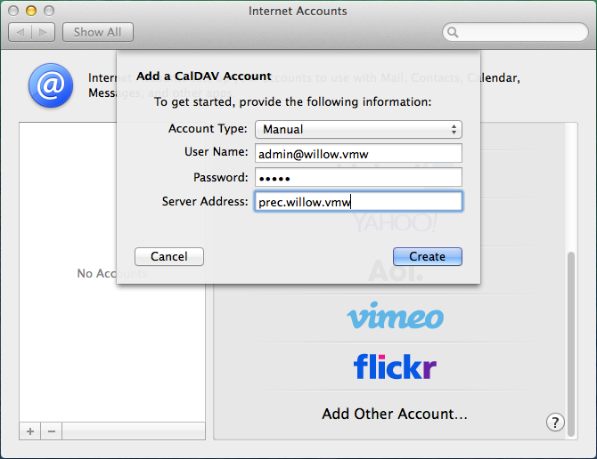
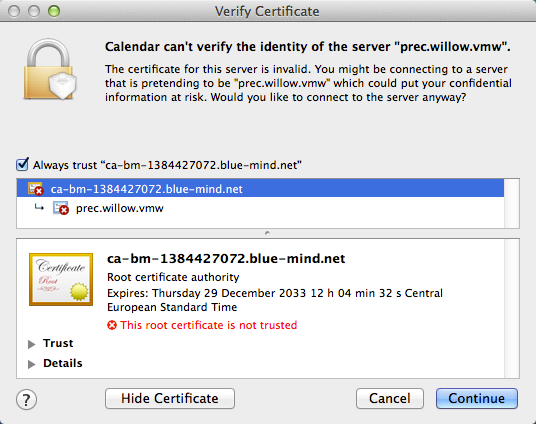
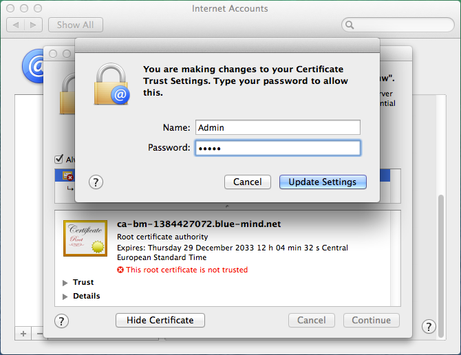
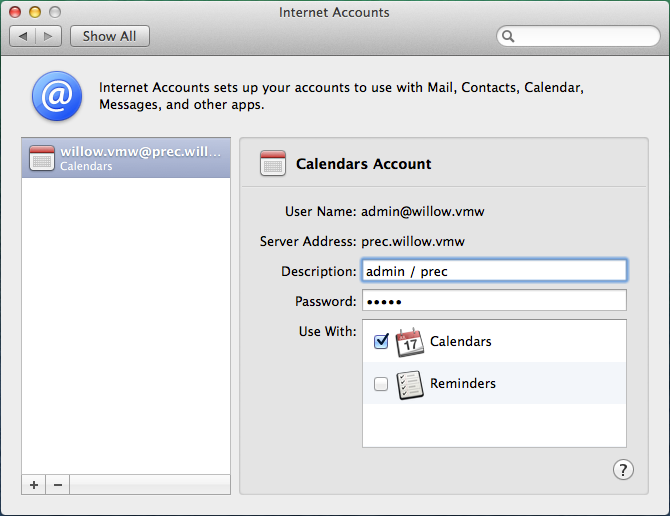

# Configuration de Calendar

## Présentation

:::info

Le guide suivant a été réalisé sous un OS X Mavericks.

Le protocole CalDav n'est actuellement validé qu'avec les clients Mac OS X **natifs** et, de préférence, avec un OS à jour. Au vu de la permissivité de la norme il ne nous est pour le moment pas possible de certifier le bon fonctionnement avec d'autres clients utilisant ce protocole.

:::

## Configuration d'un compte CalDAV

### Création du compte

Se rendre dans la gestion des comptes internet : System Preferences > «Internet Accounts» :

Choisir «Add other account» :

Sélectionner «Add a CalDAV account» et cliquer sur le bouton «create» :

Choisir le type de compte manuel (un compte automatique nécessite que des enregistrements DNS SRV soient en place) et saisir les informations du compte :

- Le nom d'utilisateur doit être le nom d'utilisateur **complet **avec le domaine**. 
- Le mot de passe est le mot de passe qui a été fourni par l'administrateur et permet de se connecter à BlueMind.
- L'adresse du serveur doit vous être indiquée par votre administrateur, elle est en général de la forme nom-serveur.domaine.com 

Cliquez sur «Create».

Une alerte indique que la connexion n'est pas sécurisée, ce qui n'est techniquement pas totalement vrai.

Validez l'alerte.

Cliquer une seconde fois sur «Create», le système précise alors que le problème est que le certificat est "autosigné" :

Cochez "Always trust..." pour dire de faire confiance au certificat et cliquer sur «Continue» pour continuer :

Valider l'ajout du certificat en saisissant votre nom d'utilisateur et mot de passe système.

Le compte est alors créé avec les réglages suivants :

:::info

Ne pas activer les reminders, cela n'est pas encore implémenté.

:::

Lancer Calendar, les rendez-vous doivent apparaître :

### Affichage des agendas partagés

Pour pouvoir les voir dans Calendar, l'utilisateur doit d'abord s'abonner aux agendas qu'il souhaite dans BlueMind. Cette opération doit nécessairement être faite dans l'interface Web.
Pour cela :

- Se rendre dans les paramètres utilisateurs > rubrique Agenda > onglet Abonnements
- Saisir le nom de l'agenda recherché (utilisateur, ressource, ...)
- Valider avec la touche "Entrée" ou choisir dans la liste proposée par l'autocomplétion
- **Cliquer sur le bouton «Enregistrer» pour prendre en compte les changements.**

*Pour en savoir plus, consulter la page [Préférences de l'agenda](../L_agenda/Paramétrer_l_agenda.md)*.

Une fois les abonnements réalisés dans BlueMind, se rendre dans les préférences de Calendar > onglet «Accounts» > sélectionner le compte créé > rubrique «Delegation» : les agendas auxquels l'utilisateur a accès (les siens ainsi que ceux pour lesquels il a reçu des droits de partage) apparaissent.
Cocher les cases de la colonne "Show" pour sélectionner les agendas à afficher :

