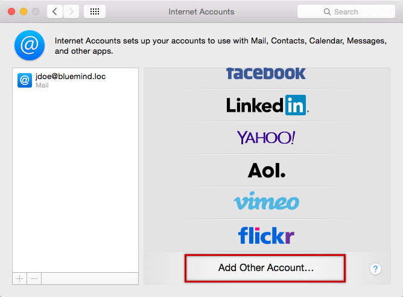
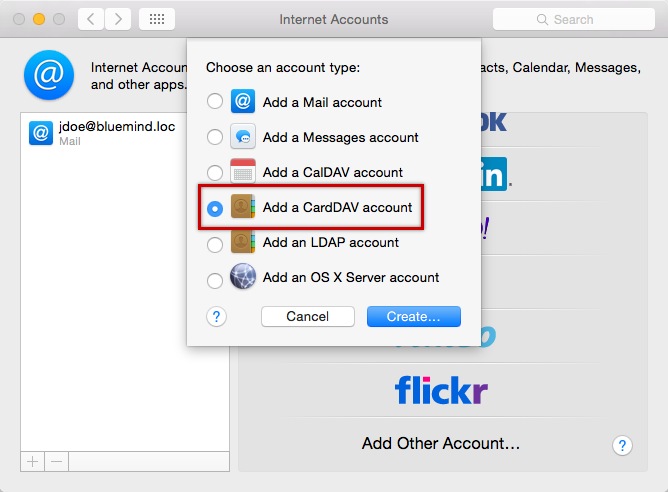

# Configuration de Contacts

## Présentation

:::info

Le guide suivant a été réalisé sous un OS X Yosemite.

Le protocole CardDav n'est actuellement validé qu'avec les clients Mac OS X **natifs** et, de préférence, avec un OS à jour. Au vu de la permissivité de la norme il ne nous est pour le moment pas possible de certifier le bon fonctionnement avec d'autres clients utilisant ce protocole.

:::

## Configuration d'un compte CardDAV

### Création du compte

Se rendre dans la gestion des comptes internet : System Preferences > «Internet Accounts» :

Choisir «Add other account» ("Ajouter un autre compte") :

Choisir «Add a CardDav account» ("ajouter un compte CardDav") :

Valider avec le bouton «Create» ("Créer")

Saisir les informations de connexion du compte utilisateur :

- User Name : nom d'utilisateur (nom complet comprenant le domaine, généralement l'adresse email principale de l'utilisateur)
- Password : le mot de passe est le mot de passe qui a été fourni par l'administrateur et permet de se connecter à BlueMind.
- Server Address : l'adresse du serveur doit vous être indiquée par votre administrateur, elle est en général de la forme nom-serveur.domaine.com

Valider en cliquant sur «Create»

L'application Contacts s'ouvre alors en présentant les contacts :

:::info

Éléments synchronisés

Seul le carnet personnel de l'utilisateur ("Mes contacts") est synchronisé et disponible pour affichage, recherche et autocomplétion dans les emails.

:::
