# Configuration de Thunderbird

## Installer Thunderbird

Télécharger et installer le client de messagerie sur le site de l'éditeur : [http://www.mozilla.org/thunderbird/](http://www.mozilla.org/thunderbird/)

## Configurer le compte courrier IMAP

Lors de sa 1ère ouverture, Thunderbird propose la création d'un compte utilisateur puis la création d'une nouvelle adresse électronique. Choisir alors l'option «Passer cette étape et utiliser mon adresse existante».

:::info

Si Thunderbird est déjà installé avec un compte utilisateur et son compte de courrier, passer simplement par le menu Fichier > Nouveau > Compte courrier existant

:::

- Renseigner le nom, l'adresse électronique et le mot de passe nécessaire à la connexion au serveur BlueMind puis cliquer sur «Continuer».
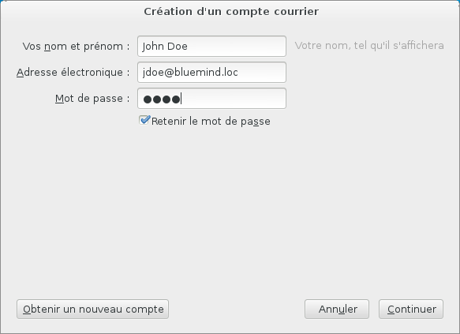

- Thunderbird essaie de se connecter à un serveur en utilisant ces informations puis affiche les informations testées et/ou trouvées :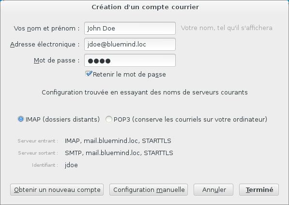
- Thunderbird propose un identifiant abrégé, basé sur la première partie de l'adresse mail. Cependant, l'identifiant attendu par le serveur BlueMind correspond à l'adresse mail complète.
Il faut donc passer en mode de configuration manuelle (bouton au bas de la fenêtre) afin de corriger cela :
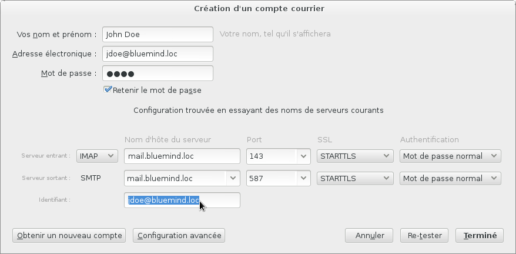

:::info

Si Thunderbird n'arrive pas à "deviner" les adresses des serveurs entrant et sortant, il propose automatiquement le formulaire de saisie manuelle et le bouton «Terminé» est grisé. Remplir les adresses correctes ainsi que l'identifiant puis cliquer sur «Re-tester» afin de valider les connexions et pouvoir terminer la procédure.

:::


:::info

- Les nom et prénom sont libres, ce sont ceux qui apparaîtraont dans les messages envoyés par l'utilisateur.
- L'adresse de messagerie est celle paramétrée par l'administrateur BlueMind 
- Les serveurs de courriers entrant et sortant doivent vous être indiqués par votre administrateur, ils sont en général de la forme &lt;nom-serveur>.domaine.com 
- L'identifiant est le nom d'utilisateur **complet avec le domaine**. 
- Le mot de passe est le mot de passe qui a été fourni par l'administrateur et permet de se connecter à BlueMind.


:::

- Cliquer sur le bouton «Terminé».
- Thunderbird affiche alors la fenêtre principale et récupère le courrier du compte paramétré.


## Se connecter à une boîte aux lettres partagée

Pour accéder à une boîte aux lettres partagée, il faut s'y "abonner" dans Thunderbird.

Pour cela, faire un clic-droit dans le volet de gauche de la fenêtre et choisir l'option "S'abonner" du menu :


Une fenêtre s'ouvre, présentant la liste des dossiers accessible à l'utilisateur.

Déployer le menu grisé "Dossiers partagés" (double-clic sur le nom ou simple-clic sur la flèche en début de ligne) et cocher la ou les cases correspondant au(x) dossier(s) souhaité(s) puis cliquer sur «OK» :

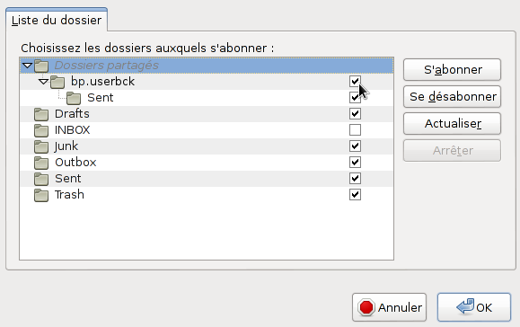

La boite partagée apparaît alors dans la fenêtre principale avec les autres dossiers du compte, dans un sous-arbre nommé "Dossiers partagés" :

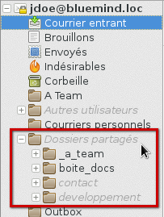


:::tip

Thunderbird peut aussi être configuré pour afficher tous les dossiers partagés de l'utilisateur sans que celui-ci ait à s'y abonner :

- aller dans le menu *Édition* (ou *Outils*) > *Paramètres des comptes*

- aller dans le menu *Paramètre serveur* du compte concerné*

- cliquer sur le bouton «*Avancés»*

- décocher *"Afficher uniquement les dossiers avec abonnement"*

:::

Selon les droits d'accès de l'utilisateur à la boite partagée, celui-ci peut alors consulter les messages que la boite contient ou y copier/déplacer des messages depuis sa boite, depuis son dossier "Courrier entrant" par exemple.


:::info

ATTENTION

L'action de glisser un mail avec la souris vers cette boîte **déplace** le mail, il disparait alors de la boite d'origine.

**Pour copier un message**, effectuer un clic-droit sur l'en-tête du message dans la partie droite de la fenêtre et faire Copier Vers > choisir la boite de l'utilisateur > Dossiers Partagés > choisir la boite partagée souhaitée puis choisir l'emplacement à l'aide de l'option "Copier ici" du sous-menu correspondant au dossier voulu :

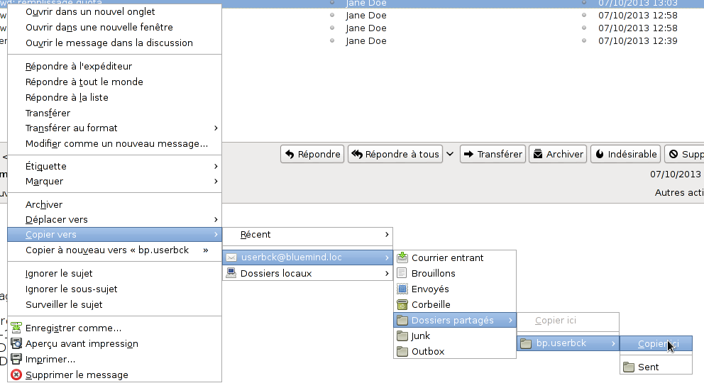

:::

## Le connecteur BlueMind

Le connecteur fourni par BlueMind permet la synchronisation de l'agenda et des carnets d'adresses de BlueMind avec Thunderbird. Il permet aussi l'accès à la gestion des tâches et au [détachement des pièces jointes volumineuses](../La_messagerie/Ajouter_des_pièces_jointes.md) lors de la rédaction de messages.

### Installation du connecteur

Pour installer le connecteur BlueMind :

- télécharger le fichier d'installation depuis l'interface de gestion des préférences de BlueMind, rubrique Téléchargements


:::info

Si le connecteur n'est pas proposé dans les téléchargements, veuillez vous rapprocher de votre administrateur système afin qu'il procède à [son installation](../../Guide_de_l_administrateur/BlueMind_et_mobilité/Les_connecteurs_BlueMind_pour_clients_lourds.md)

(/Guide_de_l_administrateur/BlueMind_et_mobilité/Les_connecteurs_BlueMind_pour_clients_lourds/).

:::

- dans Thunderbird, aller dans Outils > Modules complémentaires
- faire glisser le fichier dans la fenêtre principale de Thunderbird depuis l'explorateur de fichier ou choisir d'installer un nouveau module depuis le menu des outils de modules :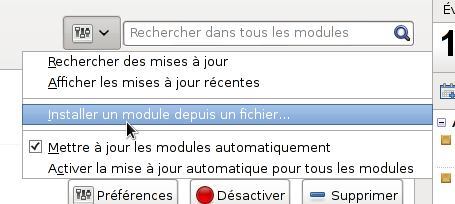
- suivre les instructions d'installation de Thunderbird et redémarrer celui-ci
- se rendre dans Outils > Options des modules > BlueMind Connector et paramétrer l'adresse du serveur :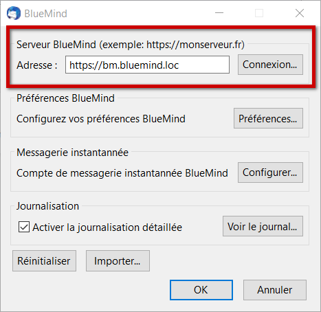NB : selon les versions d'OS et de Thunderbird, l'accès peut se faire de plusieurs façons :
    - Outils > modules complémentaires > bouton "Options" sur le module correspondant
    - Outils (ou Préférences) > Options > onglet BlueMind
- Cliquer sur OK pour quitter
- Le connecteur établit alors une première connexion et demande les nom d'utilisateur et mot de passe de l'utilisateur.

:::info

Le connecteur Thunderbird synchronise tous les éléments automatiquement toutes les 2mn. La synchronisation peut être forcée manuellement à un moment donné via le menu Outils > BlueMind > Synchroniser

:::

### Gestion des préférences de BlueMind

 La version 4.1 de BlueMind apporte aux utilisateurs de Thunderbird la possibilité de gérer l'intégralité de leurs préférences BlueMind depuis leur logiciel, sans avoir à se rendre dans l'application web BlueMind.

Plusieurs voies sont possibles pour accéder à la gestion des préférences :

- Outils > BlueMind > Préférences BlueMind
- depuis la fenêtre de gestion du connecteur :Outils > Options des modules > BlueMind Connector > bouton "Préférences"


L'interface se présente et fonctionne alors exactement de la même façon que la gestion des préférences dans l'application web BlueMind :

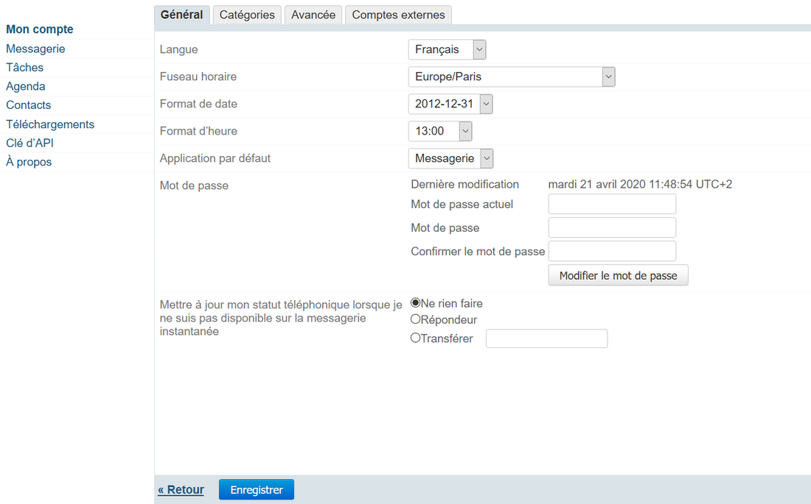

### Détachement des pièces jointes

Une fois le connecteur installé, la fonctionnalité de [détachement des pièces jointes](../La_messagerie/Ajouter_des_pièces_jointes.md) est directement accessible dans la fenêtre de rédaction d'un message.

#### Fonctionnement de base

Ajoutez simplement votre pièce jointe de façon habituelle (avec le bouton dédié ou par glisser-déposer). Si la taille de celle-ci dépasse le seuil de détachement automatique paramétré dans BlueMind, Thunderbird vous propose de détacher le fichier :

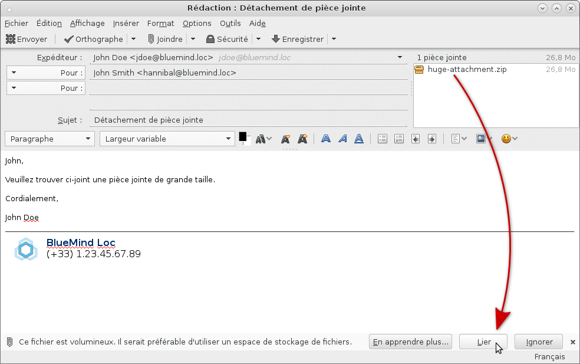

Le fichier est alors automatiquement envoyé sur le serveur et lié au message :

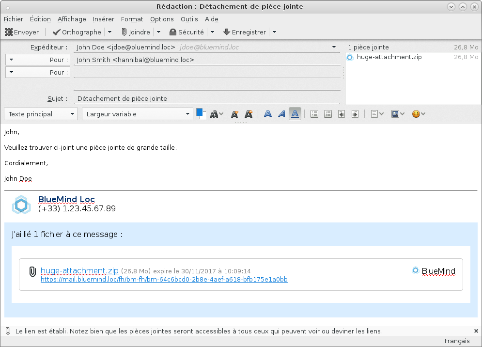

De même que lors du détachement depuis le webmail BlueMind, le bloc de téléchargement sera affiché tel quel chez le destinataire, quel que soit son client de messagerie.

:::info

Lors de la 1ère utilisation, il vous est demandé de choisir le service à utiliser :

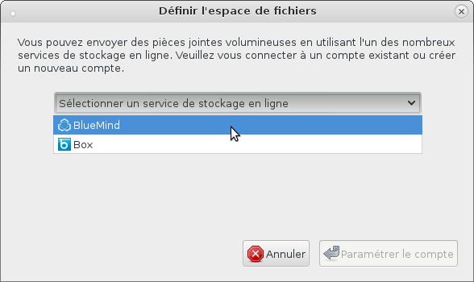

1. Sélectionnez BlueMind
2. Cliquez sur le bouton "Paramétrer le compte"
3. Un avertissement peut apparaître, validez alors l'exception demandée pour le certificat puis cliquez de nouveau sur "Paramétrer le compte"
4. La popup se ferme est le fichier est alors joint au message


:::

#### Détachement forcé

Pour détacher un fichier qui est déjà joint au message, effectuer un clic droit sur le nom de la pièce jointe puis choisir Convertir en > BlueMind :

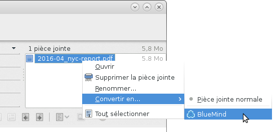

À l'inverse, pour réintégré un fichier qui a été détaché, choisir Convertir en > Pièce jointe normale. Le fichier est alors joint au message et le bloc de téléchargement est supprimé.

Un fichier peut aussi être joint au message de façon lié directement lors de son inclusion. Pour cela, cliquez sur la flèche du bouton "Joindre" afin de dérouler le menu des options et choisissez Espace de fichiers > BlueMind

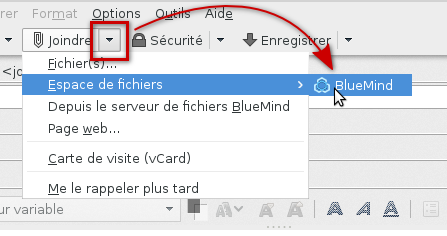

Le sélecteur de fichiers de votre système s'ouvre et une fois le fichier choisi, celui-ci est automatiquement et immédiatement envoyé sur le serveur et lié au message :

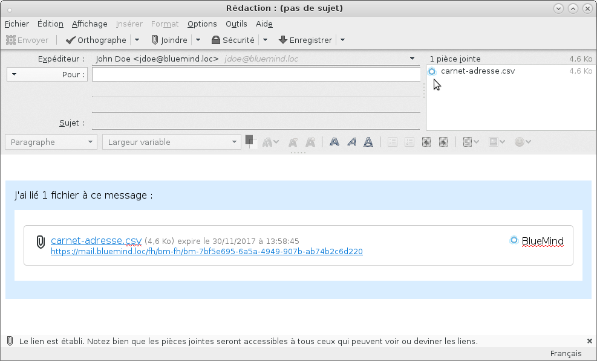

#### Sélecteur de fichiers BlueMind

De même que depuis le webmail BlueMind, vous pouvez accéder au sélecteur de fichiers vous permettant d'envoyer des fichiers déjà présents dans votre espace en ligne (fichiers que vous avez déjà envoyés et détachés lors de précédents messages).

Pour y accéder, cliquez sur la flèche du bouton "Joindre" afin de dérouler le menu des options et choisissez "Depuis le serveur de fichiers BlueMind" :

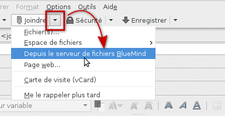Le sélecteur de fichier de BlueMind s'ouvre, permettant de sélectionner les fichiers disponibles. Cliquez sur un ou plusieurs fichiers puis sur le bouton "Sélectionner" pour les ajouter au message :


#### Paramétrage

Dans les préférences de Thunderbird, onglet Pièces jointes, vous pouvez choisir de désactiver le détachement automatique des pièces jointes dépassant un certain seuil en cochant ou décochant la case prévue à cet effet :

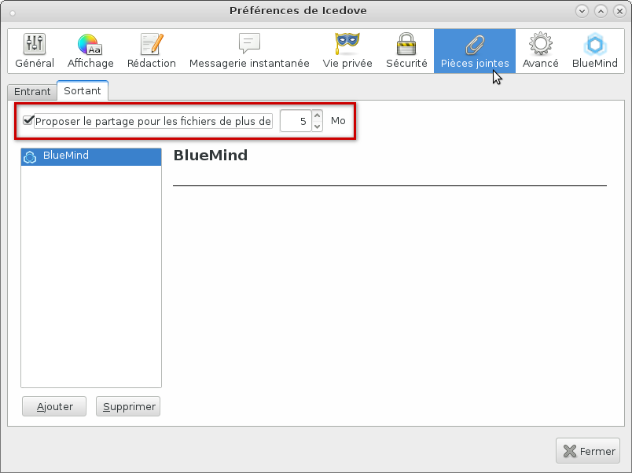


:::info

Le seuil peut être modifié dans cette fenêtre, néanmoins celui-ci est synchronisé avec le serveur BlueMind à chaque démarrage de Thunderbird, la valeur modifiée sera donc écrasée lors de votre prochaine session.

:::

### L'agenda

#### Affichage

Une fois le connecteur installé et la connexion établie, l'agenda est accessible par le menu Outils > BlueMind > Calendrier ou au moyen d'un nouveau bouton sur l'interface principale de Thunderbird :

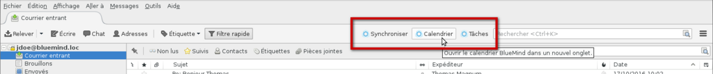

Il présente les mêmes caractéristiques d'affichage et le même fonctionnement que [l'agenda](../L_agenda/Découvrir_l_agenda.md) en ligne :

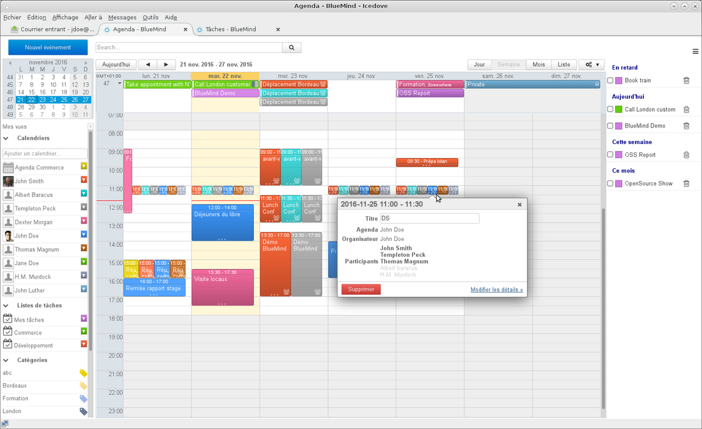

#### Préférences et agendas

La gestion des agendas affichés mais aussi la création d'agendas secondaires ou encore l'attribution de droits de partages à d'autres utilisateurs s'effectuent au sein de la gestion des préférences (voir plus haut) : menu Outils > BlueMind > Préférences BlueMind > section Agenda.

Pour plus d'informations détaillées, consulter la page dédiée aux [Préférences de l'agenda](../L_agenda/Paramétrer_l_agenda.md)

### Les tâches

De même que l'agenda, la gestion des tâches est accessible dans un onglet propre et propose la même interface que dans BlueMind en ligne :

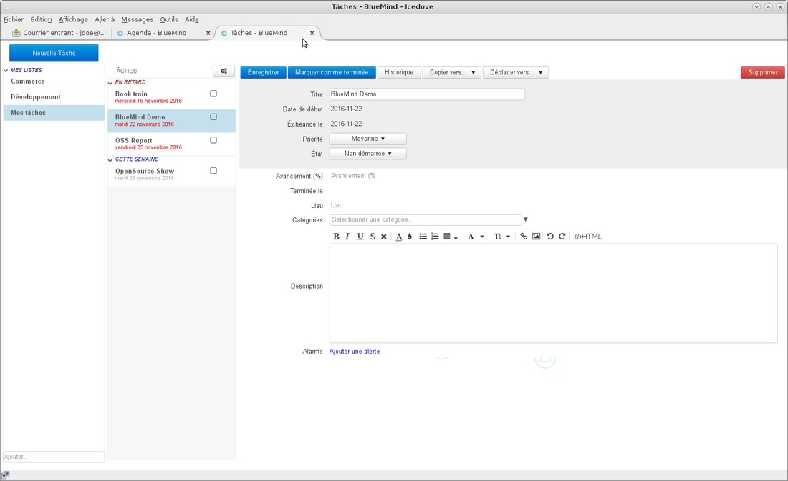

Pour en savoir plus sur le fonctionnement, vous pouvez consulter la page dédiée : [Les tâches](../Les_tâches/Découvrir_les_tâches.md)

### Les contacts

Tous les carnets d'adresses BlueMind de l'utilisateur peuvent être synchronisés avec Thunderbird et sont accessibles via le gestionnaire de carnet d'adresses (menu Outils > Carnet d'adresses) :

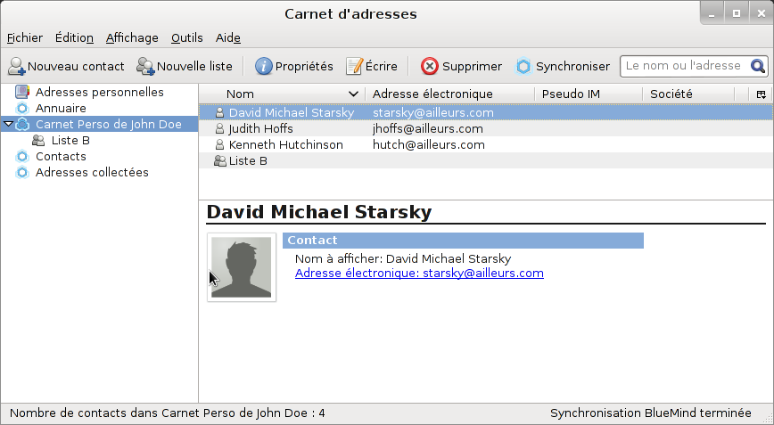

Pour qu'un carnet d'adresse soit visible dans Thunderbird, il faut d'abord s'y abonner dans BlueMind, qu'il s'agisse d'un carnet d'adresse personnel ou d'un carnet partagé par un autre utilisateur.

Pour ajouter un abonnement à un carnet :

- Une fois que le partage est activé (par l'utilisateur pour un carnet personnel ou par l'administrateur pour un carnet de domaine), se rendre dans la gestion des préférences BlueMind : Outils > BlueMind > Préférences BlueMind > section Contacts > onglet Abonnements

- dans le champs de saisie, commencer à taper le nom du carnet d'adresses, qui est alors proposé par l'autocomplétion :

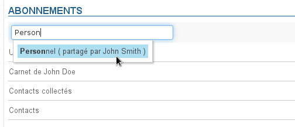 
NB : les carnets personnels de l'utilisateur sont automatiquement ajoutés lors de leur création


:::tip

Abonnement et synchronisation

Le bouton "Synchronisation" permet de paramétrer une synchronisation différenciée pour chaque carnet.

- **Si la synchronisation est activée** : le carnet est visible et les fiches sont consultables et disponibles hors connexion
- **Si la synchronisation est désactivée** : le carnet est visible avec une icône différente des autres carnets et les fiches sont accessibles en recherche (carnet d'adresses) et autocomplétion (composition de messages) uniquement

:::info

Synchronisation de l'annuaire

Pour éviter les problèmes liés à un grand nombre d'utilisateurs sur le domaine, le carnet Annuaire n'est pas synchronisé par défaut.

:::

Pour plus d'informations, consultez la page [Utiliser un carnet d'adresses partagé](../Les_contacts/Utiliser_un_carnet_d_adresses_partagé.md)

:::

- Retourner dans le module des carnets d'adresses
- Cliquer sur le bouton «Synchroniser» ou utiliser le menu Outils > BlueMind > Synchroniser. Le carnet apparaît alors :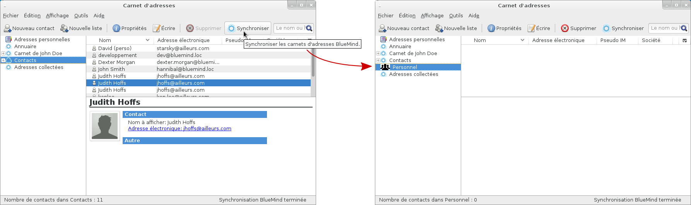

### Signature d'entreprise

Si une [signature d'entreprise](../../Guide_de_l_administrateur/Configuration/Signatures_d_entreprise.md) est paramétrée, elle sera automatiquement ajoutée à la fin du message par le serveur après son envoi.

Un aperçu est proposé dans la fenêtre de rédaction afin que l'utilisateur puisse voir qu'une signature sera présente et laquelle si plusieurs signatures sont paramétrées (signature interne, externe, pour un groupe, etc.) :

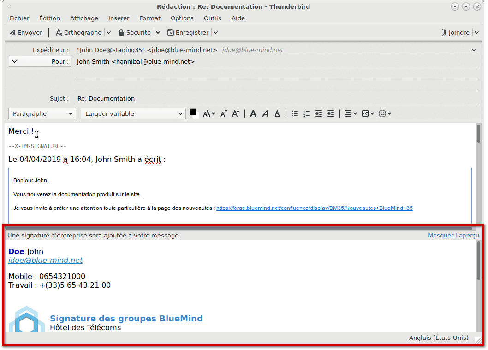

#### Placement de la signature

Si l'administrateur a choisi d'activer l'option adéquate, les utilisateurs peuvent choisir le placement de leur signature.

**Pour cela il faut ajouter la chaîne de caractère (tag) `--X-BM-SIGNATURE--` à l'emplacement souhaité dans l'email.**

Afin de faciliter cette insertion, l'utilisateur peut paramétrer cette chaîne en tant que signature par défaut dans Thunderbird :

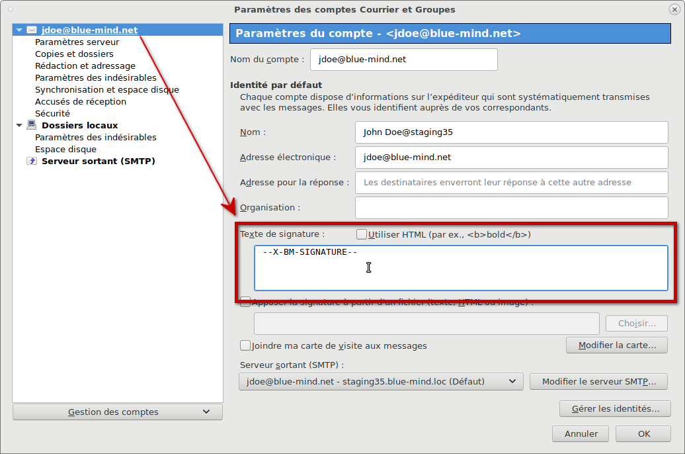

Lors de la rédaction d'un email ou de la réponse à un email, le tag est alors automatiquement placé dans le message :

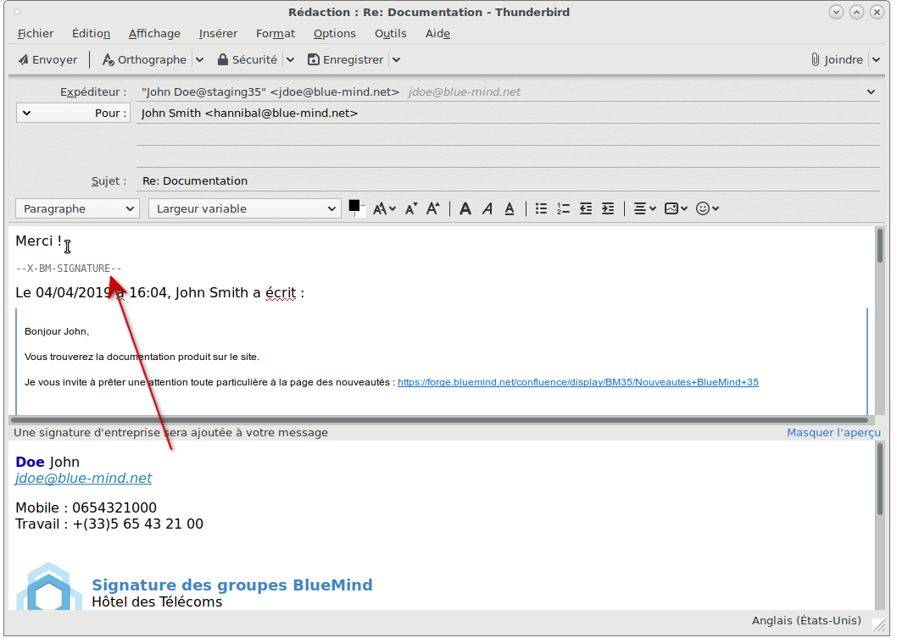


:::tip

Même dans le cas présent d'un placement par Thunderbird, le tag peut toujours être déplacé manuellement par l'utilisateur s'il souhaite temporairement placer la signature à un autre endroit.

:::

La signature est ensuite insérée par le serveur là où le tag se trouve :


:::info

En cas d'absence ou de suppression du tag, la signature sera placée à la toute fin du message.

:::

#### Utilisation d'une signature personnelle

Contrairement au webmail, BlueMind ne peut pas détecter une signature personnelle afin de la remplacer lors de l'utilisation de Thunderbird. Ainsi, si une signature personnelle est utilisée dans Thunderbird, la signature d'entreprise sera ajoutée **en plus de celle-ci** aux messages.

Il convient donc de ne pas utiliser de signature personnelle lorsqu'une signature d'entreprise est présente, à moins que celle-ci ne vienne apporter une information supplémentaire pertinente et souhaitée, ou d'utiliser en tant que signature le tag de placement (voir section précédente).

## Résolution de problèmes


:::tip

L'accès aux préférences du connecteur se fait via le menu Outils > BlueMind > Préférences du connecteur BlueMind.

:::

### Réinitialisation du connecteur

Lorsque des dysfonctionnements se présentent, qui ne sont pas résolus par un simple redémarrage du logiciel, une première étape est de réinitialiser le connecteur : cette opération réinitialise la synchronisation et vide le cache du navigateur de Thunderbird.

Cela se fait très simplement de la façon suivante :

- se rendre dans les préférences du connecteur
- cliquer sur le bouton "Réinitialiser" :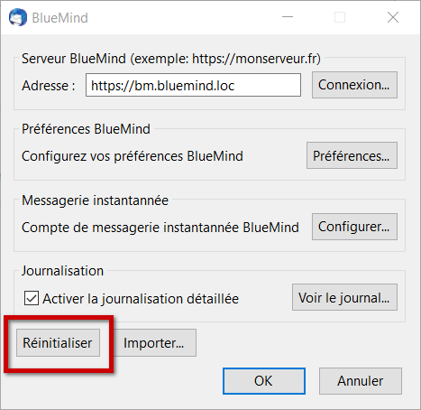
- Quitter en cliquant sur OK


### Les logs du connecteur

#### Obtenir des logs détaillés

Lorsque des problèmes surviennent sans cause évidente, il faut activer la journalisation détaillée du connecteur afin de pouvoir obtenir des logs complets qui donneront des informations sur le déroulement de la synchronisation du connecteur.

Pour cela :

- se rendre dans les préférences du connecteur
- cocher la case "Activer la journalisation détaillée" :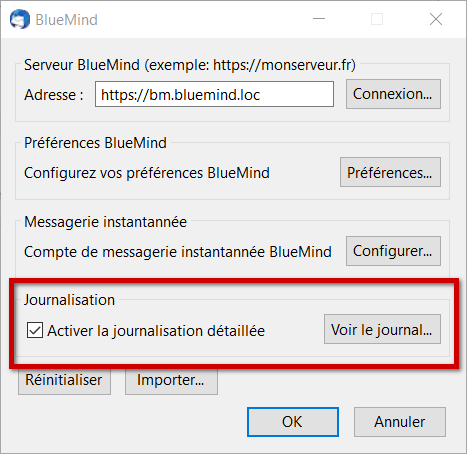
- Valider avec le bouton "OK"
- Relancer Thunderbird


#### Consulter les logs

La section d'activation des logs (voir ci-dessus) permet d'accéder aux logs en cliquant sur le bouton "Voir le journal..."

## Problèmes connus

### L'onglet d'agenda présente une page blanche

Si la réinitialisation du connecteur (voir ci-dessus) ne suffit pas à faire réapparaître l'agenda alors 2 solutions doivent être mises en oeuvre :

#### Vider manuellement le cache du navigateur intégré

Il est possible de procéder à une réinitialisation manuelle du cache de la façon suivante :

- ouvrir l'onglet agenda de Thunderbird
- aller dans Outils > Supprimer l'historique récent
- choisir « Tout* »* dans le menu déroulant et cocher toutes les cases
- cliquer sur «Effacer maintenant»
- fermer puis rouvrir l'onglet agenda de Thunderbird

#### Forcer le nettoyage des caches

En complément de la réinitialisation et du vidage manuel, on peut procéder à un nettoyage forcé des caches de Thunderbird :

1. Fermer le logiciel
2. utiliser la ligne de commande :


```
"C:\Program Files (x86)\Mozilla Thunderbird\thunderbird.exe" -purgecaches
```

Pour plus d'informations, consulter [https://developer.mozilla.org/fr/docs/Mozilla/Command_Line_Options](https://developer.mozilla.org/fr/docs/Mozilla/Command_Line_Options)

3. Supprimer le dossier de stockage local :


```
C:\Users\John\AppData\Roaming\Thunderbird\Profiles\c05tkj52.default\storage\default\https+++bm.bluemind.loc
```

*NB : le chemin vers le programme peut varier d'une version d'OS à l'autre*

4. Relancer Thunderbird


Si aucune de ces méthodes ne permet de rétablir l'agenda alors il faut mettre en œuvre la journalisation détaillée (voir paragraphe précédent) et transmettre les logs ainsi obtenus à votre service informatique ou au support BlueMind.


