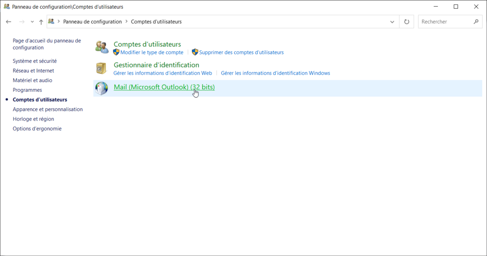
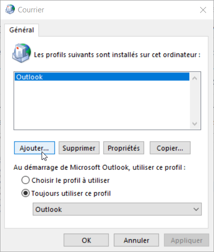
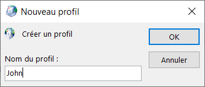
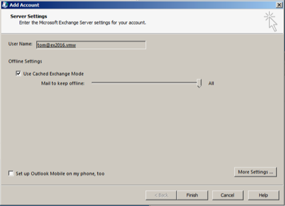
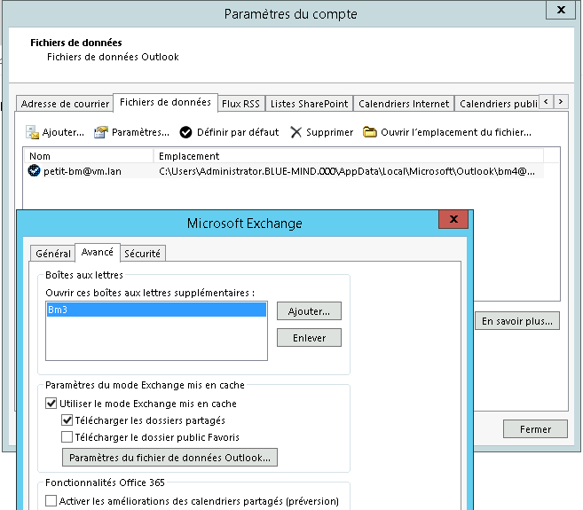
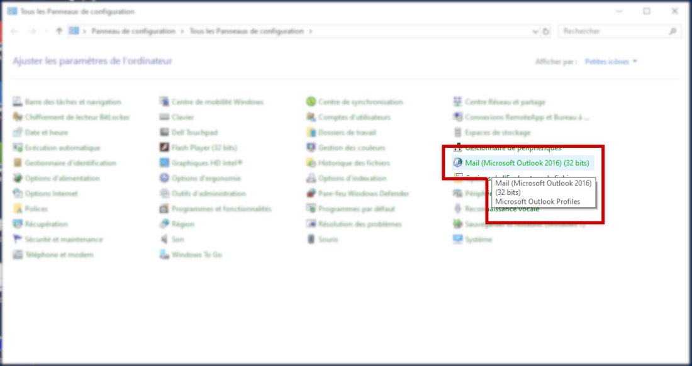
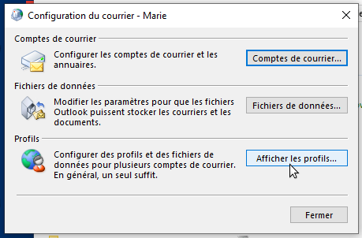

# Synchronisation avec Outlook

## Présentation

La synchronisation d'Outlook avec BlueMind 4.0 ne nécessite plus l'installation d'un connecteur donnant accès aux fonctions de BlueMind depuis Outlook. Désormais, vous pouvez utiliser pleinement toutes les fonctionnalités de votre Outlook connecté à votre messagerie BlueMind.

L'installation consiste en 3 parties, dont les 2 premières doivent être réalisées par un administrateur :

1. [Installation côté serveur](../../Guide_de_l_administrateur/La_souscription_BlueMind/Mise_en_%C5%93uvre_de_MAPI_pour_Outlook.md)
2. Configuration du poste Windows afin d'établir la connexion avec le serveur
3. Création d'un compte dans Outlook

:::info

Comme dans les versions précédentes de BlueMind, l'utilisation d'Outlook est rendue possible par une souscription. [Veuillez vous rapprocher de notre équipe commerciale pour obtenir une souscription de test](https://content.bluemind.net/decouvrez-bluemind-4-0).

:::


:::info

L'utilisation d'Outlook en MAPI sans connecteur implique que celui-ci ne peut bénéficier du [détachement des pièces jointes volumineuses](../La_messagerie/Ajouter_des_pièces_jointes.md), ceci étant une fonctionnalité purement BlueMind qui est pour le moment apportée par le connecteur.

:::

## Compatibilité

:::info

Outlook pour MacOS

Les protocoles de communication étant différents, nous ne pouvons garantir la compatibilité qu'avec Outlook **pour Windows**.

**BlueMind 4 n'est ainsi pas compatible avec les versions d'Outlook pour MacOS**.

:::

## Prérequis

1. Versions :
    - [BlueMind 4.0](https://download.bluemind.net/bm-download/4.0) **avec souscription**
    - Poste client :
        - **Windows** 10 à jour
        - Outlook 2013 (ou supérieur) à jour
2. Les urls externe et d'autodiscover doivent être accessibles depuis le poste en HTTPS : entrées dans un navigateur elles doivent afficher la page de login de BlueMind

## Configuration d'Outlook

:::info

Outlook : configuration Offline impérative

À ce jour, la **configuration "online"** totale ou partielle **d'Outlook n'est pas  supportée**, la transformation des données à la volée des formats BlueMind vers les formats attendus par Outlook ont trop d'impact coté client Outlook et serveur BlueMind.

Ainsi, **il est indispensable de configurer Outlook en "full cached mode"** (étape 6 ci-dessous)

:::

1. Ouvrir le logiciel
2. **Créer un nouveau profil Outlook : le compte ne doit pas être ajouté dans un profil déjà existant, y compris le profil par défaut lors du lancement du logiciel.**

Au stade actuel de l'implémentation du protocole MAPI dans BlueMind, le profil Outlook ainsi créé ne peut être utilisé pour se connecter à un autre compte Exchange. 

Pour cela :

    - se rendre dans le Panneau de configuration > Comptes Utilisateurs > Mail Microsoft Outlook (selon la configuration de l'affichage, ce menu peut se trouver à la racine du panneau de configuration) :
    - Dans la fenêtre Courrier qui s'ouvre, cliquer sur "Ajouter" afin de créer un nouveau profil vierge :
    - Donner un nom à ce profil :
    - l'interface vous amène dès lors à l'étape suivante de création du compte de messagerie
1. Ajouter un nouveau compte Email

:::info

Ne pas choisir la configuration manuelle

:::

2. Renseigner l'adresse email et le mot de passe de l'utilisateur :


:::info

Il est important d'utiliser l'adresse par défaut de l'utilisateur : les alias ne sont pas correctement pris en compte.

:::

3. Après quelques instants, Outlook signale que le compte a été ajouté avec succès :
4. Cocher "Modifier les paramètres du compte" et cliquer sur "Suivant"
5.  **Cocher "Utiliser le cache Exchange" et amener le curseur le plus à droite possible, jusqu'à "Tout" :**  
6. Cliquer sur "Terminer"


 **Vous y voilà ! Votre Outlook communique désormais en mode natif avec BlueMind !** 

## Les boîtes aux lettres partagées

La version 4.3 de BlueMind permet, grâce à une nouvelle fonctionnalité d'abonnements identique à celle des calendriers et carnets d'adresse, de faire apparaître les boîtes partagées dans les clients Outlook connectés en MAPI.

Il suffit pour cela de se connecter à son compte BlueMind, se rendre dans la gestion de son compte > Messagerie > onglet Abonnements.

Vous pouvez retrouver plus de détails sur la procédure d'abonnement et ses incidences sur les pages dédiées :

- [Partager une messagerie](../La_messagerie/Partager_une_messagerie.md)
- [Utiliser une messagerie partagée](../La_messagerie/Utiliser_une_messagerie_partagée.md)

## Les boîtes utilisateurs partagées

L'accès aux boîtes aux lettres d'utilisateurs n'est pas disponible de la même façon que pour les boîtes partagées.

Pour faire apparaitre une boîte d'utilisateur dans Outlook, se rendre dans les Paramètres du compte > onglet "Fichiers de données" > "Paramètres" > onglet "Avancé" :



## Configuration de Windows pour une organisation

### Configuration des postes Windows à l'aide des GPO

Si l'organisation dispose d'un annuaire Active Directory, les GPO suivantes peuvent être appliquées pour faciliter le déploiement de Microsoft Outlook :

#### Interdire l'authentification avec les serveurs Office 365:

Définir la police suivante:

- **signinoptions = 3 (None allowed)**


Documentation:

[https://admx.help/?Category=Office2016&Policy=office16.Office.Microsoft.Policies.Windows::L_SignInOptions&Language=fr-fr](https://admx.help/?Category=Office2016&Policy=office16.Office.Microsoft.Policies.Windows::L_SignInOptions&Language=fr-fr)

#### Forcer l'interface de configuration avancée

Définir la police suivante:

- **disableoffice365simplifiedaccountcreation = 1**

Documentation:

[https://admx.help/?Category=Office2016&Policy=outlk16.Office.Microsoft.Policies.Windows::L_DisableOffice365SimplifiedAccountCreation&Language=fr-fr](https://admx.help/?Category=Office2016&Policy=outlk16.Office.Microsoft.Policies.Windows::L_DisableOffice365SimplifiedAccountCreation&Language=fr-fr)

#### Forcer la configuration manuelle des comptes

Définir la police suivante:

- **disableaccountsettingsdetectionservice = 1**

Documentation:

[https://admx.help/?Category=Office2016&Policy=outlk16.Office.Microsoft.Policies.Windows::DisableAccountSettingsDetectionService&Language=fr-fr](https://admx.help/?Category=Office2016&Policy=outlk16.Office.Microsoft.Policies.Windows::DisableAccountSettingsDetectionService&Language=fr-fr)

#### Forcer l'utilisation d'autodiscover sur l'instance "on-premise"

Définir la police suivante:  

- **enableoffice365configservice = 1**

Documentation:

[https://admx.help/?Category=Office2016&Policy=outlk16.Office.Microsoft.Policies.Windows::L_OutlookEnableOfficeConfigServiceInAutodiscover&Language=fr-fr](https://admx.help/?Category=Office2016&Policy=outlk16.Office.Microsoft.Policies.Windows::L_OutlookEnableOfficeConfigServiceInAutodiscover&Language=fr-fr)

#### Paramétrer l'autodiscover adapté pour Bluemind

Définir les polices suivantes:

- **excludelastknowngoodurl = 1**
- **excludescplookup = 1**
- **excludehttpsrootdomain = 1**
- **excludehttpsautodiscoverdomain = 0**
- **excludehttpredirect = 0**
- **excludesrvrecord = 0**
- **excludeexplicito365endpoint = 1**
- **disableautodiscoverv2service = 1**

Documentation:

[https://admx.help/?Category=Office2016&Policy=outlk16.Office.Microsoft.Policies.Windows::L_OutlookDisableAutoDiscover&Language=fr-fr](https://admx.help/?Category=Office2016&Policy=outlk16.Office.Microsoft.Policies.Windows::L_OutlookDisableAutoDiscover&Language=fr-fr)

#### Forcer l'utilisation exclusive du protocole MAPI (désactivation du fallback imap)

Définir la police suivante:

- **disablerpctcpfallback = 1**


Documentation:

[https://admx.help/?Category=Office2016&Policy=outlk16.Office.Microsoft.Policies.Windows::L_DisableRpcTransportFallback](https://admx.help/?Category=Office2016&Policy=outlk16.Office.Microsoft.Policies.Windows::L_DisableRpcTransportFallback)

#### Désactiver les comptes Microsoft personnels

Définir la police suivante:

- **disableexchangeconsumeraccounts = 1**

Documentation:

[https://admx.help/?Category=Office2016&Policy=outlk16.Office.Microsoft.Policies.Windows::L_DisableExchangeConsumerAccounts&Language=fr-fr](https://admx.help/?Category=Office2016&Policy=outlk16.Office.Microsoft.Policies.Windows::L_DisableExchangeConsumerAccounts&Language=fr-fr)

#### Forcer l'utilisation d'un seul compte mapi par profil

Définir la police suivante:

- **maxnumexchange = 1**

Documentation:

[https://admx.help/?Category=Office2016&Policy=outlk16.Office.Microsoft.Policies.Windows::L_SetMaximumNumberOfExchangeAccounts&Language=fr-fr](https://admx.help/?Category=Office2016&Policy=outlk16.Office.Microsoft.Policies.Windows::L_SetMaximumNumberOfExchangeAccounts&Language=fr-fr)

#### Définir la mise en cache offline

Définir la police suivante:

- **cache mode = 1**

Documentation:

[https://admx.help/?Category=Office2016&Policy=outlk16.Office.Microsoft.Policies.Windows::L_CachedExchangeModeSyncSlider&Language=fr-fr](https://admx.help/?Category=Office2016&Policy=outlk16.Office.Microsoft.Policies.Windows::L_CachedExchangeModeSyncSlider&Language=fr-fr)

#### Activation des logs en cas de conflits

Définir la police suivante:

- **enableconflictlogging = 3**


Documentation:

[https://admx.help/?Category=Office2016&Policy=outlk16.Office.Microsoft.Policies.Windows::L_TurnOnLoggingForAllConflicts&Language=fr-fr](https://admx.help/?Category=Office2016&Policy=outlk16.Office.Microsoft.Policies.Windows::L_TurnOnLoggingForAllConflicts&Language=fr-fr)

## Configuration des postes à l'aide de clés registres

Pour faciliter le déploiement d'Outlook avec Bluemind, enregistrer les clés registres suivantes sur les postes de travail:


```
Windows Registry Editor Version 5.00
 
;; AUTODISCOVER 
;Outlook 2010
[HKEY\_CURRENT\_USER\Software\Microsoft\Office\14.0\Outlook\AutoDiscover]
"ExcludeExplicitO365Endpoint"=dword:00000001
"ExcludeHttpsAutoDiscoverDomain"=dword:00000000
"ExcludeHttpsRootDomain"=dword:00000001
"ExcludeScpLookup"=dword:00000001
"ExcludeSrvRecord"=dword:00000001
 
;Outlook 2013
[HKEY\_CURRENT\_USER\Software\Microsoft\Office\15.0\Outlook\AutoDiscover]
"ExcludeExplicitO365Endpoint"=dword:00000001
"ExcludeHttpsAutoDiscoverDomain"=dword:00000000
"ExcludeHttpsRootDomain"=dword:00000001
"ExcludeScpLookup"=dword:00000001
"ExcludeSrvRecord"=dword:00000001
 
;Outlook 2016 et Office365
[HKEY\_CURRENT\_USER\Software\Microsoft\Office\16.0\Outlook\AutoDiscover]
"ExcludeExplicitO365Endpoint"=dword:00000001
"ExcludeHttpsAutoDiscoverDomain"=dword:00000000
"ExcludeHttpsRootDomain"=dword:00000001
"ExcludeScpLookup"=dword:00000001
"ExcludeSrvRecord"=dword:00000001


;; CACHE MODE ALL, DISABLE MULTIPLE EXCHANGE ACCOUNTS
;Outlook 2016 et Office365
[HKEY\_CURRENT\_USER\Software\policies\microsoft\office\16.0\outlook\cached mode]
"DisableMultipleExchange"=dword:00000001
"SyncWindowSetting"=dword:00000000

;Outlook 2013
[HKEY\_CURRENT\_USER\Software\policies\microsoft\office\15.0\outlook\cached mode]
"DisableMultipleExchange"=dword:00000001
"SyncWindowSetting"=dword:00000000

;Outlook 2010
[HKEY\_CURRENT\_USER\Software\policies\microsoft\office\14.0\outlook\cached mode]
"DisableMultipleExchange"=dword:00000001
"SyncWindowSetting"=dword:00000000


```

Enregistrer ce contenu dans un fichier **mapi-bluemind.reg** et déployer ce fichier sur les postes de travail Windows. 

## Problèmes connus

### Un profil est déjà présent sur le poste

Dans Outlook se rendre dans Fichier > Gérer le compte > Gérer les profils

:::info

Selon les versions d'Outlook et/ou de Windows, il se peut que l'option "Gérer les profils" ne soit pas présente dans ce menu. Dans ce cas, se rendre dans le panneau de configuration du poste et choisir "Courrier" ("Mail" peut apparaître, même sur des système en français) :



Si le tri par catégorie est activé, l'option se trouve alors dans Panneau de configuration > Comptes utilisateurs :


:::

Cliquer sur le bouton "Afficher les profils" :



Sélectionner le profil et le supprimer :


**Relancer Outlook**

En cas de problème et de données persistantes, on pourra supprimer la totalité des données de la façon suivante :

Dans un navigateur, se rendre dans `%localappdata%\Microsoft` (copier cette chaine dans le champs de destination de l'explorateur de fichier) et supprimer totalement le répertoire `Outlook` (Shift+Suppr.)

Ensuite, aller dans `%APPDATA%\Roaming\Microsoft` et supprimer le répertoire Outlook (Shift+suppr) (ça correspond à `C:\users\[username]\AppData\Roaming\Microsoft` sous windows10)

### Création de compte en erreur à cause d'un mauvais mot de passe enregistré

**Problèmes/Symptômes** : la saisie du mot de passe ne permet pas la création du compte, Outlook indique toujours que le mot de passe est erroné

**Cause** : l'utilisateur a enregistré un mauvais mot de passe pour ce compte lors d'une tentative de création précédente

**Vérification possible par l'administrateur** : dans le fichier de logs du serveur `/var/log/nginx/access.log` on trouve des lignes de ce type :


```
192.168.61.133 - - [06/May/2019:16:57:53 +0200] "POST /autodiscover/autodiscover.xml HTTP/1.1" 401 0 "-" "Microsoft Office/16.0 (Windows NT 10.0; Microsoft Outlook 16.0.11601; Pro)"
```
ou

```
192.168.61.133 - tom@bm.lan [06/May/2019:16:58:31 +0200] "POST /mapi/nspi/?MailboxId=94a5c596-90a8-4985-91fd-57629ee06561@bm.lan HTTP/1.1" 200 149 "-" "Microsoft Office/16.0(Windows NT 10.0; Microsoft Outlook 16.0.11601; Pro)"
```

Ces lignes indiquent qu'il y a mauvais mot de passe pour [tom@bm.lan](mailto:tom@bm.lan) soumis par la création de compte

**Solution** :

Pour supprimer le mauvais mot de passe :

- s'assurer qu'Outlook et l'écran de création de compte soient fermés
- ouvrir le Gestionnaire d'identification en tapant Windows + R
- saisir "`control /name Microsoft.CredentialManager`" :
- cliquer sur OK (ou touche &lt;Entrée>)
- Supprimer les entrées de type  `autodiscover.domaine.tld`  et  `MicrosoftOffice16\_SSPI:utilisateur@domaine.tld`  Par exemple pour supprimer le mot de passe de *[tom@bm.lan](mailto:tom@bm.lan)* :


### Les boîtes partagées n'apparaissent pas parmi les dossiers de l'utilisateur

**Si votre BlueMind est en version 4.5 ou supérieure** : vérifiez que vous êtes bien abonné à la boite [dans la gestion de votre compte](../La_messagerie/Utiliser_une_messagerie_partagée.md).

**Si votre BlueMind est en version 4.4 ou antérieure** : les boites aux lettres partagées se trouvent dans les dossiers publics. Ceux-ci peuvent être trouvés en cliquant sur les points de suspension en bas de l'arborescence :


