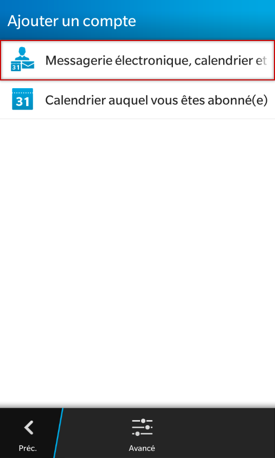
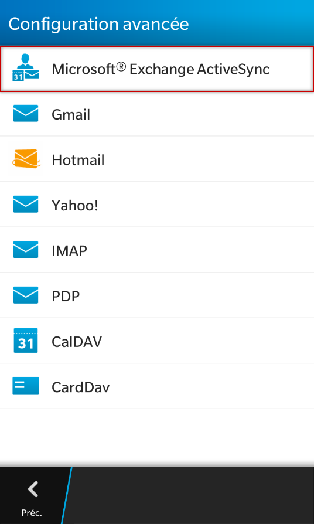
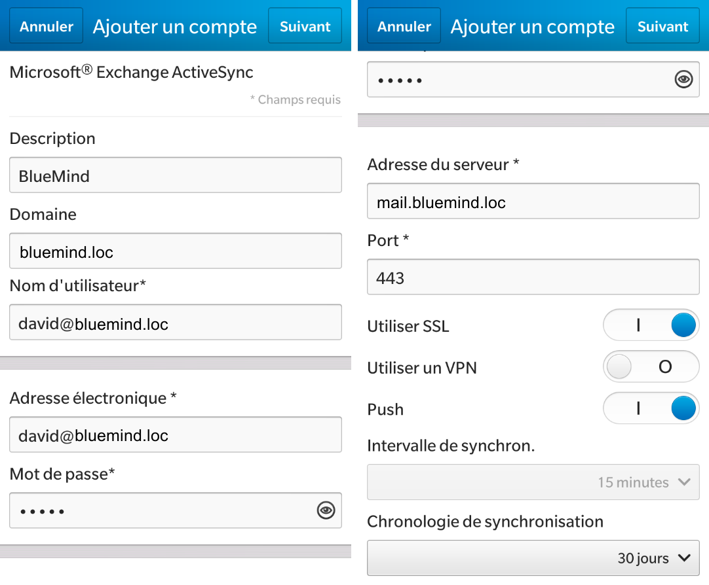
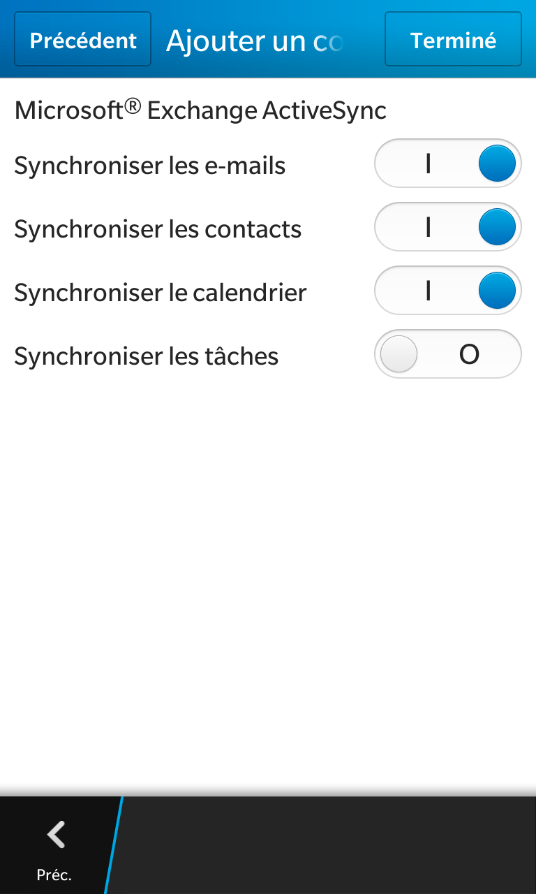
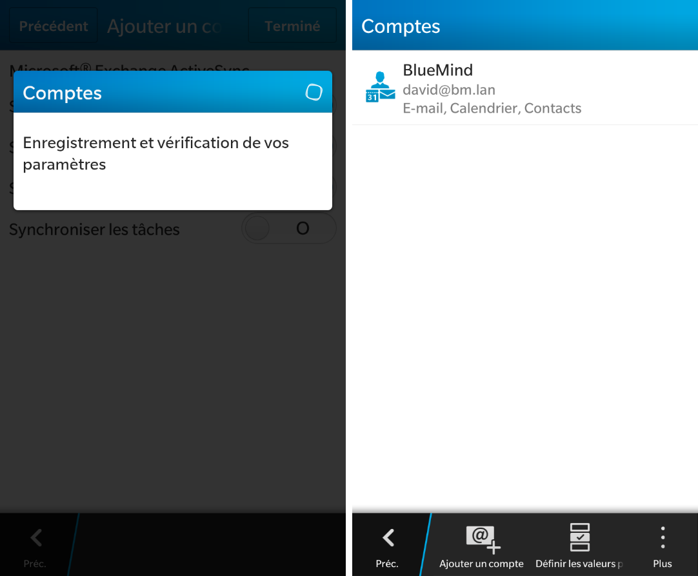
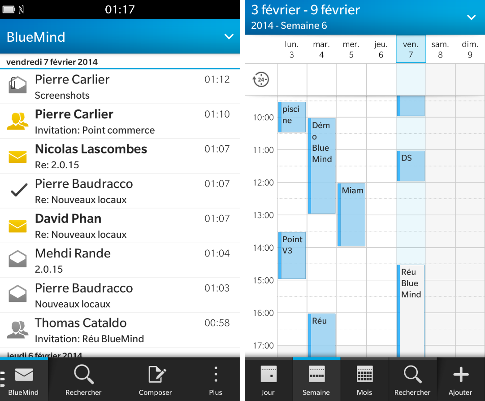
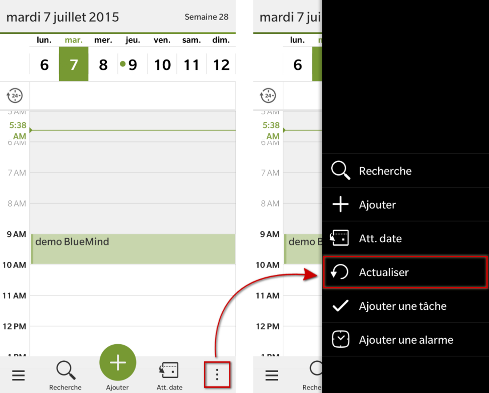

# Synchronisation avec Blackberry

:::info

La possibilité de connecter un smartphone au serveur BlueMind dépend de la politique d'autorisation définie par les administrateurs. Assurez-vous auprès d'eux que vous êtes bien autorisé à vous connecter avec un smartphone. En particulier, certaines configurations nécessitent une autorisation manuelle d'un administrateur.

Se référer à cette page : [Configuration du serveur EAS](../../Guide_de_l_administrateur/BlueMind_et_mobilité/Configuration_du_serveur_EAS.md).

:::

## Présentation

La synchronisation ActiveSync est le mode de synchronisation à privilégier car il permet en une seule configuration de synchroniser les messages ainsi que les contacts et agendas alors que la [synchronisation IMAP](./Synchronisation_IMAP_du_Blackberry.md) ne permet d'accéder qu'à ses emails.

Pour en savoir plus, consulter la page [Synchronisation des périphériques externes](./Configuration_des_peripheriques_mobiles.md).

:::info

Ce guide a été réalisé sous Blackberry 10 OS, selon la version utilisée les opérations sont les mêmes même si les écrans peuvent différer sensiblement.

:::

## BlackBerry supportés

Seuls les périphériques équipés de BlackBerry OS 10 (Q5, Q10) sont supportés.

## Configuration du compte ActiveSync

### Création du compte

Dans les paramètres systèmes, se rendre dans «Comptes» :

Ajouter un compte "Messagerie électronique, calendrier et contacts" :

Choisir un type de compte Microsoft&lt;sup>®&lt;/sup> Exchange ActiveSync :

Renseigner les informations de compte et serveur :

Sauf cas particulier :

- le login est identique à votre adresse e-mail
- le domaine est votre domaine de messagerie : *bluemind.loc* dans cet exemple
- l'adresse du serveur (*mail.bluemind.loc* dans cet exemple) est identique à l'adresse à laquelle vous accédez à BlueMind (en enlevant https://). Par exemple, si vous accédez à BlueMind depuis votre navigateur à l'adresse **https://bm.domaine.com** alors vous devez saisir bm.domaine.com

### Choix des éléments à synchroniser

Sur l'écran suivant,activer ou désactiver les éléments à synchroniser :

Cliquer enfin sur «Terminé»

:::info

Seuls les carnets d'adresses personnels sont synchronisés avec les contacts du smartphone, cependant les adresses des autres carnets (Annuaire, Contacts collectés...) sont accessibles via les fonctions de recherche du smartphone (contacts, e-mails...)

:::

### Fin de la création

Le système enregistre votre configuration et votre compte apparaît :

Vous pouvez dès lors consulter vos emails et votre calendrier sur votre Blackberry !

## Forcer le rafraichissement de l'agenda

Afin de forcer la synchronisation de l'agenda, depuis l'application Calendrier faire apparaître le menu en bas à droite et appuyer sur «Actualiser» :

