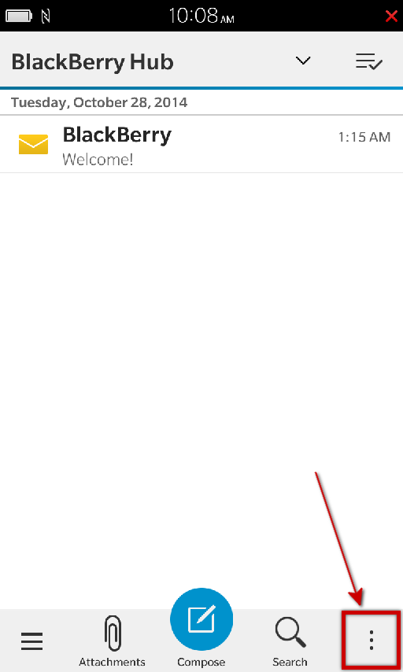
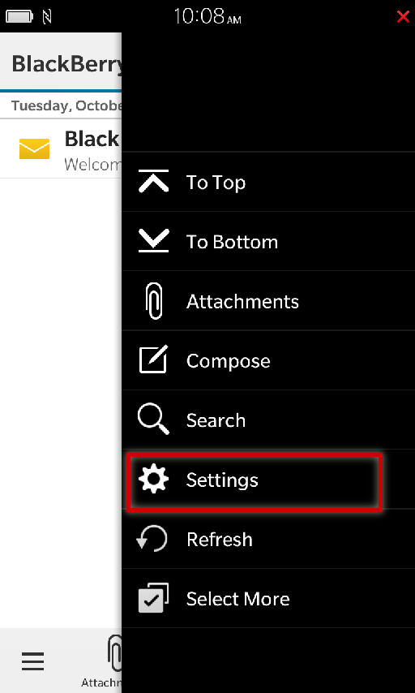
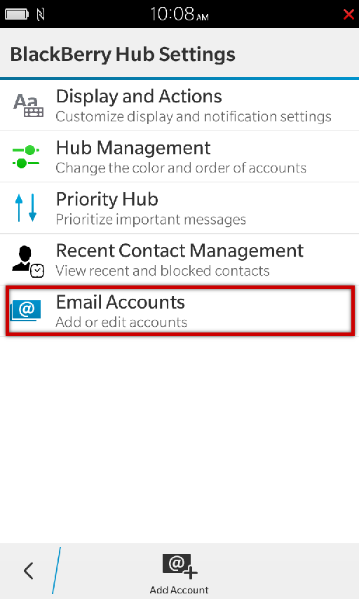
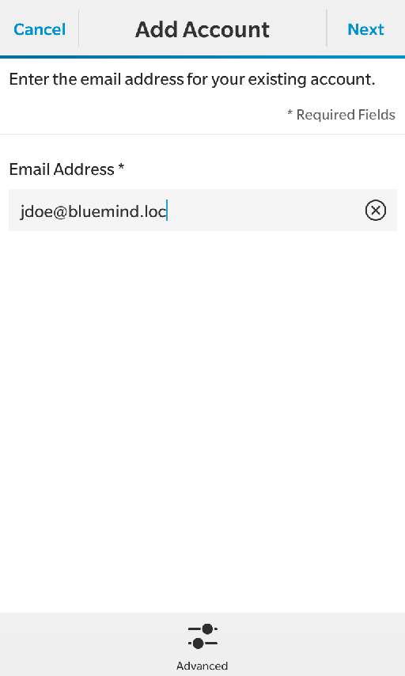
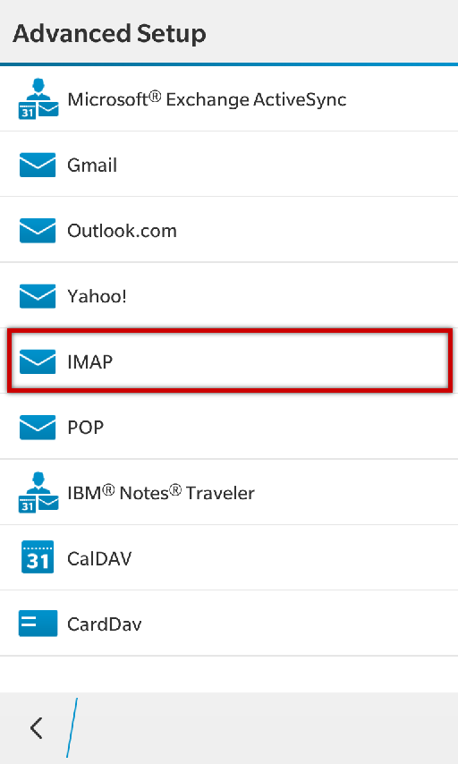
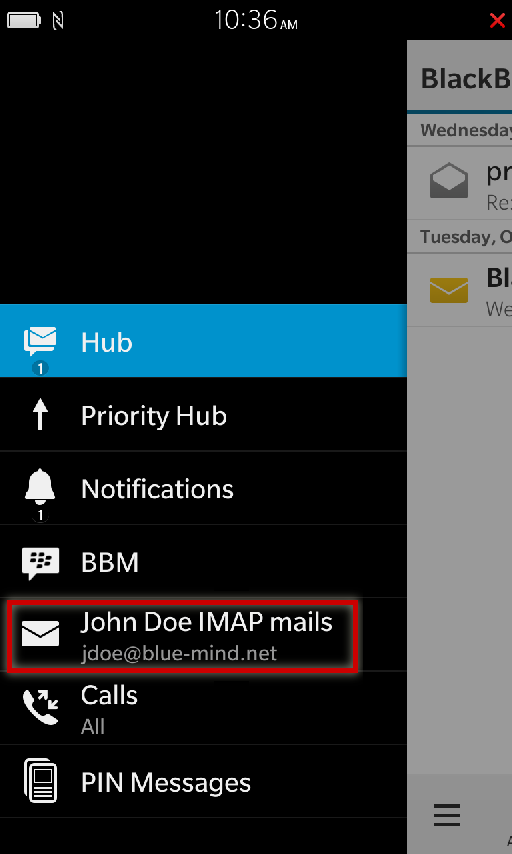
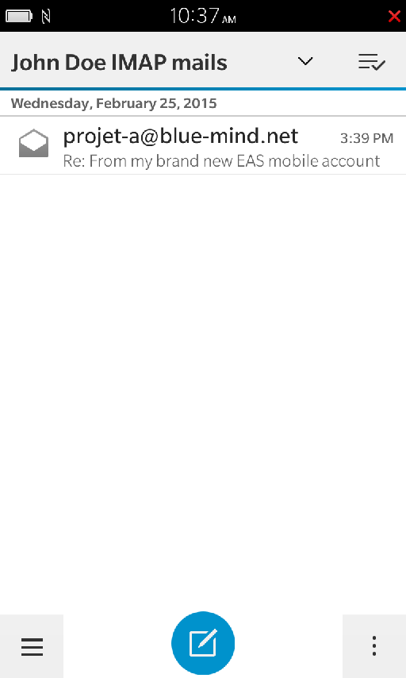

# Synchronisation IMAP du Blackberry

:::info

Ce guide a été réalisé sous Blackberry 10 OS, selon la version utilisée les opérations sont les mêmes même si les écrans peuvent différer sensiblement.

:::

## Configuration du compte courrier

La synchronisation du courrier dans Blackberry se fait dans le Blackberry Hub.
Depuis cette application, ouvrir le menu :

Se rendre dans les réglages («Settings») :

Se rendre dans la configuration des comptes courrier («Email Accounts») :

Ajouter un nouveau compte («Add account») :

Choisir d'ajouter un compte de type «Email, Calendar and Contacts» ("Messages, calendrier et contacts") :

Saisir l'adresse de messagerie de l'utilisateur et appuyer sur «Next» ("Suivant") :

Choisir comme type de compte IMAP :

L'écran suivant permet de saisir les paramètres de connexion aux serveurs entrant et sortant ainsi que de configurer les options de synchronisation, faire défiler vers le haut pour accéder aux champs :

Dans la première partie de l'écran :

- «Description» et «Your Name» ("Votre Nom") sont libres, il s'agit des informations qui seront affichées sur l'appareil ou dans les messages sortant.
- «Username» ("Nom d'utilisateur") est, sauf cas particulier, identique à l'adresse de messagerie **complète**, incluant donc le nom de domaine

La section suivante permet de paramétrer le serveur entrant :

- l'adresse du serveur (*mail.bluemind.loc* dans cet exemple) est identique à l'adresse à laquelle vous accédez à BlueMind (en enlevant https://). Par exemple, si vous accédez à BlueMind depuis votre navigateur à l'adresse **[https://bm.domaine.com](https://bm.domaine.com)** alors vous devez saisir [bm.domaine.com](http://bm.domaine.com)
- le type de sécurité peut être SSL ou TLS, selon la configuration (voir plus bas, encadré *"Ports et sécurité"*)

La section suivante permet de paramétrer le serveur sortant (SMTP), permettant l'envoi des messages. Sauf cas particulier les informations de connexion et d'adresse sont les mêmes que pour le serveur entrant, seul le numéro de port change.

La section suivante, permet de paramétrer les options principales du compte :

- «Use push if supported» : "Utiliser le *push* s'il est supporté" : active les notifications *push* du serveur lors de l'arrivée de nouveaux messages.Avec cette option ce n'est plus le téléphone qui interroge régulièrement le serveur pour savoir si de nouveaux messages sont arrivés mais le serveur qui informe le téléphone dès qu'un message arrive.
- «Append messages to send folder» : "copier les messages dans le dossier 'envoyé'" : place une copie du message dans le dossier des messages envoyés.Attention, cette option consommera de l'espace sur le téléphone et le serveur mais aussi des données mobiles lors de la copie vers le serveur.
- «Sync interval» : intervalle de synchronisation
- «Sync timeframe» : nombre de jours à synchroniser

La dernière partie, enfin, permet de paramétrer le comportement selon le type de réseau auquel l'appareil est connecté :

- «Roaming» : "Itinérance" : lorsque l'utilisateur est connecté à un réseau mobile autre que celui de son opérateur, par exemple à un réseau partenaire lorsqu'il est à l'étranger. Cela engendre généralement un coût supplémentaire par rapport à une connexion habituelle.
- «Cellular» : "Cellulaire" : lorsque l'utilisateur est connecté au réseau mobile (Edge, 3G, 4G, etc.)
- «Wi-Fi»

Pour chaque type de connexion, il est possible de choisir de relever les messages entiers, les en-têtes seulement ou de limiter à une certaine taille.

:::info

Ports et sécurité

Les options présentées ci-dessus sont les informations par défaut. Les ports et méthodes de connexions peuvent varier, en cas de problème contactez votre administrateur qui vous indiquera les informations particulières à saisir.

IMAP (serveur entrant) :

- 143: TLS possible
- 993: SSL

SMTP (serveur sortant) :

- 25: TLS possible mais pas obligatoire
    - sans authentification: envoi possible uniquement vers un des domaines BlueMind
    - avec authentification ou depuis une IP listée dans l'interface de l'administrateur dans Gestion du système > Configuration système > onglet Messagerie > champs 'Mes réseaux': envoi possible vers n'importe quel destinataire
- 465: SSL + authentification obligatoire - envoi possible vers n'importe quel destinataire
- 587: TLS + authentification obligatoire - envoi possible vers n'importe quel destinataire

:::

Appuyer sur «Done» ("Valider") en haut de l'écran une fois tous les paramètres saisis.

L'appareil vérifie les connexions aux serveurs et vous informe d'un éventuel problème de certificat. Appuyer sur «Continue» :

 

L'application renvoie alors à l'accueil du Hub présentant les messages de tous les comptes. Pour consulter uniquement ceux du nouveau compte, ouvrir le menu et sélectionner le compte créé :

