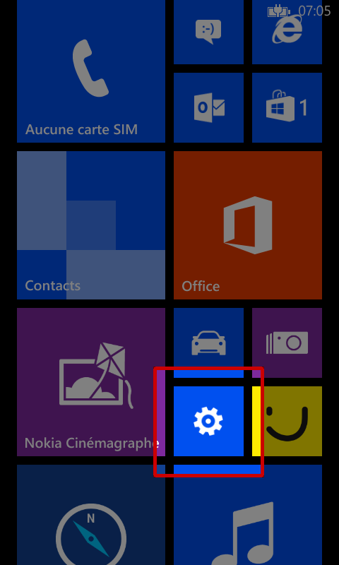
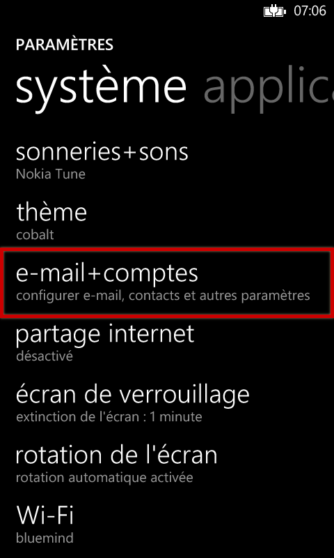
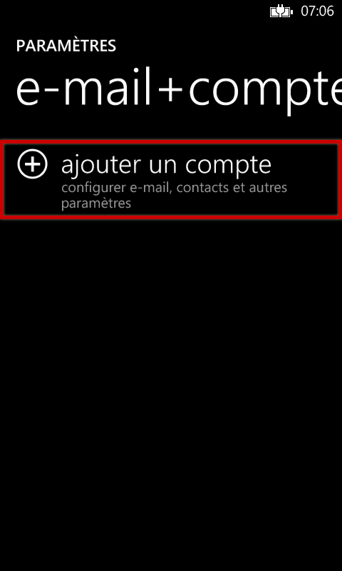
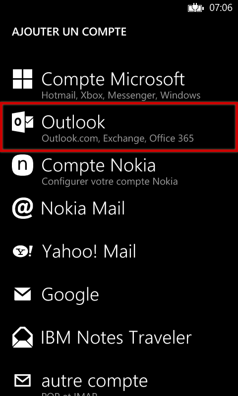
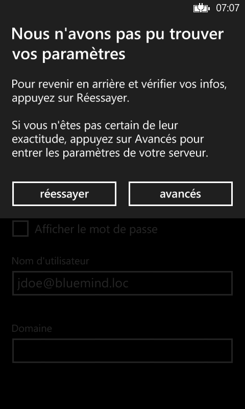
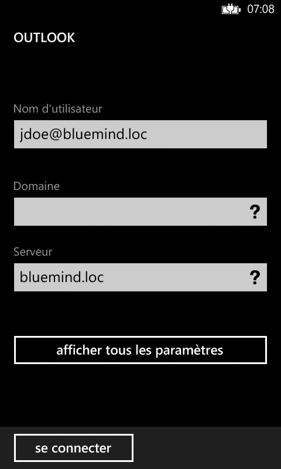
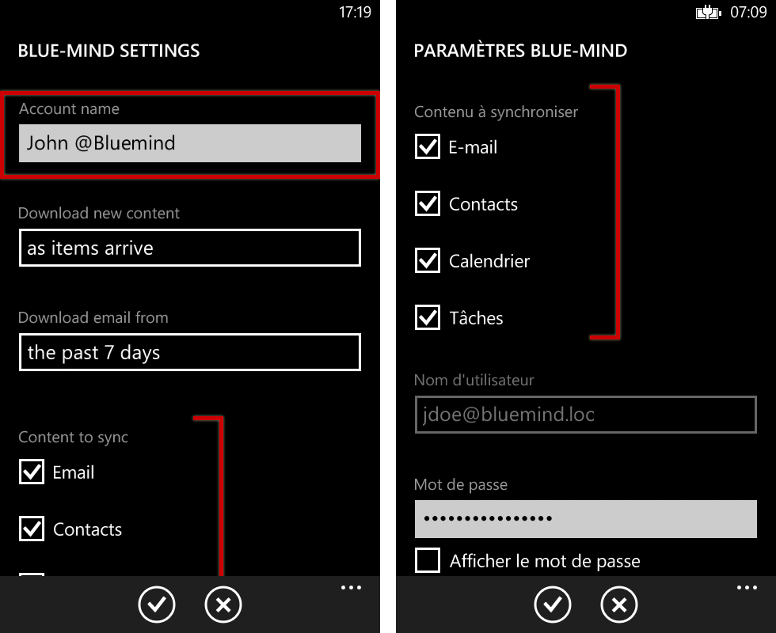
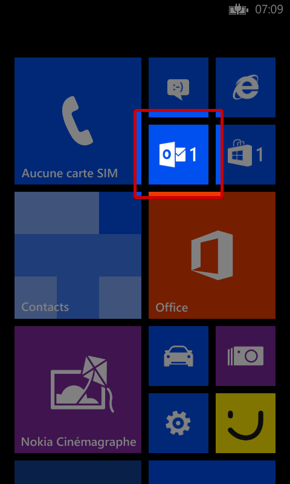
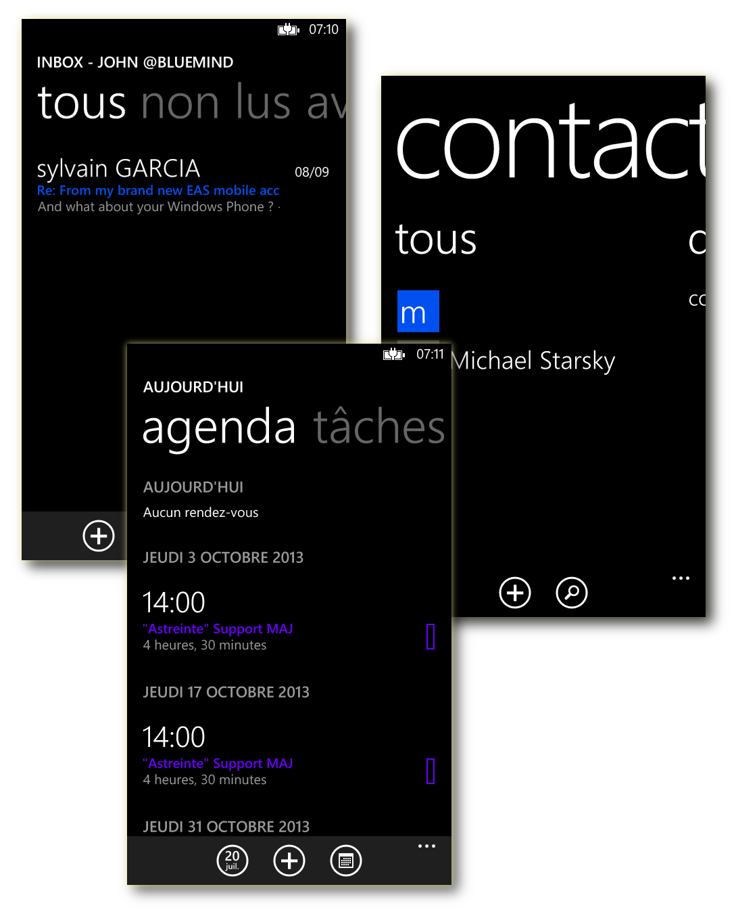
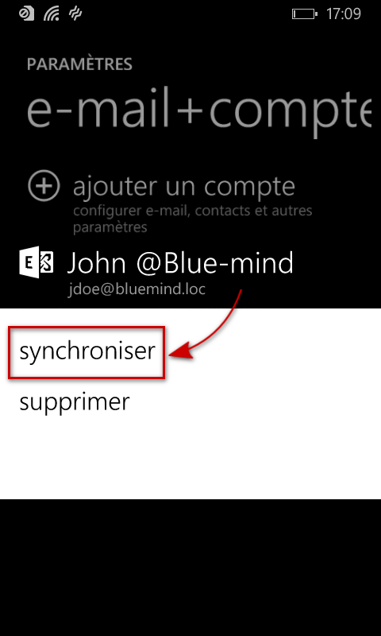

# Synchronisation avec Windows Phone

## Présentation

La synchronisation ActiveSync est le mode de synchronisation à privilégier car il permet en une seule configuration de synchroniser les messages ainsi que les contacts et agendas alors que la synchronisation IMAP ne permet d'accéder qu'à ses emails.

Pour en savoir plus, consulter la page [Synchronisation des périphériques externes](./Configuration_des_peripheriques_mobiles.md).

:::info

Ce guide a été réalisé avec un Nokia Lumia 520 sous Lumia Black (Windows Phone 8.0)

Pour les autres téléphones Windows Phone, les opérations sont les mêmes même si les écrans peuvent différer sensiblement.

:::

## Configuration du compte

:::info

La possibilité de connecter un smartphone au serveur BlueMind dépend de la politique d'autorisation définie par les administrateurs. Assurez-vous auprès d'eux que vous êtes bien autorisé à vous connecter avec un smartphone. En particulier, certaines configurations nécessitent une autorisation manuelle d'un administrateur.

Se référer à cette page : [Configuration du serveur EAS](../../Guide_de_l_administrateur/BlueMind_et_mobilité/Configuration_du_serveur_EAS.md).

:::

### Création du compte

Sur l'écran d'accueil ou depuis la liste des applications, se rendre dans les paramètres :

Puis choisir «e-mail+comptes» :

Choisir d'ajouter un nouveau compte :

Choisir un compte de type «Outlook» :

Saisir son adresse e-mail ainsi que son mot de passe puis taper «se connecter» :

Windows Phone teste alors des paramètres afin de se connecter automatiquement.

En cas d'échec, passer en mode avancé :

Corriger le nom d'utilisateur et le serveur :

Sauf cas particulier :

- le login est identique à votre adresse e-mail
- l'adresse du serveur (ici *bluemind.loc*) est identique à l'url d'accès à BlueMind (en enlevant https://). Par exemple, si vous accédez à BlueMind depuis votre navigateur à l'adresse [https://bm.bluemind.loc](https://bm.domaine.com) alors vous devez saisir **bm.bluemind.loc**

Une fois cela corrigé, la connexion doit s'établir ; Windows Phone effectue alors une première synchronisation et le compte apparaît dans les paramètres :

### Choix des éléments à synchroniser

Une fois le compte correctement créé, on peut dans les paramètres de celui-ci personnaliser le nom, choisir les éléments à synchroniser ainsi que leur fréquence (à l'arrivée des éléments, toutes les 30mn, 1h, etc.) ou étendue (les 7 derniers jours, le dernier mois, etc.) :

Dès lors, l'accès à la messagerie apparaît sur l'écran d'accueil avec une indication en cas de mail non lus :

Et l'ensemble des données du compte est synchronisé et accessible : messages, contacts, agenda :

## Forcer le rafraichissement de l'agenda

Afin de forcer la synchronisation de l'agenda :

- se rendre dans les Paramètres > «e-mail + comptes»
- faire un appui long sur le compte souhaité
- appuyer sur "Synchroniser" dans le menu qui apparait :

