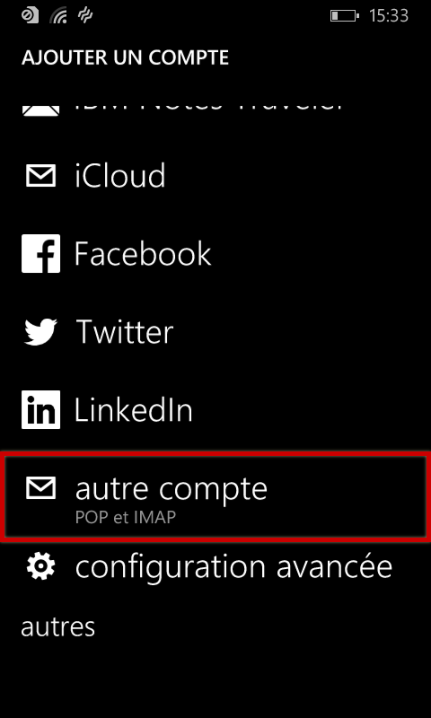
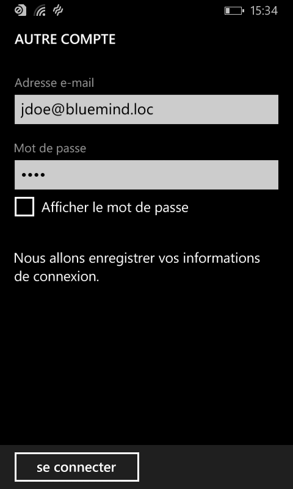
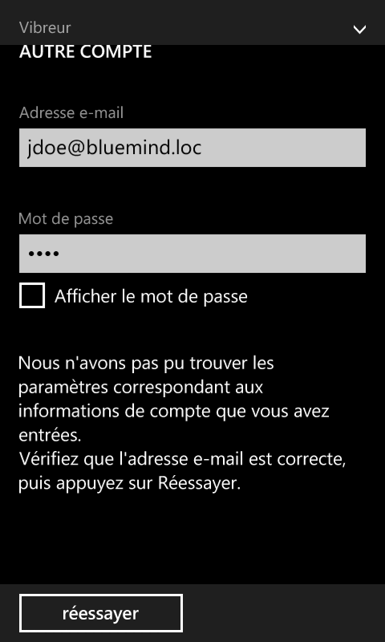
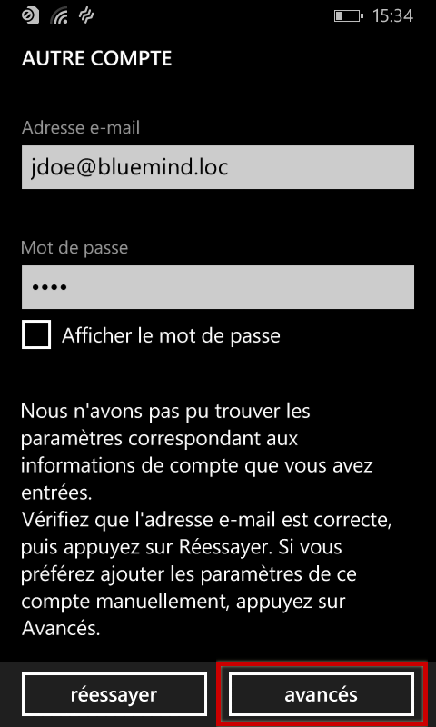
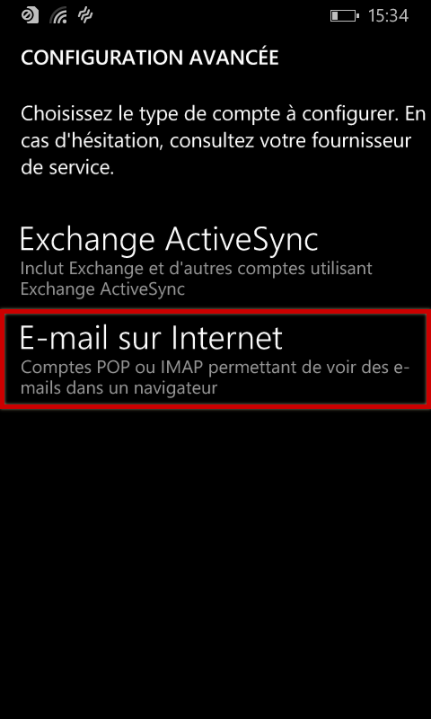
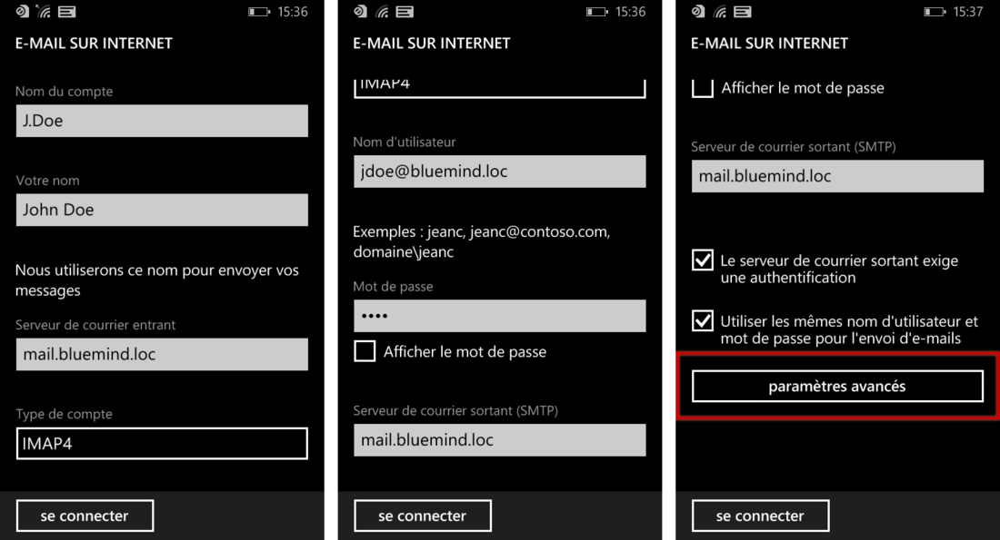
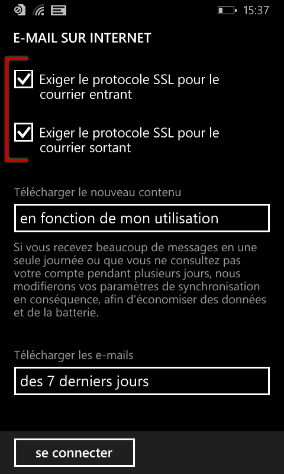
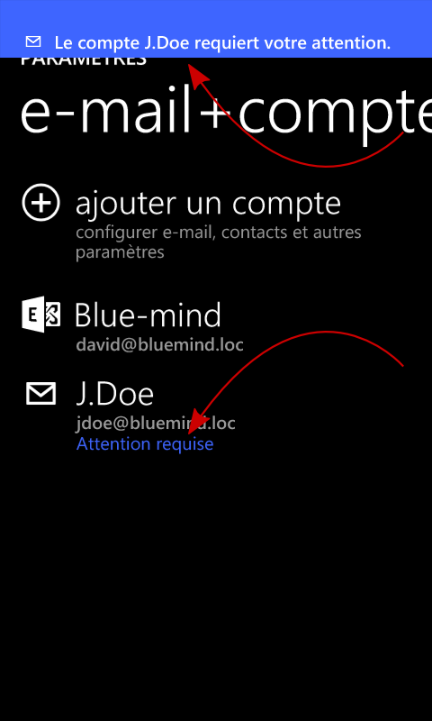
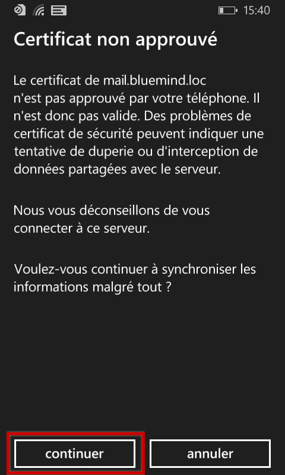
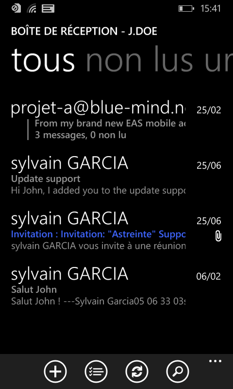

# Synchronisation IMAP sous Windows Phone

:::important

Ce guide a été réalisé avec un Nokia Lumia 520 sous Lumia Black (Windows Phone 8.0)

Pour les autres téléphones Windows Phone, les opérations sont les mêmes même si les écrans peuvent différer sensiblement.

:::

# Configuration du nouveau compte courrier

Sur l'écran d'accueil ou depuis la liste des applications, se rendre dans les paramètres :

Puis choisir «e-mail+comptes» :

Choisir d'ajouter un nouveau compte :

Faire défiler afin de choisir un compte de type «autre compte | Pop et IMAP» :

Saisir les informations de connexion au compte :

Le système vous informe qu'il n'a pas réussi à se connecter :

Taper sur «réessayer», la connexion échoue à nouveau mais un bouton pour accéder aux paramètres avancés apparaît :

Choisir une configuration «E-mail sur internet» :

Remplir les informations de connexion aux serveurs entrant et sortant :

Au bas du formulaire, taper sur «paramètres avancés» afin de faire apparaître de nouveaux champs de configuration.
Cocher les deux cases permettant d'activer le protocole SSL et choisir comme désiré la fréquence et la durée de synchronisation des messages :

La configuration est alors presque terminée.

De retour sur la page de gestion des comptes, un double message vous informe qu'une action est attendue :

Taper sur le nom du compte.

Un avertissement vous informe alors que le certificat du serveur doit être approuvé. Taper sur «Continuer» pour le valider :

L'avertissement disparaît de l'écran de gestion des comptes et les messages sont alors relevés et consultables dans l'application :

 

 

