# Gestion des tâches avec iOS

# Présentation

Vos tâches BlueMind peuvent être synchronisées et gérées sur votre appareil mobile Apple grâce à l'application « Rappels »
:::important

Ce guide a été réalisé avec un modèle d'IPad, les écrans sont généralement identiques sur tous les produits Apple mais peuvent varier suivant les versions.

:::

# Activation

Pour activer la synchronisation des tâches, se rendre dans les réglages > Mail, Contacts, Calendrier > choisir le compte concerné et activer les rappels :

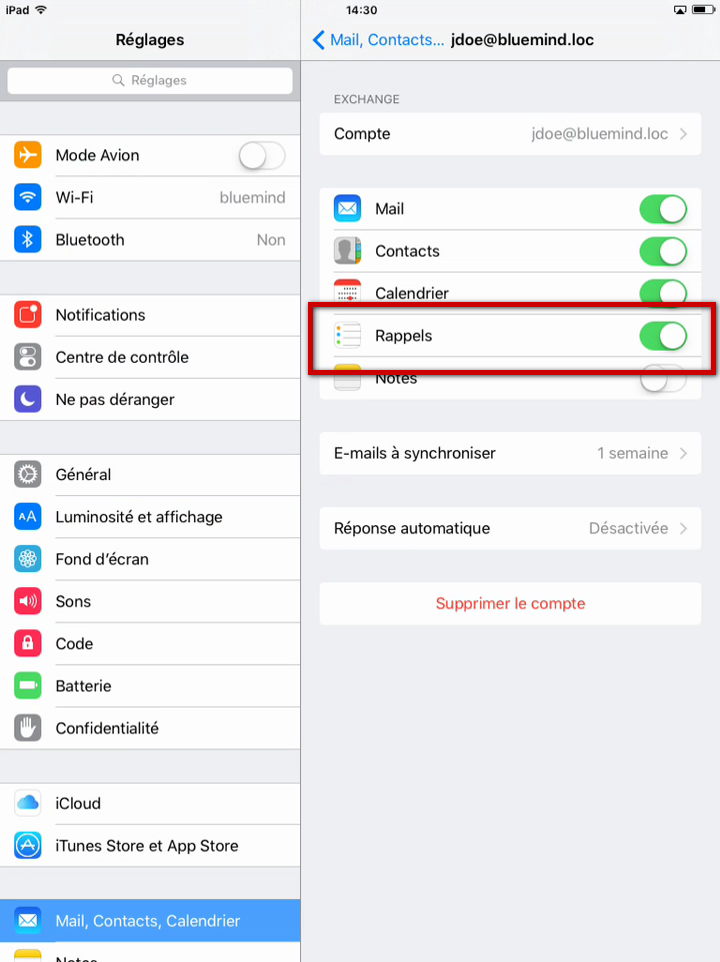

# Consulter ses tâches

Dès l'activation de la fonctionnalité, les tâches sont automatiquement synchronisées et visibles dans l'application.

Celle-ci se présente en 2 colonnes :

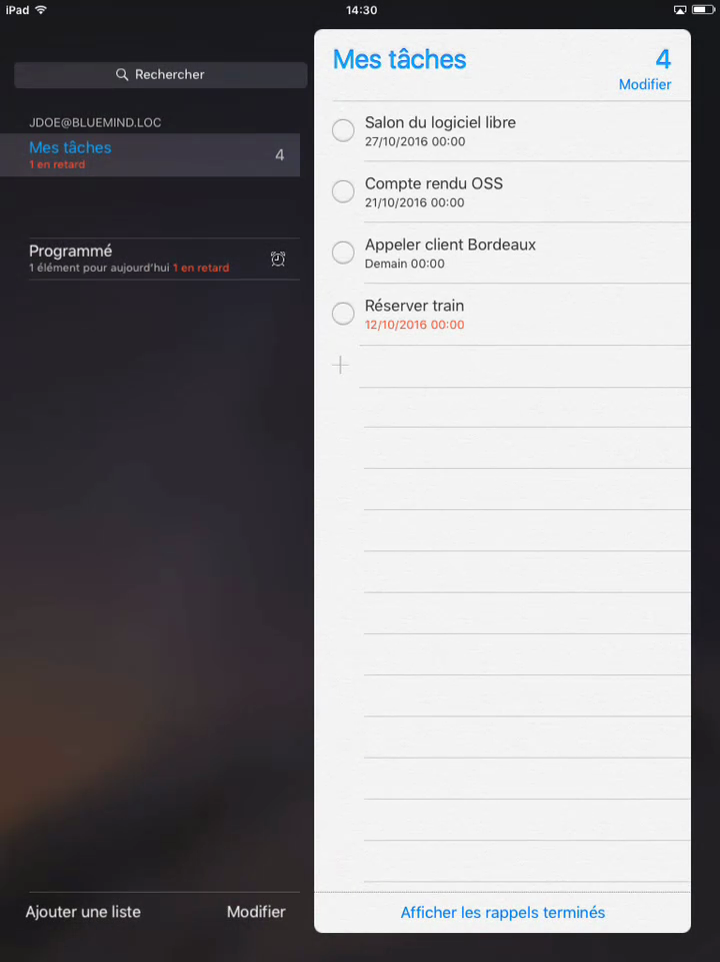

- la colonne de gauche propose les listes de tâches et accès aux fonctionnalités. De haut en bas :
  - le champs de recherche
  - listes de tâches de l'utilisateur
  - les tâches du jour ("Programmé")
  - actions sur les listes :ajouter, modifier
- la colonne de droite présente les tâches de la liste actuellement sélectionnée

# Actions sur les tâches

## Créer une tâche

Pour ajouter une nouvelle liste, taper sur la ligne 1ère ligne disponible précédée du signe '+' en bas de la liste des tâches :

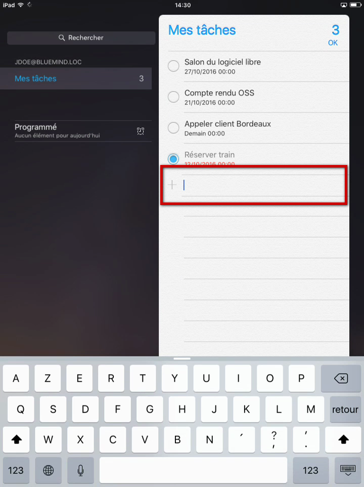

Saisir le nom de la tâche :

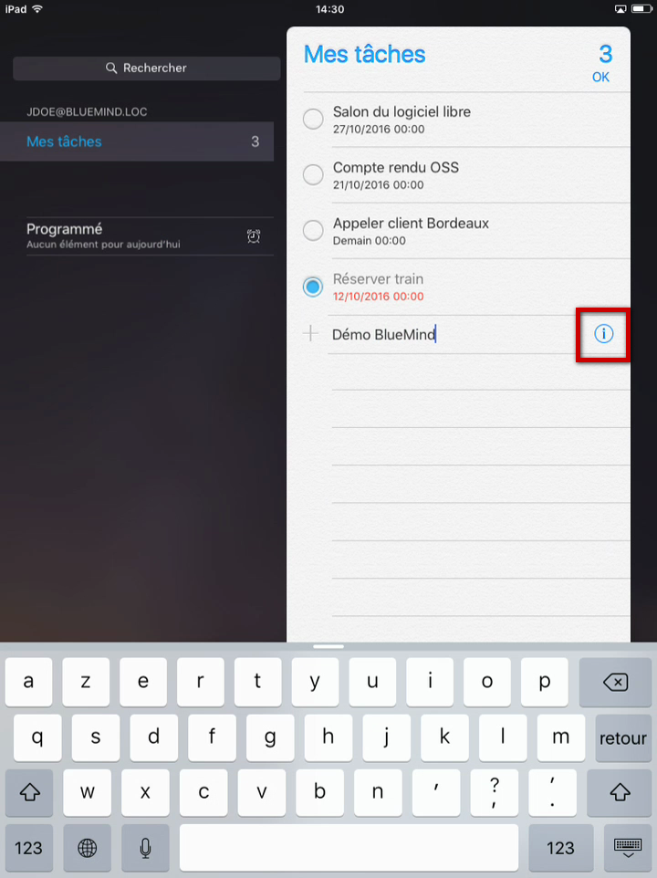

Taper sur l'icône  en fin de ligne pour accéder aux informations complémentaires :

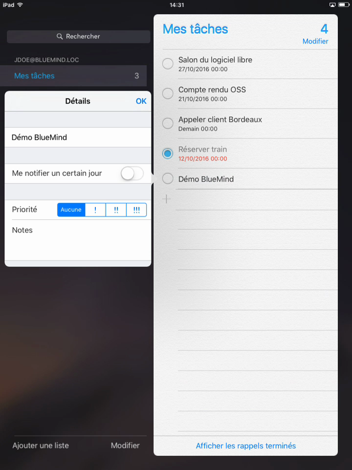

« Me notifier un certain jour » permet de définir la date d'échéance de la tâche :

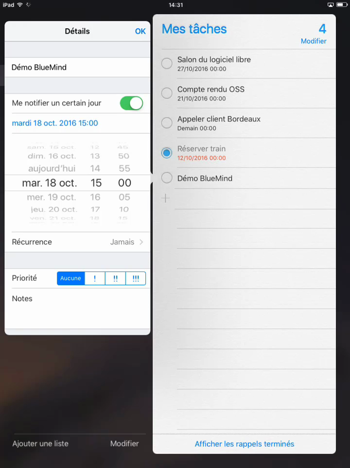

## Marquer comme terminée

Taper sur le bouton radio situé devant la tâche :

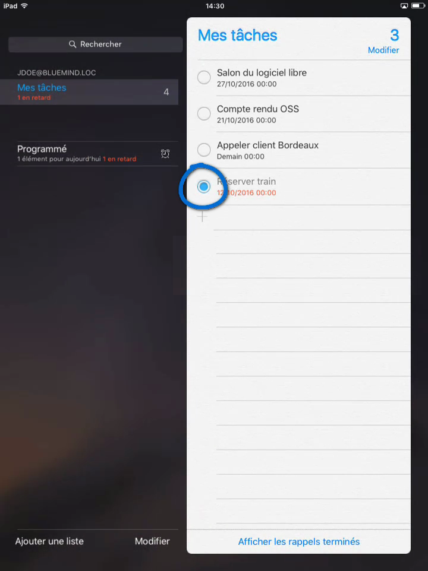

## Supprimer une tâche

Passer en mode modification en haut de la liste des tâches :

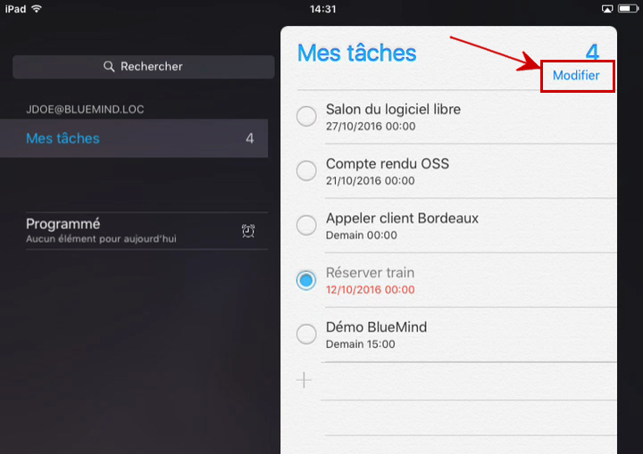

Un symbole "sens interdit" apparaît devant chaque tâche à la place du bouton de validation de la tâche :

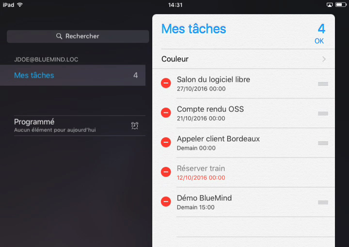

Faire glisser la tâche vers la gauche pour accéder aux boutons d'actions et taper sur "Supprimer" :

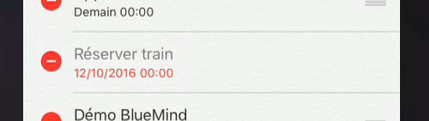

La tâche a disparu de la liste :

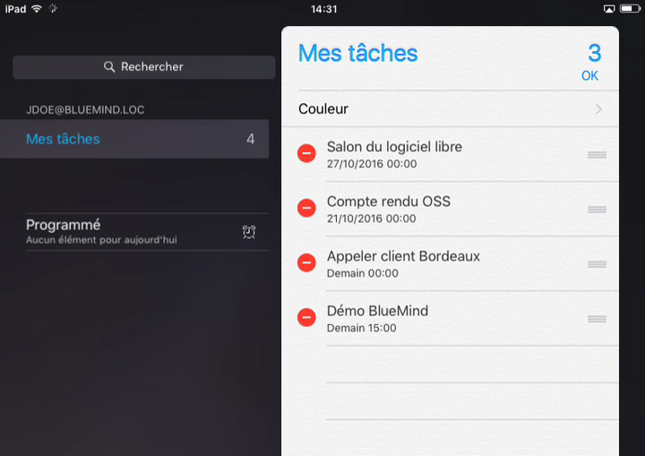

Taper sur "OK" en haut à droite pour valider les modifications et revenir au mode consultation.

# Créer une liste de tâches

Taper sur « Ajouter une liste » en bas à gauche de l'écran :

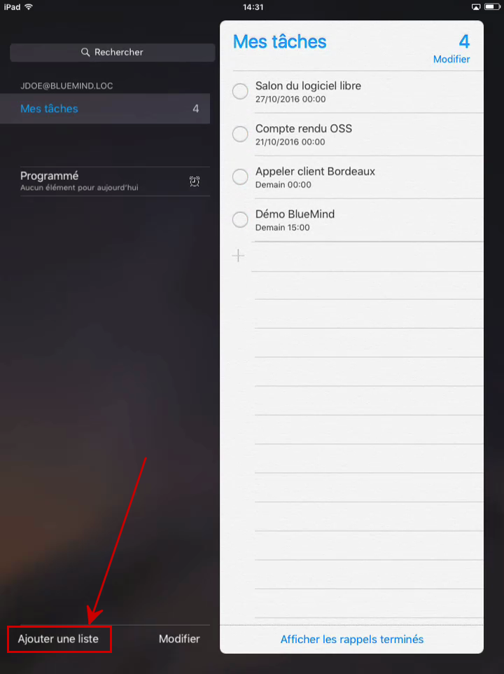

Entrer le nom de la liste et choisir une couleur personnalisée :

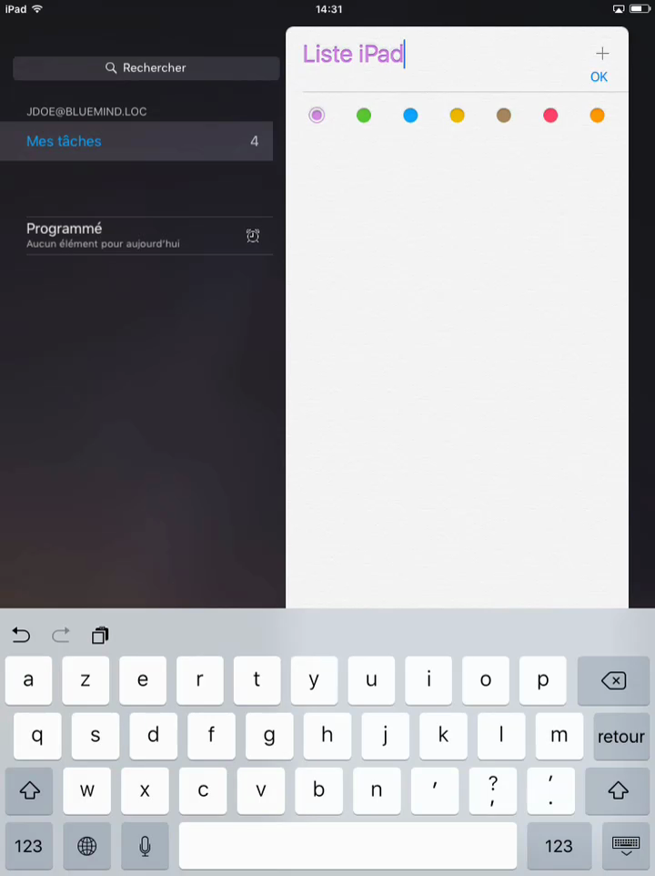

Taper sur &lt;OK> en haut à droite pour valider.

La liste est créer et sélectionnée, ajouter tout de suite des tâches si désiré :

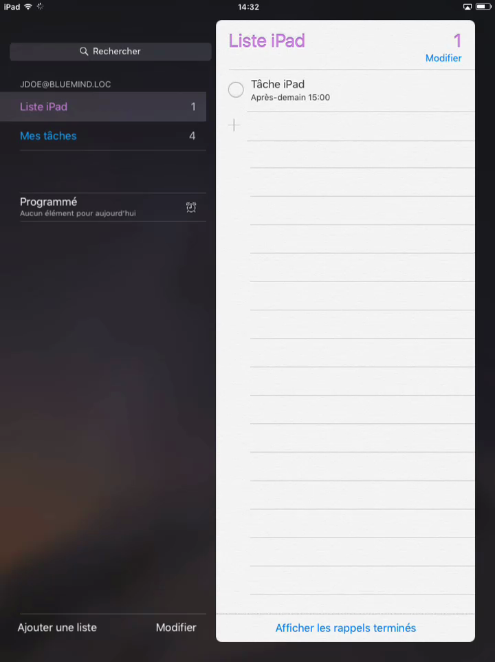

Les nouveautés sont immédiatement synchronisées et visibles dans BlueMind :

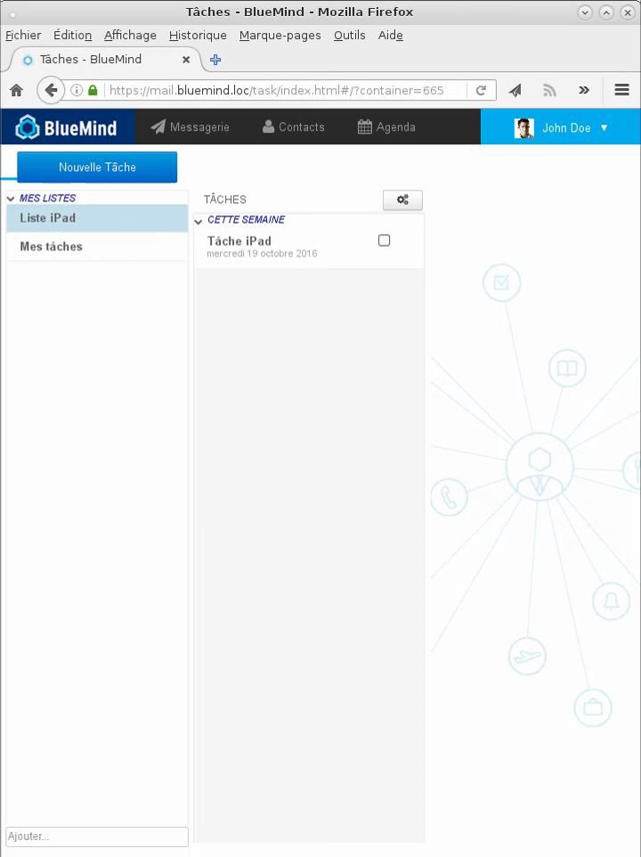

 

Enregistrer

Enregistrer

Enregistrer

Enregistrer

Enregistrer

