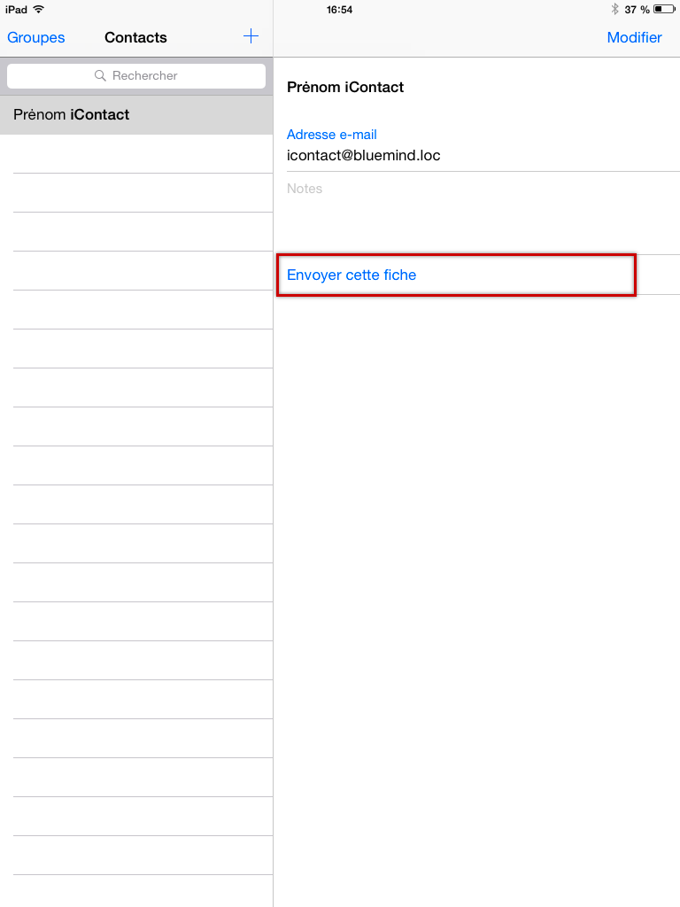
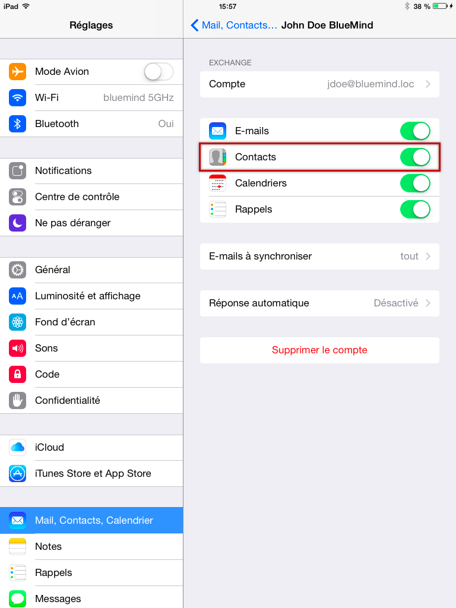
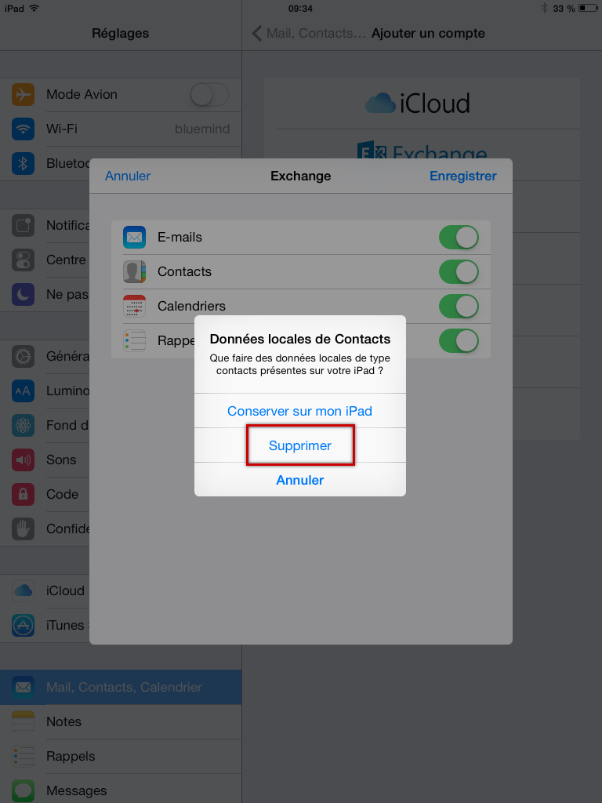

# Importer les contacts locaux dans BlueMind

## Présentation

Lors d'une migration, il se peut que vous disposiez déjà de contact sur votre périphérique IOS. Cette procédure explique comment intégrer vos anciens contacts IOS dans BlueMind afin d'en disposer sur la totalité de vos périphériques synchronisés ( smartphone, web, client lourd ).

:::info

Ce guide a été réalisé avec un modèle d'IPad, les écrans sont généralement identiques sur tous les produits Apple mais peuvent varier suivant les versions.

:::

## Procédure

:::info

Il est nécessaire de posséder un compte mail sur l'appareil afin de pouvoir envoyer les contacts à l'utilisateur BlueMind. Si l'utilisateur ne possède pas d'autre service de messagerie que BlueMind il peut créer son compte BlueMind soit de type EAS soit en créant un simple compte IMAP, cela n'aura pas d'impact négatif sur la procédure.

:::

1. il faut dans un premier temps réaliser un export des contacts présents sur le périphérique IOS au format vCard (fichier .vcf) :

    - IOS n'est pas capable seul de réaliser un export de la totalité du carnet d'adresse, il faut utiliser une application tierce, telle que [Backup Contacts + Share](https://itunes.apple.com/us/app/backup-contacts-+-share/id486537944?mt=8&ign-mpt=uo%3D4) disponible sur l'App Store par exemple.
Cette application permet de sauvegarder les contacts de votre choix dans un fichier et de le partager par e-mail. *(Pour en savoir plus, se reporter au site de l'éditeur)*

:::info

Si vous procédez à un export après création du compte EAS BlueMind, n'exporter que les contacts du carnet d'adresse local, sans quoi tous les contacts BlueMind se retrouveraient en doublon.

:::
Une fois le fichier généré, l'envoyer par e-mail à l'adresse de l'utilisateur.

    - Si l'on ne souhaite pas utiliser d'application tierce, ou si l'on ne souhaite pas exporter la totalité des contacts, il est possible de réaliser l'export de chaque contact individuellement.Depuis l'application Contacts, sur chaque fiche de contact à exporter appuyer sur «Envoyer cette fiche» puis «Envoyer par e-mail». Un fichier .vcf est alors joint à un nouveau message qu'il faut envoyer à l'adresse de l'utilisateur.
1. Se connecter depuis un navigateur à BlueMind
2. Ouvrir le ou les messages contenant les fichiers à importer et enregistrer ces fichiers sur l'ordinateur
3. Se rendre dans l'application Contacts et procéder à [l'import du fichier](./../../Les_contacts/Importer_et_exporter_des_contacts.md)
4. S'il n'existe pas encore, [créer le compte utilisateur](index.md) concerné sur le périphérique IOS
5. S'assurer que la synchronisation des contacts est bien activée : 
    - En fin de création lors du choix des éléments à synchroniser (voir lien ci-dessus sur la création d'un utilisateur)
    - Si le compte existe déjà, en se rendant dans les réglages puis en sélectionnant le compte :
6. Afin d'éviter les doublons par la suite, choisir de supprimer les contacts de l'appareil lorsque celui-ci le propose à l'activation de la synchronisation :

:::tip

Dans certains cas, il se peut que l'appareil ne propose pas de supprimer les données locales. Il faut alors se rendre dans l'application Contacts et supprimer les contacts manuellement.

:::

7. Se rendre dans l'application Contacts : les contacts de BlueMind apparaissent, contenant à présent les contacts qui étaient auparavant sur l'appareil seulement.
