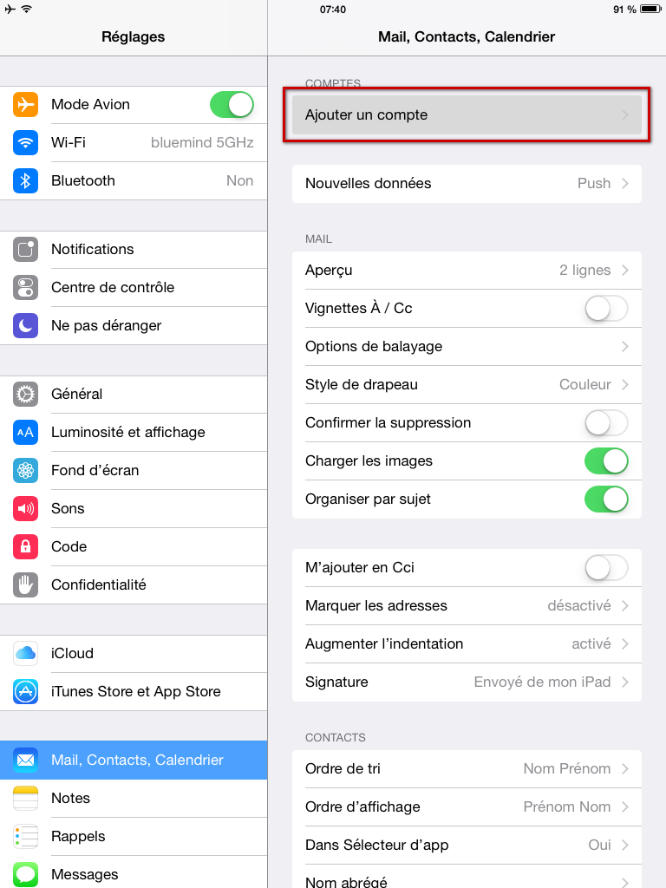
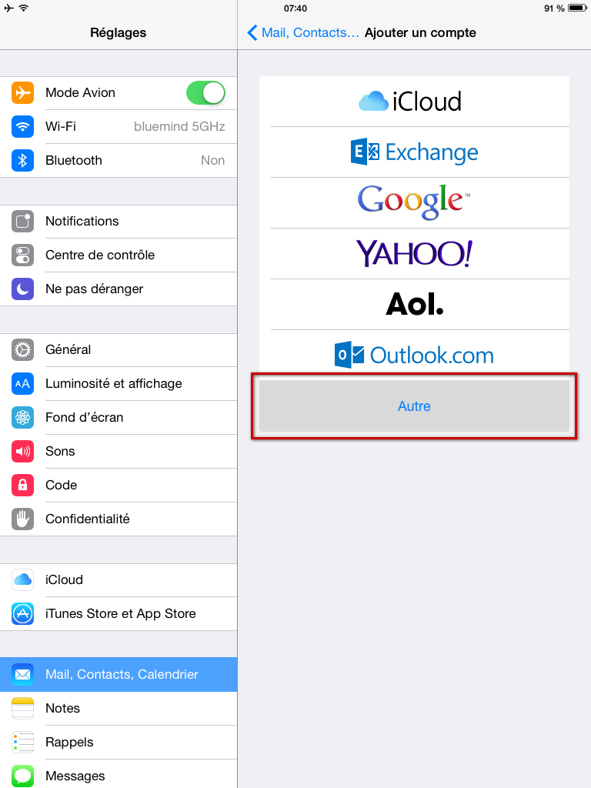
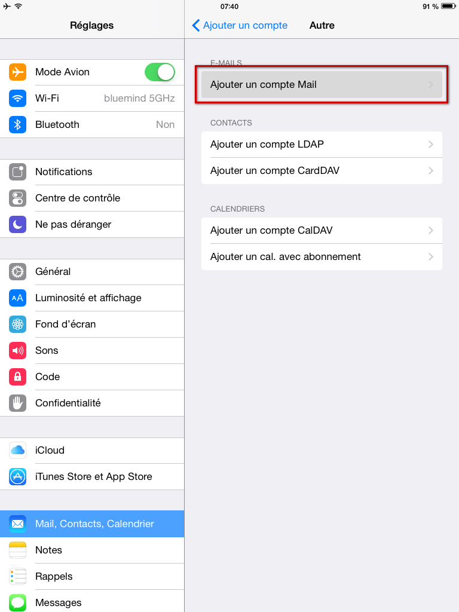
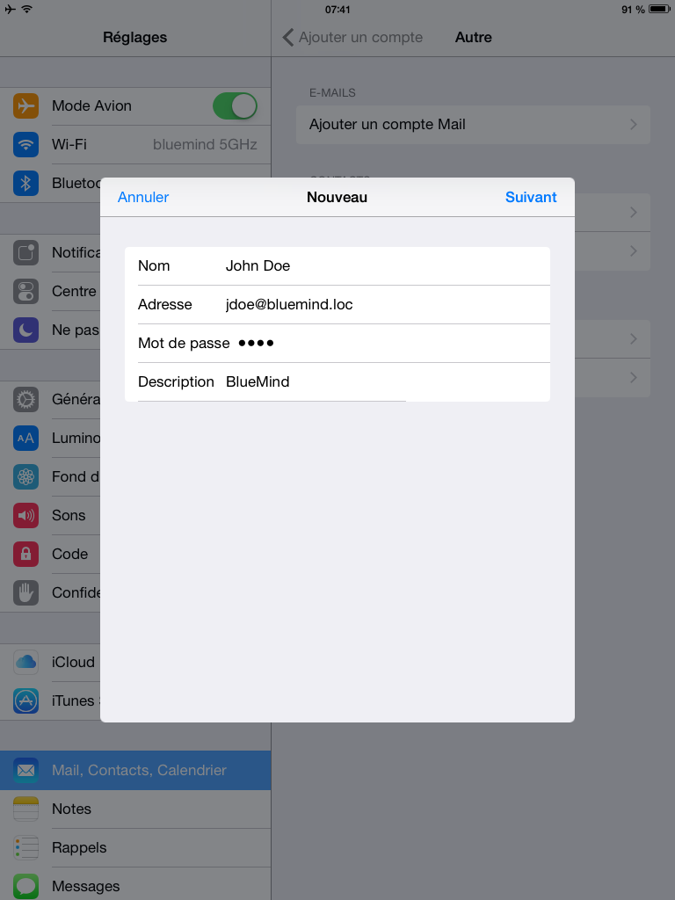
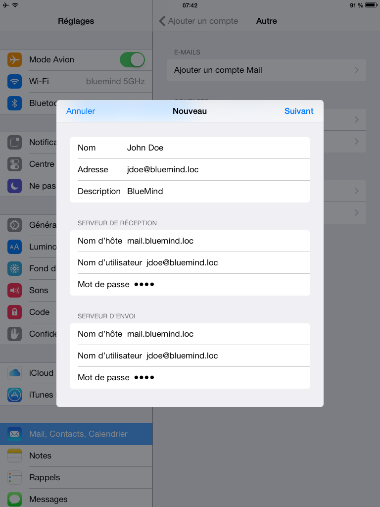
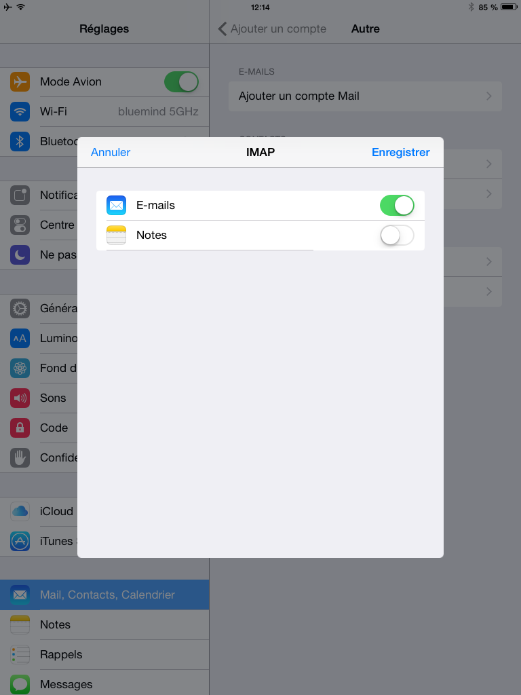

# Synchronisation IMAP avec iOS

:::info

Ce guide a été réalisé avec un modèle d'IPad, les écrans sont généralement identiques sur tous les produits Apple mais sur un iPhone le menu situé à gauche sera masqué à cause de la largeur de l'écran inférieure.

:::

## Configuration du nouveau compte courrier

Se rendre dans les réglages puis menu «Mail, Contacts, Calendrier» et appuyer sur «Ajouter un compte» :

Choisir un type de compte «Autre» :

Choisir «Ajouter un compte Mail» :

Saisir les informations principales du compte :

Vérifier et corriger si besoin les informations de connexion :

Sauf cas particulier :

- le nom d'utilisateur est identique à votre adresse e-mail
- le nom d'hôte (ici *mail.bluemind.loc*) est identique à l'url d'accès à BlueMind (en enlevant https://). Par exemple, si vous accédez à BlueMind depuis votre navigateur à l'adresse https://mail.bluemind.loc alors vous devez saisir **mail.blumind.loc**

Choisir de ne synchroniser que les messages, la synchronisation des notes n'étant pas proposée par BlueMind :

