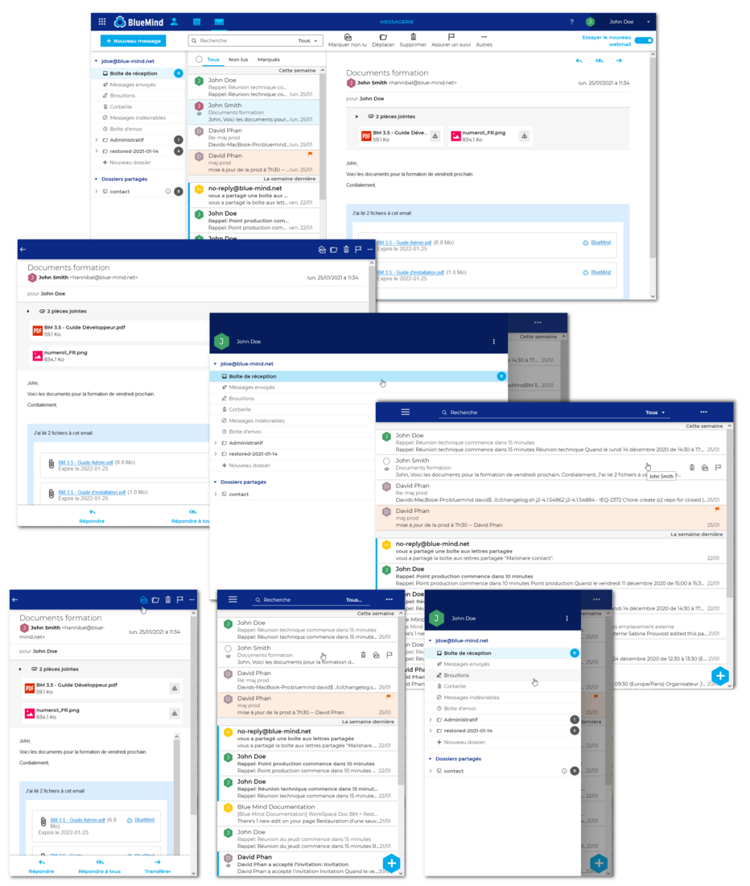
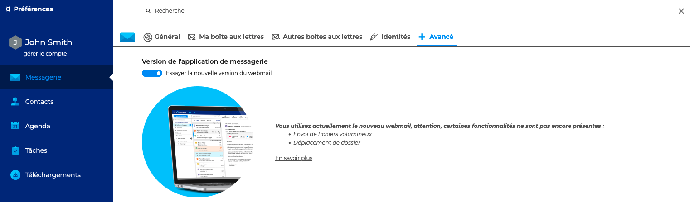
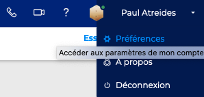

# Découvrir la solution BlueMind

## Découvrir l'interface

BlueMind a développé un tout **nouveau webmail** basé sur les technologies web proposées par les navigateurs récents : Web App Javascript, elle offre une **ergonomie repensée et intuitive**, avec les 3 volets adaptés aux écrans larges. Elle permet surtout un **fonctionnement plus rapide et fluide** grâce à l'utilisation du stockage local du navigateur.

Cette application, encore en beta, ne couvre pas encore le périmètre complet de l'ancien webmail. Elle est toutefois fonctionnelle. Vous pouvez bien sûr passer de la nouvelle web app à l'ancien webmail en conservant toutes vos données. Les fonctionnalités de cette application web vont s'enrichir progressivement pour offrir les mêmes fonctionnalités que l'ancien webmail.

Nous vous invitons donc à la tester et l'expérimenter dès maintenant ! Nous vous conseillons tout de même d'être vigilants car des dysfonctionnements peuvent malgré tout survenir dans cette version beta.

Nous attendons vos retours avec impatience !

## Accéder à la nouvelle interface

Pour accéder à la nouvelle interface de la solution BlueMind, **activer le commutateur** en haut à droite :

:::tip

Si le commutateur n'apparait pas, veuillez contacter l'administrateur afin d'obtenir les droits.

:::

L'utilisateur a aussi la possibilité de basculer **depuis ses paramètres**, rubrique messagerie :

:::tip

Pour **revenir à l'ancienne version**, désactiver le commutateur en haut à droite ou dans les [préférences](/Guide_de_l_utilisateur/Paramétrer_le_compte_utilisateur/) : aller dans **Préférence - Messagerie - + Avancé**

:::

## Accéder aux applications et paramètres

**La navigation** se fait grâce au bandeau principal en haut de l'interface.

La partie gauche du bandeau permet un accès direct aux applications [Messagerie](/Guide_de_l_utilisateur/La_messagerie/), [Contacts](/Guide_de_l_utilisateur/Les_contacts/), [Agenda](/Guide_de_l_utilisateur/L_agenda/) et [Tâches](/Guide_de_l_utilisateur/Les_tâches/). 
L'accès à la téléphonie, la [Visioconférence](/Guide_de_l_utilisateur/La_visioconférence/), l'aide en ligne et le [paramétrage du compte](/Guide_de_l_utilisateur/Paramétrer_le_compte_utilisateur/) est à droite du bandeau.

Pour connaître la **version** installée de BlueMind, aller sur **À propos** pour ouvrir le panneau d'informations

:::tip

Application par défaut

Par défaut, l'interface s'ouvre sur la messagerie mais peut également s'ouvrir sur l'agenda. Pour cela, aller dans les [paramètres du compte](/Guide_de_l_utilisateur/Paramétrer_le_compte_utilisateur/) : **Préférences - Général - Application par défaut**

:::

## Utiliser le moteur de recherche

La solution BlueMind est dotée d'un **nouveau moteur de recherche performant**, permettant d'effectuer des **recherches full-text** dans les messages, les contacts ou les évènements.

La recherche dans BlueMind :

- se fait l'ensemble des mots contenus dans **messages**, les fiches des **contacts** ou des **évènements**, y compris les [catégories](/Guide_de_l_utilisateur/Paramétrer_le_compte_utilisateur/#créer-des-catégories)
- se fait sur des mots exacts : le mot "invitation" sera recherché au singulier
- ne tient pas compte des accents : "réservation" ou "reservation" donnera les mêmes résultats

Il est possible d'utiliser le caractère * afin de remplacer une partie de mot dans une recherche. Par exemple :

- invit* : recherchera les mots commençant par invit et trouvera par exemple "invité" ou "invitation"
- inv*ion : recherchera les mots commençant par "in" et finissant par "ion" tels que "invitation" ou "invention".

Attention : les temps de réponse lors de recherches avec le caractère "*" sont sensiblement plus longs qu'une recherche simple.

