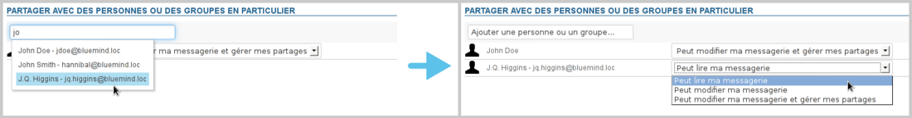

# Gestion des partages

La gestion des partages se fait au moyen d'un formulaire commun à tous les types de partages (boites partagées, agendas utilisateurs, agendas de ressources, etc.)

# Ajouter un utilisateur

Pour ajouter un utilisateur (personne ou groupe) :

- Commencer à saisir son nom ou une partie de son nom dans le champs "Ajouter une personne ou un groupe..."L'autocomplétion propose au fur et à mesure de la saisie une liste d'utilisateurs présents dans l'annuaire dans laquelle il suffit de choisir l'utilisateur souhaité. Il est alors ajouté à la liste :
- Sélectionner les droits désirés.
- Répéter l'opération pour tous les utilisateurs auquels vous souhaitez attribuer des droits.
- **Une fois tous les droits positionnés, enregistrer la liste avec le bouton "Enregistrer" en bas de page afin que les changements soient pris en compte.**

# Modifier les droits d'un utilisateur

- Dans la liste des utilisateurs désignés, positionner la liste déroulante sur le nouveau droit.
- Répéter l'opération pour tous les utilisateurs souhaités.
- **Une fois tous les utilisateurs positionnés, enregistrer la liste avec le bouton "Enregistrer" en bas de page afin que les changements soient pris en compte.**

# Supprimer les droits d'un utilisateur

- Dans la liste des utilisateurs désignés, cliquer sur l'icône de suppression en fin de ligne :
- Répéter l'opération pour tous les utilisateurs souhaités.
- **Une fois tous les utilisateurs positionnés, enregistrer la liste avec le bouton "Enregistrer" en bas de page afin que les changements soient pris en compte.**

