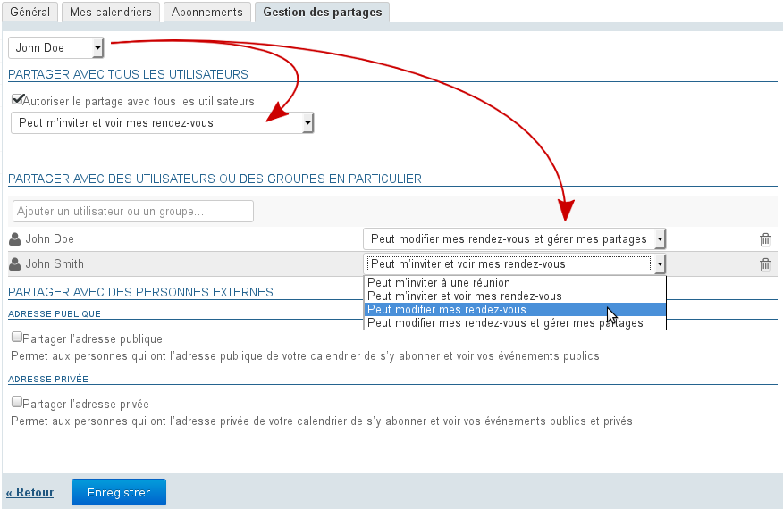
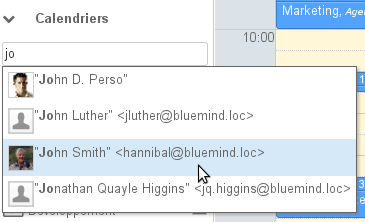
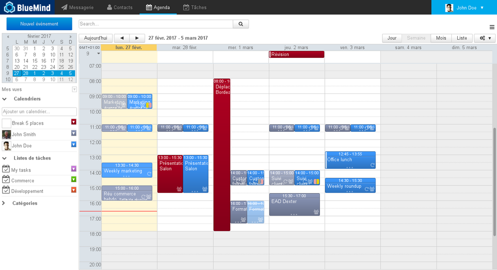
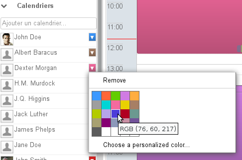
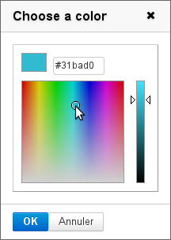
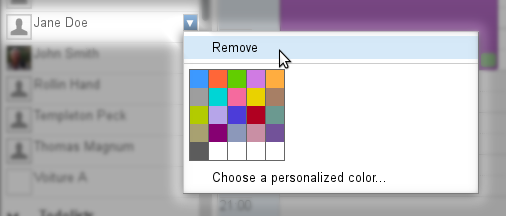
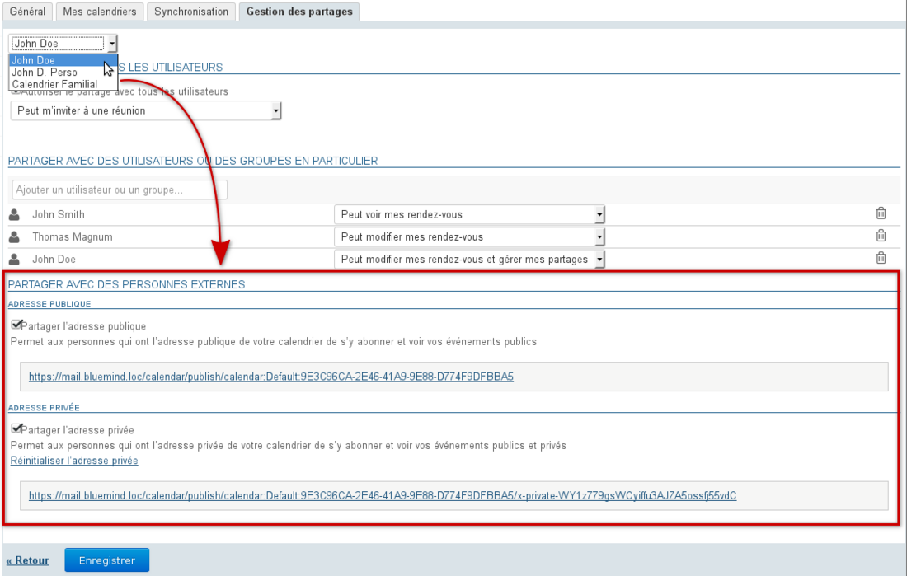

# Le partage d'agenda

# Présentation

À partir de BlueMind 3.5, un utilisateur peut posséder plusieurs agendas dont il peut gérer les partages : agenda principal BlueMind, agenda secondaire, agenda (d'utilisateur ou de domaine) dont il a lui-même reçu les droits d'administration ou encore agenda externe synchronisé.

Ainsi, pour chacun de ces agendas, l'utilisateur peut le garder privé ou le partager avec d'autres utilisateurs ou membres de groupes en donnant différents niveaux d'accès.

# Partager et déléguer

Les droits peuvent être délégués à l'ensemble des utilisateurs du domaine (partage public) ou à certains utilisateurs seulement.

Les droits possibles sont :

- « **Peut m'inviter à un rendez-vous** » : ne peut pas voir les rendez-vous de l'utilisateur mais peut tout de même l'inviter. Si ce droit minimum n'est pas accordé alors l'autocomplétion ne proposera pas le nom de l'utilisateur dans le formulaire d'ajout de participant à un rendez-vous.
- 
« **Peut m'inviter et voir mes rendez-vous** » : peut consulter l'agenda et inviter l'utilisateur. Les événements privés apparaîtront mais avec le libellé "privé" à la place du titre et sans détails autres que le jour, l'heure et la durée.

- 
« **Peut modifier mes rendez-vous** » : en plus du droit précédent, peut accepter et modifier les rendez-vous de l'utilisateur.

- 
« **Peut modifier mes rendez-vous et gérer mes partages »** : **il s'agit d'un partage complet de l'agenda** : en plus des droits précédents, peut lui-même donner des droits de partage sur l'agenda de l'utilisateur  **et voir ou éditer les détails des rendez-vous privés de l'utilisateur** .

Pour déléguer son agenda, se rendre dans la gestion des préférences utilisateur (« Mon compte ») > rubrique Agenda > onglet Gestion des partages :

1 
Sélectionner le calendrier souhaité.
:::important

Sont disponibles :

  - le calendrier par défaut de l'utilisateur
  - ses calendriers personnels visibles dans l'onglet "Mes calendriers" :
    - les calendriers personnels qu'il a créés dans BlueMind
    - les calendriers externes auxquels il est abonné
  - les carnets d'autres utilisateurs pour lesquels il a le droit de gestion des partages

:::
1 La section "Partager avec tous les utilisateurs" correspond au partage public du calendrier, ces droits seront appliqués à l'ensemble des utilisateurs du domaine :
  2 cocher la case "Autoriser le partage avec tous les utilisateurs"
  2 sélectionner le droit souhaité dans la liste déroulante
1 Pour accorder un partage à des utilisateurs ou groupes, se rendre à la section suivante "Partager avec des utilisateurs ou des groupes en particulier" :
  2 
rechercher l'utilisateur ou le groupe grâce au champs "Ajouter un utilisateur ou un groupe".
:::important

Il n'est pas possible de saisir une adresse email, seuls sont disponibles ici les utilisateurs et groupes de l'annuaire.
Pour un partage externe voir ci-après le chapitre [Partager vers l'extérieur](#Lepartaged'agenda-partage-exterieur)

:::

  2 valider en cliquant sur le nom proposé par l'autocomplétion ou par la touche &lt;Entrée>
  2 
sélectionner le droit souhaité dans la liste déroulante
:::important

Les calendriers de type "ICS externe" sont synchronisés en lecture seule, bien que le droit de modification soit présent dans la liste des droits, il ne pourra pas s'appliquer : les modifications ou créations qui pourraient être effectué par l'utilisateur désigné disparaîtront lors de la prochaine synchronisation.

:::

1 Répéter l'opération pour chaque utilisateur ou groupe
1 Une fois les droits positionnés comme souhaité, valider au moyen du bouton « ** Enregistrer ** »

Le tableau suivant indique les fonctionnalités qui seront accessibles aux utilisateurs en fonction des droits qui leur sont affectés sur le calendrier sélectionné ci-dessus :

      | Fonctionnalité\Droit accordé | Invitation | Invitation+Voir | Modifier | Modifier+Gérer |
| --- | --- | --- | --- | --- |
| Inviter |  |  |  |  |
| S'abonner au calendrier |  |  |  |  |
| Voir les rendez-vous publics |  |  |  |  |
| Voir les rendez-vous privés sans détails |  |  |  |  |
| Voir les détails des rendez-vous privés |  |  |  |  |
| Voir les alertes d'invitation en attente |  |  |  |  |
| Accepter/Refuser une invitation à un rdv public |  |  |  |  |
| Accepter/Refuser une invitation à un rdv privé |  |  |  |  |
| Créer un événement public |  |  |  |  |
| Créer un événement privé |  |  |  |  |
| Modifier un événement public |  |  |  |  |
| Modifier un événement privé |  |  |  |  |
| Affecter/Supprimer un droit de partage à un tiers |  |  |  |  |

:::important

De même, ce tableau vous indique les fonctionnalités auxquelles vous avez accès sur un calendrier qui vous est partagé avec le droit indiqué

:::

# Affichage d'un agenda partagé

L'utilisateur doit avoir au moins les droits de visualisation ou de modification sur les rendez-vous de l'agenda à afficher.

## Dans BlueMind ou Thunderbird

L'abonnement à un agenda n'est pas nécessaire pour faire apparaître celui-ci dans sa vue.

**Pour afficher l'agenda souhaité** :

-  dans le champs "Ajouter un calendrier", saisir le nom de l'utilisateur recherché.L'autocomplétion propose les utilisateurs correspondant au cours de la frappe
- Sélectionner dans la liste proposée le nom correspondant :
- Le calendrier sélectionné s'affiche alors avec une couleur différente de celle du ou des agendas déjà affichés :

:::important

Règles spécifiques aux groupes

- La sélection du groupe affiche les agendas des membres du groupe ayant partagé leur agenda avec l'utilisateur.
- Si un ou plusieurs utilisateurs partagent leur agenda avec un groupe alors tous les membres du groupe voient l'agenda.

:::

**Pour masquer temporairement un des agendas affichés**, cliquer sur l'utilisateur correspondant dans la liste, il apparait alors grisé et son agenda n'est plus visible :

** Pour changer la couleur d'un agenda :**

Il est possible de personnaliser les couleurs des agendas affichés et ainsi faire en sorte qu'une même couleur soit toujours attribuée à un même utilisateur.

Pour cela, déplier le menu en cliquant sur l'icône de couleur en fin de ligne dans la liste des agendas affichés et choisir la couleur voulue :

Pour plus de précision, cliquer sur "Choose a personalized color..." afin d'afficher la palette de choix de couleur :

:::important

La couleur est automatiquement sauvegardée pour l'affichage de cet agenda, elle sera réutilisée lors de sessions suivantes et peut être modifiée.

:::

**Pour supprimer de l'affichage un des agendas**, cliquer sur l'icône de couleur en fin de ligne dans la liste des agendas affichés pour faire apparaître le menu et cliquer sur "Remove" :

## Dans Outlook et les appareils mobiles

Pour visualiser un agenda partagé dans Outlook ou sur un appareil mobile connecté en EAS, il est nécessaire de s'abonner à cet agenda et d'en activer la synchronisation.

Ceci peut être fait directement directement depuis l'email d'information reçu, grâce aux liens dédiés, ou à tout moment depuis la section Abonnements des préférences de l'agenda BlueMind. Pour plus de détails sur la procédure et les éléments qui seront synchronisés, veuillez consulter le paragraphe dédié : [Préférences de l'agenda - §4. Abonnements](/Guide_de_l_utilisateur/L_agenda/Préférences_de_l_agenda/#Preferencesdelagenda-abonnements)

# Agenda de domaine

L'administrateur peut [créer des agendas de domaine](/Guide_de_l_administrateur/Gestion_des_entités/Calendriers_de_domaines/), qui sont des agendas commun à un ou plusieurs utilisateurs, en consultation ou en modification selon les droits qui leur sont attribués.

S'il a au moins le droit de consultation, un utilisateur peut alors y accéder de la même façon qu'à l'agenda d'un utilisateur : par le champs de recherche de la vue principale  (voir ci-dessus) soit par la gestion de ses abonnements (voir [Préférences de l'agenda](/Guide_de_l_utilisateur/L_agenda/Préférences_de_l_agenda/)).

# Partager vers l'extérieur

Le calendrier BlueMind peut être partagé vers l'extérieur via une adresse publique ou via une adresse privée permettant de voir les détails des événements privés.
:::important

Le partage public permettra aux personnes visualisant l'agenda de connaître le détail de tous les événements publics et ils ne verront qu'une information "occupé(é)" en lieu et place d'un événement privé.

Le partage privé, quant à lui, permettra de visualiser aussi les détails des événements privés.

:::

Pour cela :

- se rendre dans la gestion des préférences > section Agenda > onglet « Gestion des partages »
- dans la liste déroulante en haut de page, sélectionner l'agenda concerné
- cocher la case correspondant au type de partage à activer (public ou privé) :

- **cliquer sur Enregistrer pour prendre en compte l'activation**

L'adresse indiquée dans la section choisie peut dès lors être transmise à des personnes extérieures à BlueMind afin qu'elles puissent synchroniser l'agenda de l'utilisateur dans leur agenda compatible ICS.

