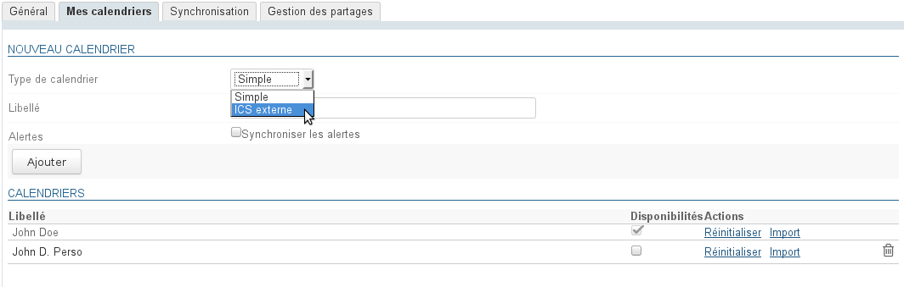
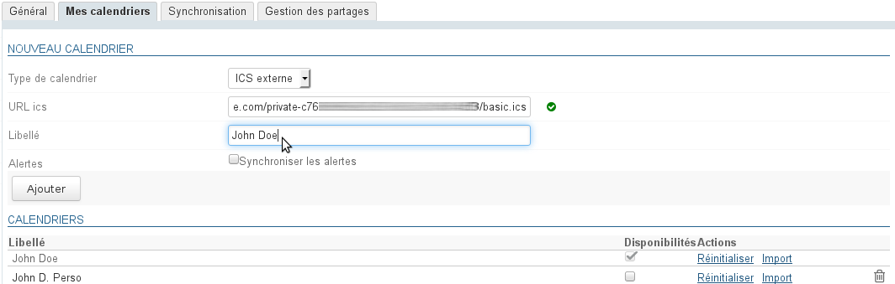
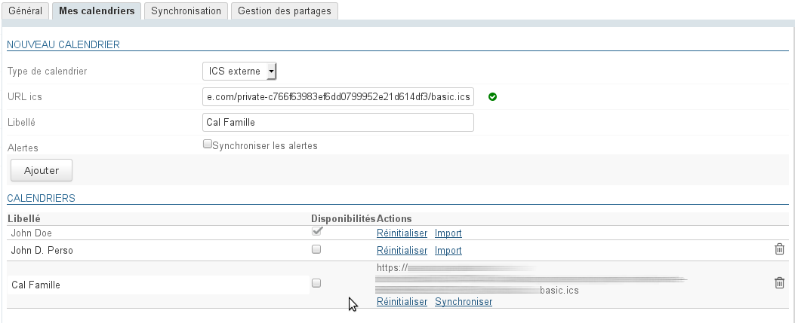
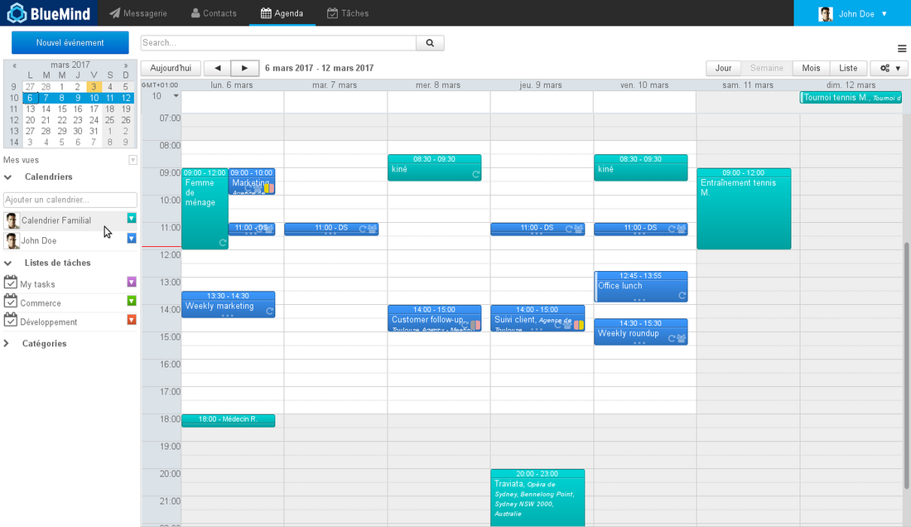
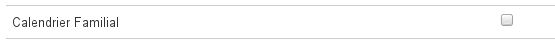

# Les calendriers externes

## Présentation

BlueMind donne la possibilité de visualiser des calendriers externes via l'url d'un calendrier au format iCalendar (extension .ics).

La synchronisation de ces calendriers se fait de façon unilatérale : les calendriers ne sont accessibles qu'en lecture, les modifications ne peuvent être enregistrées dans le calendrier d'origine.

## Prérequis

- Assurez-vous d'avoir l'url du calendrier à synchroniser au format ics et avec un droit de partage correct : le calendrier doit être accessible de façon extérieure à votre fournisseur d'agenda.
- Certains fournisseurs proposent des urls avec pour préfixe webcal://, ces urls ne sont pas prises en charge par BlueMind il convient de les modifier en remplaçant simplement 'webcal' par 'http'

## Ajouter un calendrier externe

Pour ajouter un calendrier externe :

- se rendre dans la gestion des paramètres > Agenda > onglet « Mes Calendriers »
- dans le formulaire de création d'un nouveau calendrier, sélectionner le type « external ics » ("ics externe") : un champ "ICS url" apparaît alors, avec un icône à la suite, indiquant la validité de l'url saisie (l'icône est tout d'abord un "warning" rouge, le champ étant vide) :

- Copier dans le champ "ICS url" l'adresse du calendrier externe puis quitter le champ pour valider (touche "tab" ou clic dans une zone vide de la page)
- le moteur valide alors l'url et rempli le champ "label" s'il accède bien au calendrier et que le nom du calendrier est correctement inclus dans celui-ci :

:::tip

NB : le champ "label" reste éditable, le nom du calendrier peut être personnalisé ou ajouté s'il n'a pas été rempli automatiquement :

:::

- Cliquer enfin sur "Ajouter" pour créer le calendrier, celui-ci s'ajoute à la liste des calendriers personnels de l'utilisateur :Le calendrier externe possède 2 liens particuliers :
    - Réinitialiser : permet de réinitialiser la synchronisation en cas de soucis avec celle-ci
    - Synchroniser : permet de forcer la synchronisation du calendrier

:::tip

La colonne "Disponibilités" permet à l'utilisateur de choisir quel(s) calendrier(s) sera utilisé afin d'indiquer son statut lors de la recherche de disponibilités par d'autres utilisateurs souhaitant l'inviter à un événement.

Voir [L'agenda](/Guide_de_l_utilisateur/L_agenda/)

:::

Le calendrier peut ensuite être recherché et ajouté par autocomplétion à la vue de l'utilisateur comme n'importe quel autre calendrier :

:::info

Délai de rafraichissement

**Dans BlueMind 4.0**, les calendriers externes sont rafraichis automatiquement toutes les heures. Ce délai n'est ni modifiable ni paramétrable. Pour éviter d'attendre la prochaine synchronisation automatique, il est conseillé de cliquer sur le lien "Synchroniser" du calendrier lors de sa création.

**À partir de BlueMind 4.1**, les calendriers externes sont rafraichis "à la demande", soit lors de leur consultation : le fait des les afficher dans l'application Agenda lance une demande de synchronisation.
NB : selon l'encombrement des serveurs et du réseau, la synchronisation peut prendre quelques secondes avant que les nouveaux événements apparaissent.

:::

## Modification

La seule modification que l'on peut apporter à un calendrier externe porte sur son nom :

- se rendre dans la gestion des paramètres > Agenda > onglet « Mes Calendriers »
- dans la liste des calendriers, cliquer sur la ligne du calendrier concerné afin de faire apparaître le champ de saisie : 
- modifier le label du calendrier puis valider avec la coche (ou en quittant simplement le champ) ou annuler avec la croix. 

:::info

L'url d'un calendrier ne peut être modifiée, pour charger une nouvelle url supprimez puis recréez un nouveau calendrier.

:::

## Suppression

### Retirer un calendrier de la vue

Un calendrier externe peut être retiré de la vue par défaut comme un autre calendrier, en cliquant sur son icône de couleur puis sur "remove" :

### Supprimer un calendrier

Pour supprimer un calendrier de sa configuration :

- se rendre dans la gestion des paramètres > Agenda > onglet « Mes Calendriers »
- cliquer sur l'icône  à la fin de la ligne correspondante

Le calendrier est immédiatement supprimé et retiré de la vue.

Si ce n'est pas le cas, procéder à une [réinitialisation des données locales](/Guide_de_l_utilisateur/Paramètres_utilisateur/)   et/ou retirer le calendrier de la vue (cf. paragraphe précédent).

