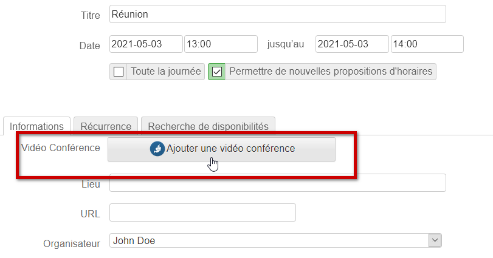
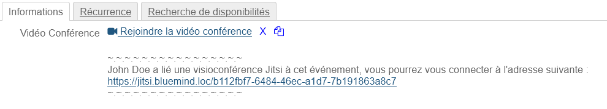
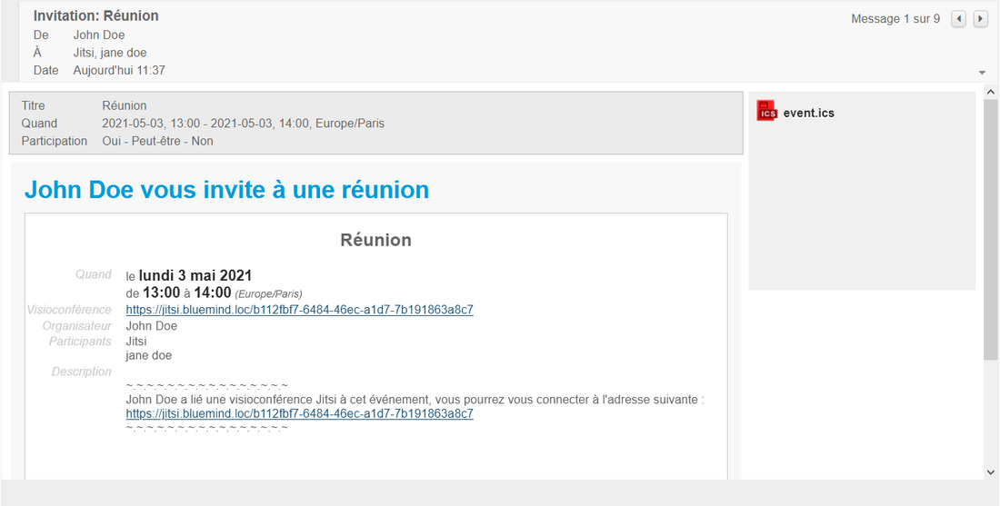
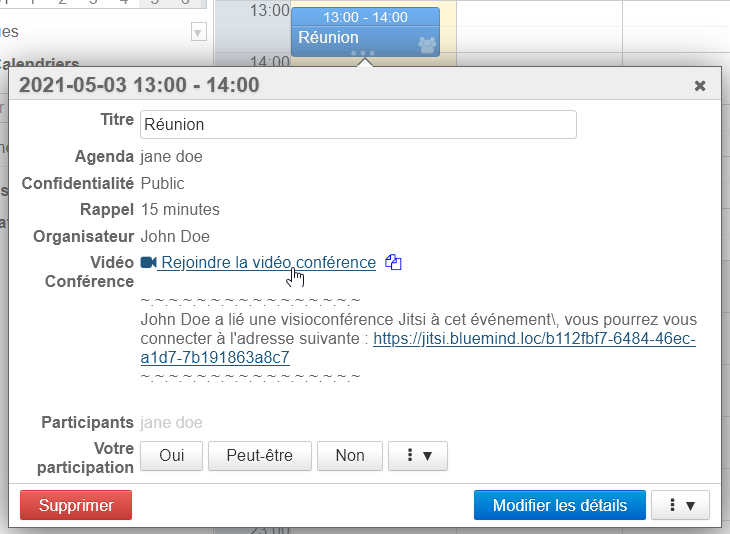
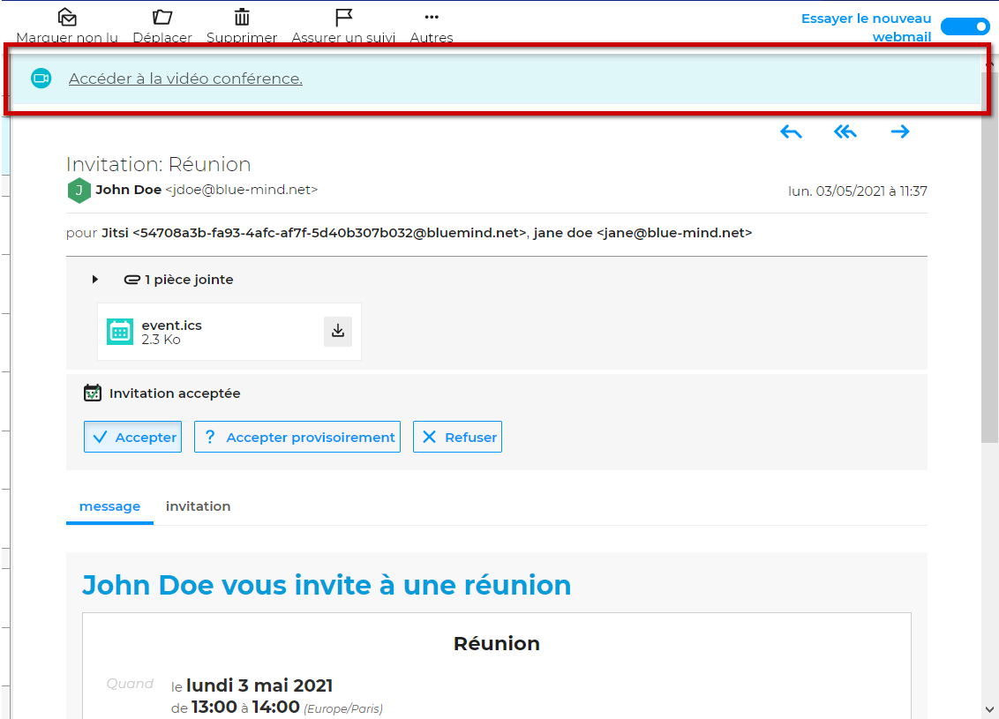
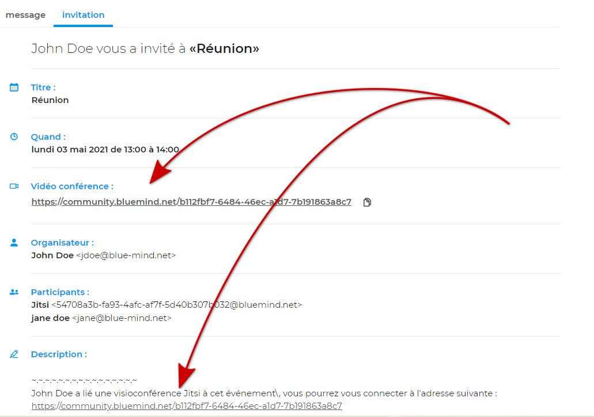

# Lier une visioconférence à un événement

# Présentation

BlueMind 4.5 propose la possibilité de lier des visioconférences à des événements : création à la volée lors de la création et de l'édition de l'événement, suppression, accès direct par lien pour les participants.

Les systèmes actuellement compatibles sont :

- BlueMind Video (service SAAS intégré depuis BlueMind 4.6.0)
- Jitsi (service externe)
- StarLeaf (service externe)

**Cette fonctionnalité doit tout d'abord être [installée par les administrateurs](/Guide_de_l_administrateur/Configuration/Visioconférence_intégrée/) qui la mettent à disposition des utilisateurs.**

# Ajouter une visioconférence à un événement

Dans le formulaire de création d'un événement, onglet Informations, cliquer sur le bouton "Ajouter une visioconférence" :

Après une information de réservation en cours (peut durer quelques secondes), un lien est ajouté à l'événement, avec un texte d'accompagnement s'il a été paramétré par les administrateurs :

2 icônes sont disponibles à côté de l'événement :

-   la croix permet de supprimer une visioconférence de l'événement
-  les fichiers servent à copier l'adresse dans le presse-papier de l'ordinateur

:::important

Le lien est effectif dès l'instant où il est généré, même si l'événement n'est pas enregistré

:::

# Accéder à la visioconférence

Le lien et la description sont visibles et fonctionnels dans l'email d'invitation reçu par les invités :

Ces éléments peuvent aussi être retrouvés dans la popup d'information de l'événement, dans le calendrier de chaque participant (organisateur et invités) :

:::important

Le lien peut être copié et transféré, toute personne disposant du lien pourra accéder à la visioconférence.

:::
:::important

Nouveau webmail

Dans le [nouveau client de messagerie en ligne BlueMind](/Guide_de_l_utilisateur/La_messagerie/Messagerie_BlueMind/) la visioconférence peut être accéder grâce au bandeau présent en en-tête du mail d'invitation :

En plus du message, qui se présente comme précédemment, les informations peuvent aussi être retrouvées dans l'onglet "Invitation" présentant tous les détails de l'événement :

:::

# Dissocier une visioconférence

A tout moment, l'organisateur peut éditer son événement et supprimer le lien de visioconférence en cliquant sur l'icône croix  à côté de celui-ci.
:::important

Le lien sera toujours valide, l'utiliser mènera bien à une visioconférence, mais il ne sera plus visible dans les informations de l'événement dans l'agenda de l'organisateur et des participants.

:::

# Appareils mobiles

Depuis les appareils mobiles connectés en EAS, il est possible de générer un lien de visioconférence en invitant la ressource à l'événement : le lien sera généré par le serveur lors de l'enregistrement de l'événement.

