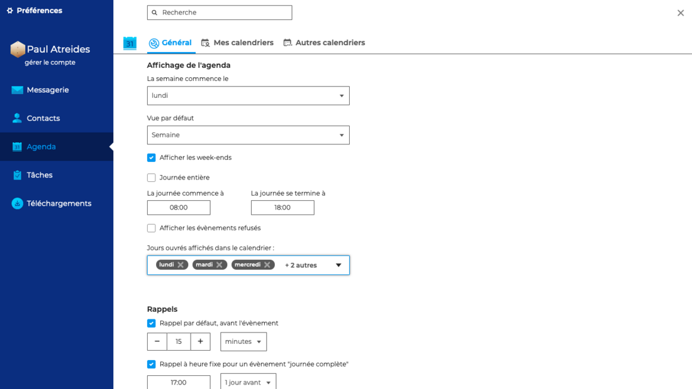
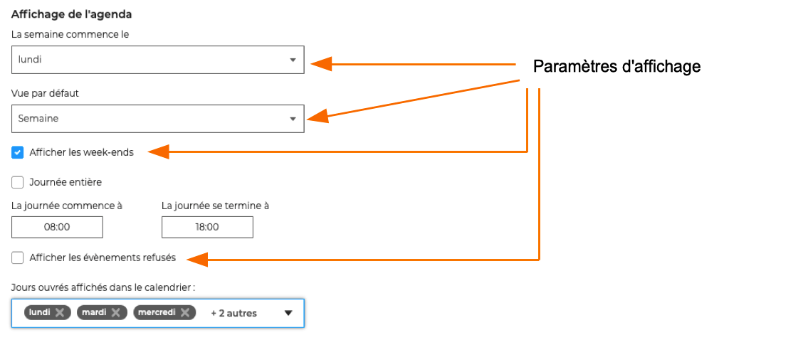
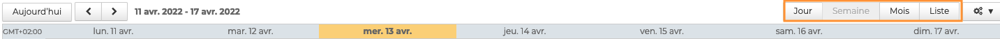

# Paramétrer l'agenda

Les paramètres généraux de l'agenda permettent à l'utilisateur de définir ses préférences d'affichage, de gestion du temps et de rappels.

Pour cela, aller dans **Préférences - Agenda - Général**

## Paramétrer l'affichage de l'agenda

L'utilisateur peut choisir :

- de commencer la semaine le lundi ou le dimanche
- d'afficher ou non les week-ends
- d'afficher ou les évènements refusés
- d'afficher par défaut son agenda par jour, semaine, mois ou liste

:::tip

Cette vue peut-être modifiée temporairement directement dans la barre d'actions au-dessus de l'agenda

:::

## Paramétrer le temps de travail

Les informations de début et fin de journée ainsi que les jours ouvrés permettent de **définir les plages horaires** qui seront considérées comme ouvrées par BlueMind.

Ainsi, lors de la recherche de disponibilité ou lors d'une invitation par exemple, l'organisateur de l'événement sera informé du fait que l'événement se situe hors des heures travaillées de l'utilisateur.

## Paramétrer les rappels 

Il est possible de définir :

- un rappel pour les événements classiques (heures bornées) : de 1 à 1000000 secondes, minutes, heures ou jours avant l'évènement
- un rappel pour les événements sur une journée complète : indique l'heure du rappel et le nombre jours avant l'évènement
- le type de rappel : par e-mail ou notification

Lorsqu'un rappel est désactivé, le champs est vide et la liste déroulante correspondante est sur "Secondes".

:::info

Ce paramétrage concerne les nouveaux événements, il n'est pas rétroactif sur les événements déjà présents dans l'agenda.

:::

