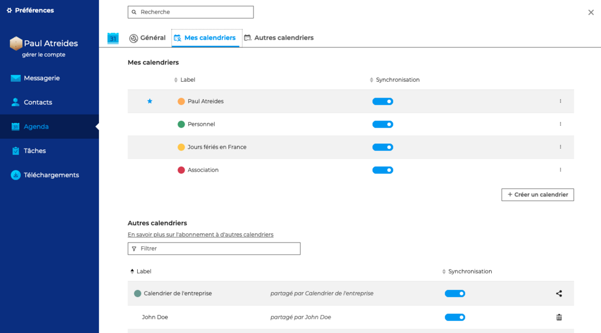
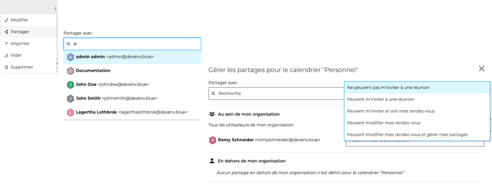
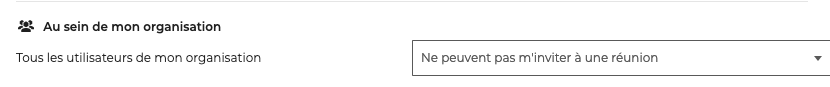
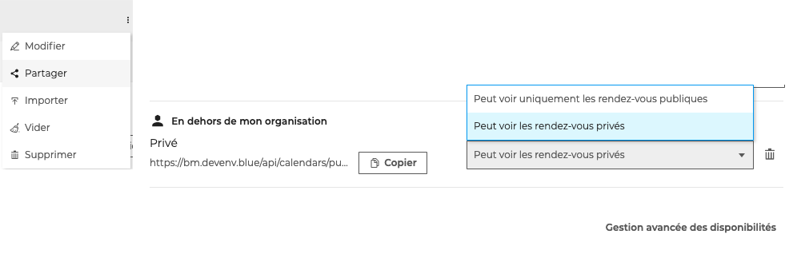
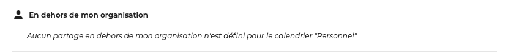

# Partager un calendrier

Un utilisateur peut décider de partager avec d'autres utilisateurs l'ensemble de ses calendriers et d'attribuer différents niveaux de droits d'accès.

La gestion des droits d'accès aux calendriers s'effectue dans les paramètres de l'agenda, en allant sous **Préférences - Agenda - Mes calendriers**

## Partager un calendrier en interne

Pour partager un calendrier avec un ou plusieurs membres de l'organisation, **se positionner sur le calendrier** puis cliquer sur "**Partager**" dans le menu pour ouvrir la fenêtre pop-up.

**Rechercher l'utilisateur** ou le groupe d'utilisateur dans la barre de recherche en tapant les premières lettres - l'autocomplétion proposera tous les utilisateurs disponibles puis **sélectionner le niveau de partage** souhaité.

Les droits possibles sont :

- **Ne peuvent pas m'inviter à une réunion** => **aucun partage** Le(s) utilisateur(s) sélectionné(s) ne peuvent pas voir le calendrier ni inviter l'utilisateur. L'autocomplétion ne proposera pas le nom de l'utilisateur dans le formulaire d'ajout de participant à un évènement.
- **Peuvent m'inviter à un rendez-vous** => **partage minimum** Le(s) utilisateur(s) sélectionné(s) ne peuvent pas voir le calendrier de l'utilisateur mais peuvent l'inviter. L'autocomplétion proposera le nom de l'utilisateur dans le formulaire d'ajout de participant à un évènement.
- **Peuvent m'inviter et voir mes rendez-vous** => **partage avec droits de lecture** Le(s) utilisateur(s) sélectionné(s) peuvent consulter l'agenda et inviter l'utilisateur. Les événements privés apparaîtront mais avec le libellé "privé" à la place du titre et sans détails autres que le jour, l'heure et la durée.

- **Peuvent modifier mes rendez-vous** => **partage avec droits d'écriture** En plus du droit précédent, le(s) utilisateur(s) sélectionné(s) peuvent accepter et modifier les rendez-vous de l'utilisateur.

- **Peuvent modifier mes rendez-vous et gérer mes partages** => **partage avec droits de gestion** En plus des droits précédents, le(s) utilisateur(s) sélectionné(s) peuvent eux-mêmes donner des droits de partage sur l'agenda de l'utilisateur et **voir ou éditer les détails des rendez-vous privés de l'utilisateur**.

:::tip

"Tous les utilisateurs de mon organisation" correspond au partage public du calendrier, le niveau de droits choisi sera appliqué à l'ensemble des utilisateurs du domaine

:::

## Partager un calendrier ICS externe

Le partage d'un calendrier externe s'effectue de la même manière qu'un [calendrier BlueMind](#partager-un-calendrier-en-interne).

Cependant, les calendriers de type "ICS externe" sont synchronisés en **lecture seule.** Bien que **les droits d'écriture et de gestion** soient proposés dans la liste, ils **ne pourront pas s'appliquer** : les modifications ou créations qui pourraient être effectuées par l'utilisateur désigné disparaîtront lors de la prochaine synchronisation.

## Partager un calendrier à l'extérieur

Le calendrier BlueMind peut être partagé vers l'extérieur **via une adresse**, publique ou privée, **créée par l'administrateur** du système.

Pour partager un calendrier avec une personne extérieure, **se positionner sur le calendrier** puis cliquer sur "**Partager**" dans le menu pour ouvrir la fenêtre pop-up.

En bas de la fenêtre, dans la partie "**En dehors de mon organisation**", cliquer sur "**Copier**" pour copier le lien de partage **puis l'envoyer** au(x) destinataire(s) extérieur(s).

Les droits sont gérés automatiquement lors de la création de l'adresse par l'administrateur :

- **adresse publique**, donne automatiquement les droits "**Peut voir uniquement les rendez-vous publics**": Permet aux personnes qui ont l'adresse de visualiser l'agenda, de connaître le détail de tous les événements publics mais ne verront qu'une information "occupé(é)" en lieu et place d'un événement privé.
- **adresse privée**, donne automatiquement les droits "**Peut voir les rendez-vous privés**" : Permet aux personnes qui ont l'adresse de visualiser l'agenda, de connaître le détail de tous les événements publics et privés.

L'utilisateur peut **modifier ce droit** : en choisissant "Peut voir uniquement les rendez-vous publiques" pour une adresse privée, l'adresse deviendra publique - et vice versa.

L'utilisateur peut également **supprimer l'adresse de partage** extérieur.

:::tip

Si aucune adresse n'apparait dans la zone "En dehors de mon organisation", contacter l'administrateur afin qu'il paramètre une adresse publique ou privée.

:::

