# Participer à un évènement

## Accepter l'invitation

Lorsqu'une réunion est organisée, l'agenda BlueMind envoie systématiquement une notification par e-mail à chaque invité et ajoute la réunion à son calendrier.

L'utilisateur invité doit **signifier sa participation à l'organisateur**, en acceptant, en mettant en attente ou en refusant l'invitation.

Cela peut être fait directement depuis la **notification reçue par e-mail**,

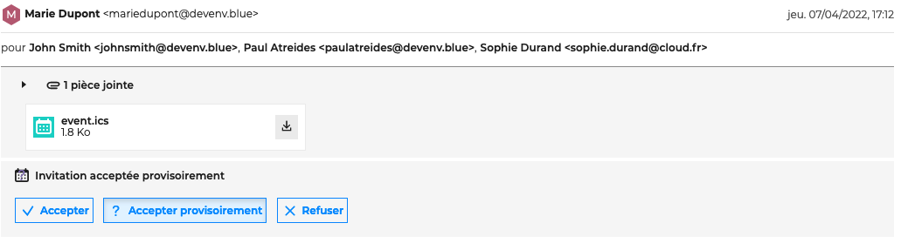

en cliquant **sur la réunion dans l'agenda**,

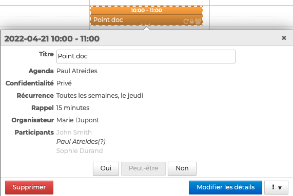

ou sur la notification d'invitations qui apparait **dans la barre d'actions de l'agenda**

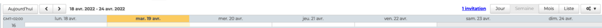

**Cliquer sur la réponse** adéquate puis choisir d'envoyer la réponse directement à l'organisateur ou en ajoutant une note. L'organisateur reçoit une notification des réponses par e-mail.

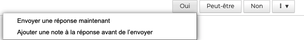

:::tip

Pour les évènements récurrents, il est possible de répondre pour l'ensemble des réunions ou à uniquement à l'occurrence sélectionnée.

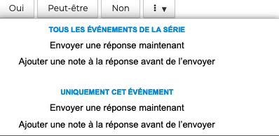

:::

Dans l'agenda, **l'affichage d'une réunion** apparaît différemment selon la participation de l'utilisateur :

- Rendez-vous accepté : couleur pleine
- Participation à "peut-être" et "proposition de nouvel horaire" : couleur pleine entourée de pointillés
- Rendez-vous refusé : transparence, contenu barré

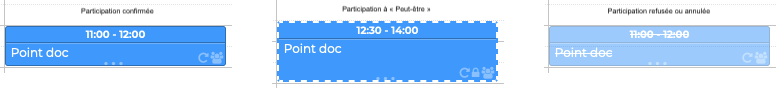

:::tip

L'utilisateur peut choisir d'afficher ou non les événements refusés, dans les [paramètres de l'agenda](/Guide_de_l_utilisateur/L_agenda/Paramétrer_l_agenda/).

Cette option n'est pas activée par défaut mais peut s'avérer utile dans le cas où l'on souhaiterait modifier sa participation à un événement refusé auparavant.

:::

## Proposer un nouvel horaire

Si, lors de la [création de la réunion](/Guide_de_l_utilisateur/L_agenda/Organiser_une_réunion/), l'organisateur le permet, les participants peuvent également **proposer un nouvel horaire.**

Pour cela cliquer le menu puis "**Proposition d'une nouvelle date**". Pour les évènements récurrents, il est possible de proposer un nouvel horaire pour l'ensemble des évènements.

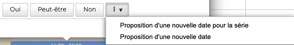

S'ouvre alors un formulaire recherche de disponibilités.

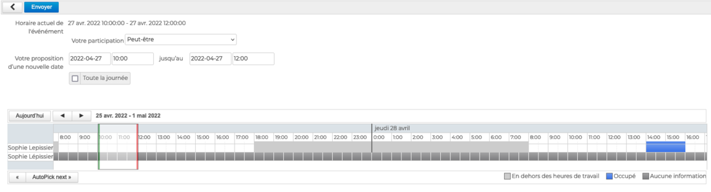

**Sélectionner l'horaire souhaité** et cliquer sur "**Envoyer**". L'organisateur reçoit alors une notification par e-mail afin de valider la proposition.

Si l'**organisateur accepte**, tous les participants reçoivent un e-mail de modification de l'événement.

Si l'**organisateur refuse**, seul participant ayant fait une proposition reçoit un message indiquant le refus de l'organisateur

## Éditer une réunion en tant qu'invité

Les participants peuvent [modifier, supprimer ou dupliquer](/Guide_de_l_utilisateur/L_agenda/Éditer_un_évènement/) une réunion à laquelle ils sont invités mais **les changements resteront privés**. Toutes les modifications réalisées par un invité seront prises en compte **uniquement sur son calendrier**. L'organisateur et les autres participants n'auront pas accès aux modifications.

Lorsqu'un invité **supprime** une réunion de son calendrier, l'organisateur reçoit une **notification d'annulation** de sa participation à la réunion.

## Télécharger les pièces jointes

Lorsqu'un événement comporte une pièce jointe, celle-ci est **signalée par un pictogramme** dans la vue de l'agenda.

À tout moment les fichiers joints à un événement peuvent être **téléchargés** en se rendant sur la fenêtre pop-up.

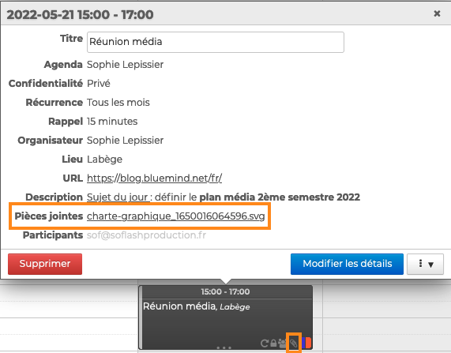

:::info

L'invité peut ajouter des pièces jointes à l'évènement, mais comme toute modification, celles-ci ne seront prises en compte que son calendrier. L'organisateur et les autres participants n'y auront pas accès.

:::

## Participer à une visioconférence

Pour accéder à une [visioconférence](../La_visioconference/), **cliquer sur le lien** disponible dans l'e-mail d'invitation

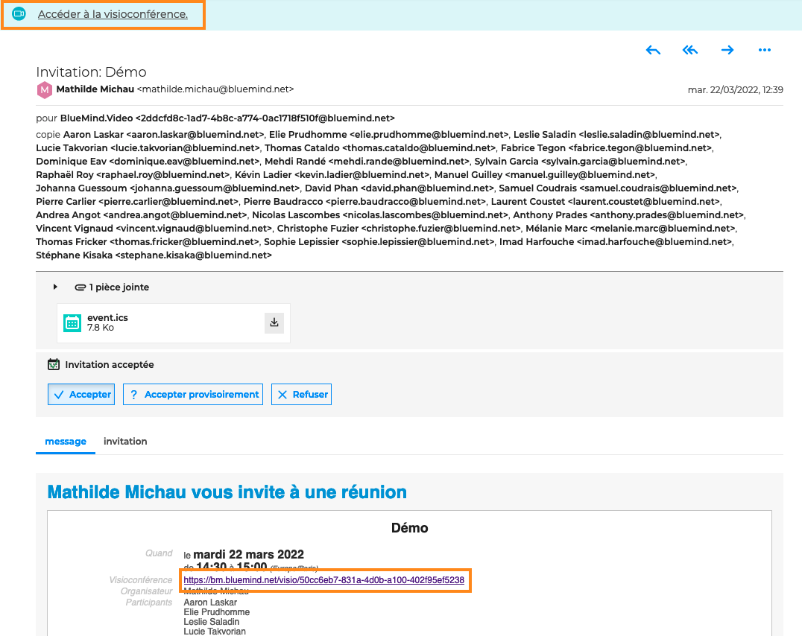

ou dans la fenêtre pop-up de l'évènement

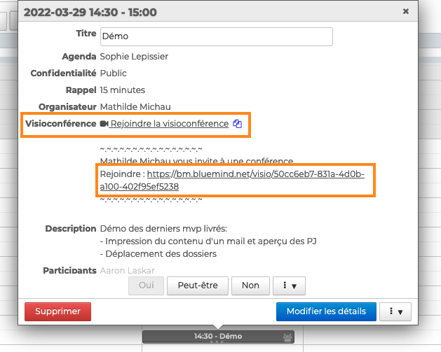

:::tip

 permet de copier de le lien pour le partager. Toute personne ayant le lien pourra accéder à la visioconférence.

:::

