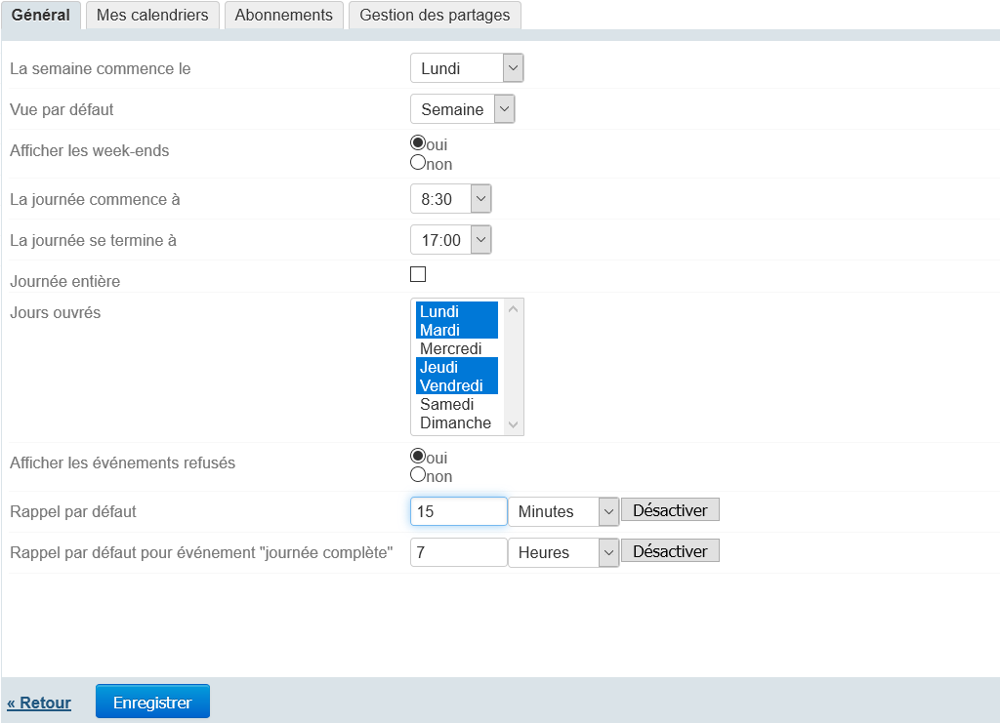
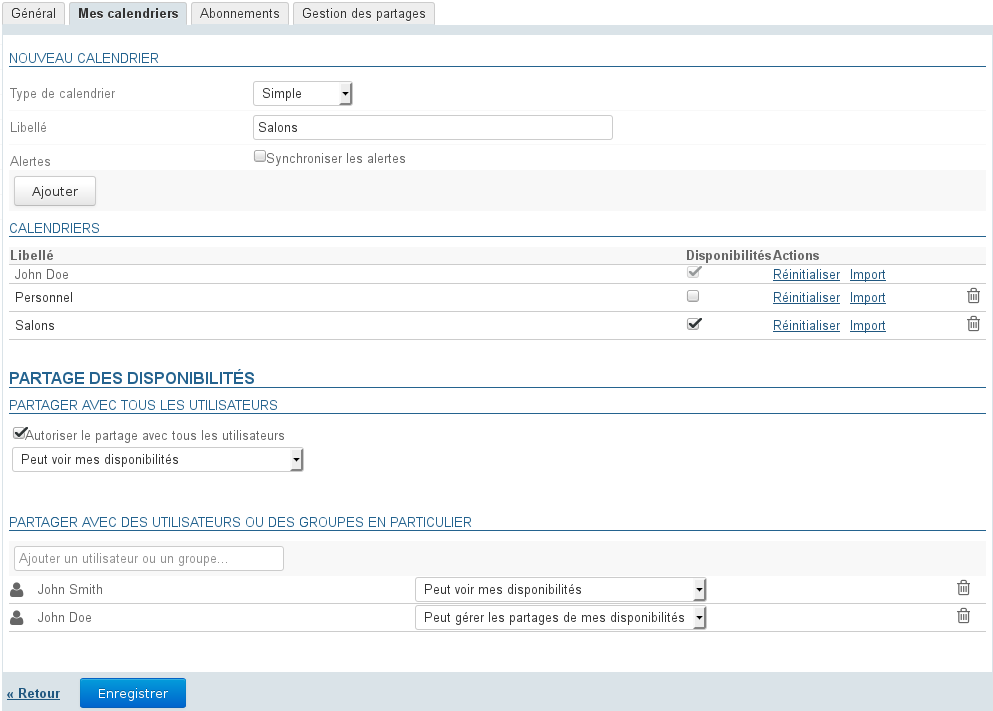
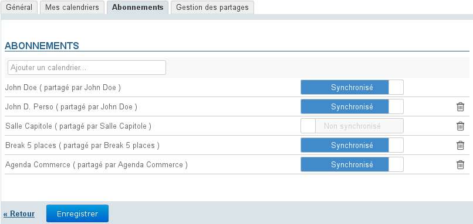
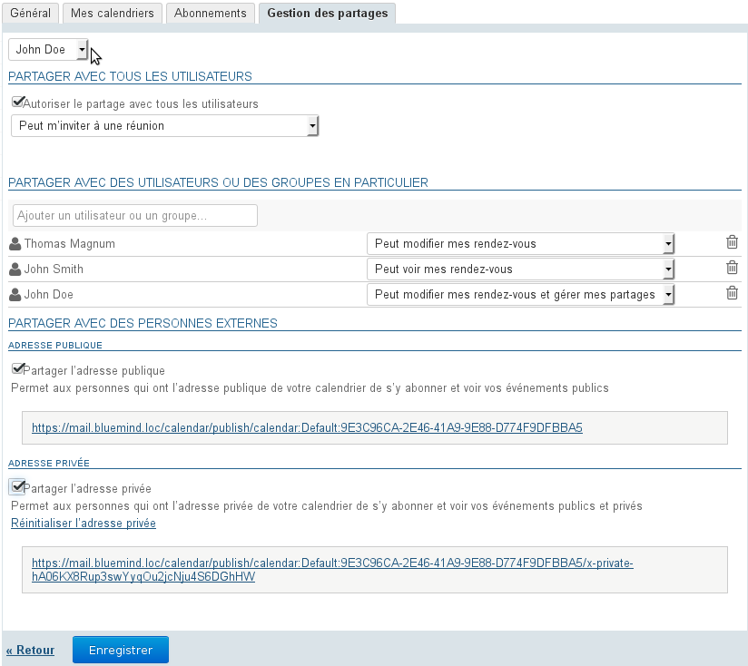
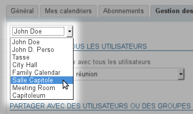
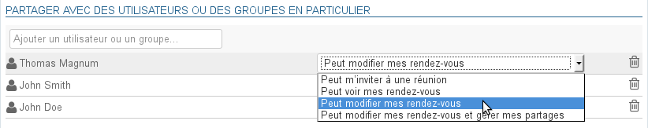

# Préférences de l'agenda

# Présentation

Pour accéder aux préférences de l'agenda, se rendre dans "Mon compte" en cliquant sur le nom d'utilisateur à droite du bandeau de navigation :

# Préférences générales

Le premier onglet des préférences de l'agenda permet à l'utilisateur de positionner ses préférences d'affichage et de gestion du temps :

Les informations de début et fin de journée ainsi que les jours ouvrés permettent de définir les plages horaires qui seront considérées comme ouvrées par BlueMind. Ainsi, lors de la recherche de disponibilité ou lors d'une invitation par exemple, l'organisateur de l'événement sera informé du fait que l'événement se situe hors des heures travaillées de l'utilisateur.

L'utilisateur a ici la possibilité de définir des rappels par défaut pour les événements ou au contraire de les désactiver.
**Ce paramétrage concerne les nouveaux événements, il n'est pas rétroactif sur les événements déjà présents dans l'agenda.**

Vous pouvez définir séparément :

- un rappel pour les événements classiques (heures bornées)
- un rappel pour les événements définis sur une journée complète : le paramétrage définit le temps "avant minuit".Par exemple le réglage par défaut est défini à 7, le rappel sera donc envoyé à 24-7=17h

:::important

Lorsqu'un rappel est désactivé, le champs est vide et la liste déroulante correspondante est sur "Secondes".

:::

# Mes calendriers

L'onglet «Mes calendriers» donne accès à la gestion des calendriers de l'utilisateur :

- calendriers personnels : voir la page [L'agenda](/Guide_de_l_utilisateur/L_agenda/) - §3 Multi-calendriers
- calendriers externes : voir la page dédiée [Les calendriers externes](/Guide_de_l_utilisateur/L_agenda/Les_calendriers_externes/)

# Abonnements

Cet onglet permet à l'utilisateur de s'abonner à des agendas, personnels, partagés ou de domaine et d'activer leur synchronisation pour une utilisation hors ligne ou sur des clients tiers (logiciel client lourd ou périphérique mobile).

Lorsque la synchronisation est activée pour un agenda, les données sont téléchargées sur le logiciel client. De ce fait :

    |  | Synchronisation activée | Synchronisation désactivée |
| --- | --- | --- |
| Application web et Thunderbird | le calendrier est consultable et disponible hors connexion | le calendrier est consultable en mode connecté mais indisponible hors connexion |
| EAS iOS | le calendrier est visible et disponible hors connexionCalendriers partagésDans BlueMind version 4, cela concerne uniquement les calendriers de l'utilisateur (par défaut et secondaires), les calendriers partagés ne seront pas affichés, qu'ils soient de domaine ou d'autres utilisateurs. | le calendrier n'est pas visible |
| EAS (autres) | si cette fonctionnalité est activée par l'administrateur (voir la page [Compatibilité](Compatibilite_57770212.html) pour plus de détails) :- le calendrier est visible- le calendrier est disponible hors connexionCalendriers partagésDans BlueMind version 4, cela concerne uniquement les calendriers de l'utilisateur (par défaut et secondaires), les calendriers partagés ne seront pas affichés, qu'ils soient de domaine ou d'autres utilisateurs. | le calendrier n'est pas visible |
| DAV | le calendrier est visible et disponible hors connexion |
| Outlook (connecteur) | - le calendrier est visible et disponible hors connexion- Si un abonnement à un calendrier est ajouté dans Outlook, il est automatique ajouté dans BlueMind avec la synchronisation activée | le calendrier n'est pas visible |

:::important

Lorsque le volume des données contenues dans un calendrier est important (plus de 9000 entrées), un message avertit de possibles problèmes de synchronisation.

:::

Pour ajouter un agenda :

- Saisir le nom de l'agenda recherché (utilisateur, ressource, ...)
- Valider avec la touche &lt;Entrée> ou choisir dans la liste proposée par l'autocomplétion
- Désactiver la synchronisation si désiré
- **Cliquer sur le bouton «Enregistrer» pour prendre en compte les changements.**

Pour supprimer un agenda :

- Cliquer sur l'icône corbeille en fin de ligne 
- **Cliquer sur le bouton «Enregistrer» pour prendre en compte les changements.**

:::important

Il est nécessaire de cliquer sur « Enregistrer » pour prendre en compte un changement d'état de synchronisation puis **relancer la synchronisation (ou attendre la synchronisation automatique) sur le logiciel client** pour que les modifications soient prises en compte (téléchargement et visualisation des données en cas d'activation, suppression des données en cas de désactivation).

:::

# Gestion des partages

Cet onglet permet à l'utilisateur de gérer les partages des agendas dont il est le gestionnaire : ses agendas mais aussi ceux des ressources ou utilisateurs lui ayant donné eux-mêmes les droits de modification et gestion.

La gestion des partages permet en outre, de [partager un agenda avec des utilisateurs extérieurs](/Guide_de_l_utilisateur/L_agenda/Le_partage_d_agenda/#Lepartaged'agenda-partage-exterieur) au domaine BlueMind

:::important

Par défaut un partage apparaît, qui est celui de l'utilisateur lui-même ayant les droits de modification et gestion : ce partage ne peut être ni supprimé ni réduit.

:::

Pour gérer les partages

- Sélectionner dans la première liste déroulante l'entité à gérer (l'utilisateur ou une de ses délégations) :
- Dans la zone de saisie dédiée, saisir le nom de la personne ou du groupe avec qui partager l'agenda
- Valider avec la touche &lt;Entrée> ou sélectionner le nom dans la liste proposée par l'autocomplétion
- L'utilisateur est ajouté dans la liste, choisir dans la liste déroulante de sa ligne le droit à lui attribuer : 
  2 **Peut m'inviter à une réunion** : l'utilisateur peut m'inviter en m'ajoutant à la liste des participants à un événement
  2 **Peut m'inviter et voir mes rendez-vous** : en plus du droit précédent, l'utilisateur peut visualiser mon agenda
  2 **Peut modifier mes rendez-vous** : en plus des droits précédents, l'utilisateur peut ajouter un événement dans mon agenda, le modifier, le supprimer ou encore confirmer ou refuser ma participation à un événement
  2 **Peut modifier mes rendez-vous et gérer mes partages** : en plus des droits précédents, l'utilisateur peut gérer les droits de partages de mon agenda
- Une fois tous les partages définis comme souhaité, **cliquer sur le bouton «Enregistrer» pour prendre en compte les changements.**

:::important

La zone "Partage public" permet d'activer et paramétrer le partage avec **tous les utilisateurs du domaine**, n'activez celui-ci que si vous êtes sûr de ce que vous faites

:::

Pour en savoir plus, consulter [Gestion des partages](/Guide_de_l_utilisateur/Gestion_des_partages/)

