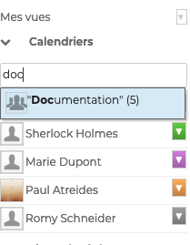
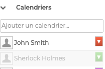
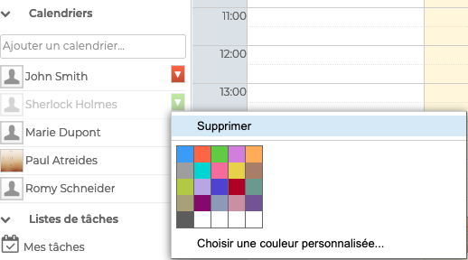
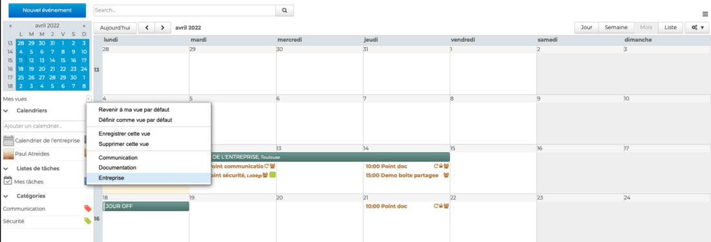
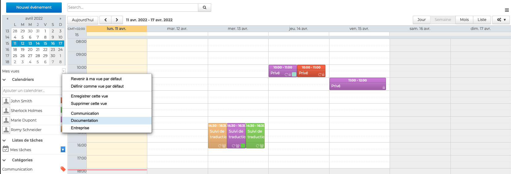
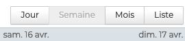
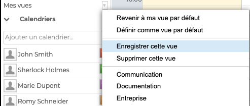
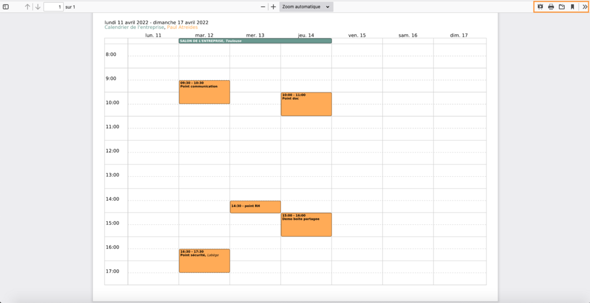

# Afficher plusieurs calendriers

En plus de son agenda personnel créé et affiché automatiquement, l'utilisateur peut visualiser **ses **[**calendriers personnels supplémentaires**](/Guide_de_l_utilisateur/L_agenda_4.7/Créer_et_éditer_un_calendrier/), les [**calendriers qui lui ont été partagés**](/Guide_de_l_utilisateur/L_agenda_4.7/Partager_un_calendrier/) par d'autres utilisateurs ou bien par l'administrateur pour **les calendriers de domaine**.

## Afficher des calendriers supplémentaires 

**Pour afficher un calendrier**, aller sur "**Ajouter un calendrier**" dans la colonne de gauche de l'application et **chercher** les calendriers en tapant les premières lettres de l'utilisateur ou du groupe d'utilisateurs - l'autocomplétion proposera les calendriers disponibles.

Puis cliquer sur le(s) calendrier(s) pour les **sélectionner**. Leurs évènements s’afficheront alors dans la zone d'affichage principale de l'agenda.

Pour **masquer** temporairement un agenda, cliquer sur son nom dans la liste : le nom devient grisé et les événements disparaissent de la zone principale de l'agenda

Pour **retirer** un agenda cliquer sur l'icône de couleur en face de son nom puis cliquer sur "Supprimer" dans le menu de personnalisation proposé :

:::tip

Le menu permet également à l'utilisateur de personnaliser les couleurs des calendriers affichés dans son agenda.

:::

## Créer des vues

L'agenda BlueMind permet, grâce à l'enregistrement préalable de différentes vues, d'accéder rapidement à **un ensemble de calendriers** (par exemple tous les calendriers des membres d'un service)** avec un affichage prédéfini **(journalier, hebdomadaire, mensuel ou par liste).**

**

Par exemple ici, l'utilisateur a créé une vue mensuelle avec le calendrier de l'entreprise et son agenda personnel

et une vue hebdomadaire, avec les agendas des membres du service documentation.

L'utilisateur pourra afficher ses différentes vues à tout moment en allant dans le menu "**Mes Vues**"

**Pour créer une vue** : 

=> sélectionner les **[agendas à afficher](#Afficherplusieurscalendriers-ajoutagenda) **dans la zone principale de l'agenda

=> choisir le **type d'affichage** dans la barre d'actions au-dessus du calendrier

=> cliquer sur "**Enregistrer cette vue**" dans le menu "Mes Vues"

Chaque vue peut-être **supprimée **ou **définie comme "vue par défaut"**. La vue par défaut est la vue qui est affichée lorsque l'utilisateur se connecte à l'application.

:::tip

Pour **réinitialiser la vue par défaut **d'un utilisateur il suffit de n'afficher que le calendrier de celui-ci et cliquer sur "Définir comme vue par défaut".

:::

## Imprimer une vue

Il est possible d'exporter au format PDF puis d'enregistrer et/ou imprimer les vues de l'agenda telles qu'affichées à l'écran.

Pour cela, dans la **barre d'actions au dessus de l'agenda**, aller sur  puis "**Impression PDF**" pour ouvrir la fenêtre pop-up. Choisir l'orientation, cocher l'option Noir et Blanc si besoin et cliquer sur "**Enregistrer**".

La vue s'ouvre dans une nouvelle fenêtre du navigateur et peut être **imprimée, enregistrée ou partagée** en utilisant la barre d'actions

