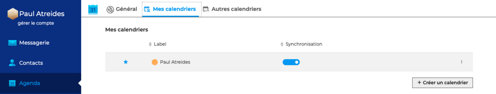
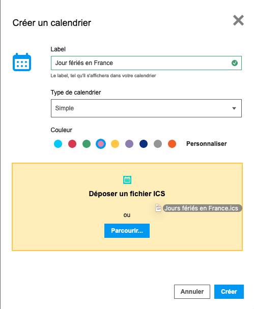
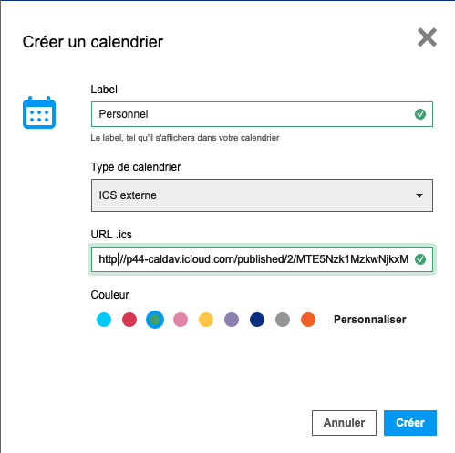
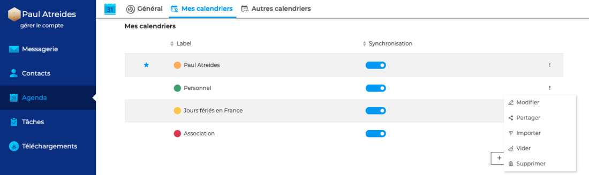

# Créer et éditer un calendrier

L'agenda BlueMind permet à un utilisateur de créer et utiliser **autant de calendriers personnels qu'il le souhaite** et d'en gérer les partages.

## Créer un calendrier BlueMind

La création de calendriers s'effectue dans les paramètres de l'agenda. Aller sous **Préférences - Agenda - Mes calendriers**

****

Cliquer sur "**+ Créer un calendrier**" pour ouvrir la fenêtre pop-up.**

**

Renseigner le** **titre et cliquer sur "**Créer**" pour créer un nouveau **calendrier vierge.**

Il est également possible d'insérer un** fichier **[**iCalendar**](/Guide_de_l_utilisateur/L_agenda_4.7/Importer_et_exporter_un_calendrier/) (extension ics) pour créer nouveau **calendrier avec des ****données** récupérées depuis un calendrier externe.

## Ajouter un calendrier externe

BlueMind offre la possibilité de **visualiser un calendrier externe** dans un agenda BlueMind.

Pour cela sélectionner le type de calendrier "**ICS externe**"

Renseigner le titre et l'adresse url du calendrier externe puis cliquer sur "**Créer**"

:::info

L'url du calendrier à synchroniser doit être au format ics et avec un droit de partage correct : le calendrier doit être accessible de façon extérieure à votre fournisseur d'agenda.

Certains fournisseurs proposent des urls avec pour préfixe webcal://, ces urls ne sont pas prises en charge par BlueMind il convient de les modifier en remplaçant simplement 'webcal' par 'http'

:::

:::info

Les calendriers externes ne sont accessibles qu'en **lecture seule**, les modifications ne peuvent être enregistrées dans le calendrier d'origine.

Les calendriers externes sont rafraichis "à la demande", soit lors de leur consultation : le fait de les afficher dans l'application Agenda lance une demande de synchronisation. Selon l'encombrement des serveurs et du réseau, la synchronisation peut prendre quelques secondes avant que les nouveaux événements apparaissent.

:::

## Modifier un calendrier personnel

**Pour modifier, vider ou supprimer **un calendrier personnel, cliquer sur le menu d'actions du calendrier

- **Modifier** ouvre la fenêtre pop-up de création du calendrier et permet de changer le label, le type de calendrier et la couleur d'affichage
- **Partager** ouvre la fenêtre pop-up de [gestion des partages](/Guide_de_l_utilisateur/L_agenda_4.7/Partager_un_calendrier/)
- **Importer **ouvre la fenêtre pop-up d'i[mport de fichier](/Guide_de_l_utilisateur/L_agenda_4.7/Importer_et_exporter_un_calendrier/)
- **Vider** permet de supprimer tous les évènements du calendrier mais de conserver le calendrier vide
- **Supprimer** permet de **supprimer définitivement** les évènements et le calendrier

