# Créer un évènement

**Pour ajouter un évènement rapidement**, se positionner à la date et heure souhaitée dans la zone principale de l'agenda. Indiquer le titre de l'évènement et [choisir l'agenda](#Creerunevenement-agenda) dans la fenêtre pop-up qui ouvre instantanément, et cliquer "**Nouvel évènement".**

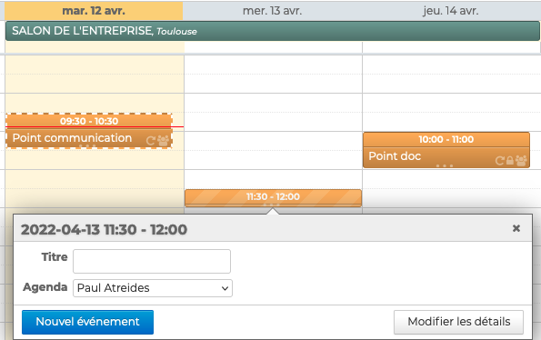

**Pour ajouter un évènement complet**, cliquer sur "**Nouvel évènement**" en haut de la colonne de gauche de l'agenda pour ouvrir **la fiche de création**

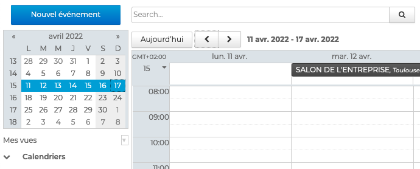

## Saisir les informations

L'onglet "**Informations**" de la fiche de l'évènement permet d'indiquer toutes les informations nécessaires :

- **Titre** : indique le nom ou sujet principal de l'évènement - champ en texte libre **obligatoire**
- **Date** : indique les jours et heures de début et de fin de l'évènement

:::info

Lorsque l'option "Toute la journée" est cochée, l'évènement n'est pas borné par des heures. L'utilisateur est considéré par défaut comme "[Disponible](#Creerunevenement-Disponibilite)"

:::

- **Lieu**** **: adresse ou indication concernant la localisation de l'évènement - champ en texte libre
- **URL** : adresse internet d'un site web, d'un blog, un lien de téléchargement, etc. - champs en texte libre créant un lien hypertexte
- **Description **: indique toute information complémentaire - champ en texte libre, avec possibilité de mise en page, d'ajouter des images, des liens, etc. 

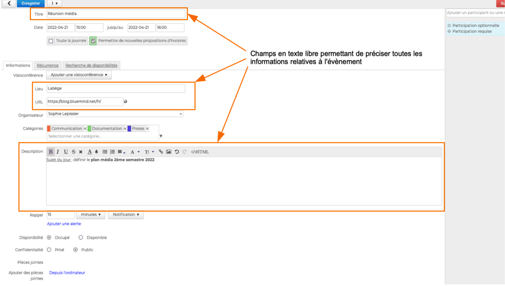

:::tip

Il est également possible d'[inviter des participants ](https://forge.bluemind.net/confluence/pages/viewpage.action?pageId=86743986)et d'ajouter une [ visioconférence ](https://forge.bluemind.net/confluence/pages/viewpage.action?pageId=86743407)à l'évènement

:::

## Attribuer un agenda 

Le champ "**Organisateur**" permet de **sélectionner le calendrier** sur lequel l'évènement sera ajouté et à partir duquel les invitations seront lancées pour [les réunions](/Guide_de_l_utilisateur/L_agenda_4.7/Organiser_une_réunion/).

La liste propose automatiquement tous les **calendriers personnels ou partagés** avec [des droits d'écriture](https://forge.bluemind.net/confluence/display/DA/.Partager+un+calendrier+vBM-4#id-.PartageruncalendriervBM4-Partageruncalendriereninternepartageinterne) ET qui sont **affichés dans [la vue en cours](https://forge.bluemind.net/confluence/display/DA/.Afficher+plusieurs+calendriers+vBM-4)**.

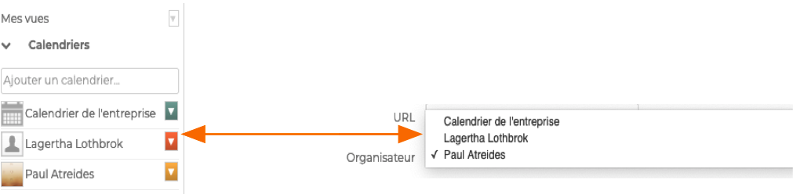

Cette fonction permet d'**ajouter un évènement directement sur le calendrier d'un autre utilisateur**. 
Par exemple, Paul Atréides a les droits d'écriture sur le calendrier de Lagertha Lothbrok. S'il choisit le calendrier de Lagertha Lothbrok, l'évènement apparaitra dans l'agenda de Lagertha Lothbrok, pas dans celui de Paul Atreides. De même, pour les réunions, les invitations seront lancées au nom de Lagertha Lothbrox.

## Ajouter des catégories

Afin de faciliter leur recherche, il est possible d'ajouter une ou plusieurs [catégories](https://forge.bluemind.net/confluence/pages/viewpage.action?pageId=86743569#id-.Param%C3%A9trerlecompteutilisateurvBM4-Cr%C3%A9erdescat%C3%A9gories) (étiquettes) aux évènements.

Pour cela, **sélectionner la ou les catégories** dans la liste en saisissant les premières lettres de la catégorie souhaitée - l'autocomplétion proposera les termes correspondant au cours de la frappe.

Si la catégorie n'existe pas, il suffit de saisir le texte de la nouvelle catégorie puis cliquer sur **Créer**. Une fois les modifications de la fiche contact enregistrées, la nouvelle catégorie sera ajoutée à la liste des catégories personnelles.

Pour la supprimer, cliquer sur la croix 

Il est possible d'affecter **autant de catégories que désiré**. Les catégories sont alors visibles sur l'évènement par des icônes de couleurs (2 au maximum). Au survol de la souris, la liste complète des catégories affectées à l'évènement est affichée.

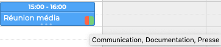

## Préciser les notifications, disponibilité et confidentialité 

La fiche d'informations de l'évènement permet également de préciser :

- **Le rappel **: par défaut le rappel sera tel que défini dans les [paramètres](https://forge.bluemind.net/confluence/pages/viewpage.action?pageId=86744790)[ de l'agenda](https://forge.bluemind.net/confluence/pages/viewpage.action?pageId=86744790) mais peut être modifié pour chaque évènement : cliquer sur la croix pour supprimer une notification et sur "Ajouter une alerte" pour en créer une ou plusieurs nouvelles

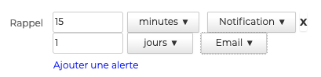

- **La disponibilité **: par défaut, lorsqu'il créée un évènement, l'utilisateur est noté "Occupé" pour les évènements courts (avec date et heure de début et de fin) et "Disponible" pour les évènements sur la journée entière. Ce paramètre permet de faire savoir aux membres de l'organisation si l'utilisateur reste joignable ou s'il peut être invité pendant l'évènement.

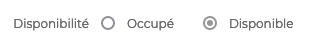

- **La confidentialité** : par défaut les évènements sont publics. L'évènement peut être paramétré comme "Privé". Dans ce cas, les utilisateurs ayant accès au calendrier pourront voir l'évènement mais pas ses informations

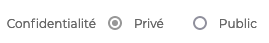

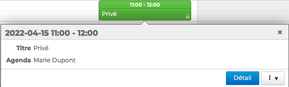

## Ajouter des pièces jointes

La dernière partie de la fiche permet d'**ajouter des documents à l'évènement**. Ces documents seront accessibles à tous les participants dans l'**e-mail d'invitation** reçu et dans l'évènement de leur **agenda BlueMind ou externe**.

Pour ajouter une pièce jointe, cliquer sur "**Depuis l'ordinateur**" et sélectionner le document. Recommencer pour ajouter un autre document.

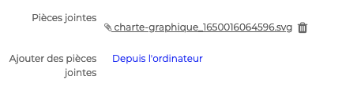

:::info

Pièce jointe détachée

L'ajout de pièces jointes détachées et de fichiers volumineux sera disponible dans une prochaine version

:::

## Configurer la récurrence d'un évènement

Pour les évènements amenés à se répéter de façon régulière, par exemple une réunion mensuelle, l'agenda BlueMind permet de ne créer l'évènement qu'une seule fois et de paramétrer le début, la fin et la fréquence de la récurrence. Il est ensuite possible de modifier une occurrence ou l'ensemble de la série

Pour programmer la récurrence d'un évènement, aller sur l'onglet **Récurrence** et sélectionner **la fréquence** : tous les jours, semaines, mois ou années.

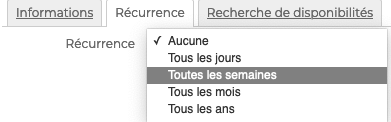

La récurrence peut être affinée en précisant l'**écart entre les évènements** :

- **Tous les jours** : le nombre de jours entre 2 évènements

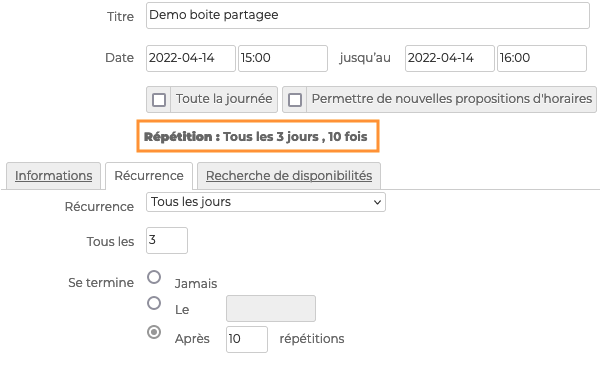

- **Toutes les semaines** : le nombre de semaines entre 2 évènements et les jours de la semaine où l'évènement aura lieu

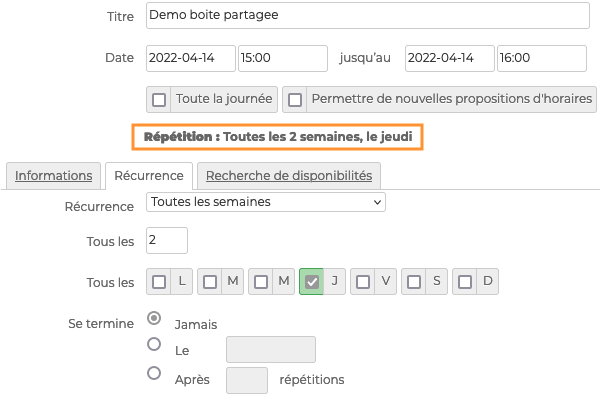

- **Tous les mois** ou **Tous les ans **: le nombre de mois ou années entre 2 évènements et si l'évènement doit être répété le même numéro de jour ou le même jour de la semaine

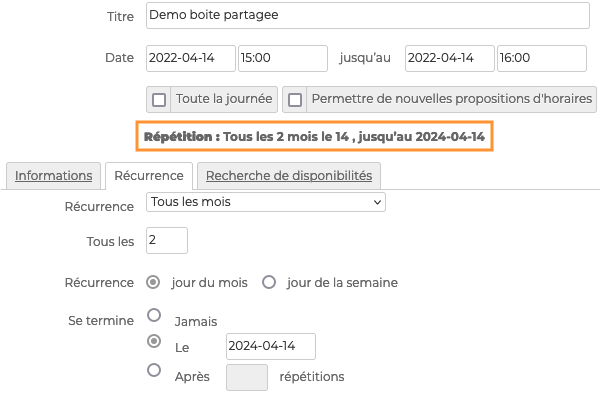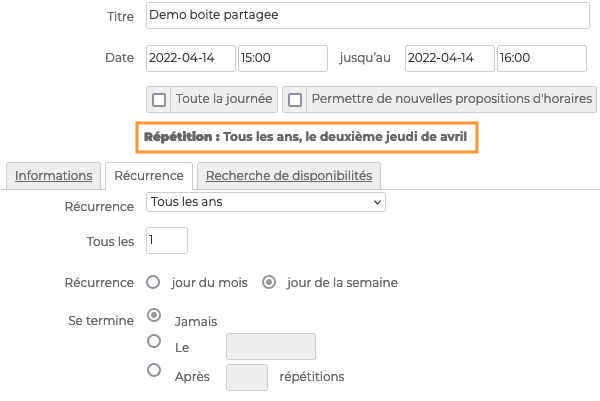

:::tip

La fin de la récurrence peut être programmée en indiquant le nombre de répétitions ou une date de fin.

:::

