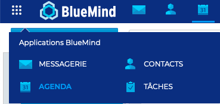
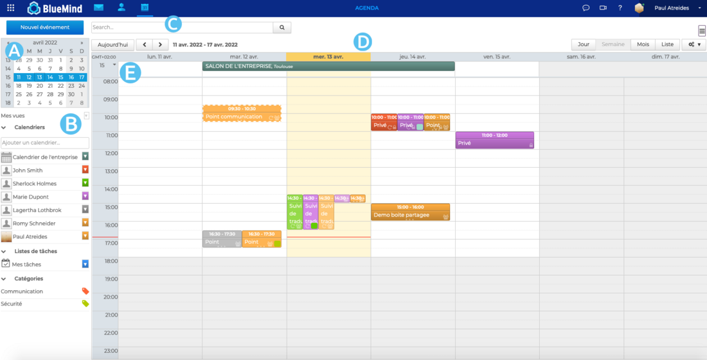

# Découvrir l'agenda

BlueMind intègre un agenda partagé complet, proposant de nombreuses fonctionnalités parmi lesquelles :

- vues jour, semaine, mois et liste
- vues multi-agendas, multi-utilisateurs, groupes
- agendas de ressources
- gestion des vues de type bookmarks
- recherche de créneaux disponibles
- recherche full-text
- gestion de droits et délégations
- synchronisation avec Outlook
- intégration dans Thunderbird
- gestion de la mobilité sur smartphones et tablettes (iphone, ipad, Android, Blackberry)
- synchronisation de calendriers externes
- partage de calendrier vers l'externe
- impressions des agendas
- gestion des récurrences, exceptions, rdv privés,..

## Accéder à l'agenda

**L'accès** à l'agenda s'effectue dans la barre de navigation principale BlueMind.

:::tip

Application par défaut

Par défaut, l'interface s'ouvre sur la messagerie mais peut également **s'ouvrir sur l'agenda**. Pour cela, aller dans les [paramètres du compte](/Guide_de_l_utilisateur/Paramétrer_le_compte_utilisateur/) : **Préférences - Général - Application par défaut**

:::

## Naviguer dans l'interface

**La vue principale **par défaut de l'agenda BlueMind se compose de plusieurs parties :

-  : le calendrier permet d'accéder rapidement à une date en faisant défiler les mois avec les flèches. Cliquer sur la date pour que s'affiche dans la zone principale la période comprenant la date sélectionnée (jour, semaine, mois, selon le paramétrage en cours).
-  : la liste des calendriers actuellement affichés, ainsi que l'accès aux vues et étiquettes
-  : le moteur de recherche permet de rechercher des événements par nom, étiquettes, détails, participant, etc.
-  : la barre d'actions avec, à gauche les boutons pour changer de période, à droite les boutons permettant de choisir le type d'affichage et le menu d'outils pour imprimer, importer, exporter et rafraichir la vue en cours.
-  : la vue principale de l'agenda, affichant avec tous les évènements des calendriers activés dans la zone B

## Reconnaître les caractéristiques d'un évènement

Afin de faciliter la lecture des évènements, leurs **principales informations et propriétés** sont **visibles directement depuis le calendrier**. Sur chaque évènement apparait :

- les horaires, le titre et lieu
- les icônes représentant les propriétés
    - il y a plusieurs participants
    - l'événement est privé
    -  l'événement est récurrent
    -  l'évènement contient des pièces jointes
- la disponibilité de l'utilisateur pendant l'évènement :  indiquée par la bordure claire
- les catégories assignées à l'évènement : indiquées par couleurs en bas à droite

## Identifier les types de calendrier

- **Les calendriers personnels** : par défaut chaque utilisateur interne a un agenda créé en son nom lors de la création de sa messagerie. L'utilisateur peut le gérer et le partager - avec différents niveaux de droits d'accès - aux autres utilisateurs de l’organisation. Il peut également se créer autant de calendriers personnels que nécessaire.
- **Les calendriers de domaine** : ce sont des calendriers permettant d'informer les membres de l'organisation d'évènements généraux, par exemple les jours de fermeture de l'entreprise, les évènements commerciaux, etc. Ces calendriers sont créés par l'administrateur et ne peuvent pas être organisateur de réunions ni être invité.
- **Les calendriers de ressource** : ce sont les calendriers, créés par l'administrateur, permettant aux utilisateurs de réserver les moyens (salle de réunion, véhicule, etc.) mis à leur disposition. La gestion des réservations de la ressource peut-être soit automatique, soit déléguée à un [gestionnaire de ressource](/Guide_de_l_utilisateur/L_agenda_4.7/Gérer_les_réservations_de_ressources/).
- **Les calendriers externes** : en plus de ses calendriers personnels, l'utilisateur peut visualiser un calendrier externe dans son agenda BlueMind

