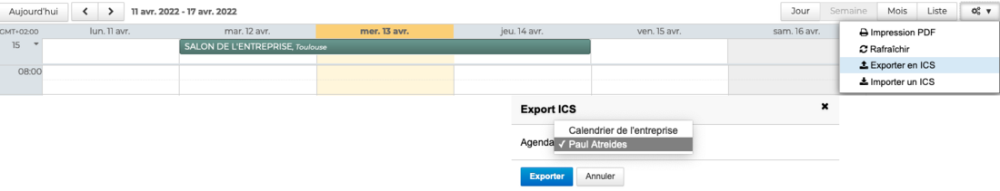

# Importer et exporter un calendrier

## Importer les données d'un agenda externe

Il est possible d'ajouter les évènements issus d'un agenda externe dans un calendrier BlueMind en **important un fichier iCalendar (ics)** : 

- soit dans les paramètres de l'agenda sous **Préférences - Agenda - Mes calendriers**. Se positionner sur le calendrier, cliquer sur **Importer** dans le menu et **déposer le fichier ics**

**

**

- soit dans la **barre d'actions au dessus de l'agenda**. Aller sur  puis "**Importer un ICS**" pour ouvrir la fenêtre pop-up. Sélectionner le fichier ics sur votre ordinateur, choisir le calendrier dans lequel le fichier doit être importé et cliquer sur "**Importer un ICS**"

L'import ICS est possible pour tous les calendriers personnels de l'utilisateur ainsi que pour les [calendriers partagés](/Guide_de_l_utilisateur/L_agenda_4.7/Partager_un_calendrier/) avec des droits d'écriture.

:::tip

Lors de l'import ICS d'un calendrier, les [catégories](/Guide_de_l_utilisateur/Paramétrer_le_compte_utilisateur/) (tags) des évènements sont également importées.

:::

## Exporter un calendrier

Les calendriers BlueMind peuvent également être **exportés dans un fichier ics**.

Pour cela, aller dans la **barre d'actions au dessus de l'agenda**. Aller sur  puis "**Exporter un ICS**" pour ouvrir la fenêtre pop-up. Sélectionner le calendrier à exporter et cliquer sur "**Exporter**"

Tous les calendriers personnels de l'utilisateur ainsi que les [calendriers partagés](/Guide_de_l_utilisateur/L_agenda_4.7/Partager_un_calendrier/) avec des droits de lecture peuvent être exportés en ICS.

