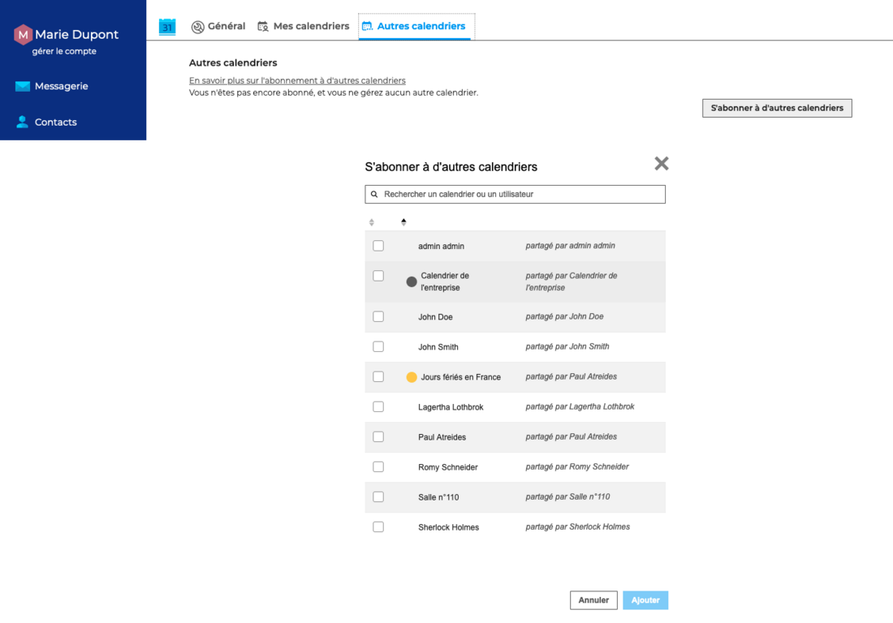
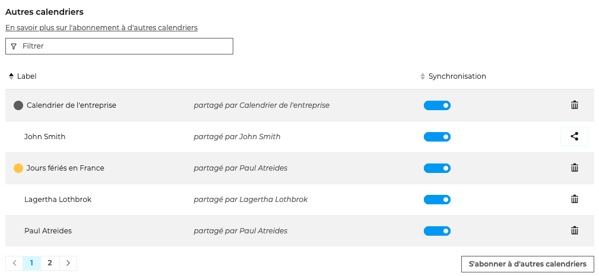

# Utiliser un calendrier partagé

La gestion des calendriers partagés s'effectue dans les paramètres de l'agenda, dans **Préférences - Agenda - Autres calendriers**

****

## S'abonner à un calendrier partagé

Pour s'abonner à un calendrier partagé, cliquer sur "**S'abonner à d'autres calendriers**"

**Sélectionner le(s) calendrier(s)** parmi la liste des calendriers partagés par d'autres utilisateurs ou aux calendriers de domaine puis cliquer sur "**Ajouter**". Les calendriers sélectionnés apparaissent alors dans la liste des "**Autres calendriers**".

## Gérer les partages d'un calendrier partagé

Cliquer sur l'icône de partage  pour ouvrir la fenêtre pop-up et suivre la **procédure de [partage d'un ca](/Guide_de_l_utilisateur/Les_contacts_4.7/Partager_un_carnet_d_adresses/)[lendrier](/Guide_de_l_utilisateur/L_agenda_4.7/Partager_un_calendrier/)**

:::info

Afin de pouvoir modifier les droits d'accès d'un calendrier qui lui a été partagé, l'utilisateur doit avoir les [droits de gestion](/Guide_de_l_utilisateur/L_agenda_4.7/Partager_un_calendrier/) sur le calendrier et être **abonné** au calendrier.

:::

## Supprimer un calendrier partagé

Cliquer sur l'icône de suppression pour se désabonner.

