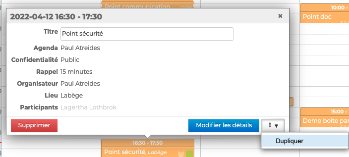
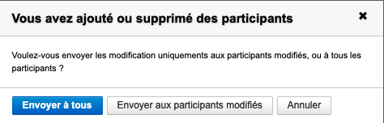
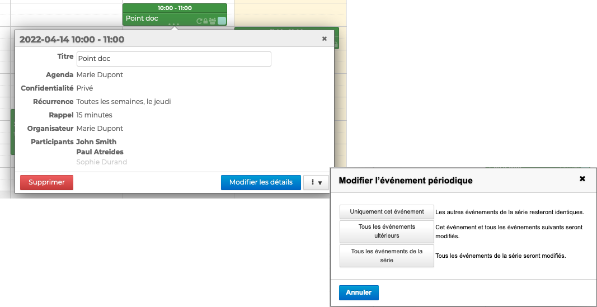
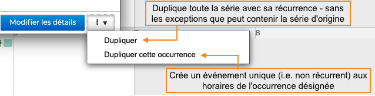
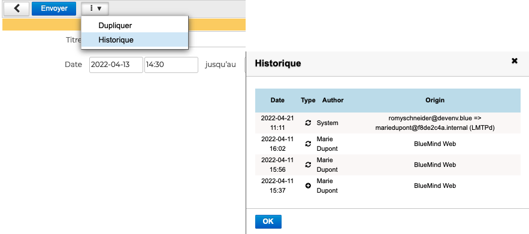

# Éditer un évènement

Une fois l'évènement enregistré et créé, il peut être **supprimé** ou **modifié **à tout moment. 
Il est également possible de **dupliquer** un évènement. Cela permet de réutiliser les informations d'un évènement pour en créer un nouveau similaire.

Pour réaliser l'une de ces actions, **Cliquer sur l'évènement** dans la zone principale de l'agenda, puis **cliquer sur l'action souhaitée** :

## Éditer un évènement individuel

- **Supprimer** : supprime définitivement l'évènement du calendrier

- **Modifier les détails** : ouvre la [fiche de création](/Guide_de_l_utilisateur/L_agenda_4.7/Créer_un_évènement/) de l'évènement => Apporter les modifications souhaitées et enregistrer

- **Dupliquer **: ouvre une nouvelle [fiche de création](/Guide_de_l_utilisateur/L_agenda_4.7/Créer_un_évènement/) d'évènement contenant les mêmes informations, organisateur et propriétés que l'évènement sélectionné => Apporter les modifications souhaitées et enregistrer pour créer le nouvel évènement

## Éditer une réunion en tant qu'organisateur

- **Supprimer** : supprime la réunion du calendrier de l'organisateur et des participants. Ces derniers reçoivent une notification par e-mail indiquant l'annulation de la réunion.

- **Modifier les détails** : ouvre la [fiche de création](/Guide_de_l_utilisateur/L_agenda_4.7/Créer_un_évènement/) de la réunion 
=> Apporter les modifications souhaitées et cliquer sur "Envoyer" pour enregistrer. Les participants reçoivent une notification par e-mail et la réunion se met à jour dans leur calendrier

:::info

Lorsque la seule modification apportée à une réunion est l’**ajout et/ou la suppression d’un ou plusieurs participants**, une fenêtre pop-up propose :

- d'envoyer la nouvelle liste d'invités à l'ensemble des participants, avec leurs statuts de participation (tel que connu de l'organisateur au moment de l'envoi)
- d'envoyer une notification uniquement aux participants ajoutés ou supprimés

:::

- **Dupliquer **: ouvre une nouvelle [fiche de création](/Guide_de_l_utilisateur/L_agenda_4.7/Créer_un_évènement/) d'évènement contenant les mêmes informations, organisateur, propriétés et participants que l'évènement sélectionné 
=> Apporter les modifications souhaitées et cliquer sur "Envoyer" pour enregistrer créer la nouvelle réunion

:::info

Le duplicata de la réunion est considéré comme une nouvelle réunion indépendante :

- Les participants reçoivent une nouvelle invitation
- Les statuts de participation de la réunion d'origine ne sont pas conservés : tous les participants sont placés en statut "en attente de réponse"
- Toute modification sur l'une des réunions (originale ou duplicata) ne sera pas répercutée sur l'autre

:::

:::tip

Voir aussi [Éditer une réunion en tant qu'invité](https://forge.bluemind.net/confluence/pages/viewpage.action?pageId=86743990#id-.Participer%C3%A0un%C3%A9v%C3%A8nementvBM4-%C3%89diteruner%C3%A9unionentantqu%27invit%C3%A9)

:::

## Éditer un évènement récurrent

Pour les évènement récurrents, l'utilisateur peut choisir les évènements qu'il souhaite supprimer ou modifier :

- **Uniquement cet événement** : seul l'événement sur lequel l'utilisateur a cliqué sera modifié, il deviendra une exception de la série qui reste inchangée
- **Tous les événements ultérieurs** : l'événement sur lequel l'utilisateur a cliqué ainsi que toute la suite de la série seront modifiés. Tous les événements antérieurs de la série restent inchangés.
- **Tous les événements de la série** : l'ensemble de la série sera modifié

- **Supprimer** : supprime la série d'évènements ou l'évènement sélectionné du calendrier de l'utilisateur et des participants pour les [réunions](#editerunevenement-reunion). Ces derniers reçoivent une notification par e-mail indiquant l'annulation de la réunion.

- **Modifier les détails** : ouvre la [fiche de création](/Guide_de_l_utilisateur/L_agenda_4.7/Créer_un_évènement/) de l'évènement => Apporter les modifications souhaitées sur la série d'évènements ou l'évènement sélectionné et enregistrer ou cliquer sur "Envoyer" pour les [réunions](#editerunevenement-reunion)

- **Dupliquer** : ouvre une nouvelle [fiche de création](/Guide_de_l_utilisateur/L_agenda_4.7/Créer_un_évènement/) d'évènement contenant les mêmes informations, organisateur, propriétés et participants que l'évènement sélectionné => Choisir de dupliquer l'ensemble des évènements ou une seule occurrence

=> Apporter les modifications souhaitées et enregistrer pour créer un nouvel évènement ou cliquer sur "Envoyer" pour créer une nouvelle [réunion](#editerunevenement-reunion)

## Consulter l'historique

Il est possible de consulter l'historique de création et de modifications d'un évènement depuis sa fiche, en cliquant sur  puis **Historique**

L'historique renseigne sur :

- la date de l'action
- le type d'action : création ("created") ou modification ("updated")
- l'utilisateur ayant effectuée l'action ("author")
- l'origine : client BlueMind, client tiers (lourd ou mobile), etc.

