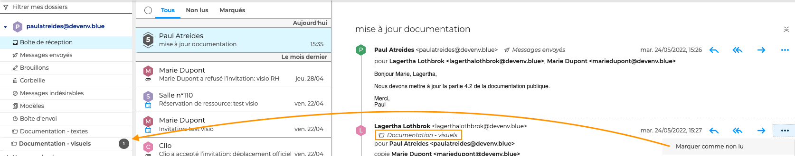

# Classer et suivre les conversations

Lorsque le [mode conversation](Gérer_la_liste_des_messages.md/#gérer-laffichage-de-la-liste-des-messages) est activé, il est possible d'agir sur la conversation, de la même façon que [sur un message](Classer_et_suivre_les_messages.md), ou sur **chaque message séparément**.

Pour cela, cliquer sur la conversation pour afficher **le fil des messages** dans la zone principale puis cliquer sur  pour faire apparaître les boutons d'actions en face de chaque message.

## Déplacer les messages d'une conversation

Chaque message d'une conversation peut-être déplacé dans un [dossier](Organiser_les_dossiers.md) différent. Pour cela, aller sur le menu, cliquer sur "**Déplacer**" et choisir le dossier. Le dossier d'appartenance du message est alors **indiqué dans le fil des messages**.

Chaque fois qu'un message est déplacé dans un dossier, la **conversation est dupliquée dans le dossier**. Une même conversation peut donc être accessible depuis la boite de réception et un ou plusieurs dossiers personnels.

:::info

Lorsque tous les messages d'une conversation sont déplacés dans des dossiers, la conversation disparait de la boite de réception jusqu'à ce qu'un nouveau message soit reçu. Dans ce cas, la conversation réapparait dans la boite de réception et est mise à jour dans chaque dossier.

:::

## Suivre les messages d'une conversation

Pour marquer un message **comme lu, non lu ou important**, aller dans le menu et choisir l'action souhaitée.

L'action est prise en compte sur le message d'origine, c'est-à-dire dans son dossier, mais ne sera pas visible dans les conversations dupliquées dans d'autres dossiers.

Par exemple, si un message est marqué comme non lu dans la conversation depuis la boite de réception, une notification de message non lu apparaitra sur le dossier du message mais pas dans les autres dossiers où la conversation est dupliquée

## Supprimer les messages d'une conversation

Pour déplacer un message dans la corbeille, aller sur le menu et cliquer sur "**Supprimer**". Le message sera alors **effacé de la conversation** dans tous les dossiers.

Pour rétablir le message, aller sur le message dans **la corbeille**, cliquer sur "**Déplacer**" et choisir le dossier. Le message réapparaitra alors dans tous les dossiers où la conversation est dupliquée.

Pour supprimer un message définitivement, aller dans le menu et cliquer sur "**Supprimer définitivement**". Le message sera alors effacé de la conversation dans tous les dossiers, *sans possibilité de le rétablir*.