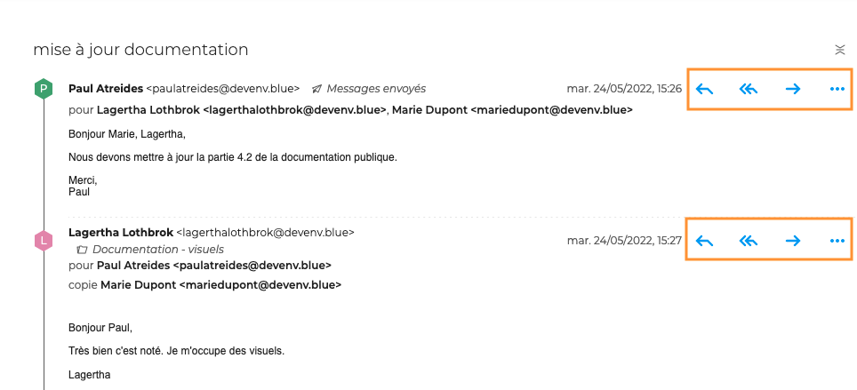
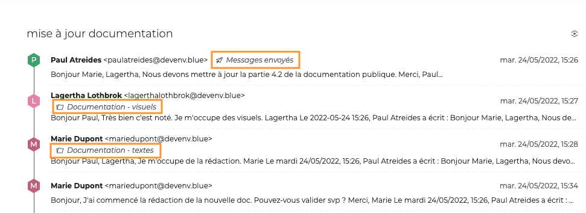
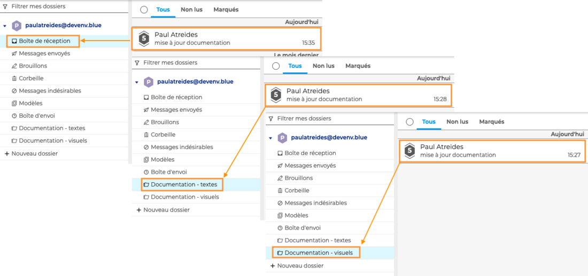
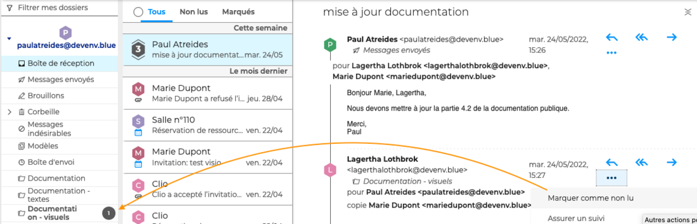
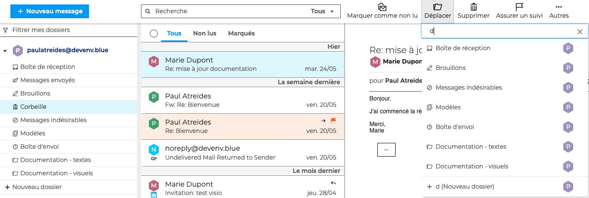
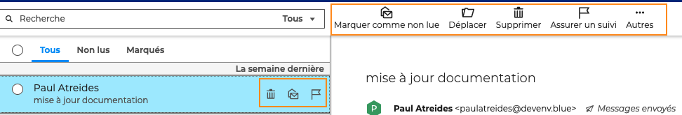
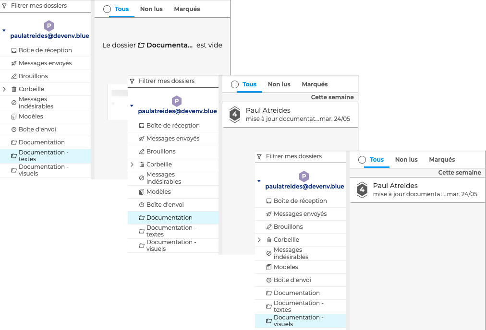
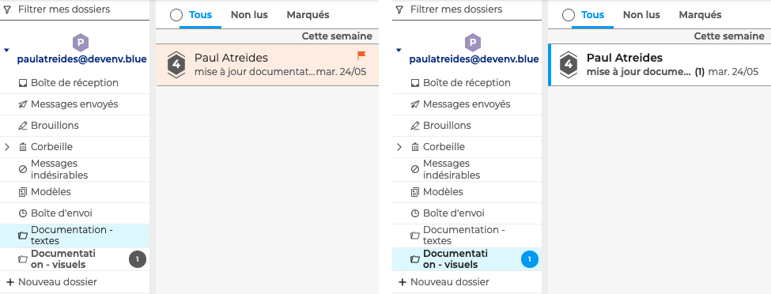
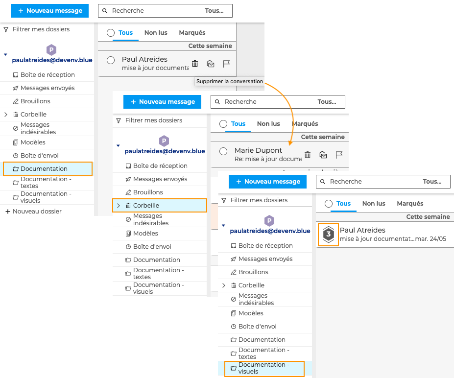

# Classer et suivre les conversations

Lorsque le [mode conversation](Gerer_la_liste_des_messages.md/#gérer-laffichage-de-la-liste-des-messages) est activé, il est possible d'agir sur la [conversation dans son ensemble](#agir-sur-une-conversation-dans-son-ensemble) ou sur [chaque message séparément](#agir-sur-un-message-dune-conversation).

## Agir sur un message d'une conversation

Pour agir sur le message d'une conversation, cliquer sur la conversation pour afficher **le fil des messages** dans la zone principale puis cliquer sur  pour faire apparaître les boutons d'actions en face de chaque message.

### Déplacer un message d'une conversation

Chaque message d'une conversation peut-être déplacé dans un [dossier](Organiser_les_dossiers.md) différent. Pour cela, aller sur le menu du message, cliquer sur "**Déplacer**" et choisir le dossier. Le dossier d'appartenance du message est alors **indiqué dans le fil des messages**.

Chaque fois qu'un message est déplacé dans un dossier, **seul le message est déplacé** mais la **conversation dans son ensemble est visible dans le dossier**. Une même conversation peut donc être accessible depuis la boite de réception et un ou plusieurs dossiers personnels.

:::info

Lorsque tous les messages d'une conversation sont déplacés dans des dossiers, la conversation disparait de la boite de réception jusqu'à ce qu'un nouveau message soit reçu. Dans ce cas, la conversation réapparait dans la boite de réception et est mise à jour dans chaque dossier.

:::

### Suivre un message d'une conversation

Pour marquer un message **comme lu, non lu ou important**, aller dans le menu du message et choisir l'action souhaitée.

**L'action sur ce message est prise en compte dans sa conversation** s'ils partagent le même dossier, mais ne sera pas visible dans les conversations dupliquées dans d'autres dossiers

Par exemple, si un message est marqué comme non lu dans la conversation depuis la boite de réception, un compteur de messages non-lus apparaîtra sur le dossier du message mais pas dans les autres dossiers où la conversation est dupliquée.

### Supprimer un message d'une conversation

Pour déplacer un message dans la corbeille, aller sur le menu du message et cliquer sur "**Supprimer**". Le message sera alors **effacé de la conversation** dans tous les dossiers.

Pour rétablir le message, aller sur le message dans **la corbeille**, cliquer sur "**Déplacer**" et choisir le dossier. Le message réapparaitra alors dans tous les dossiers où la conversation est dupliquée.

Pour supprimer un message définitivement, aller dans le menu et cliquer sur "**Supprimer définitivement**". Le message sera alors effacé de la conversation dans tous les dossiers, ***sans possibilité de le rétablir***.

## Agir sur une conversation dans son ensemble

Les menus et boutons d'actions sur une conversation dans son ensemble sont **les mêmes que pour les messages** lorsque le mode conversation n'est pas activé. 
Voir [Classer et suivre les messages](Classer_et_suivre_les_messages.md)

### Déplacer une conversation

Cliquer sur "**Déplacer**" dans le menu général, ou **glisser-déposer** la conversation dans le dossier souhaité.

**L'action est contextualisée** : déplacer une conversation correspond à déplacer ses messages appartenant au même dossier. Les messages qui ne sont pas classés dans le même dossier ne seront pas déplacés.

La conversation ne sera donc plus visible dans le dossier d'origine car il n'y aura plus aucun message lié à la conversation. La conversation (dans son ensemble) sera visible dans le nouveau dossier, ainsi que dans les dossiers où sont classés les autres messages de la conversation.

Par exemple ici, la conversation a été déplacée du dossier "Documentation - texte" vers le dossier "Documentation". La conversation a donc disparu du dossier "Documentation - textes" et est visible dans le dossier "Documentation". La conversation est toujours visible dans le dossier "Documentation - visuels" car un message de la conversation est classé dans ce dossier.

### Suivre une conversation

Pour **marquer une conversation comme importante ou comme non lue**, aller dans le menu général et cliquer sur le bouton souhaité.

**L'action est contextualisée** : lorsqu'une conversation est marquée comme importante, le drapeau de notification sera visible uniquement dans le dossier où l'action a été activée, pas dans les autres dossiers. De même pour une conversation marquée comme non lue.

Par exemple ici, la conversation est marquée comme non lue dans le dossier "Documentation - visuels" et comme importante dans le dossier "Documentation - textes"

### Supprimer une conversation

Pour déplacer une conversation dans la corbeille, cliquer sur "**Supprimer**" dans le menu général ou au survol de la conversation dans la liste des messages.

**L'action est contextualisée** : supprimer une conversation correspond à supprimer ses messages appartenant au même dossier. Les messages qui ne sont pas classés dans le même dossier ne seront pas supprimés.

La conversation ne sera donc plus visible dans le dossier d'origine car il n'y aura plus aucun message. Les messages de la conversation appartenant au dossier sont dans corbeille. La conversation, sans les messages mis à la corbeille, est visible dans les dossiers où sont classés les autres messages de la conversation.

Par exemple ici, la conversation du dossier "Documentation" est placée dans la corbeille. Le message appartenant au dossier "Documentation" est dans la corbeille. La conversation est toujours visible dans la dossier "Documentation - visuels" mais sans le message placé dans la corbeille, il n'y a plus que 3 messages au lieu de 4 auparavant.

