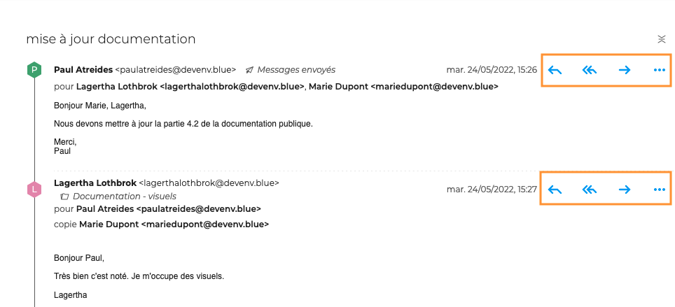
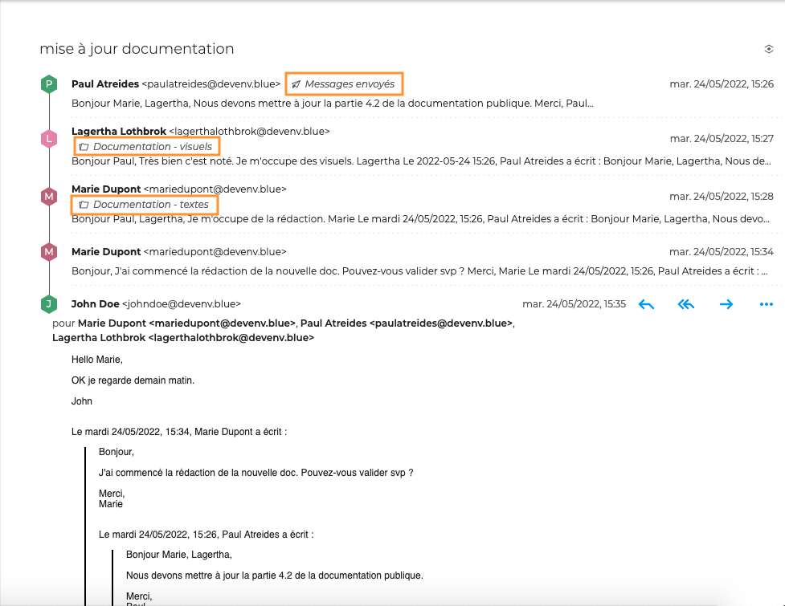
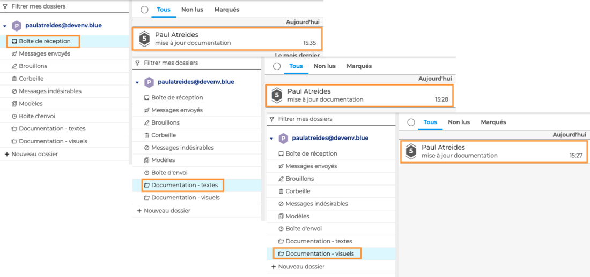
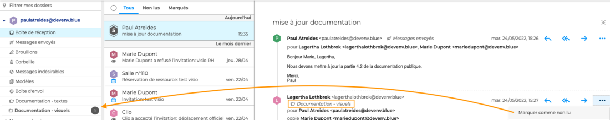

# Classer et suivre les conversations

Lorsque le [mode conversation](Gérer_la_liste_des_messages.md/#gérer-laffichage-de-la-liste-des-messages) est activé, il est possible d'agir sur l'ensemble de la conversation, [de la même façon qu'un message](Classer_et_suivre_les_messages.md), ou sur chaque message séparément.

Pour cela, cliquer sur la conversation afin d'afficher le fil des messages dans la zone principale puis cliquer sur  pour faire apparaître les boutons d'actions en face de chaque message.

## Déplacer les messages d'une conversation

Pour déplacer le message d'une conversation, cliquer sur "**Déplacer**" dans le menu puis sélectionner [le dossier](Organiser_les_dossiers.md).
Chaque message peut-être déplacé dans un dossier différent. La conversation est alors dupliquée dans chaque dossier. 

Le dossier dans lequel le message est classé apparait en italique dans le fil de la conversation.

:::info

Lorsque tous les messages d'une conversation sont déplacés dans un ou plusieurs dossiers, la conversation disparait de la boite de réception jusqu'à ce qu'un nouveau message soit reçu. La conversation, dans son ensemble, est alors visible dans la boite de réception ainsi que dans chaque dossier

:::

## Suivre les messages d'une conversation

Pour **marquer un message comme important, lu ou non lu**, aller dans le menu et chosir l'action souhaitée. 

L'action est alors **visible uniquement sur le message d'origine**, c'est-à-dire dans le dossier auquel il appartient.

Par exemple, si un message est marqué comme non lu dans la conversation depuis la boite de réception, une notification de message non lu apparaitra sur la conversation dans le dossier du message marqué mais pas dans les autres dossiers.

## Supprimer les messages d'une conversation

Pour **déplacer un message dans la corbeille**, aller dans le menu et cliquer sur "**Supprimer**". Le message sera effacé de l'ensemble des conversations, quelque soit le dossier. 

Pour **rétablir le message**, aller dans la corbeille et déplacer le message vers le dossier souhaité. Le message réapparait alors dans toutes les conversations.

Pour supprimer définivitement un message, sans le déplacer dans la corbeille, aller dans le menu et cliquer sur "**Supprimer définitivement**". Le message est alors supprimé de l'ensemble des conversations, quelque soit le dossier et ne pourra pas être rétabli.