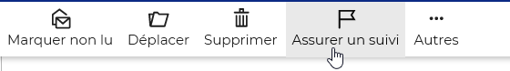
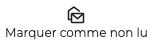
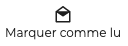
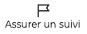
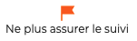
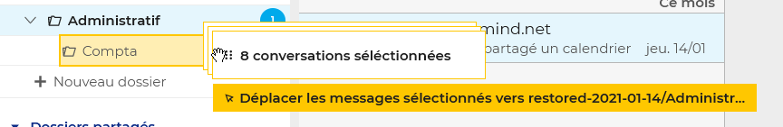
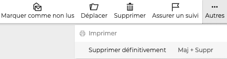

# Classer et suivre les messages

**L'ensemble des actions** possibles sur un message est disponible dans barre d'action au dessus de celui-ci :

Les **actions principales** sont également accessibles au survol d'un message dans la [liste des messages:](/Guide_de_l_utilisateur/La_messagerie/Gérer_la_liste_des_messages/)

Lorsque **plusieurs messages**s ont sélectionnés, les actions possibles apparaissent dans la barre d'action et dans la zone d'affichage principale :

## Suivre les messages

Les actions permettant de suivre et/ou de mettre en avant certains messages sont :

- **Marquer non lu**: les messages non lus apparaissent en gras dans la liste des messages

→ Cliquer sur **Marquer comme non lus** pour annuler l'action 

- **Assurer un suivi**: marque les messages d'un drapeau "important" 

→ Cliquer sur **Ne plus assurer le suivi** pour retirer le drapeau 

:::tip

Ces deux actions permettent également de retrouver les messages rapidement grâce aux filtres en haut de la [liste des messages](/Guide_de_l_utilisateur/La_messagerie/Gérer_la_liste_des_messages/)

:::

## Déplacer un message

Pour classer un ou plusieurs messages dans un dossier, choisir l'action **Déplacer**. Un menu s'ouvre permettant de rechercher le dossier ou d'en créer un nouveau si besoin.

Les messages peuvent également être déplacés par **glisser-déposer** simplement en prenant le ou les messages à déplacer

Un message de confirmation indique que l'opération a été réalisée. Cliquer sur le nom du dossier dans le message pour être automatiquement redirigé vers le dossier de destination :

## Supprimer des messages

L'action **supprimer le message**  dans la barre d'action ou au survol du message dans la liste le déplace dans la corbeille.

Pour le supprimer de façon définitive (sans aller dans la corbeille), aller dans **Autres** et cliquer sur **Supprimer définitivement**

:::tip

La suppression de messages est possible sur un ou plusieurs messages simultanément.

:::

