# Envoyer un message

## Créer un message

- Pour envoyer un **nouveau message,** cliquer sur  en haut de la colonne de gauche ou dans le composeur.

- Pour **répondre à** un message ou le **transférer,** utiliser les commandes en haut à droite du message

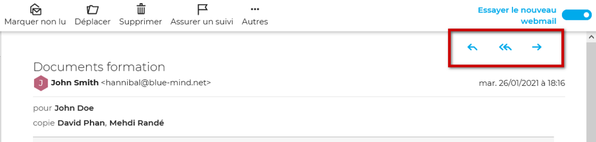

- Pour **modifier un message reçu** et le renvoyer ou le transférer, aller sur Autres puis **Éditer en tant que nouveau message**

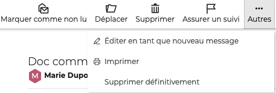

Après avoir choisi l'une de ces actions, le **composeur de la messagerie** BlueMind s'ouvre dans la partie droite de l'interface :

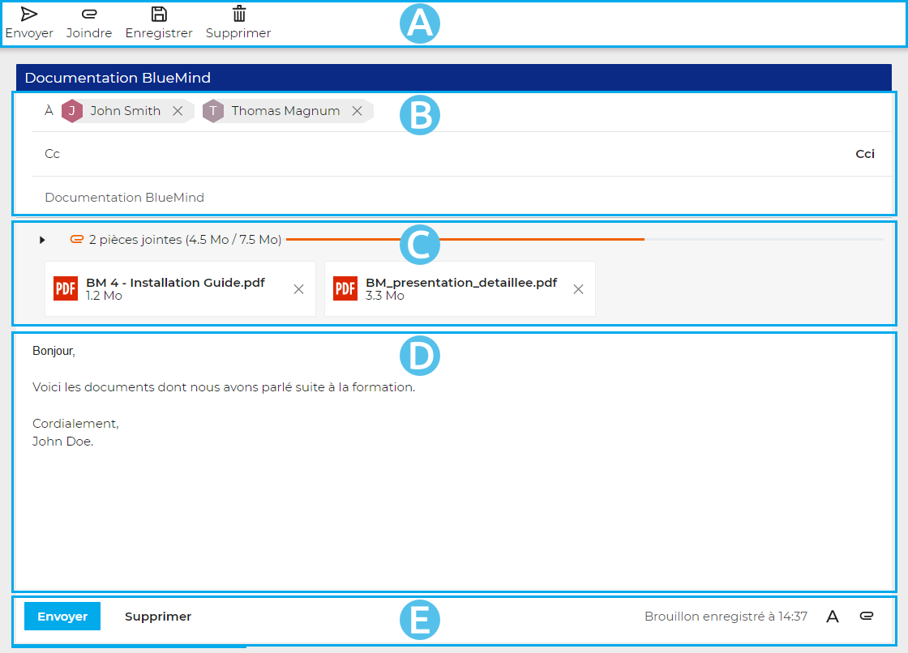

-  : la barre d'outil principale vous propose les actions disponibles pour le message en cours de rédaction : envoyer, joindre un fichier, enregistrer le brouillon, supprimer le message, afficher le champ "De"
-  : cette zone présente les champs d'adresses (de, à, cc, cci) ainsi que l'objet du message
-  : cette zone présente les pièces jointes au messages. Cette zone peut être dépliée ou repliée pour plus ou moins d'informations à propos des fichiers
-  : la zone de rédaction du message
-  : en plus de l'information d'enregistrement, cette zone propose une répétition des boutons d'action principaux pour un accès intuitif et facilité : à gauche, on retrouve les boutons d'enregistrement et suppression du message, à droite un accès à la mise en forme, à l'ajout de pièces jointes ainsi que l'insertion d'une signature, utilisation un modèle et l'affichage du champ 'De"

## Choisir les destinataires

**Pour ajouter un destinataire**, saisir les premiers caractères. Les champs de destinataires (À, Cc ou Cci) proposent des résultats par recherche parmi [tous les contacts](../Les_contacts/Decouvrir_les_contacts.md/#identifier-les-types-de-contacts) des carnets d'adresses de l'utilisateur et de l'[annuaire](../Les_contacts/Utiliser_un_carnet_d_adresses_partage.md/#utiliser-lannuaire).

- Le champ «**À**» permet de saisir le ou les destinataires principaux du message.

- Le champ «**CC**» (« Copie Carbone ») permet d'ajouter des destinataires en copie
- Le bouton «**CCi**» (« Copie Carbone invisible ») permet d'ajouter un champ de saisie pour des destinataires en **copie cachée**.

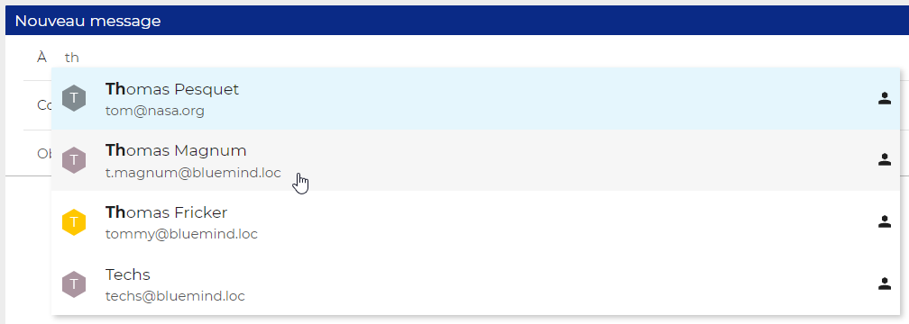

Pour **valider l'ajout du contact**, cliquer sur le contact souhaité ou valider avec entrée

Un contact peut aussi être **saisi manuellement** : écrire (ou copier/coller) dans le champ l'adresse e-mail puis valider avec la touche entrée ou en tapant un caractère de séparation (espace, virgule, point-virgule...)

**Pour supprimer un destinataire**, cliquer sur la croix de suppression dans le cartouche à son nom

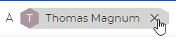

## Choisir l'expéditeur

Le champ de l'**expéditeur** peut être affiché en sélectionnant l'option "**Afficher le champ "De"**" dans la barre d'outil principale sous "Autres". Cela permet de pouvoir choisir l'[identité](/Guide_de_l_utilisateur/La_messagerie/Gérer_les_identités_du_compte/) avec laquelle l'e-mail doit être envoyé.

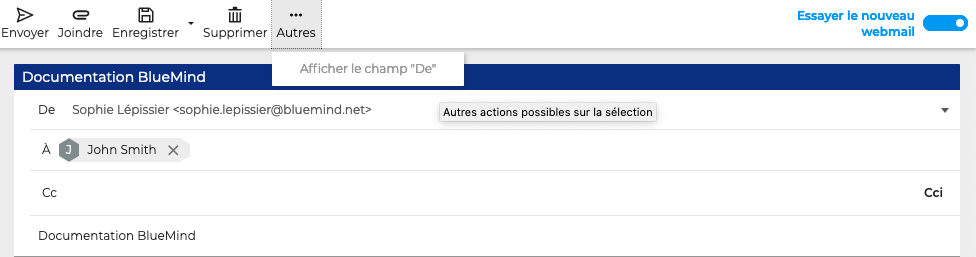

## Éditer le contenu du message

Pour modifier la police du texte, ajouter un lien, créer une liste ou ajouter une image, **utiliser le bouton de mise en forme**  dans la barre d'action en bas à droite du composeur **ou sélectionner le texte à modifier** et utiliser les actions qui apparaissent automatiquement.

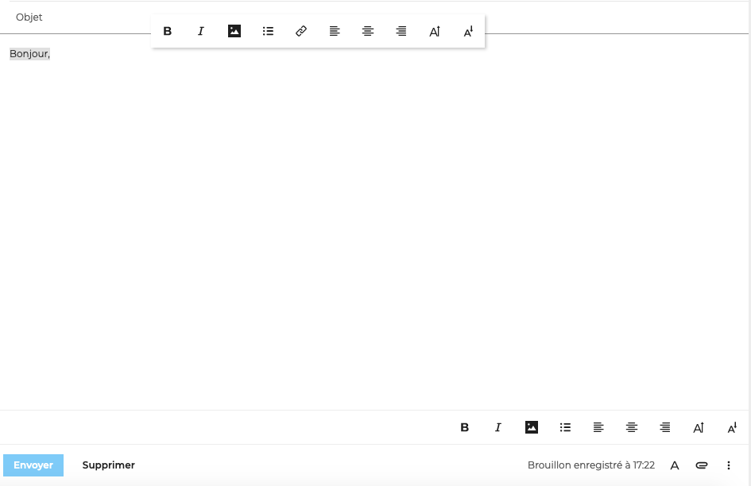

Les messages en cours d'édition s'enregistrent automatiquement comme brouillon. Pour le retrouver et reprendre l'édition ultérieurement, aller dans le dossier **Brouillons** de la [liste des dossiers](/Guide_de_l_utilisateur/La_messagerie/Organiser_les_dossiers/).

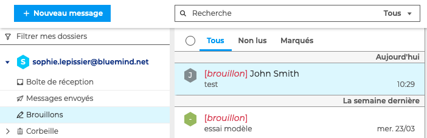

:::tip

Pièces jointes
Les images et autres fichiers peuvent également être ajoutés en [pièces jointes](/Guide_de_l_utilisateur/La_messagerie/Ajouter_des_pièces_jointes/)
:::

## Utiliser un modèle

Il est possible d'enregistrer un message comme modèle afin de s'en resservir ultérieurement. Le message s'enregistrera dans le dossier **Modèles**.

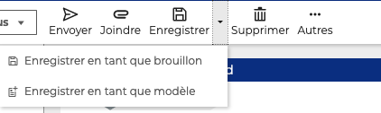

Pour rédiger un message à partir d'un modèle, utiliser l'action "**Utiliser un modèle**" dans la barre d'action en bas à droite du composeur.

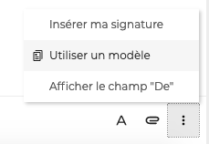

## Ajouter une signature

Pour ajouter une signature à un message, utiliser l'action "**Insérer ma signature**" dans la barre d'action en bas à droite du composeur

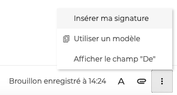

Pour **ajouter une signature automatiquement** aux messages, aller dans les paramètres : **Préférences - Messagerie - Général - Signatures** et cocher l'option "**Ajouter la signature automatiquement**".

:::tip

BlueMind permet aux utilisateurs d'utiliser **différentes signatures en fonction de l'expéditeur**. Les signatures sont paramétrées dans les [identités](/Guide_de_l_utilisateur/La_messagerie/Gérer_les_identités_du_compte/) du compte.

:::

:::info

Lorsqu'une **signature d'entreprise** a été paramétrée par l'administrateur, l'option "Ajouter ma signature" n'est pas disponible.

La signature d'entreprise ne peut pas être modifiée. Cependant, l'administrateur peut la paramétrer de façon à s'adapter automatiquement aux différentes identités des utilisateurs.

Par exemple ici, les signatures sont différentes selon que John Smith écrit en son nom ou au nom de la [boite aux lettres partagée](/Guide_de_l_utilisateur/La_messagerie/Utiliser_une_messagerie_partagée/) du service documentation :

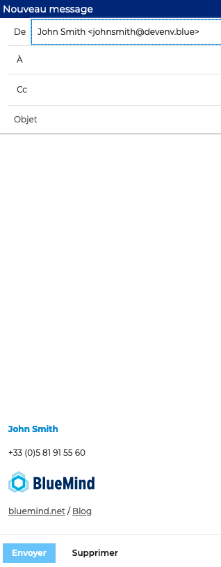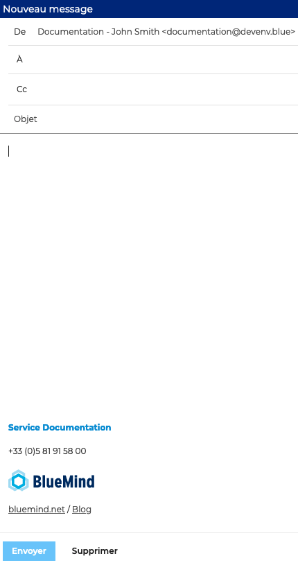

*La possibilité de choisir l'emplacement de la signature dans le corps de l'e-mail sera disponible prochainement.*

:::

