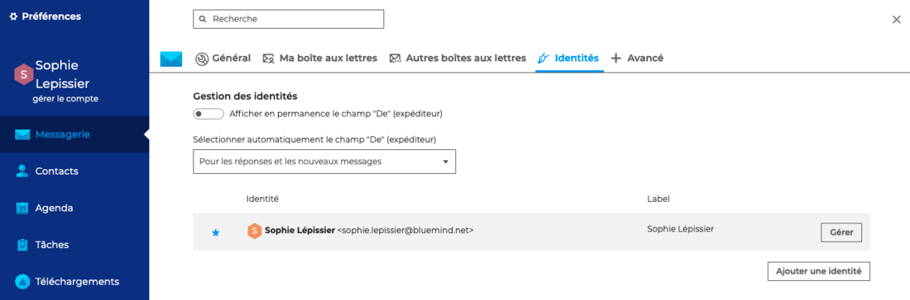
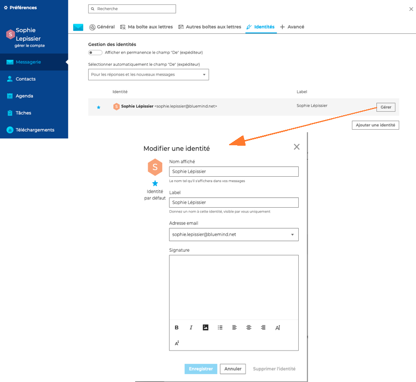
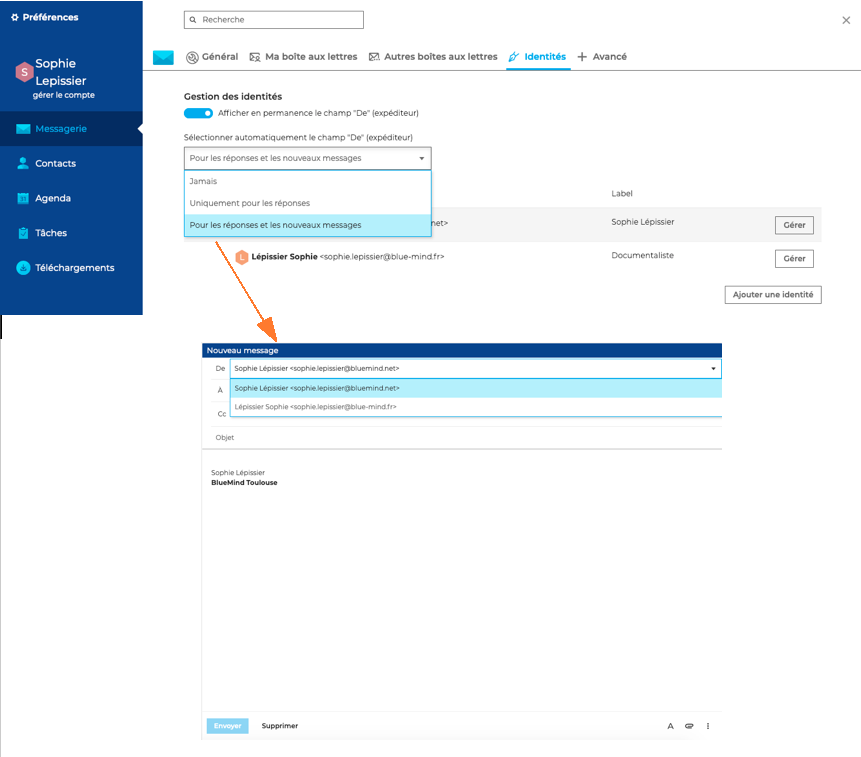

# Gérer les identités du compte

BlueMind permet de créer plusieurs "**identités**" pour un même compte, avec un libellé, un e-mail et une signature différente pour chacune d'entre elles

La gestion des identités se fait dans les paramètres de la messagerie. Pour modifier et ajouter des identités, aller sur **Préférences - Messagerie - Identités**

## Modifier une identité

Une identité est créée par défaut par BlueMind. Pour la modifier, aller sur "**Gérer**" puis renseigner les champs : 

- **Nom affiché** est le nom qui apparaîtra dans les messages envoyés

- **Label** sert à distinguer l'identité parmi la liste, une même adresse et un même nom d'affichage pouvant être utilisés dans plusieurs identités

- **Adresse email** : il est possible de choisir l'une des adresses de messagerie qui sont affectées ou partagées au compte utilisateur : alias de domaines, boites partagées, etc.

- **Signature** : rédaction de la signature au format HTML, avec possibilité d'insérer les images, logos, etc.

## Créer une identité

**"Ajouter une identité"** permet de créer d'autres identités avec, par exemple, une signature différente. Il est également possible de choisir l'identité par défaut, c'est-à-dire l'identité qui sera sélectionnée par défaut lors de la création d'un nouveau message.

:::tip

La possibilité de créer une identité pour une adresse hors BlueMind sera disponible dans une prochaine version.

:::

## Paramétrer le champ Expéditeur

Pour voir et sélectionner l'expéditeur (identité) lors de l'envoi de messages, cocher l'option **"Afficher en permanence le champs "De" (expéditeur)"**.

**"Sélectionner automatiquement le champ "DE" (expéditeur)"** permet de préciser dans quel contexte l'application pourra choisir automatiquement l'identité la plus adaptée : jamais, uniquement pour les réponses ou pour les réponses et les nouveaux messages.

:::tip

Il est également possible d'afficher l'expéditeur (champs "De") de façon occasionnelle en sélectionnant l'option "Afficher le champ "De"" dans la barre d'outils du [composeur](/Guide_de_l_utilisateur/La_messagerie/Envoyer_un_message/).

:::

