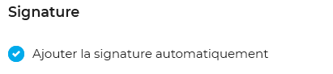

# Préférences du webmail

# Présentation

Encore en développement, la gestion des préférences du webmail propose des options de personnalisation de l'interface en constante évolution.

# Accès

Les préférences sont accessibles depuis le menu en haut à droite de la page :

# Préférences d'affichage

La densité d'affichage permet de paramétrer la liste des messages afin d'afficher plus ou moins d'informations et ainsi avoir un affichage plus complet ou diminuer les informations mais afficher plus de messages dans le même espace :

# Signature

L'option "Ajouter la signature automatiquement" permet d'activer ou désactiver les signatures paramétrées dans les [identités](/Guide_de_l_utilisateur/La_messagerie/Les_identités/) du compte.

# Préférences générales BlueMind

Un lien en colonne de droite, sous le nom d'utilisateur, permet de basculer vers les [Paramètres utilisateur BlueMind](/Guide_de_l_utilisateur/Paramètres_utilisateur/) :

