# Messagerie BlueMind

# Présentation

BlueMind a développé un tout nouveau webmail basé sur les technologies web proposées par les navigateurs récents : Web App Javascript, elle offre une ergonomie repensée et intuitive, avec les 3 volets adaptés aux écrans larges. Elle permet surtout un fonctionnement plus rapide et fluide grâce à l'utilisation du stockage local du navigateur.

Cette application, encore en beta, ne couvre pas encore le périmètre complet de l'ancien webmail. Elle est toutefois fonctionnelle. Vous pouvez bien sûr passer de la nouvelle web app à l'ancien webmail en conservant toutes vos données. Les fonctionnalités de cette application web vont s'enrichir progressivement pour offrir les mêmes fonctionnalités que l'ancien webmail.

Nous vous invitons donc à la tester et l'expérimenter dès maintenant ! Nous vous conseillons tout de même d'être vigilants car des dysfonctionnements peuvent malgré tout survenir dans cette version beta.

Nous attendons vos retours avec impatience !

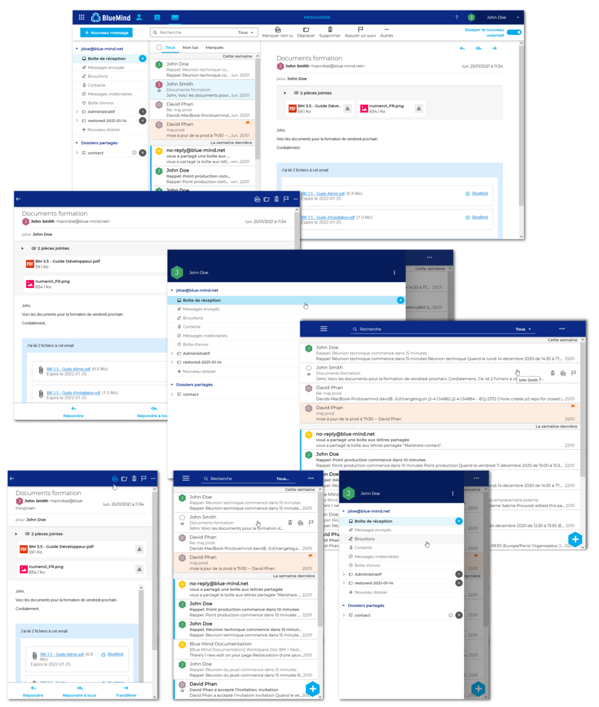

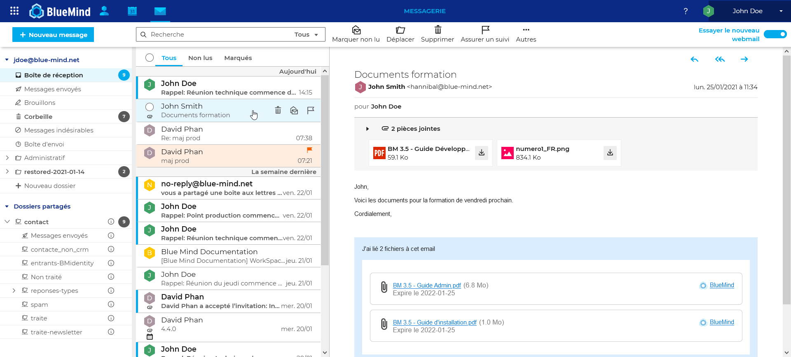

# Tester le nouveau client de messagerie

Les administrateurs doivent [installer et mettre à disposition des utilisateurs le nouveau webmail](/Guide_d_installation/Installation_du_nouveau_client_de_messagerie/).

Une fois fait, un commutateur permet de basculer entre la messagerie classique et le nouveau webmail BlueMind, en haut à droite de la messagerie :

L'utilisateur a aussi la possibilité de basculer depuis la gestion de ses paramètres, rubrique messagerie :

# Affichage

## Le bandeau de navigation

Le bandeau du haut de la fenêtre a été modernisé et harmonisé avec la nouvelle interface. Il permet :

- de passer d'une application à l'autre dans sa partie gauche :
- d'accéder aux préférences et se déconnecter dans sa partie droite :
-  d'accéder directement à la documentation BlueMind en ligne grâce au point d'interrogation en partie droite :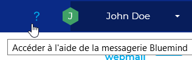

## Le client de messagerie (webmail)

La vue principale de la messagerie est une vue en 3 colonnes :

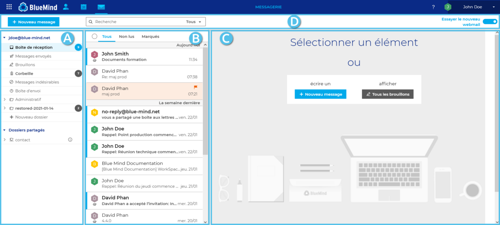

1  **Colonne de gauche**  : l'arborescence de dossiersElle propose les dossiers dans des arborescences séparées et repliables, permettant ainsi le regroupement des dossiers de l'utilisateur d'une part et des boîtes partagées d'autre part.
1  **Colonne du milieu**  : la liste des messages contenus dans le dossier sélectionné en colonne ADes filtres en haut de liste permettent de n'afficher que certains types de messages et le passage de la souris sur un message fait apparaître des informations et actions possibles.
1  **Colonne de droite**  : la zone d'affichage principale Elle présente les actions possibles en guise d'accueil ou le message sélectionné s'il y a lieu.
1  **Barre d'action**  : elle comprend le bouton de création de nouveau message, le moteur de recherche et les boutons des actions possibles selon l'affichage en cours (actions sur un message lorsqu'il est affiché ou actions groupées possibles lorsque plusieurs messages sont sélectionnés)

# La liste des dossiers

## Présentation

La colonne de gauche présente la liste hiérarchique des dossiers accessibles par l'utilisateur, en lecture ou en lecture-écriture, triés en 2 arborescences repliables :

1 **Le compte de l'utilisateur** regroupe ses dossiers propres : dossiers par défaut (boîte de réception, messages envoyés, corbeille, etc.) suivis des dossiers créés par l'utilisateur triés par ordre alphabétique
1 **Dossiers partagés** : regroupe les boîtes partagées sur lesquelles l'utilisateur a un droit de lecture ou d'écriture.

:::important

Boîtes utilisateurs

A l'heure actuelle de la version de test du webmail, les boîtes d'utilisateurs n'apparaissent pas encore. Cela sera effectif dans la version définitive.

:::

Lorsqu'un dossier est sélectionné :

- les messages qu'il contient s'affichent dans la colonne du milieu
- le nom du dossier apparait sur fond bleu
- la puce indiquant le nombre de messages non lus dans le dossier apparait en bleu vif :

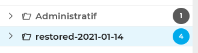 *Ici le dossier "restored-2021-01-14" est sélectionné*

En passant la souris sur un dossier, un menu apparait, proposant les actions possibles sur ce dossier et les messages qu'il contient :

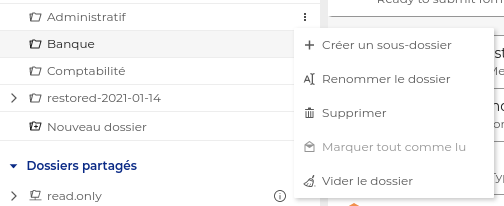

Les actions actuellement disponibles sont :

- **Créer un sous-dossier** (voir détails ci-après)
- **Renommer le dossier** (voir détails  ci-après)
- 
**Supprimer**
:::important
La suppression d'un dossier et de son contenu est une suppression définitive : les messages contenus dans le dossier ne sont pas placés à la corbeille.
:::

- **Marquer tout comme lu** : tous les messages du dossier sont marqués comme lus

:::important

L'action "Vider le dossier" sera disponible dans la version 4.5 de BlueMind. Elle sera applicable à tous les dossiers et non à la corbeille seulement.

:::

## Gestion des dossiers

La gestion des dossiers se fait directement depuis la liste des dossiers.

### Créer un dossier

- En bas de l'arborescence de l'utilisateur, se trouve une entrée "Nouveau dossier" :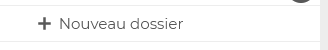
- Cliquer dessus pour faire apparaître le champs de saisie :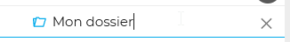 
  - Pour valider la création : appuyer sur &lt;Entrée>
  - Pour annuler la création : appuyer sur &lt;Echap> ou cliquer sur la croix en fin de ligne

### Créer un sous-dossier

- Se placer sur le dossier parent du dossier que l'on veut créer
- Dérouler le menu (voir ci-dessus)
- Cliquer sur "Créer un sous-dossier", un nouveau dossier apparait sous le dossier sélectionné avec un champ permettant de saisir le nom :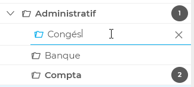
  - Pour valider la création : appuyer sur &lt;Entrée>
  - Pour annuler la création : appuyer sur &lt;Echap> ou cliquer sur la croix en fin de ligne

### Renommer un dossier

- Se placer sur le dossier que l'on veut renommer
- Dérouler le menu (voir ci-dessus)
- Cliquer sur "Renommer le dossier", le nom du dossier devient modifiable :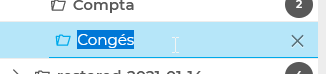 
  - Pour valider la création : appuyer sur &lt;Entrée>
  - Pour annuler la création : appuyer sur &lt;Echap> ou cliquer sur la croix en fin de ligne

### Supprimer un dossier

- Se placer sur le dossier que l'on veut supprimer
- Dérouler le menu (voir ci-dessus)
- Cliquer sur "Supprimer"
- L'interface présente une demande de confirmation
- Si l'utilisateur valide, le dossier et les messages qu'il contient sont supprimés.

:::important
La suppression d'un dossier et de son contenu est une suppression définitive : les messages contenus dans le dossier ne sont pas placés à la corbeille.
:::

### Déplacer un dossier

Cette fonctionnalité n'est pas encore disponible dans la version test du webmail.

Pour contourner cela, il faut procéder à un déplacement des messages qu'il contient :

- Créer le dossier de destination à l'endroit souhaité
- Se rendre dans le dossier source
- Sélectionner l'ensemble des messages (bouton "Tous" en haut de liste)
- Déplacer les messages en les faisant glisser dans le nouveau dossier (voir ci-après)

# Liste des messages

## Présentation

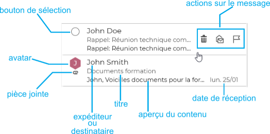
:::important

La liste des messages est actuellement triée par date uniquement, cela est amené à évoluer.

:::

Les messages non lus sont signalés par un bandeau bleu en début de ligne et leur texte est en gras :

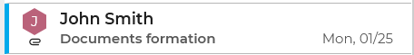

En haut de liste, 3 champs permettent de filtrer l'affichage :

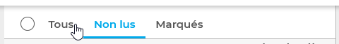

- **Tous**
- **Non lus**
- **Marqués** : affiche seulement les messages marqués comme important

Le bouton radio devant les filtres permet de sélectionner l'ensemble des messages actuellement affichés.

Pour personnaliser l'affichage de la liste des messages, consultez la page [Préférences du webmail](/Guide_de_l_utilisateur/La_messagerie/Messagerie_BlueMind/Préférences_du_webmail/)

## Actions sur les messages

### Actions directes

Les actions principales sont accessibles au survol d'un message dans la liste :

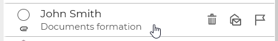

Un message peut ici être :

- sélectionné
- supprimé
- marqué comme lu/non lu
- marqué comme suivi/non suivi

### Sélectionner des messages

#### Sélectionner un ou plusieurs messages

Lors du survol d'un message, un bouton radio apparait, permettant de le sélectionner. Cliquer sur les boutons du ou des messages désirés pour les sélectionner :

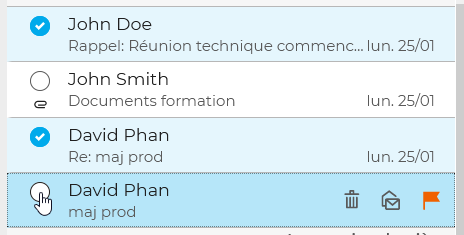

#### Sélectionner tous les messages

Le bouton radio en haut de liste permet de sélectionner/désélectionner l'ensemble des messages du dossier, selon le filtre activé :

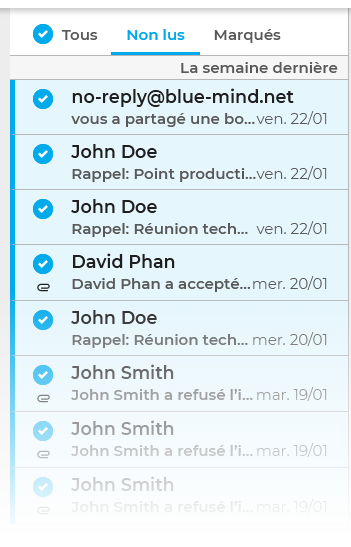

### Actions groupées sur des messages

Lorsqu'un ou plusieurs messages sont sélectionnés, les actions possibles apparaissent dans la barre d'action et dans la zone d'affichage principale :

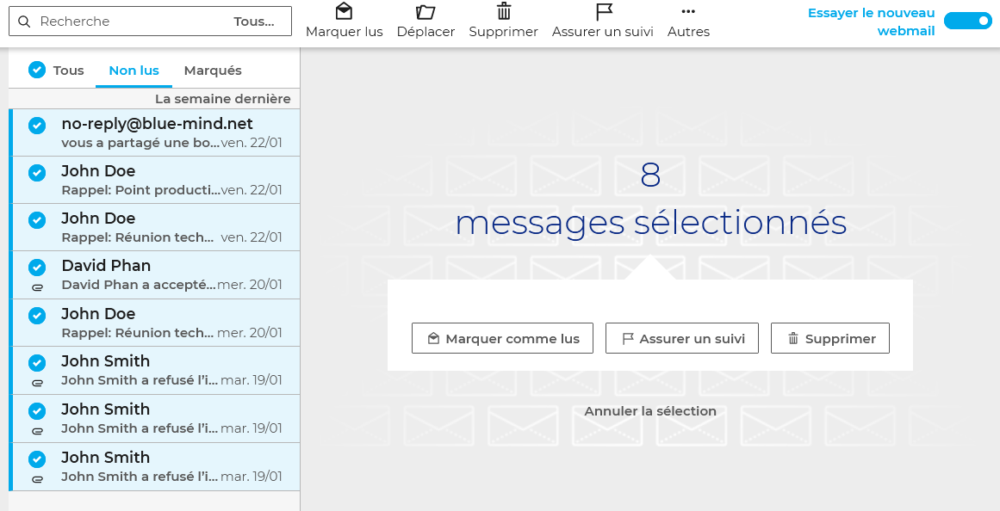Les actions groupées disponibles sont :

- **Marquer comme lus**
- **Déplacer** : ouvre un menu permettant de rechercher le dossier de destination souhaité :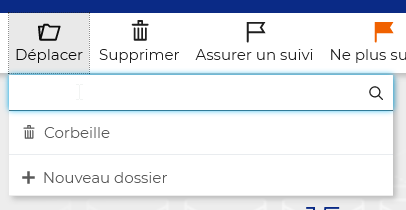
- **Supprimer**
- **Assurer un suivi** : marque les messages d'un drapeau "important" (affiché seulement si des messages non marqués sont sélectionnés)
- **Ne plus suivre** : retire le drapeau marqueur des messages (affiché seulement si des messages marqués sont sélectionnés)
- **Autres** : ce menu propose l'action "Supprimer définitivement", après confirmation les messages seront supprimés sans être déplacés dans la corbeille

### Déplacer des messages

Les messages peuvent être déplacés par glisser-déposer simplement en prenant un message seul directement ou en sélectionnant plusieurs messages (voir ci-dessus) :

Un message de confirmation indique que l'opération a été réalisée. Cliquer sur le nom du dossier dans le message pour être automatiquement redirigé vers le dossier de destination :
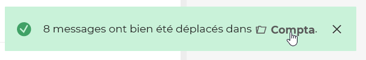

# Affichage d'un message

La zone d'affichage principale affiche le message sélectionné :

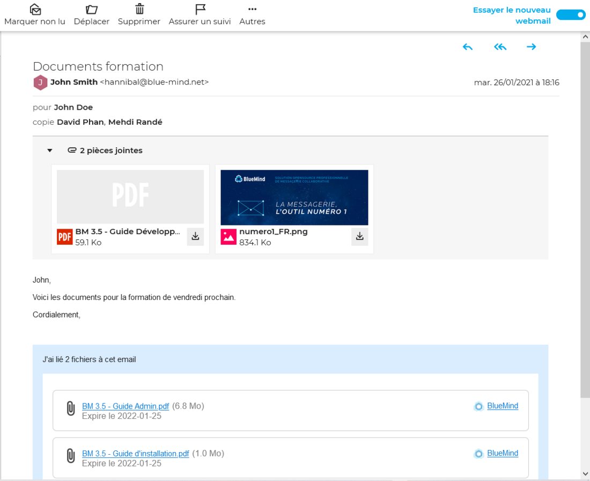La barre d'action au dessus du message propose les actions disponibles pour ce message :

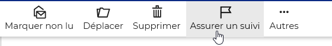

Les actions de réponse et transfert sont accessibles en haut à droite du message :

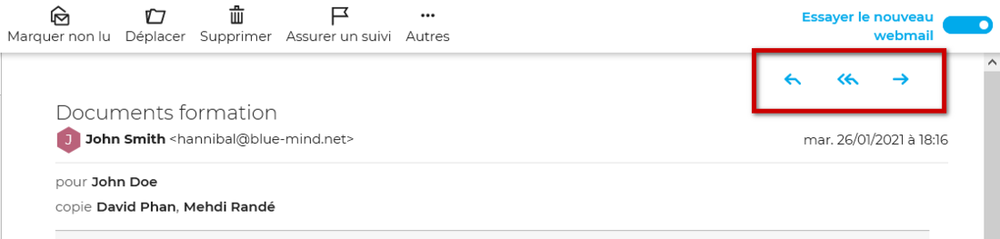

## Les pièces jointes

Un encart repliable sous l'en-tête présente les pièces jointes intégrées au message, avec un aperçu lorsqu'il est possible. Chaque fichier peut être téléchargés au moyen de l'icône 

Selon la nature de la pièce jointe, cliquer dessus ouvrira la fenêtre d'aperçu ou proposera de télécharger ou ouvrir le fichier.
:::important

Le téléchargement de l'ensemble des fichiers en un seul clic sera disponible dans une prochaine version, ainsi que la gestion des [pièces jointes détachées](https://forge.bluemind.net/confluence/display/BM4/Fichiers+volumineux+et+detachement+des+pieces+jointes).

:::

