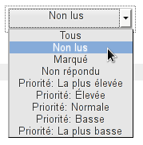
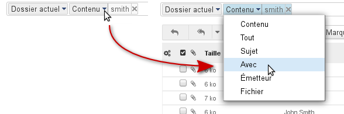
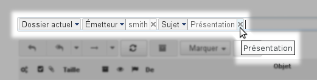
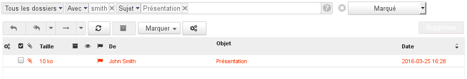

# Moteur de recherche avancé

# Présentation

BlueMind 3 est doté d'un nouveau et performant moteur de recherche permettant d'effectuer dans les messages des recherches full-text, multicritères et portant sur l'ensemble des dossiers accessibles par l'utilisateur.

# Fonctionnement

Devant le champs de recherche, un menu déroulant permet de sélectionner l'espace de recherche :

Après le champs de recherche, une liste déroulante permet de préciser le statut des messages à afficher :

:::important

Cette liste déroulante, contrairement au reste de la recherche, n'est pas réinitialisée en cas de changement de dossier, le filtre d'affichage reste effectif.

:::

Au cours de la frappe, plusieurs options sont proposées afin d'aider l'utilisateur à affiner sa recherche, si aucune option n'est sélectionnée la recherche est effectuée sur tous les champs :

Une fois la recherche lancée et si une option de recherche est choisie, il est toujours possible de la modifier grâce au menu qui s'ajoute devant le terme recherché dans le champs de saisie :

Le champs de saisie reste toujours disponible, il est ainsi possible de faire des recherches multicritères, portant par exemple sur l'expéditeur et le sujet du message :

Chaque terme recherché peut être retiré en cliquant sur la croix qui le suit :

Pour effacer une recherche et revenir à l'affichage complet des messages, cliquer sur la croix  en fin de champs de recherche.
:::important

Les filtres sont cumulatifs : le résultat de la recherche présentera les messages correspondant à TOUS les critères définis.

Soit la recherche suivante :

Cette recherche présente les messages présents dans tous les dossiers (boite de réception, sous-dossiers, corbeille, dossiers partagés, etc.), envoyés ou reçus par une personne ayant "smith" dans son nom ou son adresse mail, avec le mot "Présentation" dans le sujet et étant marqués d'un drapeau.

:::
:::important

Précisions sur le moteur de recherche

La recherche dans BlueMind :

- se fait sur des mots exacts : le mot "invitation" sera recherché au singulier
- ne tient pas compte des accents : "réservation" ou "reservation" donnera les mêmes résultats

Il est possible d'utiliser le caractère * afin de remplacer une partie de mot dans une recherche. Par exemple :

- invit* : recherchera les mots commençant par invit et trouvera par exemple "invité" ou "invitation"
- inv*ion : recherchera les mots commençant par "in" et finissant par "ion" tels que "invitation" ou "invention".

Attention : les temps de réponse lors de recherches avec le caractère "*" sont sensiblement plus longs qu'une recherche simple.

NB : Cette information peut être retrouvée à tout moment depuis le webmail en cliquant sur le bout point d'interrogation** en fin de champs de recherche

:::

